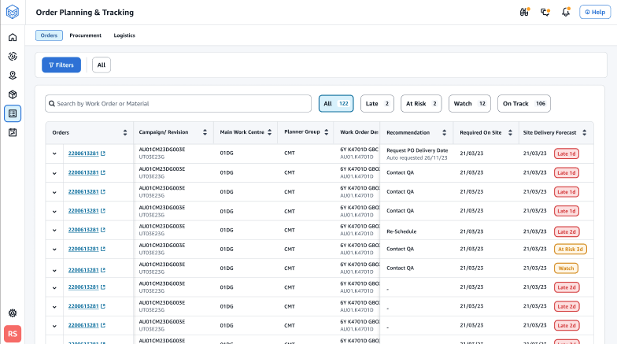
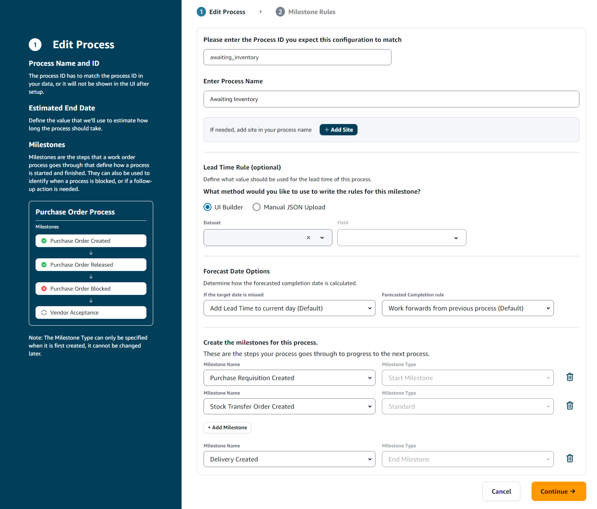

# Configuring Order Planning and Tracking for the first time

As an administrator, you can create multiple processes and milestones to track your orders.

###### Note

To generate a order insight, in addition to configuring the processes and milestones for your orders, you must ingest the required data entities and columns. For more information on the required data entities, see [Order Planning and Tracking](entities-work-order-insights.md "entities-work-order-insights.md").

1. Open the AWS Supply Chain web application.
2. In the left navigation pane on the AWS Supply Chain dashboard, choose
   **Order Planning and Tracking**. The **Manage your orders** page appears.

 3. Choose **Setup**. 4. On the **Orders Setup** page, under **Getting Started with Orders**, choose **Create Process**.

The **Edit Process** page appears.

 5. Under **Please enter the Process ID you expect this configuration to match** – Enter the Process ID. If the _work_order_plan_ data entity is uploaded, the _Process ID_ is derived from the _work_order_plan_ data entity or AWS Supply Chain will generate an UUID that you can modify to match the process ID you know will be ingested. 6. Under **Enter Process Name** – Enter a name for the process.

If you have multiple sites that uses the same process name, choose **Add Site** to add a site with your process. The site value can be determined from any of the entities (process_header, process_operation, process_product, product, site, vendor_product) that have a one-to-one relationship with the order line (process_product). 7. (Optional) Under **Lead Time Rule** > **What method would you like to use to write the rules for this milestone?**, choose one of the following:

    * *UI Builder* – Select the dataset and the corresponding columns that should be included in the lead time process. Make sure the dataset you select is ingested into data lake.
    * *Manual JSON Upload* – Paste the process and rule definitions in .json format.

8. Under **Forecast Date Options**, you can specify how you want the forecast completion date to be calculated.
   - _If the target date is missed_ – Select _Add Lead Time to current day_ if you want the forecast completion date to be the next day. Select _Add 1 day to current day_ to add one day to the forecast completion target.
   - _Forecasted completion rule_ – Select _Work forward from previous process_ if you want the forecast calculation to work forward from the previous process completion date plus the duration of the current process. This means that the process is trying to complete as soon as possible. Select _Work backwards from required on site date_ for the forecast calculation to subtract the duration from the process target date. This mean the process is trying to complete by the process target date.

9. **Create the milestones for this process** – Select the milestone name and type from the dropdown.
10. Choose **Add Milestone** to add a new milestone.
11. Choose **Continue**.

The **Milestone Rules** page appears.

Review the milestone rules you created. 12. Choose **Save and Exit**.
