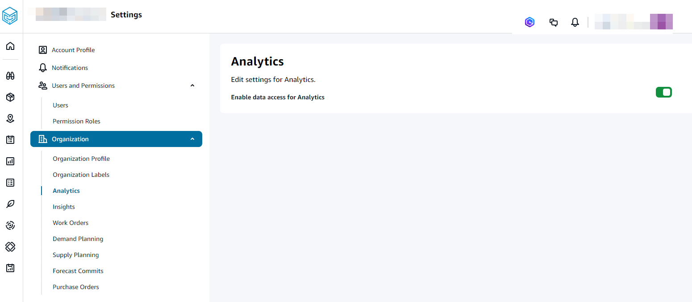
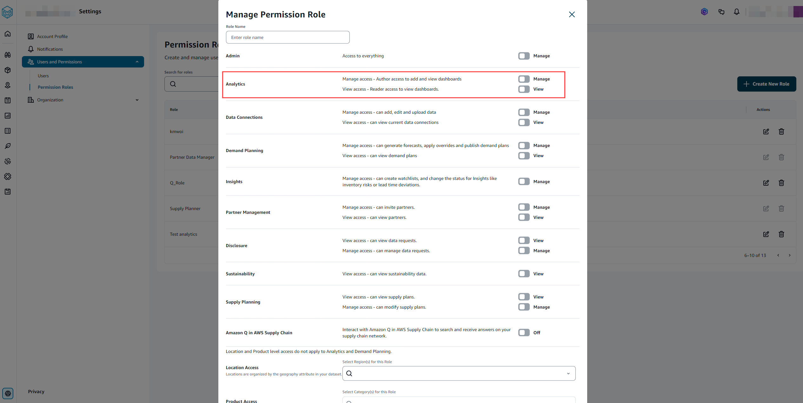

# Setting AWS Supply Chain Analytics

You must enable AWS Supply Chain Analytics before you can start using Quick Suite dashboards.

1. In the left navigation pane on the AWS Supply Chain dashboard, choose the
   **Settings** icon.
2. Under **Organization**, choose **Analytics**.

The **Analytics** setting page appears.

 3. Slide the **Enable data access for Analytics** button to enable AWS Supply Chain Analytics. 4. Under **User and Permissions**, choose **Permission Roles**.

You can edit the permission roles for a current user or add a new permission role to enable Analytics access.

 5. On the **Manage Permission Role** page, under **Analytics**, slide the **Manage** or **View** button to grant read or write access.

    * *Manage – Select this permission role if you want the Analytics user to create and view dashboards.*
    * *View – Select this permission role if you want the Analytics user to only view the dashboards.*
