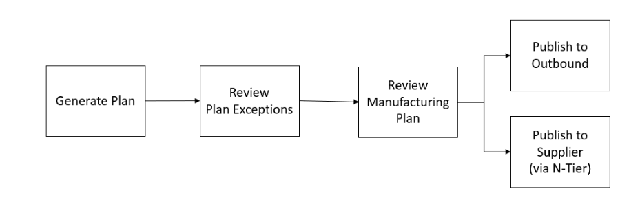

# Business workflow

Supply Planning provides the following workflow to manage your manufacturing plans.

- **Generate plan** – Supply Planning generates the
  manufacturing plan according to the configured schedule. The latest input
  data required to generate the plan is received from the AWS Supply Chain
  data lake. Supply Planning uses configuration data, transactional data, and
  plan settings to generate the manufacturing plan, which includes material,
  transfer, and production plans. The Manufacturing Plan is generated for the
  configured planning horizon in terms of the number of time periods. You can
  create plans with either daily or weekly details, and you can create them on
  a daily or weekly frequency. If multiple plans are created within the same
  planning cycle (daily or weekly), new plans will override the existing
  plans. Existing plans are versioned after a new plan is generated at the
  beginning of a new planning cycle (for example, a new week).
- **Review plan exceptions** – Supply Planning generates
  plan exceptions for products or site combinations that do not have either
  required configuration data (lead time, sourcing schedule, and so on) or
  required transactional data, such as on-hand inventory. Planners can review
  exceptions and provide required data, and then they can rerun the plan to
  correct the issues and generate the supply plan for relevant product and
  site combinations.
- **Review manufacturing plan** – Supply planners can review and
  manage material, transfer, and production plans by navigating to the
  **Plan Overview**, **Plan
  Outputs**, **Supply Plan Details**, and **Supply Demand Pegging** tabs in the AWS Supply Chain web application.
  The Supply Planning module generates _Material Plan Change_ insights
  for products and sites where the required quantity deviation exceeds the configured threshold, relative to the most recent plan.
  Planners can configure the display of detailed inputs, such as forecasts, inventory levels, orders, and other relevant data that
  contribute to the calculation of the plan's output.
  - The **Supply Plan Details** page offers a comprehensive timeline view, displaying key metrics
    such as forecast, inventory, open orders, and planned supply.
    This allows planners to assess and adjust plans as needed.
  - The **Supply Demand Pegging** page provides a detailed list of all pegging records that link supply orders to their corresponding demand orders.
    Each pegging record includes information about the supply order (for example, on-hand inventory, purchase orders,
    planned purchase orders, planned manufacture orders, and planned transfer orders),
    the demand order (for example, sales orders, forecasted demands, and planned order demands),
    the pegged quantity, and the associated end demand.
    This view enables users to analyze how specific supply quantities are allocated to fulfill various demand
    orders, and vice versa.

  Users can interact with the data by selecting any demand quantity to view all supply orders
  linked to it or selecting any supply quantity to see all demand orders tied to that supply.
  From this view, users can also navigate to the **End Demand Pegging** page by clicking the **End Demand Product**
  for a more consolidated overview of a specific end demand.
  - The **End Demand Pegging** page provides a comprehensive view of the entire pegging
    tree for a specific end demand, such as a sales order or forecast.
    It offers full visibility into all related supply and demand orders associated with the end demand,
    including planned transfer orders, planned manufacture orders, purchase orders, and intermediate demands.
    This view allows users to trace the entire supply chain flow, from the top-level demand to every
    linked supply and dependent demand orders, offering a clear insight into how supply orders are structured to meet customer or forecasted needs.

  These views help users efficiently manage and track supply and demand allocation across the supply chain.

- **Planned order adjustments** – Users can manually update the order quantity, order-by date, and expected delivery date
  for system-generated planned orders, including Planned Purchase Orders, Planned Transfer Orders, and Planned Production Orders.
  After making updates, users can mark these orders as **Firmed** to ensure they are preserved during planning runs.
  To run the plan in ad-hoc mode, users can choose **Run Plan** located in the top-right corner of the page.
  When the plan runs, the system retains all Firmed planned orders, recalculates planning measures on the **Supply Plan Details** page,
  and reflects any changes in upstream sites or bill of material (BOM) components in the updated plan output.
  In addition to modifying existing planned orders, users can create new Planned Transfer Orders directly from the **Transfer Plan** page
  by selecting **Create New Transfer Order** from the **Action** menu. After the ad-hoc plan run is complete, the system automatically
  synchronizes the updated planning data with the `supply_plan` and `supply_demand_pegging` entities in the Data Lake.
  During the next scheduled planning run, the system will clear all previously Firmed planned orders and
  generate new ones based on the latest data inputs.
- **Publish to outbound** – Supply plans are published to
  the outbound Amazon S3 connector at the configured time scheduled under
  _Plan Settings_. You can integrate these plans into
  your ERP, purchasing, or production planning systems for execution.
- **Publish to N-Tier visibility** – Material plans can
  optionally be published to the suppliers through N-Tier visibility. Material
  plans are published to N-Tier visibility based on the schedule that's
  configured under _Plan Settings_. N-Tier visibility
  further publishes the material plan to onboarded suppliers based on
  collaboration settings.
