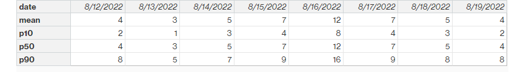
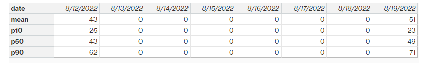

# Transactional data

###### Topics

- [Forecast](#forecast "#forecast")
- [Sales history or demand](#demand "#demand")
- [Inventory level](#inventory-level "#inventory-level")
- [Inbound orders](#in-flight-orders "#in-flight-orders")

## Forecast

Supply Planning uses two different sources and types of forecast. You can use
the following source systems to retrieve forecast source:

- _External_ – Supply Planning uses the data that is being ingested
  into the data lake forecast entity.
- _Demand Planning_ – Supply Planning uses the forecasts from Demand
  Planning.
- _None_ – Supply Planning uses the sales or demand history data from
  the outbound order line.

Supply Planning supports two types of forecast: deterministic and stochastic.
Deterministic forecasts contain only the mean of the forecast. Stochastic
forecasts contain P10/P50/P90, sometimes along with mean. When mean is not
provided with stochastic forecasts, Supply Planning uses P50(median) as
mean.

Each forecast record has four fields to represent the demand forecast:

- mean(double)
- p10(double)
- p50(also known as median, double)
- p90(double)

Based on the configured inventory policy, different fields in this entity are
required. For _sl_, p10/p50/90 is required; for
_doc_fcst_, policy p50 or mean is required. Supply
Planning uses p50 as an approximation of the mean, and for
_doc_dem_ and _abs_level_, none of the
forecast fields are required.

**Daily planning**

Forecasts may be different for daily planning compared to weekly planning.
Here is an example of the daily and weekly planning forecast requirement.

**Weekly planning**

You can use the daily planning forecast example for weekly planning, or you
can also use the following example for weekly planning.

## Sales history or demand

Inventory policy _doc_dem_ requires demand history to compute the historical average demand. Supply Planning gets the demand history from the _outbound_order_line_ entity under the _Outbound_ category.
Supply Planning uses the following fields:

- _ship_from_site_id_(string)
- _product_id_(string)
- _actual_delivery_date_(timestamp); when missing, use
  _promised_delivery_date_(timestamp)

As part of the calculation, Supply Planning uses historical outbound order
lines with delivery dates in the past 30 days. The target field used for
quantity is _quantity_delivered_; when missing,
use _quantity_promised_. If _quantity_promised_ is missing, then _final_quantity_requested_ will be used. If all are
missing, then _0_ will be used.

For example, if you use Supply Planning for product “laptop” at site “TX0” on
July 1, 2023, the record in _outbound_order_line_ where
_product_id=laptop_, _ship_from_site_id=TX0_, and _actual_delivery_date_ is from June 1, 2023 to June 30, 2023.
Supply Planning adds all the records and divides by 30 days to get the daily
demand.

## Inventory level

Supply Planning requires a beginning inventory level to start the planning
process. Supply Planning searches for the inventory level under the
_entity inv_level_ data entity. Supply Planning searches
for a record with the following fields:

- _product_id_
- _site_id_

Supply Planning uses _on_hand_inventory_ to determine the
inventory level.

## Inbound orders

Supply Planning uses _inbound_order_line_ to retrieve the
in-flight order quantity. If an order is delivered during the planning horizon,
the quantity is considered as part of the existing supply.

Supply Planning searches for a record under
_inbound_order_line_ with the following fields:

- _order_receive_date_; when missing, use _expected_delivery_date_
- _product_id_
- _to_site_id_

The following are the supported Order Types: PO (Purchase), TO (Transfer), and
MO (Production or Manufacturing).

Supply Planning uses the _quantity_received_;
when missing, use _quantity_confirmed_ then
_quantity_submitted_ to determine the
on-order quantity.
