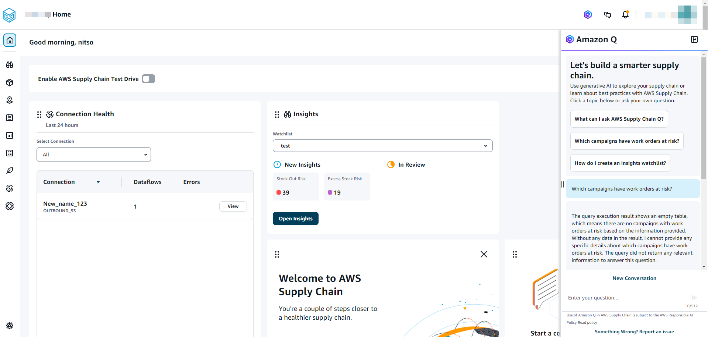
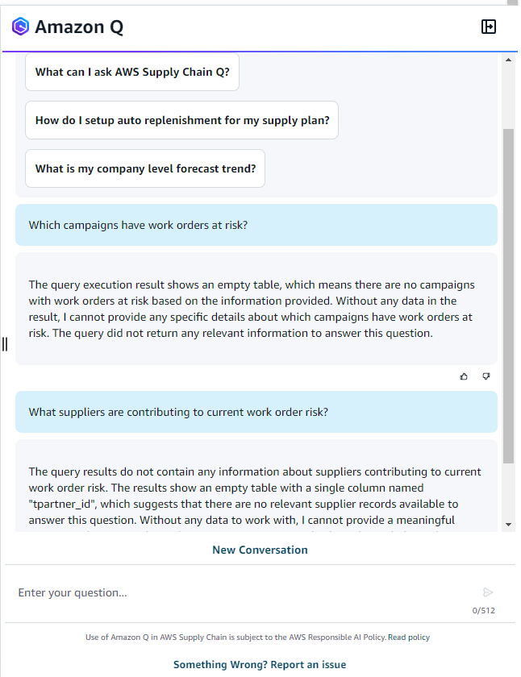

# Using Amazon Q in AWS Supply Chain

After enabling Amazon Q in AWS Supply Chain, perform the following procedure:

1. On the AWS Supply Chain dashboard, choose the **Amazon Q** icon.

The Amazon Q dialog window should automatically appear on the right side of the page. You can hide or unhide the page by choosing the Amazon Q icon.

 2. Choose a question from the list of sample questions displayed.

You can ask any questions regarding AWS Supply Chain from anywhere in the web application. Amazon Q in AWS Supply Chain will customize your answers using the context from the page you are in to provide more accurate responses.
You can start with the default prompted questions or ask your own question.
