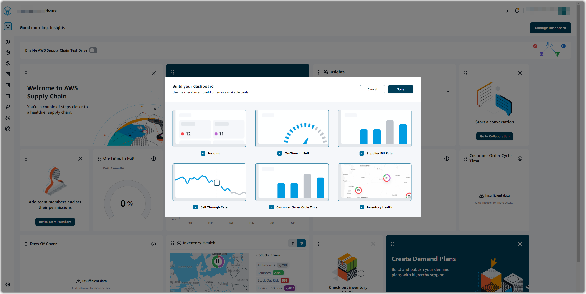

# AWS Supply Chain dashboard

You can view your data connections and inventory visibility, add users or groups, and
monitor your watchlists and key performance indicators (KPIs) directly from the dashboard. Your default dashboard view depends on the permission the AWS Supply Chain administrator
assigns you.

To customize your dashboard, complete the following procedure:

1. On the AWS Supply Chain dashboard, choose **Manage dashboard**.

The **Build your dashboard** page appears.

 2. Depending on your user permission role, you will see cards that you can use for customizing
your dashboard. For each card that you want to add to your dashboard, select its check
box. 3. Choose **Save**.

## Key Performance Indicators

Key performance indicators (KPIs) are metrics that can help measure the performance of a supply chain. AWS Supply Chain administrator supports the following KPIs:

### On-Time in-full

On-time In-Full (OTIF) measures the effectiveness of customer fulfillment operations, such as, picking, packing and shipping orders on-time and in full.
This metric is measured by adding the total number of orders shipped in-full, on or before the expected ship date divided by the total number of shipments with an expected ship date for the month.

OTIF requires the following entities to be populated and mapped in AWS Supply Chain Data lake:

| Dataset                   | Entity                 |
| ------------------------- | ---------------------- | --------------------------------------------------------------------------------------------------------------------------------------------------------------------------------------------------------------------------------------------------------------------------------------------------------------------------------------------------------------------------------------------------------------------------------------------------------------------------------------------------------------------------------------------------------------------------------------------------------------------------------------------------------------------------------------------------------------------------------------------------------------------------------------------------------------------------------------------------------------------------------------------------------- |
| Outbound_Shipment         | Shipped_Qty            |
| Outbound_Order_Line       | Quantity_Promised      |
| Outbound_Shipment_Records | Actual_Ship_Date       |
| Outbound_Shipment         | Expected_Ship_Date     | To calculate OTIF, AWS Supply Chain uses the following formula: **SUM (outbound_shipment.shipped_qty = outbound_order_line.Quantity promised AND outbound_shipment_records.actual_ship_date ≤ outbound_shipment.expected_ship_date) ÷ by total number of orders with outbound_shipment.expected_ship_date for a given month.** ### Customer order cycle time Customer order cycle time measures the efficiency of the supply chain fulfillment process. This metric is calculated by the average number of days between the order date and when the order is shipped. Customer order cycle time requires the following entities to be populated and mapped in AWS Supply Chain data lake.                                                                                                                                                                                                                 |
| Dataset                   | Entity                 |
| ---                       | ---                    |
| Outbound_Order_Line       | Order_Date             |
| Outbound_Shipment_Records | Actual_Ship_Date       | AWS Supply Chain uses the following formula to calculate customer order cycle time: **Average number of days between Outbound_order_Line.order_date and Outbound_Shipment.actual_ship_date for all outbound order lines during a given month.** ### Supplier fill rate The supplier fill rate measures your supplier’s commitment to your organization. This metric is calculated by adding all the inbound orders where the quantity received matches the quantity requested by the expected delivery date. The supplier fill rate requires the following entities to be populated and mapped in AWS Supply Chain data lake.                                                                                                                                                                                                                                                                             |
| Dataset                   | Entity                 |
| ---                       | ---                    |
| Inbound_Order_Line        | Quantity_Submitted     |
| Inbound_Order_Line        | Quantity_Received      |
| Inbound_Order_Line        | Received_Date          |
| Inbound_Order_Line        | Expected_Delivery_Date | To calculate supplier fill rate, AWS Supply Chain uses the following formula : **Sum (inbound_order_line.Quantity Submitted = inbound_order_line.quantity_recieved and inbound_order_line.order.recieve.date ≤ inbound_order_line.expected_delivery_date) ÷ by the total number of lines with inbound_order_line.expected_delivery_date within a given month.** ### Sell-through rate A sell-through rate measures the percentage of available inventory sold in a given month. This metric is calculated by adding all outbound shipment quantities for a given month divided by the sum of current inventory at the beginning of the month and the inventory received during the month. The sell-through rate requires the following entities to be populated and mapped in AWS Supply Chain data lake.                                                                                                 |
| Dataset                   | Entity                 |
| ---                       | ---                    |
| Outbound_Shipment         | Shipped_Qty            |
| Outbound_Shipment_Records | Actual_Ship_Date       |
| Inventory_Level_Records   | On_Hand_Inventory      |
| Inbound_Order_Line        | Expected_Delivery_Date |
| Inbound_Order_Line        | Quantity_Received      |
| Inbound_Order_Line        | Received_Date          | To calculate sell-through rate, AWS Supply Chain uses the following formula: **SUM outbound_shipment_records.quantity_shipped for a given month ÷ by SUM( InventoryLevel_records.on_hand_inventory at start of month+ inbound_order_line.quantity_recieved during the month).** ### Enabling KPIs To enable KPIs in AWS Supply Chain, complete the following procedure: 1. On the AWS Supply Chain dashboard, under **Monitor KPIs**, choose **Enable**. The AWS Supply Chain dashboard updates to display the KPIs for the current dataset. 2. To view the actual value or percentage, hover over the KPI. ### Managing KPIs To view or remove KPIs from the AWS Supply Chain dashboard, complete the following procedure: 1. On the AWS Supply Chain dashboard, choose **Manage dashboard**. 2. Choose the KPIs that you want to see or remove from the AWS Supply Chain dashboard. 3. Choose **Save**. |
