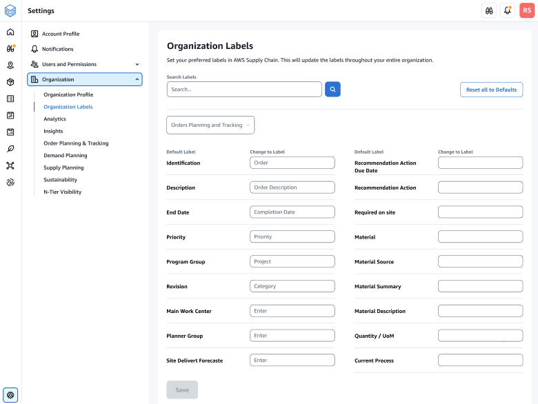
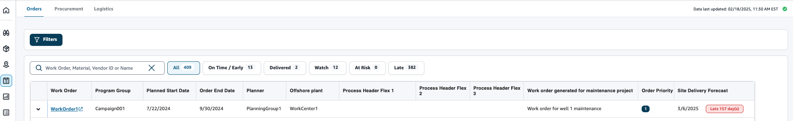

# Organization Labels

As an administrator, you can customize the order labels.

1. In the left navigation pane on the AWS Supply Chain dashboard, choose the
   **Settings** icon.
2. Under **Organization**, choose **Organization Labels** .

The **Organization Labels** page appears.

 3. Under **Change to Label**, enter the preferred name for each **Default Label**.

###### Note

Changing the default label will update your entire organization with the new label for Orders. For example, you will see the **Orders** table updated when you update the _Order_, _Order Description_, _Main Work Center_, and _Planner Group_ labels under **Organization Labels** (see screenshot above).

 4. Choose **Save**. 5. To change the customized labels to the default labels, choose **Reset all to Defaults**.
