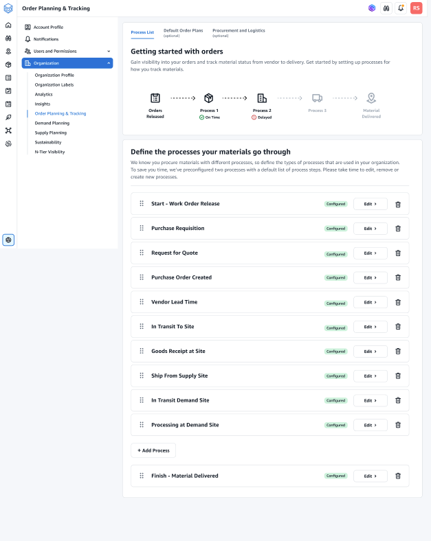
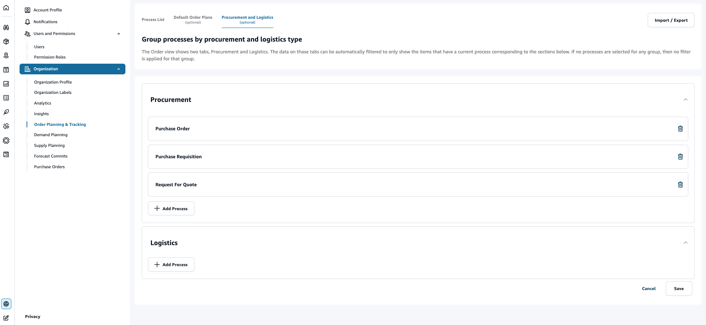

# Orders settings

You can setup orders and track the material status from vendor to delivery using the following procedure.

1. In the left navigation pane on the AWS Supply Chain dashboard, choose the
   **Settings** icon.
2. Under **Organization**, choose **Orders** .

The **Order** setting page appears.

 3. Under the **Process List** tab, you can view all the configured processes or processes that need to be configured. You can delete or create new processes. 4. Choose **Import/Export**. 5. Under **Import / Export Order Configuration**, choose **Save** to copy the _Milestone Definitions_, _Process Definitions_, and _Default Order Plans_ in JSON format. You can use this feature to setup the
configuration in one instance (for example, pre-production instance) and then copy the same configuration to another instance (for example, production instance). 6. (Optional) Under the **Default Order Plans** tab, you can setup fallback lead times for processes that don't match the order plan data.

By default, order planning and tracking uses the lead time information from the _work_order_plan_ dataset. If order tracking can't find the material to process combination in the w*work_order_plan* dataset, order planning and tracking will use the default order plan configuration
for matching lead times. Order plans are segmented by the _reservation_type_ in the _reservation_ dataset. To use the default order configuration, the _reservation_ dataset must be ingested. The
reservation types are displayed under the order configuration and you can setup the order plan for each reservation type by adding processes and defining lead times for each process. 7. (Optional) Under the **Procurement and Logistics** tab, expand **Procurement** and **Logistics**.

 8. Under **Procurement** and **Logistics**, choose **Add Process** to add the processes that should be listed on the Procurement and Logistics page.

###### Note

When there are no processes added under **Procurement** or **Logistics**, the Procurement and Logistics tab will display the details of all the processes. 9. On the **Select an existing process** page, select an existing process from the drop-down. 10. Choose **Add**. 11. Choose **Save**.
