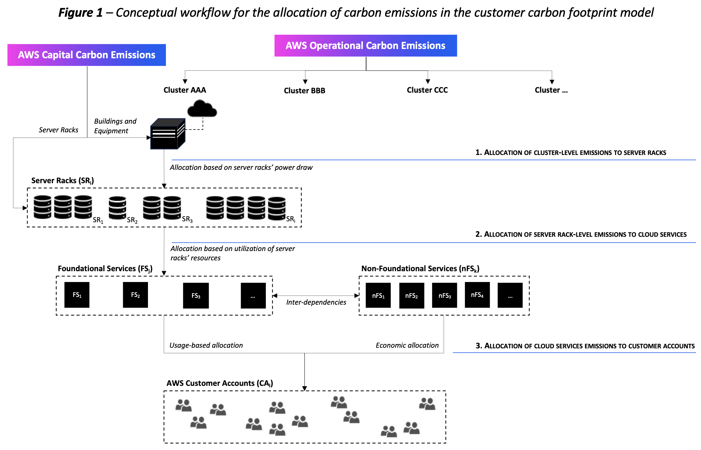

# Allocation approach

The carbon allocation model uses a top-down approach to calculate customers' carbon
footprint associated with the AWS cloud service usage. AWS prioritizes
`physical allocation` (also known as usage-based allocation) and
consider `economic allocation` as a secondary option.

The model takes operational and capital emissions associated with each AWS cluster and performs a series of transformations to break down such emissions into several logical segments. Conceptually, the
model works using the following logical transformation workflow:

1. Allocate cluster-level emissions (for example, operational carbon emissions as well as building and equipment amortized embodied carbon) to server racks in the cluster, using the server racks' power draw. Add the server racks amortized embodied carbon associated with each rack in that given cluster.
2. Allocate carbon emissions associated with server racks to AWS cloud services based on utilization of server racks resources, accounting for interdependencies. We use physical allocation for services with dedicated server racks, and economic allocation for other services.
3. Allocate carbon emissions associated with each cloud service to individual customer accounts. We use physical allocation for services with dedicated server racks, and economic allocation for other services.

