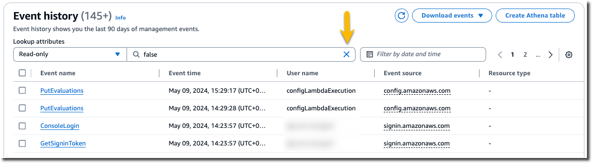
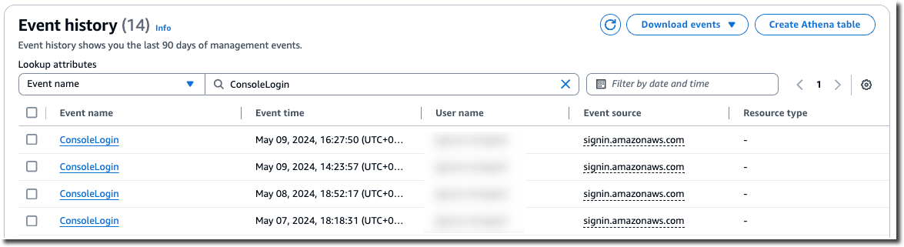
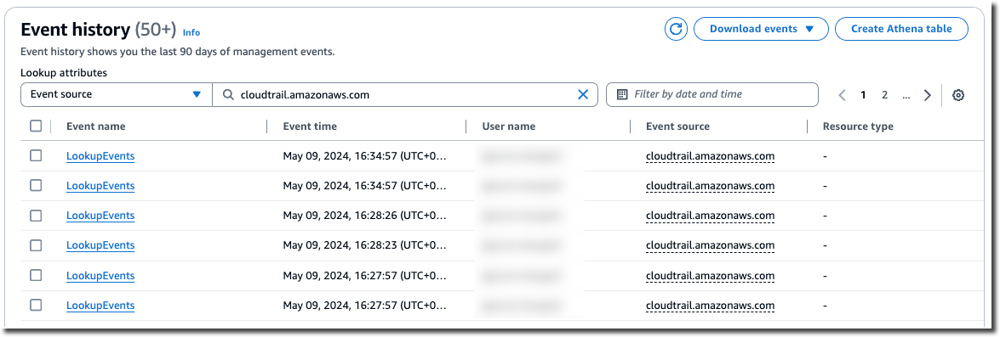
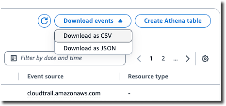

# View event history

This section describes how to use the CloudTrail **Event history** page on the
CloudTrail console to view the last 90 days of management events for your AWS account for the current AWS Region.

###### To view the **Event history**

1. Sign in to the AWS Management Console and open the CloudTrail console at
   [https://console.aws.amazon.com/cloudtrail/](https://console.aws.amazon.com/cloudtrail/ "https://console.aws.amazon.com/cloudtrail/").
2. In the navigation pane, choose **Event history**. You see a filtered list
   of events, with the most recent events showing first. The default filter for events is
   **Read only**, set to **false**. You can clear
   that filter by choosing **X** at the right of the filter. You can search
   events in **Event history** by filtering for events on a single
   attribute

 3. Choose an attribute to filter on and enter the full value for the attribute. CloudTrail can't filter on a partial value.
For example, to view all console login events, choose the **Event
name** filter, and specify **ConsoleLogin** for the attribute value.

Or, to view recent CloudTrail management events, choose **Event source**, and
specify `cloudtrail.amazonaws.com`. For information about the events a service logs
to CloudTrail, refer to the service's API Reference.

 4. To view a specific management event, choose the event name. On the event details page, you
can view details about the event, see any referenced resources, and view the event
record. 5. To compare events, select up to five events by filling their check boxes in the
left margin of the **Event history** table. You can view details for
selected events side-by-side in the **Compare event details**
table. 6. You can save event history by downloading it as a file in CSV or JSON format. Downloading
your event history can take a few minutes.

For more information, see [Working with CloudTrail event history](view-cloudtrail-events.md "view-cloudtrail-events.md").
