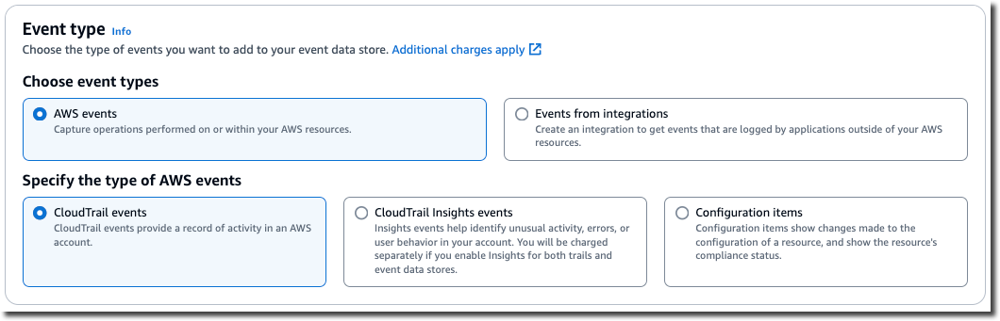
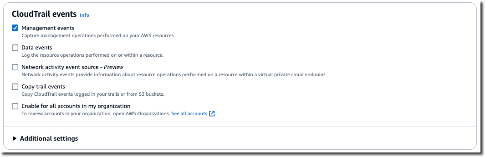
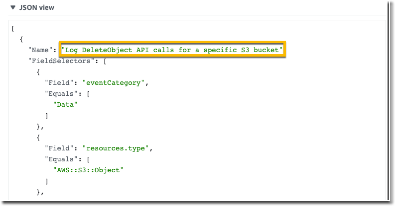
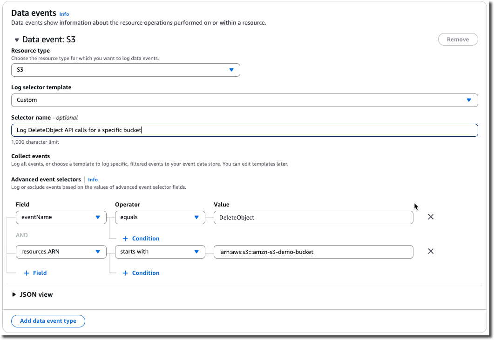

# Create an event data store for S3 data

events

You can create an event data store to log CloudTrail events (management events, data events),
[CloudTrail Insights events](query-event-data-store-insights.md "query-event-data-store-insights.md"), [AWS Audit Manager evidence](../../../audit-manager/latest/userguide/evidence-finder.md#understanding-evidence-finder "../../../audit-manager/latest/userguide/evidence-finder.md#understanding-evidence-finder"), [AWS Config
configuration items](query-event-data-store-config.md "query-event-data-store-config.md"), or [non-AWS
events](event-data-store-integration-events.md "event-data-store-integration-events.md").

When you create an event data store for data events, you choose the AWS services and
resource types for which you want to log data events. For information about AWS services that
log data events, see [Data events](logging-data-events-with-cloudtrail.md#logging-data-events "logging-data-events-with-cloudtrail.md#logging-data-events").

This walkthrough shows you how to create an event data store for Amazon S3 data events. In this
tutorial, instead of logging all Amazon S3 data events, we'll choose a custom log selector template
to log events only when an object is deleted from a specific S3 bucket.

###### To create an event data store for S3 data events

1. Sign in to the AWS Management Console and open the CloudTrail console at
   [https://console.aws.amazon.com/cloudtrail/](https://console.aws.amazon.com/cloudtrail/ "https://console.aws.amazon.com/cloudtrail/").
2. From the navigation pane, under **Lake**, choose **Event data
   stores**.
3. Choose **Create event data store**.
4. On the **Configure event data store** page, in **General
   details**, give your event data store a name, such as
   `s3-data-events-eds`. As a best practice, use a name that quickly
   identifies the purpose of the event data store. For information about CloudTrail naming
   requirements, see [Naming requirements for CloudTrail resources, S3 buckets, and KMS keys](cloudtrail-trail-naming-requirements.md "cloudtrail-trail-naming-requirements.md").
5. Choose the **Pricing option** that you want to use for your event data store. The pricing option determines the cost for ingesting and storing events, and the
   default and maximum retention periods for your event data store. For more information, see
   [AWS CloudTrail Pricing](https://aws.amazon.com/cloudtrail/pricing/ "https://aws.amazon.com/cloudtrail/pricing/") and [Managing CloudTrail Lake costs](cloudtrail-lake-manage-costs.md "cloudtrail-lake-manage-costs.md").

The following are the available options:

    * **One-year extendable retention pricing** - Generally recommended if you expect to ingest less than 25 TB of event data per month and want a flexible retention period of up to
     10 years. For the first 366 days (the default retention period), storage is
     included at no additional charge with ingestion pricing. After 366 days, extended retention is available at pay-as-you-go pricing. This is the default option.

    	+ **Default retention period:** 366 days
    	+ **Maximum retention period:** 3,653 days
    * **Seven-year retention pricing** - Recommended if you expect to ingest more than 25 TB of event data per month and need a retention period of up to 7 years. Retention is included with ingestion
     pricing at no additional charge.

    	+ **Default retention period:** 2,557 days
    	+ **Maximum retention period:** 2,557 days

6. Specify a retention period for the event data store. Retention periods can be between 7 days and 3,653 days (about 10 years) for the **One-year extendable retention pricing** option,
   or between 7 days and 2,557 days (about seven years) for the **Seven-year retention pricing** option.

CloudTrail Lake determines whether to retain an event by checking if the
`eventTime` of the event is within the specified retention period. For example, if
you specify a retention period of 90 days, CloudTrail will remove events when their
`eventTime` is older than 90 days. 7. (Optional) In **Encryption**. choose whether you want to encrypt the
event data store using your own KMS key. By default, all events in an event data store are
encrypted by CloudTrail using a KMS key that AWS owns and manages for you.

To enable encryption using your own KMS key, choose **Use my own
AWS KMS key**. Choose **New** to have an AWS KMS key created
for you, or choose **Existing** to use an existing KMS key. In
**Enter KMS alias**, specify an alias, in the format
`alias/``MyAliasName`. Using your own KMS key requires
that you edit your KMS key policy to allow CloudTrail logs to be encrypted and decrypted. For more
information, see [Configure AWS KMS key policies for CloudTrail](create-kms-key-policy-for-cloudtrail.md "create-kms-key-policy-for-cloudtrail.md"). CloudTrail also supports AWS KMS multi-Region
keys. For more information about multi-Region keys, see [Using multi-Region
keys](../../../kms/latest/developerguide/multi-region-keys-overview.md "../../../kms/latest/developerguide/multi-region-keys-overview.md") in the _AWS Key Management Service Developer Guide_.

Using your own KMS key incurs AWS KMS costs for encryption and decryption. After you
associate an event data store with a KMS key, the KMS key cannot be removed or
changed.

###### Note

To enable AWS Key Management Service encryption for an organization event data store, you must use an
existing KMS key for the management account. 8. (Optional) If you want to query against your event data using Amazon Athena, choose **Enable** in **Lake query federation**.
Federation lets you view the metadata associated with the event data store in the AWS Glue
[Data Catalog](../../../glue/latest/dg/components-overview.md#data-catalog-intro "../../../glue/latest/dg/components-overview.md#data-catalog-intro") and run SQL queries against the event data in Athena. The table metadata stored in the AWS Glue Data Catalog
lets the Athena query engine know how to find, read, and process the data that you want to query. For more information, see
[Federate an event data store](query-federation.md "query-federation.md").

To enable Lake query federation, choose **Enable** and then do the following:

    1. Choose whether you want to create a new role or use an existing IAM role. [AWS Lake Formation](../../../lake-formation/latest/dg/how-it-works.md "../../../lake-formation/latest/dg/how-it-works.md")
     uses this role to manage permissions for the federated event data store. When you create a new role using the CloudTrail console, CloudTrail automatically creates a role with the required permissions.
     If you choose an existing role, be sure the policy for the role provides the
     [required minimum permissions](query-federation.md#query-federation-permissions-role "query-federation.md#query-federation-permissions-role").
    2. If you are creating a new role, enter a name to identify the role.
    3. If you are using an existing role, choose the role you want to use. The role must exist in your account.

9. (Optional) Choose **Enable resource policy** to add a resource-based policy to your event data store.
   Resource-based policies allow you to control which principals can perform actions on your event data store.
   For example, you can add a resource based policy that allows the root users in other accounts to query this event data store and view the query results. For example policies, see
   [Resource-based policy examples for event data stores](security_iam_resource-based-policy-examples.md#security_iam_resource-based-policy-examples-eds "security_iam_resource-based-policy-examples.md#security_iam_resource-based-policy-examples-eds").

A resource-based policy includes one or more statements. Each statement in
the policy defines the [principals](../../../IAM/latest/UserGuide/reference_policies_elements_principal.md "../../../IAM/latest/UserGuide/reference_policies_elements_principal.md") that are allowed or denied access
to the event data store and the actions the principals can perform
on the event data store resource.

The following actions are supported in resource-based policies for event data stores:

    * `cloudtrail:StartQuery`
    * `cloudtrail:CancelQuery`
    * `cloudtrail:ListQueries`
    * `cloudtrail:DescribeQuery`
    * `cloudtrail:GetQueryResults`
    * `cloudtrail:GenerateQuery`
    * `cloudtrail:GenerateQueryResultsSummary`
    * `cloudtrail:GetEventDataStore`

For [organization event data stores](cloudtrail-lake-organizations.md "cloudtrail-lake-organizations.md"), CloudTrail creates a [default resource-based policy](cloudtrail-lake-organizations.md#cloudtrail-lake-organizations-eds-rbp "cloudtrail-lake-organizations.md#cloudtrail-lake-organizations-eds-rbp") that
lists the actions that the delegated administrator accounts are allowed to perform on organization event data stores. The permissions in this policy are derived from the delegated
administrator permissions in AWS Organizations. This policy is updated automatically following changes to the organization event data store or to the organization
(for example, a CloudTrail delegated administrator account is registered or removed). 10. (Optional) In **Tags**, add one or more custom tags (key-value pairs) to
your event data store. Tags can help you identify your CloudTrail event data stores. For example,
you could attach a tag with the name `stage` and the value
`prod`. You can use tags to limit access to your event data store. You
can also use tags to track the query and ingestion costs for your event data store.

For information about how to use tags to track costs, see [Creating user-defined cost
allocation tags for CloudTrail Lake event data stores](cloudtrail-budgets-tools.md#cloudtrail-lake-manage-costs-tags "cloudtrail-budgets-tools.md#cloudtrail-lake-manage-costs-tags"). For information about how to use IAM policies to authorize access to an event data store
based on tags, see [Examples: Denying
access to create or delete event data stores based on tags](security_iam_id-based-policy-examples.md#security_iam_id-based-policy-examples-eds-tags "security_iam_id-based-policy-examples.md#security_iam_id-based-policy-examples-eds-tags"). For information about how
you can use tags in AWS, see [Tagging
your AWS resources](../../../tag-editor/latest/userguide/tagging.md "../../../tag-editor/latest/userguide/tagging.md") in the
_Tagging AWS Resources User Guide_. 11. Choose **Next** to configure the event data store. 12. On the **Choose events** page, leave the default selections for
**Event type**.

 13. For **CloudTrail events**, choose **Data events** and
deselect **Management events**. For more information about data events, see
[Logging data events](logging-data-events-with-cloudtrail.md "logging-data-events-with-cloudtrail.md").

 14. Leave the default setting for **Copy trail events**. You'd use this
option to copy existing trail events to your event data store. For more information, see [Copy trail events to an event data store](cloudtrail-copy-trail-to-lake-eds.md "cloudtrail-copy-trail-to-lake-eds.md"). 15. Choose **Enable for all accounts in my organization** if this is an
organization event data store. This option won't be available to change unless you have
accounts configured in AWS Organizations. 16. For **Additional settings** leave the default selections. By default,
an event data store collects events for all AWS Regions and starts ingesting events when
it's created. 17. For **Data events**, make the following selections:

    1. In **Resource type**, choose **S3**.
     The resource type identifies the AWS service and resource on which data events are logged.
    2. In **Log selector template**, choose **Custom**.
     Choosing **Custom** lets you define a custom event selector to filter on
     the `eventName`, `resources.ARN`, and `readOnly` fields.
     For information about these fields, see [AdvancedFieldSelector](../APIReference/API_AdvancedFieldSelector.md "../APIReference/API_AdvancedFieldSelector.md") in the *AWS CloudTrail API Reference*.
    3. (Optional) In **Selector name**, enter a name to identify your
     selector. The selector name is a descriptive name for an advanced event selector, such as
     "Log DeleteObject API calls for a specific S3 bucket". The selector name is listed as
     `Name` in the advanced event selector and is viewable if you expand the
     **JSON view**.

    
    4. In **Advanced event selectors**, we'll build the custom event selector
     to filter on the `eventName` and `resources.ARN` fields. Advanced
     event selectors for an event data store work the same as advanced event selectors that you
     apply to a trail. For more information about how to build advanced event selectors, see
     [Logging data events with advanced
     event selectors](logging-data-events-with-cloudtrail.md#creating-data-event-selectors-advanced "logging-data-events-with-cloudtrail.md#creating-data-event-selectors-advanced").

    	1. For **Field** choose **eventName**. For
    	 **Operator**, choose **equals**. For
    	 **Value**, enter `DeleteObject`. Choose **+
    	 Field** to filter on another field.
    	2. For **Field**, choose **resources.ARN**. For
    	 **Operator**, choose **StartsWith**. For
    	 **Value**, enter the ARN for your bucket (for example,
    	 arn:aws:s3:::`amzn-s3-demo-bucket`). For information about how to get
    	 the ARN, see [Amazon S3 resources](../../../AmazonS3/latest/userguide/s3-arn-format.md "../../../AmazonS3/latest/userguide/s3-arn-format.md") in the
    	 *Amazon Simple Storage Service User Guide*.

 18. Choose **Next** to review your choices. 19. On the **Review and create** page, review your choices. Choose
**Edit** to make changes to a section. When you're ready to create the event
data store, choose **Create event data store**. 20. The new event data store is visible in the **Event data stores** table
on the **Event data stores** page.

From this point forward, the event data store captures events that match its advanced
event selectors. Events that occurred before you created the event data store are not in the
event data store, unless you opted to copy existing trail events.
You are now ready to run queries on your event data store. For information about how to
view and run sample queries, see [View sample queries with the CloudTrail console](lake-console-queries.md "lake-console-queries.md").

For more information about CloudTrail Lake, see [Working with AWS CloudTrail Lake](cloudtrail-lake.md "cloudtrail-lake.md").
