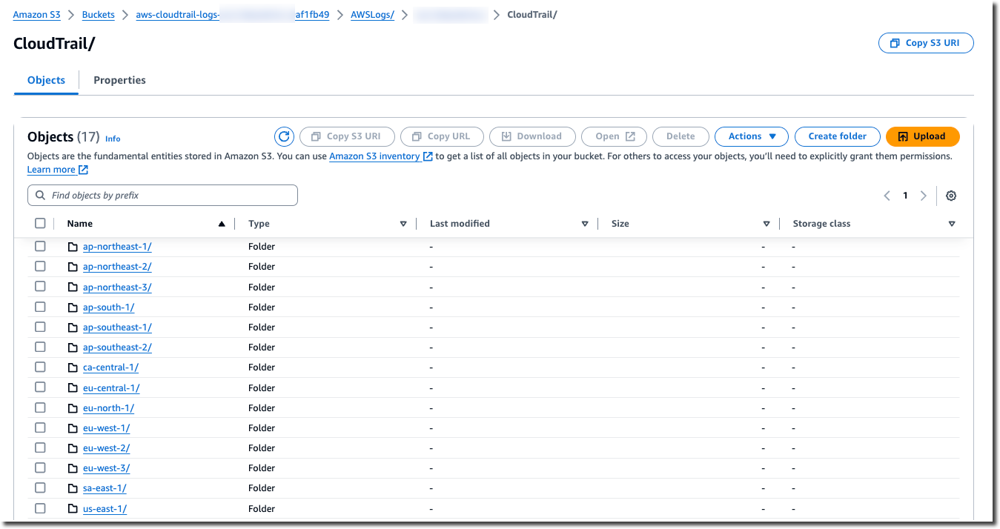

# View your log files

Within an average of about 5 minutes of creating your first trail, CloudTrail delivers the first
set of log files to the Amazon S3 bucket for your trail. You can look at these files and learn about
the information they contain.

###### Note

CloudTrail typically delivers logs within an average of about 5 minutes of an
API call. This time is not guaranteed. Review the [AWS CloudTrail Service Level Agreement](https://aws.amazon.com/cloudtrail/sla "https://aws.amazon.com/cloudtrail/sla") for more
information.

If you misconfigure your trail (for example, the S3 bucket is unreachable),
CloudTrail will attempt to redeliver the log files to your S3 bucket for 30 days, and
these attempted-to-deliver events will be subject to standard CloudTrail charges.
To avoid charges on a misconfigured trail, you need to delete the trail.

###### To view your log files

1. Sign in to the AWS Management Console and open the CloudTrail console at
   [https://console.aws.amazon.com/cloudtrail/](https://console.aws.amazon.com/cloudtrail/ "https://console.aws.amazon.com/cloudtrail/").
2. In the navigation pane, choose **Trails**. On the
   **Trails** page, find the name of the trail you just created (in the
   example, `management-events`).
3. In the row for the trail, choose the value for the S3 bucket.
4. The Amazon S3 console opens and shows two folders for the bucket:
   `CloudTrail-Digest` and `CloudTrail`. Choose the
   **CloudTrail** folder to view the log files.
5. If you created a multi-Region trail, there is a folder for each AWS Region. Choose the
   folder for the AWS Region where you want to review log files. For example, if you want to
   review the log files for the US East (Ohio) Region, choose
   **us-east-2**.

 6. Navigate the bucket folder structure to the year, the month, and the day where you want
to review logs of activity in that Region. In that day, there are a number of files. The name
of the files begin with your AWS account ID, and end with the extension
`.gz`. For example, if your account ID is
`123456789012`, you would see files with names similar to
this:
`123456789012`\_CloudTrail\_`us-east-2`\_`20240512T0000Z_EXAMPLE`.json.gz.

To view these files, you can download them, unzip them, and then view them in a
plain-text editor or a JSON file viewer. Some browsers also support viewing .gz and JSON files
directly. We recommend using a JSON viewer, as it makes it easier to parse the information in
CloudTrail log files.
