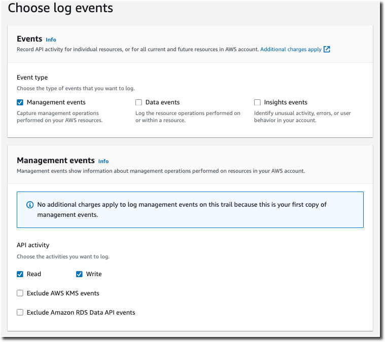
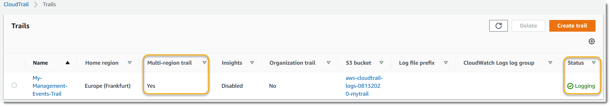

# Create a trail to log management events

For your first trail, we recommend creating a trail that logs all [management events](cloudtrail-concepts.md#cloudtrail-concepts-management-events "cloudtrail-concepts.md#cloudtrail-concepts-management-events") and does not log any
[data events](cloudtrail-concepts.md#cloudtrail-concepts-data-events "cloudtrail-concepts.md#cloudtrail-concepts-data-events") or Insights events. Examples of management
events include security events such as IAM `CreateUser` and
`AttachRolePolicy` events, resource events such as `RunInstances` and
`CreateBucket`, and many more. You will create an Amazon S3 bucket where you will store
the log files for the trail as part of creating the trail in the CloudTrail console.

###### Note

AWS Control Tower sets up a new CloudTrail trail logging management events when you set up a landing zone.
It is an organization-level trail, which means that it logs all management events for the management account and all member accounts in the organization. For more information, see
[About logging in AWS Control Tower](../../../controltower/latest/userguide/about-logging.md "../../../controltower/latest/userguide/about-logging.md") in the _AWS CloudTrail User Guide_.

This tutorial assumes you are creating your first trail. Depending on the number of trails
you have in your AWS account, and how those trails are configured, the following procedure
might or might not incur expenses. CloudTrail stores log files in an Amazon S3 bucket, which incurs costs.
For more information about pricing, see [AWS CloudTrail Pricing](https://aws.amazon.com/cloudtrail/pricing/ "https://aws.amazon.com/cloudtrail/pricing/") and [Amazon S3
Pricing](https://aws.amazon.com/s3/pricing/ "https://aws.amazon.com/s3/pricing/").

###### To create a trail

1. Sign in to the AWS Management Console and open the CloudTrail console at
   [https://console.aws.amazon.com/cloudtrail/](https://console.aws.amazon.com/cloudtrail/ "https://console.aws.amazon.com/cloudtrail/").
2. In the **Region** selector, choose the AWS Region where you want your
   trail to be created. This is the home Region for the trail.

###### Note

The home Region is the only AWS Region where you can update the trail after it
is created. 3. On the CloudTrail service home page, the **Trails** page, or the
**Trails** section of the **Dashboard** page, choose
**Create trail**. 4. In **Trail name**, give your trail a name, such as
`management-events`. As a best practice, use a name that
quickly identifies the purpose of the trail. In this case, you're creating a trail that logs
management events. 5. Leave the default setting for **Enable for all accounts in my
organization**. This option won't be available to change unless you have accounts
configured in Organizations. 6. For **Storage location**, choose **Create new S3
bucket** to create a bucket. When you create a bucket, CloudTrail creates and applies the
required bucket policies. If you choose to create a new S3 bucket, your IAM policy needs to
include permission for the `s3:PutEncryptionConfiguration` action because by default
server-side encryption is enabled for the bucket. Give your bucket a name that makes it easy to
identify.

To make it easier to find your logs, create a new folder (also known as a _prefix_) in an existing bucket to store your CloudTrail logs.

###### Note

The name of your Amazon S3 bucket must be globally unique. For more information, see [Bucket naming
rules](../../../AmazonS3/latest/userguide/bucketnamingrules.md "../../../AmazonS3/latest/userguide/bucketnamingrules.md") in the _Amazon Simple Storage Service User Guide_. 7. Clear the check box to disable **Log file SSE-KMS encryption**. By
default, your log files are encrypted with SSE-S3 encryption. For more information about this
setting, see [Using server-side encryption
with Amazon S3 managed keys (SSE-S3)](../../../AmazonS3/latest/userguide/UsingServerSideEncryption.md "../../../AmazonS3/latest/userguide/UsingServerSideEncryption.md"). 8. Leave default settings in **Additional settings**. 9. Leave the default settings for **CloudWatch Logs**. For now, do not send
logs to Amazon CloudWatch Logs. 10. (Optional) In **Tags**, you can add up to 50 tag key pairs to
help you identify, sort, and control access to your trail. Tags can help you
identify your CloudTrail trails and other resources, such as the Amazon S3
buckets that contain CloudTrail log files. For example, you could attach a tag with the name
`Compliance` and the value `Auditing`.

###### Note

Though you can add tags to trails when you create them in the CloudTrail console, and you can
create an Amazon S3 bucket to store your log files in the CloudTrail console, you cannot add tags to the
Amazon S3 bucket from the CloudTrail console. For more information about viewing and changing the
properties of an Amazon S3 bucket, including adding tags to a bucket, see the [_Amazon S3 User Guide_](../../../AmazonS3/latest/userguide/view-bucket-properties.md "../../../AmazonS3/latest/userguide/view-bucket-properties.md").

When you are finished creating tags, choose **Next**. 11. On the **Choose log events** page, select event types to
log. For this trail, keep the default, **Management events**. In the
**Management events** area, choose to log both **Read** and
**Write** events, if they are not already selected. Leave the check boxes for
**Exclude AWS KMS events** and **Exclude Amazon RDS Data API
events** empty, to log all management events.

 12. Leave default settings for **Data events**, **Insights events**, and
**Network activity events**. This trail will not log any data events, Insights events,
or network activity events. Choose
**Next**. 13. On the **Review and create** page, review the settings you've chosen for
your trail. Choose **Edit** for a section to go back and make changes. When
you are ready to create your trail, choose **Create trail**. 14. The **Trails** page shows your new trail in the table. Note that the
trail is set to **Multi-region trail** by default, and that logging is turned
on for the trail by default.

For more information about trails, see [Working with CloudTrail trails](cloudtrail-trails.md "cloudtrail-trails.md").
