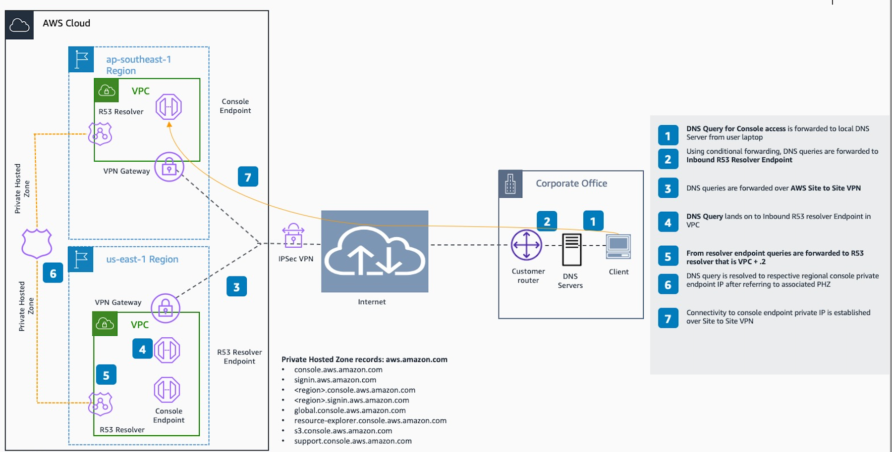

# Reference

architecture

To connect privately to AWS Management Console Private Access from an on-premises network, you can
leverage the AWS Site-to-Site VPN to AWS Virtual Private Gateway (VGW) connection option. AWS Site-to-Site VPN
enables access to your remote network from your VPC by creating a connection, and configuring
routing to pass traffic through the connection. For more information, see [What is AWS Site-to-Site
VPN](../../../vpn/latest/s2svpn/VPC_VPN.md "../../../vpn/latest/s2svpn/VPC_VPN.md") in the _AWS Site-to-Site VPN User Guide_. AWS Virtual
Private Gateway (VGW) is a highly available Regional service that acts as a gateway between a
VPC and the on-premises network.

**AWS Site-to-Site VPN to AWS Virtual Private Gateway (VGW)**

An essential component in this reference architecture design is the Amazon Route 53 Resolver,
specifically the inbound resolver. When you set it up in the VPC where the AWS Management Console Private
Access endpoints are created, resolver endpoints (network interfaces) are created in the
specified subnets. Their IP addresses can then be referred to in conditional forwarders on the
on-premises DNS servers, to allow querying of records in a Private Hosted Zone.
When on-premises clients connect to the AWS Management Console, they are routed to the AWS Management Console Private
Access endpoints’ private IPs.

Before setting up the connection to the AWS Management Console Private Access endpoint, complete the
prerequisites steps of setting up the AWS Management Console Private Access endpoints in all the Regions
where you want to access the AWS Management Console, as well as in US East (N. Virginia) Region, and configuring the
Private Hosted Zone.
