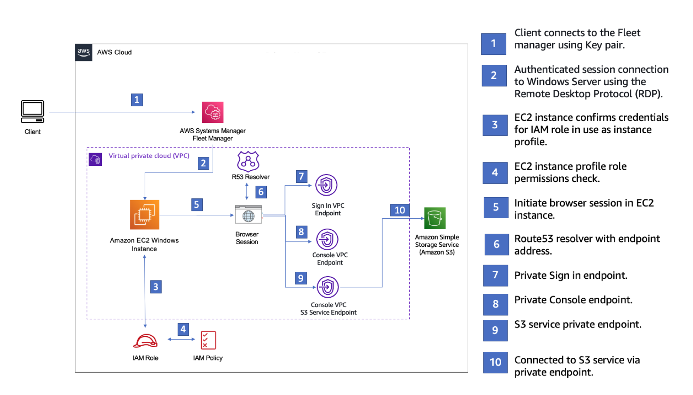
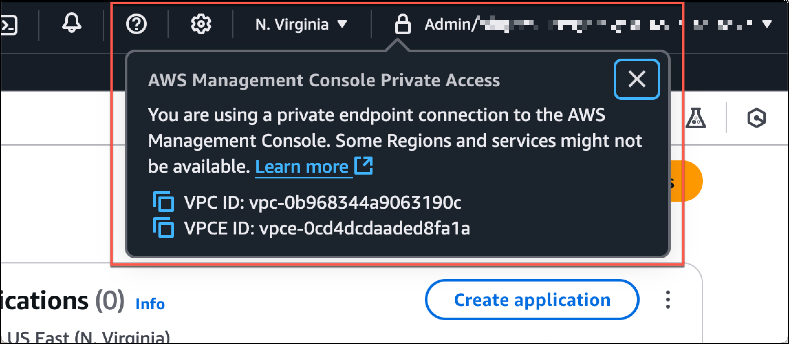

# Test setup with Amazon EC2

[Amazon Elastic Compute Cloud](../../../ec2.md "../../../ec2.md")
(Amazon EC2), provides scalable computing capacity in the Amazon Web Services cloud. You can use Amazon EC2 to
launch as many or as few virtual servers as you need, configure security and networking, and
manage storage. In this setup, we use [Fleet Manager](../../../systems-manager/latest/userguide/fleet.md "../../../systems-manager/latest/userguide/fleet.md"), a capability of
AWS Systems Manager, to connect to an Amazon EC2 Windows instance using the Remote Desktop Protocol
(RDP).

This guide demonstrates a test environment to set up and experience an AWS Management Console Private
Access connection to Amazon Simple Storage Service from an Amazon EC2 instance. This tutorial uses CloudFormation to create and
configure the network setup to be used by Amazon EC2 to visualize this feature.

The following diagram describes the workflow for using Amazon EC2 to access an AWS Management Console
Private Access setup. It shows how a user is connected to Amazon S3 using a private
endpoint.


Copy the following CloudFormation template and save it to a file that you will use in step three
of the _To set up a network_ procedure.

###### Note

This CloudFormation template uses configurations that are currently not supported in the
Israel (Tel Aviv) Region.

```
Description: |
  AWS Management Console Private Access.
Parameters:
  VpcCIDR:
    Type: String
    Default: 172.16.0.0/16
    Description: CIDR range for VPC

  Ec2KeyPair:
    Type: AWS::EC2::KeyPair::KeyName
    Description: The EC2 KeyPair to use to connect to the Windows instance

  PublicSubnet1CIDR:
    Type: String
    Default: 172.16.1.0/24
    Description: CIDR range for Public Subnet A

  PublicSubnet2CIDR:
    Type: String
    Default: 172.16.0.0/24
    Description: CIDR range for Public Subnet B

  PublicSubnet3CIDR:
    Type: String
    Default: 172.16.2.0/24
    Description: CIDR range for Public Subnet C

  PrivateSubnet1CIDR:
    Type: String
    Default: 172.16.4.0/24
    Description: CIDR range for Private Subnet A

  PrivateSubnet2CIDR:
    Type: String
    Default: 172.16.5.0/24
    Description: CIDR range for Private Subnet B

  PrivateSubnet3CIDR:
    Type: String
    Default: 172.16.3.0/24
    Description: CIDR range for Private Subnet C

  LatestWindowsAmiId:
    Type: 'AWS::SSM::Parameter::Value<AWS::EC2::Image::Id>'
    Default: '/aws/service/ami-windows-latest/Windows_Server-2022-English-Full-Base'

  InstanceTypeParameter:
    Type: String
    Default: 't3.medium'


Resources:

#########################
# VPC AND SUBNETS
#########################

  AppVPC:
    Type: 'AWS::EC2::VPC'
    Properties:
      CidrBlock: !Ref VpcCIDR
      InstanceTenancy: default
      EnableDnsSupport: true
      EnableDnsHostnames: true

  PublicSubnetA:
    Type: 'AWS::EC2::Subnet'
    Properties:
      VpcId: !Ref AppVPC
      CidrBlock: !Ref PublicSubnet1CIDR
      MapPublicIpOnLaunch: true
      AvailabilityZone:
        Fn::Select:
          - 0
          - Fn::GetAZs: ""

  PublicSubnetB:
    Type: 'AWS::EC2::Subnet'
    Properties:
      VpcId: !Ref AppVPC
      CidrBlock: !Ref PublicSubnet2CIDR
      MapPublicIpOnLaunch: true
      AvailabilityZone:
        Fn::Select:
          - 1
          - Fn::GetAZs: ""

  PublicSubnetC:
    Type: 'AWS::EC2::Subnet'
    Properties:
      VpcId: !Ref AppVPC
      CidrBlock: !Ref PublicSubnet3CIDR
      MapPublicIpOnLaunch: true
      AvailabilityZone:
        Fn::Select:
          - 2
          - Fn::GetAZs: ""

  PrivateSubnetA:
    Type: 'AWS::EC2::Subnet'
    Properties:
      VpcId: !Ref AppVPC
      CidrBlock: !Ref PrivateSubnet1CIDR
      AvailabilityZone:
        Fn::Select:
          - 0
          - Fn::GetAZs: ""

  PrivateSubnetB:
    Type: 'AWS::EC2::Subnet'
    Properties:
      VpcId: !Ref AppVPC
      CidrBlock: !Ref PrivateSubnet2CIDR
      AvailabilityZone:
        Fn::Select:
          - 1
          - Fn::GetAZs: ""

  PrivateSubnetC:
    Type: 'AWS::EC2::Subnet'
    Properties:
      VpcId: !Ref AppVPC
      CidrBlock: !Ref PrivateSubnet3CIDR
      AvailabilityZone:
        Fn::Select:
          - 2
          - Fn::GetAZs: ""

  InternetGateway:
    Type: AWS::EC2::InternetGateway

  InternetGatewayAttachment:
    Type: AWS::EC2::VPCGatewayAttachment
    Properties:
      InternetGatewayId: !Ref InternetGateway
      VpcId: !Ref AppVPC

  NatGatewayEIP:
    Type: AWS::EC2::EIP
    DependsOn: InternetGatewayAttachment

  NatGateway:
    Type: AWS::EC2::NatGateway
    Properties:
      AllocationId: !GetAtt NatGatewayEIP.AllocationId
      SubnetId: !Ref PublicSubnetA

#########################
# Route Tables
#########################

  PrivateRouteTable:
    Type: 'AWS::EC2::RouteTable'
    Properties:
      VpcId: !Ref AppVPC

  DefaultPrivateRoute:
    Type: AWS::EC2::Route
    Properties:
      RouteTableId: !Ref PrivateRouteTable
      DestinationCidrBlock: 0.0.0.0/0
      NatGatewayId: !Ref NatGateway

  PrivateSubnetRouteTableAssociation1:
    Type: 'AWS::EC2::SubnetRouteTableAssociation'
    Properties:
      RouteTableId: !Ref PrivateRouteTable
      SubnetId: !Ref PrivateSubnetA

  PrivateSubnetRouteTableAssociation2:
    Type: 'AWS::EC2::SubnetRouteTableAssociation'
    Properties:
      RouteTableId: !Ref PrivateRouteTable
      SubnetId: !Ref PrivateSubnetB

  PrivateSubnetRouteTableAssociation3:
    Type: 'AWS::EC2::SubnetRouteTableAssociation'
    Properties:
      RouteTableId: !Ref PrivateRouteTable
      SubnetId: !Ref PrivateSubnetC

  PublicRouteTable:
    Type: AWS::EC2::RouteTable
    Properties:
      VpcId: !Ref AppVPC

  DefaultPublicRoute:
    Type: AWS::EC2::Route
    DependsOn: InternetGatewayAttachment
    Properties:
      RouteTableId: !Ref PublicRouteTable
      DestinationCidrBlock: 0.0.0.0/0
      GatewayId: !Ref InternetGateway

  PublicSubnetARouteTableAssociation1:
    Type: AWS::EC2::SubnetRouteTableAssociation
    Properties:
      RouteTableId: !Ref PublicRouteTable
      SubnetId: !Ref PublicSubnetA

  PublicSubnetBRouteTableAssociation2:
    Type: AWS::EC2::SubnetRouteTableAssociation
    Properties:
      RouteTableId: !Ref PublicRouteTable
      SubnetId: !Ref PublicSubnetB

  PublicSubnetBRouteTableAssociation3:
    Type: AWS::EC2::SubnetRouteTableAssociation
    Properties:
      RouteTableId: !Ref PublicRouteTable
      SubnetId: !Ref PublicSubnetC


#########################
# SECURITY GROUPS
#########################

  VPCEndpointSecurityGroup:
    Type: 'AWS::EC2::SecurityGroup'
    Properties:
      GroupDescription: Allow TLS for VPC Endpoint
      VpcId: !Ref AppVPC
      SecurityGroupIngress:
        - IpProtocol: tcp
          FromPort: 443
          ToPort: 443
          CidrIp: !GetAtt AppVPC.CidrBlock

  EC2SecurityGroup:
    Type: 'AWS::EC2::SecurityGroup'
    Properties:
      GroupDescription: Default EC2 Instance SG
      VpcId: !Ref AppVPC

#########################
# VPC ENDPOINTS
#########################

  VPCEndpointGatewayS3:
    Type: 'AWS::EC2::VPCEndpoint'
    Properties:
      ServiceName: !Sub 'com.amazonaws.${AWS::Region}.s3'
      VpcEndpointType: Gateway
      VpcId: !Ref AppVPC
      RouteTableIds:
        - !Ref PrivateRouteTable

  VPCEndpointInterfaceSSM:
    Type: 'AWS::EC2::VPCEndpoint'
    Properties:
      VpcEndpointType: Interface
      PrivateDnsEnabled: false
      SubnetIds:
        - !Ref PrivateSubnetA
        - !Ref PrivateSubnetB
      SecurityGroupIds:
        - !Ref VPCEndpointSecurityGroup
      ServiceName: !Sub 'com.amazonaws.${AWS::Region}.ssm'
      VpcId: !Ref AppVPC

  VPCEndpointInterfaceEc2messages:
    Type: 'AWS::EC2::VPCEndpoint'
    Properties:
      VpcEndpointType: Interface
      PrivateDnsEnabled: false
      SubnetIds:
        - !Ref PrivateSubnetA
        - !Ref PrivateSubnetB
        - !Ref PrivateSubnetC
      SecurityGroupIds:
        - !Ref VPCEndpointSecurityGroup
      ServiceName: !Sub 'com.amazonaws.${AWS::Region}.ec2messages'
      VpcId: !Ref AppVPC

  VPCEndpointInterfaceSsmmessages:
    Type: 'AWS::EC2::VPCEndpoint'
    Properties:
      VpcEndpointType: Interface
      PrivateDnsEnabled: false
      SubnetIds:
        - !Ref PrivateSubnetA
        - !Ref PrivateSubnetB
        - !Ref PrivateSubnetC
      SecurityGroupIds:
        - !Ref VPCEndpointSecurityGroup
      ServiceName: !Sub 'com.amazonaws.${AWS::Region}.ssmmessages'
      VpcId: !Ref AppVPC

  VPCEndpointInterfaceSignin:
    Type: 'AWS::EC2::VPCEndpoint'
    Properties:
      VpcEndpointType: Interface
      PrivateDnsEnabled: false
      SubnetIds:
        - !Ref PrivateSubnetA
        - !Ref PrivateSubnetB
        - !Ref PrivateSubnetC
      SecurityGroupIds:
        - !Ref VPCEndpointSecurityGroup
      ServiceName: !Sub 'com.amazonaws.${AWS::Region}.signin'
      VpcId: !Ref AppVPC

  VPCEndpointInterfaceConsole:
    Type: 'AWS::EC2::VPCEndpoint'
    Properties:
      VpcEndpointType: Interface
      PrivateDnsEnabled: false
      SubnetIds:
        - !Ref PrivateSubnetA
        - !Ref PrivateSubnetB
        - !Ref PrivateSubnetC
      SecurityGroupIds:
        - !Ref VPCEndpointSecurityGroup
      ServiceName: !Sub 'com.amazonaws.${AWS::Region}.console'
      VpcId: !Ref AppVPC

#########################
# ROUTE53 RESOURCES
#########################

  ConsoleHostedZone:
    Type: "AWS::Route53::HostedZone"
    Properties:
      HostedZoneConfig:
        Comment: 'Console VPC Endpoint Hosted Zone'
      Name: 'console.aws.amazon.com'
      VPCs:
        -
          VPCId: !Ref AppVPC
          VPCRegion: !Ref "AWS::Region"

  ConsoleRecordGlobal:
    Type: AWS::Route53::RecordSet
    Properties:
      HostedZoneId: !Ref 'ConsoleHostedZone'
      Name: 'console.aws.amazon.com'
      AliasTarget:
        DNSName: !Select ['1', !Split [':', !Select ['0', !GetAtt VPCEndpointInterfaceConsole.DnsEntries]]]
        HostedZoneId: !Select ['0', !Split [':', !Select ['0', !GetAtt VPCEndpointInterfaceConsole.DnsEntries]]]
      Type: A

  GlobalConsoleRecord:
    Type: AWS::Route53::RecordSet
    Properties:
      HostedZoneId: !Ref 'ConsoleHostedZone'
      Name: 'global.console.aws.amazon.com'
      AliasTarget:
        DNSName: !Select ['1', !Split [':', !Select ['0', !GetAtt VPCEndpointInterfaceConsole.DnsEntries]]]
        HostedZoneId: !Select ['0', !Split [':', !Select ['0', !GetAtt VPCEndpointInterfaceConsole.DnsEntries]]]
      Type: A

  ConsoleS3ProxyRecordGlobal:
    Type: AWS::Route53::RecordSet
    Properties:
      HostedZoneId: !Ref 'ConsoleHostedZone'
      Name: 's3.console.aws.amazon.com'
      AliasTarget:
        DNSName: !Select ['1', !Split [':', !Select ['0', !GetAtt VPCEndpointInterfaceConsole.DnsEntries]]]
        HostedZoneId: !Select ['0', !Split [':', !Select ['0', !GetAtt VPCEndpointInterfaceConsole.DnsEntries]]]
      Type: A

  ConsoleSupportProxyRecordGlobal:
    Type: AWS::Route53::RecordSet
    Properties:
      HostedZoneId: !Ref 'ConsoleHostedZone'
      Name: "support.console.aws.amazon.com"
      AliasTarget:
        DNSName: !Select ['1', !Split [':', !Select ['0', !GetAtt VPCEndpointInterfaceConsole.DnsEntries]]]
        HostedZoneId: !Select ['0', !Split [':', !Select ['0', !GetAtt VPCEndpointInterfaceConsole.DnsEntries]]]
      Type: A

  ExplorerProxyRecordGlobal:
    Type: AWS::Route53::RecordSet
    Properties:
      HostedZoneId: !Ref 'ConsoleHostedZone'
      Name: "resource-explorer.console.aws.amazon.com"
      AliasTarget:
        DNSName: !Select ['1', !Split [':', !Select ['0', !GetAtt VPCEndpointInterfaceConsole.DnsEntries]]]
        HostedZoneId: !Select ['0', !Split [':', !Select ['0', !GetAtt VPCEndpointInterfaceConsole.DnsEntries]]]
      Type: A

  WidgetProxyRecord:
    Type: AWS::Route53::RecordSet
    Properties:
      HostedZoneId: !Ref 'ConsoleHostedZone'
      Name: "*.widget.console.aws.amazon.com"
      AliasTarget:
        DNSName: !Select ["1", !Split [":", !Select ["0", !GetAtt VPCEndpointInterfaceConsole.DnsEntries],],]
        HostedZoneId: !Select ["0", !Split [":", !Select ["0", !GetAtt VPCEndpointInterfaceConsole.DnsEntries],],]
      Type: A

  ConsoleRecordRegional:
    Type: AWS::Route53::RecordSet
    Properties:
      HostedZoneId: !Ref 'ConsoleHostedZone'
      Name: !Sub "${AWS::Region}.console.aws.amazon.com"
      AliasTarget:
        DNSName: !Select ['1', !Split [':', !Select ['0', !GetAtt VPCEndpointInterfaceConsole.DnsEntries]]]
        HostedZoneId: !Select ['0', !Split [':', !Select ['0', !GetAtt VPCEndpointInterfaceConsole.DnsEntries]]]
      Type: A

  ConsoleRecordRegionalMultiSession:
    Type: AWS::Route53::RecordSet
    Properties:
      HostedZoneId: !Ref 'ConsoleHostedZone'
      Name: !Sub "*.${AWS::Region}.console.aws.amazon.com"
      AliasTarget:
        DNSName: !Select ['1', !Split [':', !Select ['0', !GetAtt VPCEndpointInterfaceConsole.DnsEntries]]]
        HostedZoneId: !Select ['0', !Split [':', !Select ['0', !GetAtt VPCEndpointInterfaceConsole.DnsEntries]]]
      Type: A

  SigninHostedZone:
    Type: "AWS::Route53::HostedZone"
    Properties:
      HostedZoneConfig:
        Comment: 'Signin VPC Endpoint Hosted Zone'
      Name: 'signin.aws.amazon.com'
      VPCs:
        -
          VPCId: !Ref AppVPC
          VPCRegion: !Ref "AWS::Region"

  SigninRecordGlobal:
    Type: AWS::Route53::RecordSet
    Properties:
      HostedZoneId: !Ref 'SigninHostedZone'
      Name: 'signin.aws.amazon.com'
      AliasTarget:
        DNSName: !Select ['1', !Split [':', !Select ['0', !GetAtt VPCEndpointInterfaceSignin.DnsEntries]]]
        HostedZoneId: !Select ['0', !Split [':', !Select ['0', !GetAtt VPCEndpointInterfaceSignin.DnsEntries]]]
      Type: A

  SigninRecordRegional:
    Type: AWS::Route53::RecordSet
    Properties:
      HostedZoneId: !Ref 'SigninHostedZone'
      Name: !Sub "${AWS::Region}.signin.aws.amazon.com"
      AliasTarget:
        DNSName: !Select ['1', !Split [':', !Select ['0', !GetAtt VPCEndpointInterfaceSignin.DnsEntries]]]
        HostedZoneId: !Select ['0', !Split [':', !Select ['0', !GetAtt VPCEndpointInterfaceSignin.DnsEntries]]]
      Type: A

#########################
# EC2 INSTANCE
#########################

  Ec2InstanceRole:
    Type: AWS::IAM::Role
    Properties:
      AssumeRolePolicyDocument:
        Version: 2012-10-17
        Statement:
          -
            Effect: Allow
            Principal:
              Service:
                - ec2.amazonaws.com
            Action:
              - sts:AssumeRole
      Path: /
      ManagedPolicyArns:
        - arn:aws:iam::aws:policy/AmazonSSMManagedInstanceCore

  Ec2InstanceProfile:
    Type: AWS::IAM::InstanceProfile
    Properties:
      Path: /
      Roles:
       - !Ref Ec2InstanceRole

  EC2WinInstance:
    Type: 'AWS::EC2::Instance'
    Properties:
      ImageId: !Ref LatestWindowsAmiId
      IamInstanceProfile: !Ref Ec2InstanceProfile
      KeyName: !Ref Ec2KeyPair
      InstanceType:
        Ref: InstanceTypeParameter
      SubnetId: !Ref PrivateSubnetA
      SecurityGroupIds:
        - Ref: EC2SecurityGroup
      BlockDeviceMappings:
        - DeviceName: /dev/sda1
          Ebs:
            VolumeSize: 50
      Tags:
      - Key: "Name"
        Value: "Console VPCE test instance"


```

###### To set up a network

1. Sign in to the management account for your organization and open the [CloudFormation console](https://console.aws.amazon.com/cloudformation "https://console.aws.amazon.com/cloudformation").
2. Choose **Create stack**.
3. Choose **With new resources (standard)**. Upload the CloudFormation template
   file that you previously created, and choose **Next**.
4. Enter a name for the stack, such as
   `PrivateConsoleNetworkForS3`, then choose
   **Next**.
5. For **VPC and subnets**, enter your preferred IP CIDR ranges, or
   use the provided default values. If you use the default values, verify that they don’t
   overlap with existing VPC resources in your AWS account.
6. For the **Ec2KeyPair** parameter, select one from the existing
   Amazon EC2 key pairs in your account. If you don't have an existing Amazon EC2 key pair, you must
   create one before proceeding to the next step. For more information, see [Create a key pair using Amazon EC2](../../../AWSEC2/latest/UserGuide/create-key-pairs.md#having-ec2-create-your-key-pair "../../../AWSEC2/latest/UserGuide/create-key-pairs.md#having-ec2-create-your-key-pair") in the
   _Amazon EC2 User Guide_.
7. Choose **Create stack**.
8. After the stack is created, choose the **Resources** tab to view
   the resources that have been created.

###### To connect to the Amazon EC2 instance

1. Sign in to the management account for your organization and open the [Amazon EC2 console](https://console.aws.amazon.com/ec2 "https://console.aws.amazon.com/ec2").
2. In the navigation pane, choose **Instances**.
3. On the **Instances** page, select **Console VPCE test
   instance** that was created by the CloudFormation template. Then choose
   **Connect**.

###### Note

This example uses Fleet Manager, a capability of AWS Systems Manager Explorer, to connect to your
Windows Server. It might take a few minutes before the connection can be
started. 4. On the **Connect to instance** page, choose **RDP
Client**, then **Connect using Fleet Manager**. 5. Choose **Fleet Manager Remote Desktop**. 6. To get the administrative password for the Amazon EC2 instance and access the Windows
Desktop using the web interface, use the private key associated with the Amazon EC2 key pair
that you used when creating the CloudFormation template . 7. From the Amazon EC2 Windows instance, open the AWS Management Console in the browser. 8. After you sign in with your AWS credentials, open the [Amazon S3 console](https://console.aws.amazon.com/s3 "https://console.aws.amazon.com/s3") and verify that you are connected using AWS Management Console
Private Access.

###### To test AWS Management Console Private Access setup

1. Sign in to the management account for your organization and open the [Amazon S3 console](https://console.aws.amazon.com/s3 "https://console.aws.amazon.com/s3").
2. Choose the lock-private icon in the navigation bar to view the VPC endpoint in use.
   The following screenshot shows the location of the lock-private icon and the VPC
   information.


