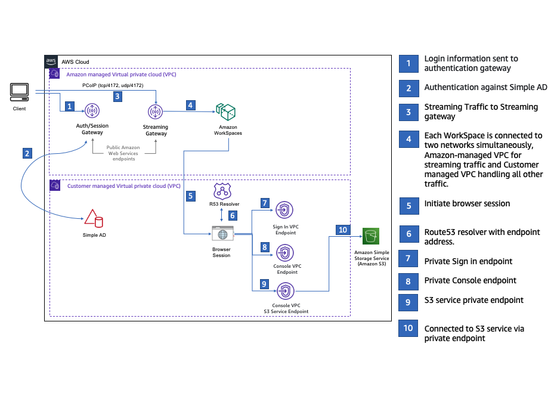
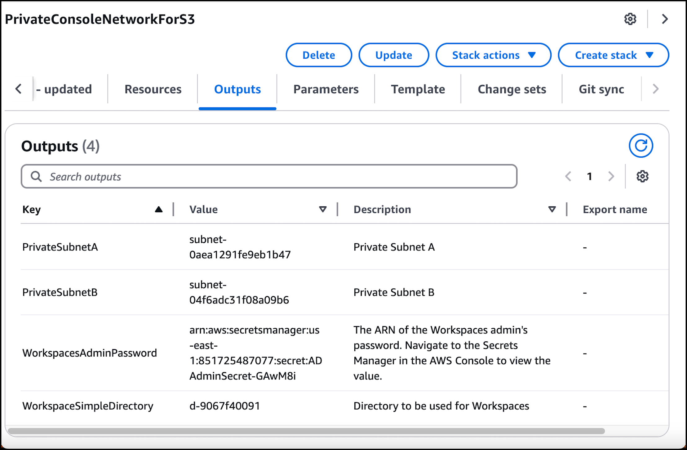
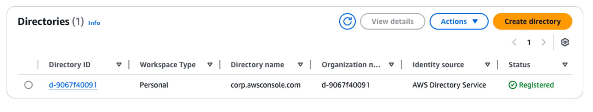

# Test setup with Amazon WorkSpaces

Amazon WorkSpaces enables you to provision virtual, cloud-based Windows, Amazon Linux, or Ubuntu
Linux desktops for your users, known as WorkSpaces. You can quickly add or remove users as
your needs change. Users can access their virtual desktops from multiple devices or web
browsers. To learn more about WorkSpaces, see the [Amazon WorkSpaces Administration
Guide](../../../workspaces/latest/adminguide/amazon-workspaces.md "../../../workspaces/latest/adminguide/amazon-workspaces.md").

The example in this section describes a test environment in which a user environment
uses a web browser running on a WorkSpace to sign in to AWS Management Console Private Access. Then, the
user visits the Amazon Simple Storage Service console. This WorkSpace is meant to simulate the experience of a
corporate user with a laptop on a VPC-connected network, accessing the AWS Management Console from their
browser.

This tutorial uses AWS CloudFormation to create and configure the network setup and a Simple
Active Directory to be used by WorkSpaces along with step by step instructions to setup a
WorkSpace using the AWS Management Console.

The following diagram describes the workflow for using a WorkSpace to test an AWS Management Console
Private Access setup. It shows the relationship between a client WorkSpace, an Amazon
managed VPC and a customer managed VPC.


Copy the following CloudFormation template and save it to a file that you will use in step 3 of
the procedure to set up a network.

```
Description: |
  AWS Management Console Private Access.
Parameters:

  VpcCIDR:
    Type: String
    Default: 172.16.0.0/16
    Description: CIDR range for VPC

  PublicSubnet1CIDR:
    Type: String
    Default: 172.16.1.0/24
    Description: CIDR range for Public Subnet A

  PublicSubnet2CIDR:
    Type: String
    Default: 172.16.0.0/24
    Description: CIDR range for Public Subnet B

  PrivateSubnet1CIDR:
    Type: String
    Default: 172.16.4.0/24
    Description: CIDR range for Private Subnet A

  PrivateSubnet2CIDR:
    Type: String
    Default: 172.16.5.0/24
    Description: CIDR range for Private Subnet B

  DSAdminPasswordResourceName:
    Type: String
    Default: ADAdminSecret
    Description: Password for directory services admin

# Amazon WorkSpaces is available in a subset of the Availability Zones for each supported Region.
# https://docs.aws.amazon.com/workspaces/latest/adminguide/azs-workspaces.html
Mappings:
  RegionMap:
    us-east-1:
      az1: use1-az2
      az2: use1-az4
      az3: use1-az6
    us-west-2:
      az1: usw2-az1
      az2: usw2-az2
      az3: usw2-az3
    ap-south-1:
      az1: aps1-az1
      az2: aps1-az2
      az3: aps1-az3
    ap-northeast-2:
      az1: apne2-az1
      az2: apne2-az3
    ap-southeast-1:
      az1: apse1-az1
      az2: apse1-az2
    ap-southeast-2:
      az1: apse2-az1
      az2: apse2-az3
    ap-northeast-1:
      az1: apne1-az1
      az2: apne1-az4
    ca-central-1:
      az1: cac1-az1
      az2: cac1-az2
    eu-central-1:
      az1: euc1-az2
      az2: euc1-az3
    eu-west-1:
      az1: euw1-az1
      az2: euw1-az2
    eu-west-2:
      az1: euw2-az2
      az2: euw2-az3
    sa-east-1:
      az1: sae1-az1
      az2: sae1-az3

Resources:

  iamLambdaExecutionRole:
    Type: AWS::IAM::Role
    Properties:
      AssumeRolePolicyDocument:
        Version: 2012-10-17
        Statement:
          - Effect: Allow
            Principal:
              Service:
              - lambda.amazonaws.com
            Action:
              - 'sts:AssumeRole'
      ManagedPolicyArns:
        - arn:aws:iam::aws:policy/service-role/AWSLambdaBasicExecutionRole
      Policies:
        - PolicyName: describe-ec2-az
          PolicyDocument:
            Version: "2012-10-17"
            Statement:
              - Effect: Allow
                Action:
                  - 'ec2:DescribeAvailabilityZones'
                Resource: '*'
      MaxSessionDuration: 3600
      Path: /service-role/

  fnZoneIdtoZoneName:
    Type: AWS::Lambda::Function
    Properties:
      Runtime: python3.8
      Handler: index.lambda_handler
      Code:
        ZipFile: |
          import boto3
          import cfnresponse

          def zoneId_to_zoneName(event, context):
              responseData = {}
              ec2 = boto3.client('ec2')
              describe_az = ec2.describe_availability_zones()
              for az in describe_az['AvailabilityZones']:
                  if event['ResourceProperties']['ZoneId'] == az['ZoneId']:
                      responseData['ZoneName'] = az['ZoneName']
                      cfnresponse.send(event, context, cfnresponse.SUCCESS, responseData, str(az['ZoneId']))

          def no_op(event, context):
              print(event)
              responseData = {}
              cfnresponse.send(event, context, cfnresponse.SUCCESS, responseData, str(event['RequestId']))

          def lambda_handler(event, context):
              if event['RequestType'] == ('Create' or 'Update'):
                  zoneId_to_zoneName(event, context)
              else:
                  no_op(event,context)
      Role: !GetAtt iamLambdaExecutionRole.Arn

  getAZ1:
    Type: "Custom::zone-id-zone-name"
    Properties:
      ServiceToken: !GetAtt fnZoneIdtoZoneName.Arn
      ZoneId: !FindInMap [ RegionMap, !Ref 'AWS::Region', az1 ]
  getAZ2:
    Type: "Custom::zone-id-zone-name"
    Properties:
      ServiceToken: !GetAtt fnZoneIdtoZoneName.Arn
      ZoneId: !FindInMap [ RegionMap, !Ref 'AWS::Region', az2 ]

#########################
# VPC AND SUBNETS
#########################

  AppVPC:
    Type: 'AWS::EC2::VPC'
    Properties:
      CidrBlock: !Ref VpcCIDR
      InstanceTenancy: default
      EnableDnsSupport: true
      EnableDnsHostnames: true

  PublicSubnetA:
    Type: 'AWS::EC2::Subnet'
    Properties:
      VpcId: !Ref AppVPC
      CidrBlock: !Ref PublicSubnet1CIDR
      MapPublicIpOnLaunch: true
      AvailabilityZone: !GetAtt getAZ1.ZoneName

  PublicSubnetB:
    Type: 'AWS::EC2::Subnet'
    Properties:
      VpcId: !Ref AppVPC
      CidrBlock: !Ref PublicSubnet2CIDR
      MapPublicIpOnLaunch: true
      AvailabilityZone: !GetAtt getAZ2.ZoneName

  PrivateSubnetA:
    Type: 'AWS::EC2::Subnet'
    Properties:
      VpcId: !Ref AppVPC
      CidrBlock: !Ref PrivateSubnet1CIDR
      AvailabilityZone: !GetAtt getAZ1.ZoneName

  PrivateSubnetB:
    Type: 'AWS::EC2::Subnet'
    Properties:
      VpcId: !Ref AppVPC
      CidrBlock: !Ref PrivateSubnet2CIDR
      AvailabilityZone: !GetAtt getAZ2.ZoneName

  InternetGateway:
    Type: AWS::EC2::InternetGateway

  InternetGatewayAttachment:
    Type: AWS::EC2::VPCGatewayAttachment
    Properties:
      InternetGatewayId: !Ref InternetGateway
      VpcId: !Ref AppVPC

  NatGatewayEIP:
    Type: AWS::EC2::EIP
    DependsOn: InternetGatewayAttachment

  NatGateway:
    Type: AWS::EC2::NatGateway
    Properties:
      AllocationId: !GetAtt NatGatewayEIP.AllocationId
      SubnetId: !Ref PublicSubnetA

#########################
# Route Tables
#########################

  PrivateRouteTable:
    Type: 'AWS::EC2::RouteTable'
    Properties:
      VpcId: !Ref AppVPC

  DefaultPrivateRoute:
    Type: AWS::EC2::Route
    Properties:
      RouteTableId: !Ref PrivateRouteTable
      DestinationCidrBlock: 0.0.0.0/0
      NatGatewayId: !Ref NatGateway

  PrivateSubnetRouteTableAssociation1:
    Type: 'AWS::EC2::SubnetRouteTableAssociation'
    Properties:
      RouteTableId: !Ref PrivateRouteTable
      SubnetId: !Ref PrivateSubnetA

  PrivateSubnetRouteTableAssociation2:
    Type: 'AWS::EC2::SubnetRouteTableAssociation'
    Properties:
      RouteTableId: !Ref PrivateRouteTable
      SubnetId: !Ref PrivateSubnetB

  PublicRouteTable:
    Type: AWS::EC2::RouteTable
    Properties:
      VpcId: !Ref AppVPC

  DefaultPublicRoute:
    Type: AWS::EC2::Route
    DependsOn: InternetGatewayAttachment
    Properties:
      RouteTableId: !Ref PublicRouteTable
      DestinationCidrBlock: 0.0.0.0/0
      GatewayId: !Ref InternetGateway

  PublicSubnetARouteTableAssociation1:
    Type: AWS::EC2::SubnetRouteTableAssociation
    Properties:
      RouteTableId: !Ref PublicRouteTable
      SubnetId: !Ref PublicSubnetA

  PublicSubnetBRouteTableAssociation2:
    Type: AWS::EC2::SubnetRouteTableAssociation
    Properties:
      RouteTableId: !Ref PublicRouteTable
      SubnetId: !Ref PublicSubnetB


#########################
# SECURITY GROUPS
#########################

  VPCEndpointSecurityGroup:
    Type: 'AWS::EC2::SecurityGroup'
    Properties:
      GroupDescription: Allow TLS for VPC Endpoint
      VpcId: !Ref AppVPC
      SecurityGroupIngress:
        - IpProtocol: tcp
          FromPort: 443
          ToPort: 443
          CidrIp: !GetAtt AppVPC.CidrBlock

#########################
# VPC ENDPOINTS
#########################

  VPCEndpointGatewayS3:
    Type: 'AWS::EC2::VPCEndpoint'
    Properties:
      ServiceName: !Sub 'com.amazonaws.${AWS::Region}.s3'
      VpcEndpointType: Gateway
      VpcId: !Ref AppVPC
      RouteTableIds:
        - !Ref PrivateRouteTable

  VPCEndpointInterfaceSignin:
    Type: 'AWS::EC2::VPCEndpoint'
    Properties:
      VpcEndpointType: Interface
      PrivateDnsEnabled: false
      SubnetIds:
        - !Ref PrivateSubnetA
        - !Ref PrivateSubnetB
      SecurityGroupIds:
        - !Ref VPCEndpointSecurityGroup
      ServiceName: !Sub 'com.amazonaws.${AWS::Region}.signin'
      VpcId: !Ref AppVPC

  VPCEndpointInterfaceConsole:
    Type: 'AWS::EC2::VPCEndpoint'
    Properties:
      VpcEndpointType: Interface
      PrivateDnsEnabled: false
      SubnetIds:
        - !Ref PrivateSubnetA
        - !Ref PrivateSubnetB
      SecurityGroupIds:
        - !Ref VPCEndpointSecurityGroup
      ServiceName: !Sub 'com.amazonaws.${AWS::Region}.console'
      VpcId: !Ref AppVPC

#########################
# ROUTE53 RESOURCES
#########################

  ConsoleHostedZone:
    Type: "AWS::Route53::HostedZone"
    Properties:
      HostedZoneConfig:
        Comment: 'Console VPC Endpoint Hosted Zone'
      Name: 'console.aws.amazon.com'
      VPCs:
        -
          VPCId: !Ref AppVPC
          VPCRegion: !Ref "AWS::Region"

  ConsoleRecordGlobal:
    Type: AWS::Route53::RecordSet
    Properties:
      HostedZoneId: !Ref 'ConsoleHostedZone'
      Name: 'console.aws.amazon.com'
      AliasTarget:
        DNSName: !Select ['1', !Split [':', !Select ['0', !GetAtt VPCEndpointInterfaceConsole.DnsEntries]]]
        HostedZoneId: !Select ['0', !Split [':', !Select ['0', !GetAtt VPCEndpointInterfaceConsole.DnsEntries]]]
      Type: A

  GlobalConsoleRecord:
    Type: AWS::Route53::RecordSet
    Properties:
      HostedZoneId: !Ref 'ConsoleHostedZone'
      Name: 'global.console.aws.amazon.com'
      AliasTarget:
        DNSName: !Select ['1', !Split [':', !Select ['0', !GetAtt VPCEndpointInterfaceConsole.DnsEntries]]]
        HostedZoneId: !Select ['0', !Split [':', !Select ['0', !GetAtt VPCEndpointInterfaceConsole.DnsEntries]]]
      Type: A

  ConsoleS3ProxyRecordGlobal:
    Type: AWS::Route53::RecordSet
    Properties:
      HostedZoneId: !Ref 'ConsoleHostedZone'
      Name: 's3.console.aws.amazon.com'
      AliasTarget:
        DNSName: !Select ['1', !Split [':', !Select ['0', !GetAtt VPCEndpointInterfaceConsole.DnsEntries]]]
        HostedZoneId: !Select ['0', !Split [':', !Select ['0', !GetAtt VPCEndpointInterfaceConsole.DnsEntries]]]
      Type: A

  ConsoleSupportProxyRecordGlobal:
    Type: AWS::Route53::RecordSet
    Properties:
      HostedZoneId: !Ref 'ConsoleHostedZone'
      Name: "support.console.aws.amazon.com"
      AliasTarget:
        DNSName: !Select ['1', !Split [':', !Select ['0', !GetAtt VPCEndpointInterfaceConsole.DnsEntries]]]
        HostedZoneId: !Select ['0', !Split [':', !Select ['0', !GetAtt VPCEndpointInterfaceConsole.DnsEntries]]]
      Type: A

  ExplorerProxyRecordGlobal:
    Type: AWS::Route53::RecordSet
    Properties:
      HostedZoneId: !Ref 'ConsoleHostedZone'
      Name: "resource-explorer.console.aws.amazon.com"
      AliasTarget:
        DNSName: !Select ['1', !Split [':', !Select ['0', !GetAtt VPCEndpointInterfaceConsole.DnsEntries]]]
        HostedZoneId: !Select ['0', !Split [':', !Select ['0', !GetAtt VPCEndpointInterfaceConsole.DnsEntries]]]
      Type: A

  WidgetProxyRecord:
    Type: AWS::Route53::RecordSet
    Properties:
      HostedZoneId: !Ref "ConsoleHostedZone"
      Name: "*.widget.console.aws.amazon.com"
      AliasTarget:
        DNSName: !Select ["1", !Split [":", !Select ["0", !GetAtt VPCEndpointInterfaceConsole.DnsEntries],],]
        HostedZoneId: !Select ["0", !Split [":", !Select ["0", !GetAtt VPCEndpointInterfaceConsole.DnsEntries],],]
      Type: A

  ConsoleRecordRegional:
    Type: AWS::Route53::RecordSet
    Properties:
      HostedZoneId: !Ref 'ConsoleHostedZone'
      Name: !Sub "${AWS::Region}.console.aws.amazon.com"
      AliasTarget:
        DNSName: !Select ['1', !Split [':', !Select ['0', !GetAtt VPCEndpointInterfaceConsole.DnsEntries]]]
        HostedZoneId: !Select ['0', !Split [':', !Select ['0', !GetAtt VPCEndpointInterfaceConsole.DnsEntries]]]
      Type: A

  ConsoleRecordRegionalMultiSession:
    Type: AWS::Route53::RecordSet
    Properties:
      HostedZoneId: !Ref 'ConsoleHostedZone'
      Name: !Sub "*.${AWS::Region}.console.aws.amazon.com"
      AliasTarget:
        DNSName: !Select ['1', !Split [':', !Select ['0', !GetAtt VPCEndpointInterfaceConsole.DnsEntries]]]
        HostedZoneId: !Select ['0', !Split [':', !Select ['0', !GetAtt VPCEndpointInterfaceConsole.DnsEntries]]]
      Type: A

  SigninHostedZone:
    Type: "AWS::Route53::HostedZone"
    Properties:
      HostedZoneConfig:
        Comment: 'Signin VPC Endpoint Hosted Zone'
      Name: 'signin.aws.amazon.com'
      VPCs:
        -
          VPCId: !Ref AppVPC
          VPCRegion: !Ref "AWS::Region"

  SigninRecordGlobal:
    Type: AWS::Route53::RecordSet
    Properties:
      HostedZoneId: !Ref 'SigninHostedZone'
      Name: 'signin.aws.amazon.com'
      AliasTarget:
        DNSName: !Select ['1', !Split [':', !Select ['0', !GetAtt VPCEndpointInterfaceSignin.DnsEntries]]]
        HostedZoneId: !Select ['0', !Split [':', !Select ['0', !GetAtt VPCEndpointInterfaceSignin.DnsEntries]]]
      Type: A

  SigninRecordRegional:
    Type: AWS::Route53::RecordSet
    Properties:
      HostedZoneId: !Ref 'SigninHostedZone'
      Name: !Sub "${AWS::Region}.signin.aws.amazon.com"
      AliasTarget:
        DNSName: !Select ['1', !Split [':', !Select ['0', !GetAtt VPCEndpointInterfaceSignin.DnsEntries]]]
        HostedZoneId: !Select ['0', !Split [':', !Select ['0', !GetAtt VPCEndpointInterfaceSignin.DnsEntries]]]
      Type: A

#########################
# WORKSPACE RESOURCES
#########################
  ADAdminSecret:
    Type: AWS::SecretsManager::Secret
    Properties:
      Name: !Ref DSAdminPasswordResourceName
      Description: "Password for directory services admin"
      GenerateSecretString:
        SecretStringTemplate: '{"username": "Admin"}'
        GenerateStringKey: password
        PasswordLength: 30
        ExcludeCharacters: '"@/\'

  WorkspaceSimpleDirectory:
    Type: AWS::DirectoryService::SimpleAD
    DependsOn: AppVPC
    Properties:
      Name: "corp.awsconsole.com"
      Password: '{{resolve:secretsmanager:ADAdminSecret:SecretString:password}}'
      Size: "Small"
      VpcSettings:
        SubnetIds:
          - Ref: PrivateSubnetA
          - Ref: PrivateSubnetB

        VpcId:
          Ref: AppVPC


Outputs:
  PrivateSubnetA:
    Description: Private Subnet A
    Value: !Ref PrivateSubnetA

  PrivateSubnetB:
    Description: Private Subnet B
    Value: !Ref PrivateSubnetB

  WorkspaceSimpleDirectory:
    Description: Directory to be used for Workspaces
    Value: !Ref WorkspaceSimpleDirectory

  WorkspacesAdminPassword:
    Description : "The ARN of the Workspaces admin's password.  Navigate to the Secrets Manager in the AWS Console to view the value."
    Value: !Ref ADAdminSecret

```

###### Note

This test setup is designed to run in the US East (N. Virginia) (us-east-1)
Region.

###### To set up a network

1. Sign in to the management account for your organization and open the [CloudFormation console](https://console.aws.amazon.com/cloudformation "https://console.aws.amazon.com/cloudformation").
2. Choose **Create stack**.
3. Choose **With new resources (standard)**. Upload the CloudFormation template
   file that you previously created, and choose **Next**.
4. Enter a name for the stack, such as
   `PrivateConsoleNetworkForS3`, then choose
   **Next**.
5. For **VPC and subnets**, enter your preferred IP CIDR ranges, or
   use the provided default values. If you use the default values, verify that they don’t
   overlap with existing VPC resources in your AWS account.
6. Choose **Create stack**.
7. After the stack is created, choose the **Resources** tab to view
   the resources that have been created.
8. Choose the **Outputs** tab, to view the values for private subnets
   and the Workspace Simple Directory. Take note of these values, as you will use them in
   step four of the next procedure for creating and configuring a WorkSpace.
   The following screenshot shows the view of the **Outputs** tab
   displaying the values for the private subnets and the Workspace Simple Directory.


Now that you have created your network, use the following procedures to create and
access a WorkSpace.

###### To create a WorkSpace

1. Open the [WorkSpaces console](https://console.aws.amazon.com/workspaces "https://console.aws.amazon.com/workspaces").
2. In the navigation pane, choose **Directories**.
3. On the **Directories** page, verify that the directory status is
   **Active**. The following screenshot shows a
   **Directories** page with an active directory.

 4. To use a directory in WorkSpaces, you must register it. In the navigation pane,
choose **WorkSpaces**, then choose **Create
WorkSpaces**. 5. For **Select a directory**, choose the directory created by CloudFormation
in the preceding procedure. On the **Actions** menu, choose
**Register**. 6. For the subnet selection, select the two private subnets noted in step nine of the
preceding procedure. 7. Select **Enable self-service permissions**, then choose
**Register**. 8. After the directory is registered, continue creating the WorkSpace. Select the
registered directory, then choose **Next**. 9. On the **Create users** page, choose **Create additional
user**. Enter your name and email to enable you to use the WorkSpace. Verify
that the email address is valid as the WorkSpace login information is sent to this email
address. 10. Choose **Next**. 11. On the **Identify Users** page, select the user you created in step
nine, then choose **Next**. 12. On the **Select Bundle** page, choose **Standard with
Amazon Linux 2**, then choose **Next**. 13. Use the default settings for the running mode and user customization, and then
choose **Create Workspace**. The WorkSpace starts out in
`Pending` status and transitions to `Available` within about 20
minutes. 14. When the WorkSpace is available, you will receive an email with instructions for
accessing it at the email address you provided in step nine.
After you sign in to your WorkSpace, you can test that you are accessing it using your
AWS Management Console Private Access.

###### To access a WorkSpace

1. Open the email that you received in step 14 of the preceding procedure.
2. In the email, choose the unique link that is provided to set up your profile and
   download the WorkSpaces client.
3. Set your password.
4. Download the client of your choice.
5. Install and launch the client. Enter the registration code that was provided in your
   email, then choose **Register**.
6. Sign in to Amazon WorkSpaces using the credentials you created in step three.

###### To test AWS Management Console Private Access setup

1. From your WorkSpace, open your browser. Then, navigate to the [AWS Management Console](https://console.aws.amazon.com/console "https://console.aws.amazon.com/console") and sign in using your credentials.

###### Note

If you are using Firefox as your browser, verify that the **Enable DNS
over HTTPS** option is turned off in your browser settings. 2. Open the [Amazon S3 console](https://console.aws.amazon.com/s3 "https://console.aws.amazon.com/s3") where you can verify
that you are connected using AWS Management Console Private Access. 3. Choose the lock-private icon on the navigation bar to view the VPC and VPC endpoint
in use. The following screenshot shows the location of the lock-private icon and the VPC
information.


