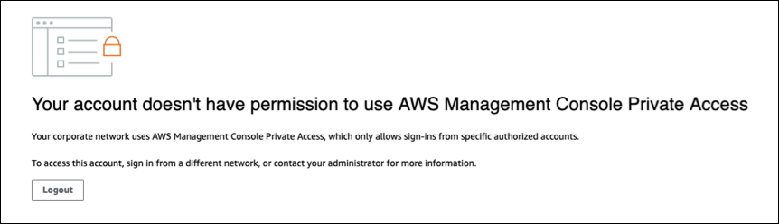

# Test VPC setup with IAM policies

You can further test your VPC that you have set up with Amazon EC2 or WorkSpaces by deploying
IAM policies that restrict access.

The following policy denies access to Amazon S3 unless it is using your specified VPC.

JSON

```
`{
 "Version":"2012-10-17",
 "Statement": [
 {
 "Effect": "Deny",
 "Action": "S3:*",
 "Resource": "*",
 "Condition": {
 "StringNotEqualsIfExists": {
 "aws:SourceVpc": "`vpc-12345678`"
 },
 "Bool": {
 "aws:ViaAwsService": "false"
 }
 }
 }
 ]
}`

```

The following policy limits sign in to selected AWS account IDs by using a AWS Management Console
Private Access policy for the sign-in endpoint.

JSON

```
`{
 "Version":"2012-10-17",
 "Statement": [
 {
 "Effect": "Allow",
 "Principal": "*",
 "Action": "*",
 "Resource": "*",
 "Condition": {
 "StringEquals": {
 "aws:PrincipalAccount": [
 "`AWSAccountID`"
 ]
 }
 }
 }
 ]
}`

```

If you connect with an identity that does not belong to your account, the following
error page is displayed.


