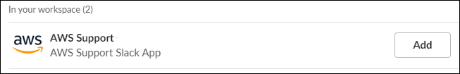
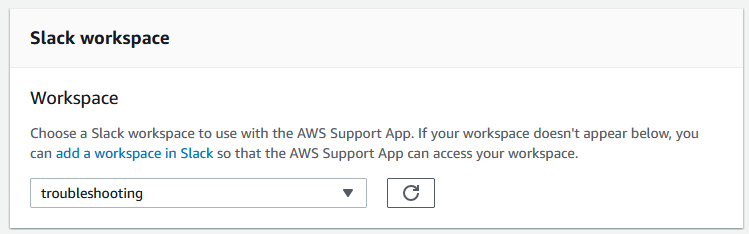
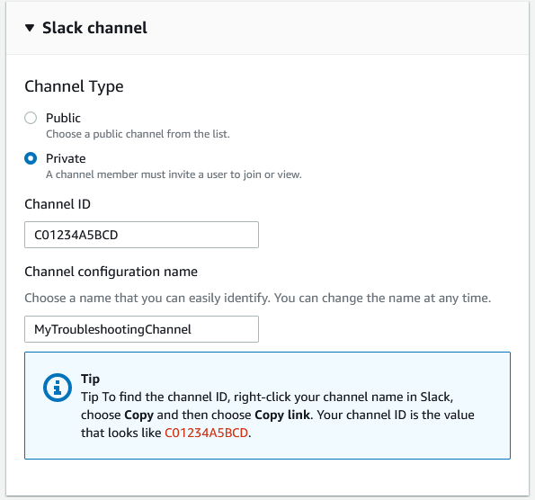
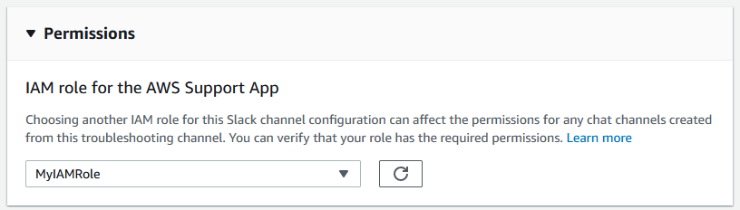
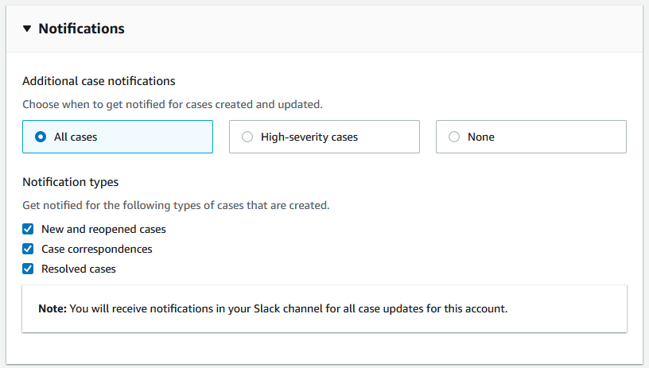

# Configuring a Slack channel

After you authorize your Slack workspace, you can configure your Slack channels to use the
AWS Support App.

In the channel where you invite and add the AWS Support App, you can create and search for
cases, and receive case notifications. This channel displays case updates, including newly
created or resolved cases, added correspondence, and shared case details.

Your Slack channel inherits permissions from the IAM role. All users in the Slack channel have the same permissions that are specified in the
IAM policy attached to the role. For example, if your IAM policy grants full read and write
permissions to your support cases, anyone in your Slack channel can create,
update, and resolve your support cases. If your IAM policy allows the role
read-only permissions, then users in your Slack channel can only view your support cases.

You can add up to 20 channels per AWS account. Each Slack channel supports up to 100
AWS accounts. This means that only 100 accounts can add the same Slack channel to the
AWS Support App. To minimize distractions, we recommend adding only the accounts necessary for managing your organization's support cases.

Each AWS account must configure a Slack channel separately in the AWS Support App. This way,
the AWS Support App can access the support cases in that AWS account. If another AWS account in
your organization already invited the AWS Support App to that Slack channel, skip to step 3.

###### Note

You can configure channels that are part of [Slack Connect](https://slack.com/connect "https://slack.com/connect") and channels that are shared with multiple workspaces.
However, only the first workspace that configured the shared channel for an
AWS account can use the AWS Support App. The AWS Support App returns an error message if you try to
configure the same Slack channel for another workspace.

###### To configure a Slack channel

1. From your Slack application, choose the Slack channel that you want to use with
   the AWS Support App.
2. Complete the following steps to invite the AWS Support App to your channel:
   1. Open the context (right-click) menu on the channel name, and then choose **View channel details**.
   2. Choose the **Integrations** tab, and then choose **Add an App**.
   3. To search for the app, enter **AWS Support App**.
   4. Choose **Add** next to the **AWS Support App**.

   

3. Sign in to the [**Support Center Console**](https://console.aws.amazon.com/support/app "https://console.aws.amazon.com/support/app") and choose **Slack
   configuration**.
4. Choose **Add channel**.
5. On the **Add channel** page, under
   **Workspace**, choose the workspace name that you previously
   authorized. You can choose the refresh icon if the workspace name doesn't appear in
   the list.

 6. Under **Slack channel**, for
**Channel
type**,
choose one of
the
following:

    * **Public** – Under **Public
     channel**, choose the Slack channel that you invited the
     AWS Support App to (step 2). If your channel doesn't appear in the list, choose the
     refresh icon and try again.
    * **Private** – Under **Channel
     ID**, enter the ID or the URL of the Slack channel that you
     invited the AWS Support App to.

    ###### Tip

    To find the channel ID, open the context (right-click) menu for the
     channel name in Slack, and then choose **Copy**, and
     then choose **Copy link**. Your channel ID is the value
     that looks like `C01234A5BCD`.

7. Under **Channel configuration name**, enter a name that easily
   identifies your Slack channel configuration for the AWS Support App. This name appears only
   in your AWS account and doesn't appear in Slack. You can rename your channel
   configuration later.

Your Slack channel type might look like the following example.

 8. Under **Permissions**, for **IAM role for the
AWS Support App in Slack**, choose a role that you created for the AWS Support App. Only
roles that have the AWS Support App as a trusted entity appear in the list.

###### Note

If you haven't created a role or don't see your role in the list, see [Managing access to the AWS Support App](support-app-permissions.md "support-app-permissions.md"). 9. Under **Notifications**, specify how to get notified for
cases.

    * **All cases** – Get notified for all case
     updates.
    * **High-severity cases** – Get notified for only
     cases that affect a production system or higher. For more information, see
     [Choosing an initial support case severity level](case-management.md#choosing-severity "case-management.md#choosing-severity").
    * **None** – Don't get notified for case
     updates.

10. (Optional) If you choose **All cases** or **High-severity
    cases**, you must select at least one of the following options:

        * **New and reopened cases**
        * **Case correspondences**
        * **Resolved cases**

    The following channel receives case notifications for all case updates in
    Slack.

 11. Review your configuration and choose **Add
channel**.
Your channel appears in the **Slack configuration**
page.

## Update your Slack channel

configuration

After you configured your Slack channel, you can update them later to change the IAM
role or case notification.

###### To update your Slack channel configuration

1. Sign in to the [**Support Center Console**](https://console.aws.amazon.com/support/app "https://console.aws.amazon.com/support/app") and choose **Slack
   configuration**.
2. Under **Channels**, choose the channel configuration that you
   want.
3. On the `**channelName**` page, you
   can do the following tasks:
   - Choose **Rename** to update your channel
     configuration name. This name only appears in your AWS account and
     won't appear in Slack.
   - Choose **Delete** to delete the channel configuration
     from the AWS Support App. See [Deleting a Slack channel configuration from the
     AWS Support App](delete-a-channel.md "delete-a-channel.md").
   - Choose **Open in Slack** to open the Slack channel in
     your browser.
   - Choose **Edit** to change the IAM role or
     notifications.
