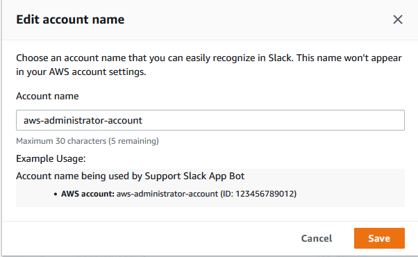
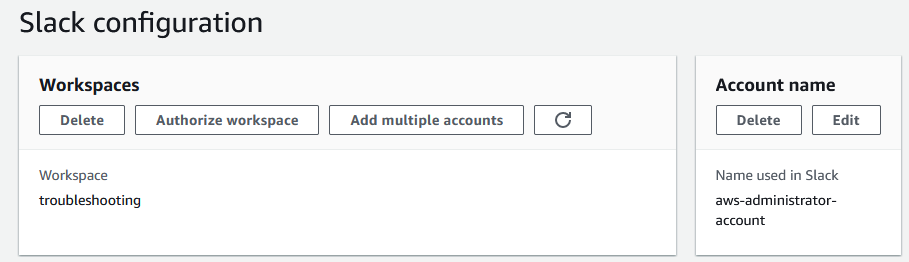

# Authorize a Slack workspace

After you authorize your workspace and give the AWS Support App permission to access it, you then
need an AWS Identity and Access Management (IAM) role for your AWS account. The AWS Support App uses this role to call
API operations from [AWS Support](../APIReference/Welcome.md "../APIReference/Welcome.md") and [Service Quotas](../../../servicequotas/2019-06-24/apireference/Welcome.md "../../../servicequotas/2019-06-24/apireference/Welcome.md") for you. For example, the AWS Support App uses the role to call the
`CreateCase` operation to create a support case for you in Slack.

###### Notes

- Your Slack channel inherits permissions from the IAM role. All users in the Slack channel have the same permissions that are specified in the
  IAM policy attached to the role. For example, if your IAM policy grants full read and write
  permissions to your support cases, anyone in your Slack channel can create,
  update, and resolve your support cases. If your IAM policy allows the role
  read-only permissions, then users in your Slack channel can only view your support cases.
- We recommend that you add the Slack workspaces and channels that you need to
  manage your support operations. We recommend that you configure private channels
  and only invite required users.
  You must authorize each Slack workspace that you want to use for your AWS account. If
  you have multiple AWS accounts, you must sign in to each account and repeat the following
  procedure to authorize the workspace. If your account belongs to an organization in AWS Organizations
  and you want to authorize multiple accounts, skip to [Authorize multiple accounts](authorize-slack-workspace.md#authorize-multiple-accounts "authorize-slack-workspace.md#authorize-multiple-accounts").

###### To authorize the Slack workspace for your AWS account

1. Sign in to the [**AWS Support Center Console**](https://console.aws.amazon.com/support/app "https://console.aws.amazon.com/support/app") and choose **Slack
   configuration**.
2. On the **Getting started** page, choose **Authorize
   workspace**.
3. If you're not already signed in to Slack, on the **Sign in to your
   workspace** page, enter your workspace name, and then choose
   **Continue**.
4. On the **AWS Support is requesting permission to access the
   your-workspace-name Slack** page, choose
   **Allow**.

###### Note

If you can't allow Slack to access your workspace, make sure that you have
permissions from your Slack administrator to add the AWS Support App to the workspace.
See [Prerequisites](prerequisites-support-app-for-slack.md "prerequisites-support-app-for-slack.md").

On the **Slack configuration** page, your workspace name appears
under **Workspaces**. 5. (Optional) To add more workspaces, choose **Authorize workspace**
and repeat steps 3-4. You can add up to five workspaces to your account. 6. (Optional) By default, your AWS account ID number appears as the account name in
your Slack channel. To change this value, under **Account name**,
choose **Edit**, enter your account name, and then choose
**Save**.

###### Tip

Use a name that you and your team can easily recognize. The AWS Support App uses this
name to identify your account in the Slack channel. You can update this name at
any time.

Your workspace and account name appear on the **Slack
configuration** page.

## Authorize multiple accounts

To authorize multiple AWS accounts to use Slack workspaces,
you can use [AWS CloudFormation](creating-resources-with-cloudformation.md "creating-resources-with-cloudformation.md") or [Terraform](creating-resources-with-cloudformation.md#terraform-support-app "creating-resources-with-cloudformation.md#terraform-support-app") to create your AWS Support App resources.
