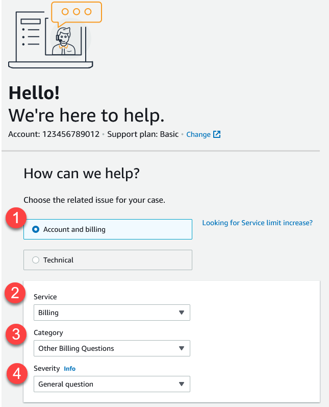
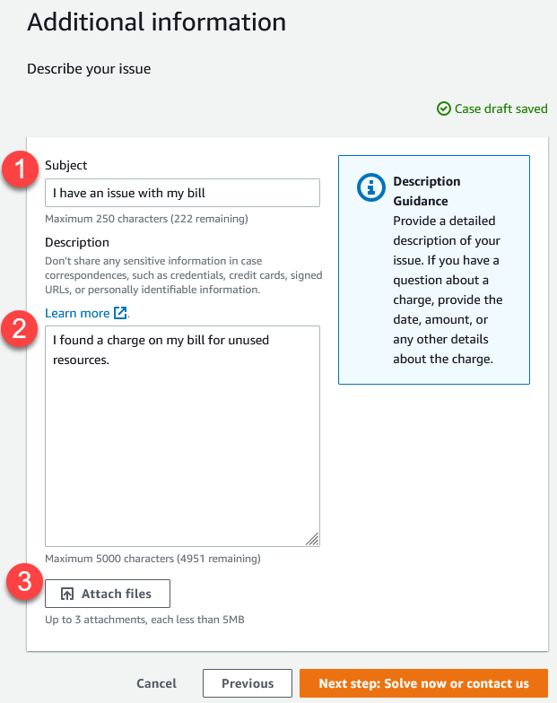
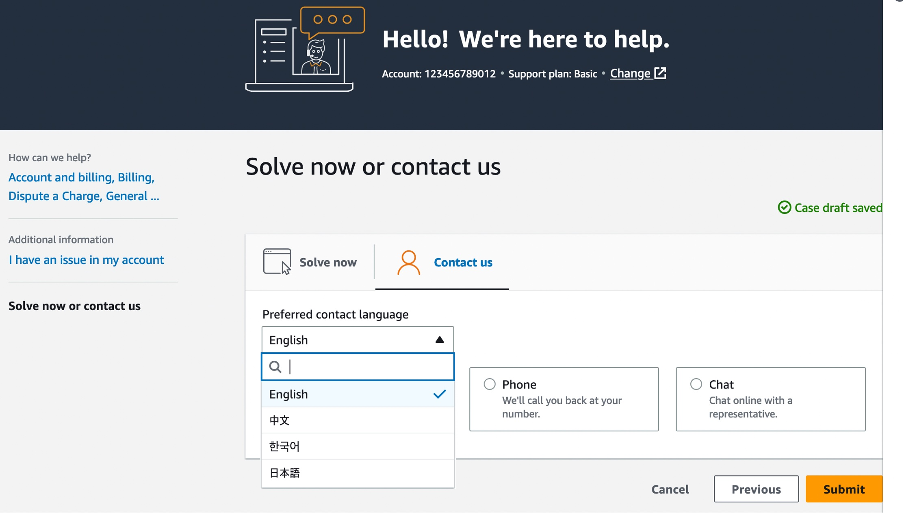

# Example: Create a support case for account and

billing

The following example is a support case for a billing and account issue.

1. **Create case** – Choose the type of case to create. In
   this example, the case type is **Account and billing**.

###### Note

If you have the Basic Support plan, you can't create a technical support
case. 2. **Service** – If your question affects multiple services,
choose the service that's most applicable. 3. **Category** – Choose the category that best fits your use
case. When you choose a category, links to information that might resolve your
problem appear below. 4. **Severity** – Customers with a paid support plan can
choose the **General guidance** (1-day response time) or
**System impaired** (12-hour response time) severity level.
Customers with a Business Support plan can also choose **Production system
impaired** (4-hour response) or **Production system
down** (1-hour response). Customers with an Enterprise On-Ramp or
Enterprise Support plan can choose **Business-critical system
down** (15-minute response for Enterprise Support and 30-minute
response for Enterprise On-Ramp).

Response times are for first response from AWS Support. These response times don't
apply to subsequent responses. For third-party issues, response times can be longer,
depending on the availability of skilled personnel. For more information, see [Choosing an initial support case severity level](case-management.md#choosing-severity "case-management.md#choosing-severity").

###### Note

Based on your category choice, you might be prompted for more
information.
After you specify the case type and classification, you can specify the description and
how you want to be contacted.

1. **Subject** – Enter a title that briefly describes your
   issue.
2. **Description** – Describe your support case. This is the
   most important information that you provide to Support. For some service and category
   combinations, a prompt appears with related information. Use these links to help
   resolve your issue. For more information, see [Describing your problem](case-management.md#describing-your-problem "case-management.md#describing-your-problem").
3. **Attachments** – Attach screenshots and other files that
   can help support agents resolve your case faster. You can attach up to three files. Each file can be up to 5 MB.
   After you add your case details, you can choose how you want to be contacted.

1. **Preferred contact language** – Choose your preferred language.
   Currently you can choose Chinese, English, Japanese, or Korean. The customized contact options in your preferred language will be shown by your support plan.
2. Choose a contact method. The contact options that appear depend on the type of
   case and your support plan.
   - If you choose **Web**, you can read and respond to the
     case progress in Support Center.
   - Choose
     **Chat** or **Phone**. If you choose
     **Phone**, you're prompted for a callback
     number.

3. Choose **Submit** when your information is complete and you're
   ready to create the case.

###### Note

If you choose Japanese as your preferred contact language for support cases, support
in Japanese may be available as follows:

- If you need customer service for non-technical support cases, or if you have a
  Developer Support plan and need technical support, support in Japanese is available during
  business hours in Japan defined as 09:00 AM to 06:00 PM Japan Standard Time (GMT+9), excluding
  holidays and weekends.
- If you have a Business, Enterprise On-Ramp, or Enterprise Support plan, technical support is available
  24/7 in Japanese.
  If you choose Chinese as your preferred contact language for support cases, support in Chinese may be available
  as follows:

- If you need customer service for non-technical support cases, support in Chinese is available
  09:00 AM to 06:00 PM (GMT+8), excluding holidays and weekends.
- If you have a Developer Support plan, technical support in Chinese is available during business
  hours generally defined as 8:00 AM to 6:00 PM in your country as set in
  [My Account](https://console.aws.amazon.com/billing/home?#/account "https://console.aws.amazon.com/billing/home?#/account"), excluding
  holidays and weekends. These times may vary in countries with multiple time zones.
- If you have a Business, Enterprise On-Ramp, or Enterprise Support plan, technical support is available 24/7 in Chinese.
  If you choose Korean as your preferred contact language for support cases, support in Korean may be
  available as follows:

- If you need customer service for non-technical support cases, support in Korean is available
  during business hours in Korea defined as 09:00 AM to 06:00 PM Korean Standard Time (GMT+9),
  excluding holidays and weekends.
- If you have a Developer Support plan, technical support in Korean is available during business
  hours generally defined as 8:00 AM to 6:00 PM in your country as set in
  [My Account](https://console.aws.amazon.com/billing/home?#/account "https://console.aws.amazon.com/billing/home?#/account"),
  excluding holidays and weekends. These times may vary in countries with multiple time zones.
- If you have a Business, Enterprise On-Ramp, or Enterprise Support plan, technical support is available 24/7 in Korean.
