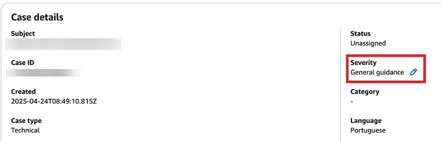
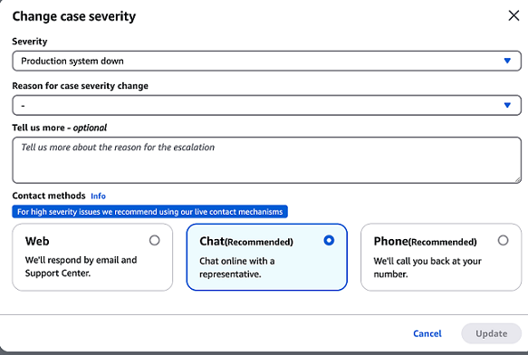

# Creating support cases and case management

In the AWS Management Console, you can create three types of customer cases in Support:

- **Account and billing** support cases are available to all AWS
  customers. You can get help with billing and account questions.
- **Service limit increase** requests are available to all AWS
  customers. For more information about the default service quotas, formerly referred
  to as limits, see [AWS service quotas](../../../general/latest/gr/aws_service_limits.md "../../../general/latest/gr/aws_service_limits.md") in
  the _AWS General Reference_.
- **Technical** support cases connect you to technical support for
  help with service-related technical issues and, in some cases, third-party
  applications. If you have Basic Support, you can't create a technical support
  case.

###### Notes

    + To change your support plan, see [Change AWS Support Plans](changing-support-plans.md "changing-support-plans.md").
    + To close your account, see [Closing
     an Account](../../../awsaccountbilling/latest/aboutv2/close-account.md "../../../awsaccountbilling/latest/aboutv2/close-account.md") in the
     *AWS Billing User Guide*.
    + To find common troubleshooting topics for AWS services, see [Troubleshooting resources](troubleshooting.md "troubleshooting.md").
    + If you're a customer of an AWS Partner that is part of the AWS Partner Network, and
     you use Resold Support, contact your AWS Partner directly for any billing
     related issues. AWS Support can't assist with non-technical issues for
     Resold Support, such as billing and account management. For more
     information, see the following topics:

    	- [How AWS Partners can determine AWS Support
    	 plans in an organization](https://aws.amazon.com/blogs/mt/aws-partners-determine-aws-support-plans-in-organization/ "https://aws.amazon.com/blogs/mt/aws-partners-determine-aws-support-plans-in-organization/")
    	- [AWS Partner-Led Support](https://aws.amazon.com/premiumsupport/partner-led-support/ "https://aws.amazon.com/premiumsupport/partner-led-support/")

## Creating a support case

You can create a support case in the Support Center of the AWS Management Console.

###### Notes

- You can sign in to Support Center as an AWS Identity and Access Management (IAM) user. For more information, see
  [Manage access to AWS Support Center](accessing-support.md "accessing-support.md").
- If you can't sign in to Support Center and create a support case, you can use the
  [Contact Us](https://aws.amazon.com/contact-us/ "https://aws.amazon.com/contact-us/") page
  instead. You can use this page to get help with billing and account
  issues.

###### To create a support case

1. Sign in to the
   [AWS Support Center Console](https://console.aws.amazon.com/support "https://console.aws.amazon.com/support").

###### Tip

In the AWS Management Console, you can also choose the question mark icon (

) and then choose **Support Center**. 2. Choose **Create case**. 3. Choose one of the following options:

    * **Account and billing**
    * **Technical**
    * For service quota increases, choose **Looking for service
     quota increases?** and then follow the instructions for
     [Request a service quota increase](create-service-quota-increase.md "create-service-quota-increase.md").

4. Choose the **Service**, **Category**, and
   **Severity**.

###### Tip

You can use the recommended solutions that appear for commonly asked
questions. 5. Choose **Next step: Additional information** 6. On the **Additional information** page, for
**Subject**, enter a title about your issue. 7. For **Description**, follow the prompts to describe your
case, such as the following:

    * Error messages that you received
    * Troubleshooting steps that you followed
    * How you're accessing the service:

    	+ AWS Management Console
    	+ AWS Command Line Interface (AWS CLI)
    	+ API operations

8. (Optional) Choose **Attach files** to add any relevant files
   to your case, such as error logs or screenshots. You can attach up to three
   files. Each file can be up to 5 MB.
9. Choose **Next step: Solve now or contact us**.
10. On the **Contact us** page, choose your preferred language.
11. Choose your preferred contact method. You can choose one of the following
    options:
    1. **Web** – Receive a reply in Support Center.
    2. **Chat** – Start a live chat with a support
       agent. If you can't connect to a chat, see [Troubleshooting](troubleshooting-support-cases.md "troubleshooting-support-cases.md").
    3. **Phone** – Receive a phone call from a
       support agent. If you choose this option, enter the following
       information:
       - **Country or region**
       - **Phone number**
       - **(Optional) Extension**###### Notes
    - The contact options that appear depend on the type of case and
      your support plan.
    - You can choose **Discard draft** to clear your
      support case draft.

12. (Optional) If you have a Business, Enterprise On-Ramp, or Enterprise Support plan, the **Additional
    contacts** option appears. You can enter the email addresses of
    people to notify when the status of the case changes. If you're signed in as an
    IAM user, include your email address. If you're signed in with your root
    account email address and password, you don't need to include your email
    address

###### Note

If you have the Basic Support plan, the **Additional
contacts** option isn't available. However, the
**Operations** contact specified in the
**Alternate Contacts** section of the [My Account](https://console.aws.amazon.com/billing/home?#/account "https://console.aws.amazon.com/billing/home?#/account") page
receives copies of the case correspondence, but only for the specific case
types of account and billing, and technical. 13. Review your case details and then choose **Submit**. Your
case ID number and summary appear.

## Describing your problem

Make your description as detailed as possible. Include relevant resource information,
along with anything else that might help us understand your issue. For example, to
troubleshoot performance, include timestamps and logs. For feature requests or general
guidance questions, include a description of your environment and purpose. In all cases,
follow the **Description Guidance** that appears on your case
submission form.

When you provide as much detail as possible, you increase the chances that your case
can be resolved quickly.

## Choosing an initial support case severity level

You might want to create a support case at the highest severity that
your support plan allows. However, it's a best practice to choose the highest severity
only for cases that can't be worked around or that directly affect production applications.
For information about building your services so that losing a single resource doesn't
affect your applications, see the [Building Fault-Tolerant Applications on AWS](http://media.amazonwebservices.com/AWS_Building_Fault_Tolerant_Applications.pdf "http://media.amazonwebservices.com/AWS_Building_Fault_Tolerant_Applications.pdf") technical paper.

The following table lists the severity levels, response times, and example problems.

###### Notes

- If you have Enterprise Support or an Enterprise On-Ramp plan, you can reassign your support case severity level to reflect changes to urgency and business impact. For example, you can change your support case from **System impaired** to **Production system impaired**. When you change the case severity, AWS Support receives notification and routes the case according to the new severity level. For more information, see [Changing the severity level of your support case](#change-severity-for-support-cases "#change-severity-for-support-cases").
- If you don't have Enterprise support or an Enterprise On-Ramp plan, then you can't change the severity level for a support case after you create
  it. If your situation changes, work with the Support agent for your support
  case.
- For more information about the severity level, see the [AWS Support API Reference](../APIReference/API_SeverityLevel.md "../APIReference/API_SeverityLevel.md").

| Severity                          | Severity level code | First-response time | Description and support plan                                                                                                                                                                         |
| --------------------------------- | ------------------- | ------------------- | ---------------------------------------------------------------------------------------------------------------------------------------------------------------------------------------------------- |
| **General guidance**              | `low`               | 24 hours            | You have a general development question, or you want to request a feature. (\*Developer, Business, Enterprise On-Ramp, or Enterprise Support plan)                                                |
| **System impaired**               | `normal`            | 12 hours            | Non-critical functions of your application are behaving abnormally, or you have a time-sensitive development question. (\*Developer, Business, Enterprise On-Ramp, or Enterprise Support plan) |
| **Production system impaired**    | `high`              | 4 hours             | Important functions of your application are impaired or degraded. (Business, Enterprise On-Ramp, or Enterprise Support plan)                                                                      |
| **Production system down**        | `urgent`            | 1 hour              | Your business is significantly impacted. Important functions of your application aren't available. (Business, Enterprise On-Ramp, or Enterprise Support plan)                                     |
| **Business-critical system down** | `critical`          | 15 minutes          | Your business is at risk. Critical functions of your application aren't available (Enterprise Support plan). Note that this is 30 minutes for the Enterprise On-Ramp Support plan.             |

## Understanding AWS Support response times

AWS Support makes every reasonable effort to respond to your initial request within the
indicated timeframe. For information about the scope of support for each Support plan,
see [AWS Support features](https://aws.amazon.com/premiumsupport/features/ "https://aws.amazon.com/premiumsupport/features/").

If you have a Business, Enterprise On-Ramp, or Enterprise Support plan, you have round-the-clock access for technical support.
\*For Developer Support, response targets for support cases are calculated in
business hours. Business hours are generally defined as 08:00 to 18:00 in the
customer country, excluding holidays and weekends. These times can vary in countries
with multiple time zones. The customer country information appears in the
**Contact Information** section of the [My Account](https://console.aws.amazon.com/billing/home#/account "https://console.aws.amazon.com/billing/home#/account") page in the
AWS Management Console.

###### Note

If you choose Japanese as your preferred contact language for support cases, support
in Japanese may be available as follows:

- If you need customer service for non-technical support cases, or if you have a
  Developer Support plan and need technical support, support in Japanese is available during
  business hours in Japan defined as 09:00 AM to 06:00 PM Japan Standard Time (GMT+9), excluding
  holidays and weekends.
- If you have a Business, Enterprise On-Ramp, or Enterprise Support plan, technical support is available
  all day, every day in Japanese.
  If you choose Chinese as your preferred contact language for support cases, support in Chinese may be available
  as follows:

- If you need customer service for non-technical support cases, support in Chinese is available
  09:00 AM to 06:00 PM (GMT+8), excluding holidays and weekends.
- If you have a Developer Support plan, technical support in Chinese is available during business
  hours generally defined as 8:00 AM to 6:00 PM in your country as set in
  [My Account](https://console.aws.amazon.com/billing/home?#/account "https://console.aws.amazon.com/billing/home?#/account"), excluding
  holidays and weekends. These times may vary in countries with multiple time zones.
- If you have a Business, Enterprise On-Ramp, or Enterprise Support plan, technical support is available all day, every day in Chinese.
  If you choose Korean as your preferred contact language for support cases, support in Korean may be
  available as follows:

- If you need customer service for non-technical support cases, support in Korean is available
  during business hours in Korea defined as 09:00 AM to 06:00 PM Korean Standard Time (GMT+9),
  excluding holidays and weekends.
- If you have a Developer Support plan, technical support in Korean is available during business
  hours generally defined as 8:00 AM to 6:00 PM in your country as set in
  [My Account](https://console.aws.amazon.com/billing/home?#/account "https://console.aws.amazon.com/billing/home?#/account"),
  excluding holidays and weekends. These times may vary in countries with multiple time zones.
- If you have a Business, Enterprise On-Ramp, or Enterprise Support plan, technical support is available all day, every day in Korean.

## Changing the severity level of your support case

If you have Enterprise Support or an Enterprise On-Ramp plan, you can reassign your support case severity level to reflect changes to urgency and business impact. For example, you can change your support case from **System impaired** to **Production system impaired**. When you change the case severity, AWS Support receives notification and attends to the case according to the new severity level.

###### Note

Japanese (JP) account or billing, Service Quota Increase Request (SQIR), and Turkish (TR) account or billing cases created in these languages have a default severity and can't be changed.

To change the severity of a support case, complete the following steps:

1. Sign in to the [AWS Support Center Console](https://console.aws.amazon.com/support "https://console.aws.amazon.com/support").

###### Tip

In the AWS Management Console, you can also choose the question mark icon (

) and then choose **Support Center**. 2. Select the case that you want to change the severity level for. 3. In **Case details**, choose the pencil icon next to the **Severity** field, as shown in the following example.

 4. For **Severity**, choose the new severity level from the following options:

    * General guidance
    * System impaired
    * Production system impaired
    * Production system down
    * Business-critical system down

5. For **Reason for case severity change**, choose from the available options for why you're changing the case severity.
6. (Optional) For **Tell us more**, enter additional information about this change.
7. Do one of the following:
   - If you're lowering the support case severity, or if you're raising it
     from **General guidance** to **System
     impaired** or **Production system
     impaired**, choose **Update**.
   - If you're raising the severity to **Production system down** or **Business-critical system down**, use one of the options in the **Contact methods** section to engage with AWS Support, and then choose **Update**. The following example shows the options available in the **Contact methods** section.

   

###### Note

- If you upgrade your support case severity to **Production system
  down** or **Business-critical system down**,
  you must wait 60 minutes before you can change the severity again.
- If your support case is currently set to **Business-critical system down**, you're
  prompted to initiate live contact with AWS Support instead of assigning a
  higher severity.
- If you're raising your support case severity level after already raising
  it at least once, you might encounter a waiting period. For example, if you
  change the severity from **System impaired** to
  **Production system impaired** at 6:00 AM, then your
  support case falls under the 4-hour first-response time for the
  **Production system impaired** severity level. In this
  scenario, you can upgrade the severity level again at 10:00 AM, after the
  4-hour window. For a list of first-response times for each severity level,
  see the table in [Understanding AWS Support response times](#response-times-for-support-cases "#response-times-for-support-cases").
