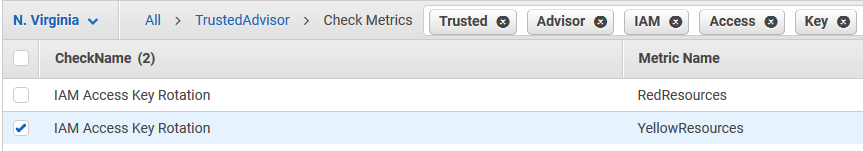
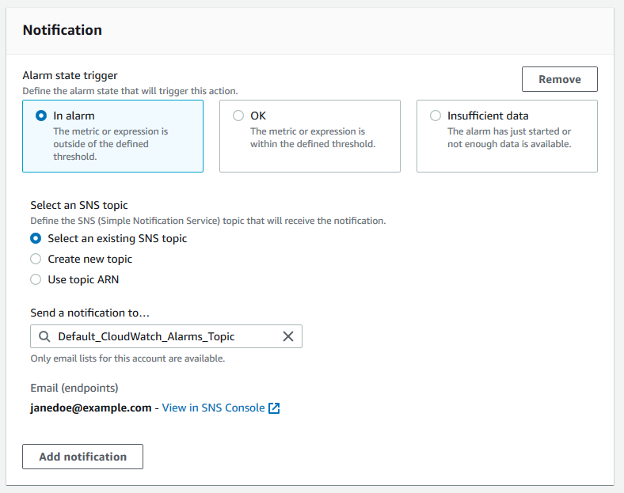
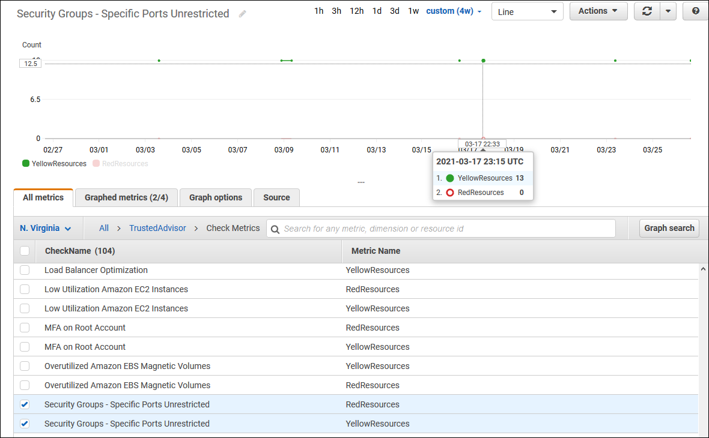

# Creating Amazon CloudWatch alarms to monitor AWS Trusted Advisor

metrics

When AWS Trusted Advisor refreshes your checks, Trusted Advisor publishes metrics about your check
results to CloudWatch. You can view the metrics in CloudWatch. You can also create alarms to detect status
changes to Trusted Advisor checks and status changes for resources, and service quota usage (formerly
referred to as limits).

Follow this procedure to create a CloudWatch alarm for a specific Trusted Advisor metric.

###### Topics

- [Prerequisites](#prerequisites-cloudwatch-metrics "#prerequisites-cloudwatch-metrics")
- [CloudWatch metrics for
  Trusted Advisor](#cloudwatch-metrics-dimensions-for-trusted-advisor "#cloudwatch-metrics-dimensions-for-trusted-advisor")
- [Trusted Advisor metrics and dimensions](#trusted-advisor-metrics-dimensions "#trusted-advisor-metrics-dimensions")

## Prerequisites

Before you create CloudWatch alarms for Trusted Advisor metrics, review the following
information:

- Understand how CloudWatch uses metrics and alarms. For more information, see [How CloudWatch works](../../../AmazonCloudWatch/latest/monitoring/cloudwatch_architecture.md "../../../AmazonCloudWatch/latest/monitoring/cloudwatch_architecture.md") in the
  _Amazon CloudWatch User Guide_.
- Use the Trusted Advisor console or the AWS Support API to refresh your checks and get the
  latest check results. For more information, see [Refresh check results](get-started-with-aws-trusted-advisor.md#refresh-check-results "get-started-with-aws-trusted-advisor.md#refresh-check-results").

###### To create a CloudWatch alarm for Trusted Advisor metrics

1. Open the CloudWatch console at
   [https://console.aws.amazon.com/cloudwatch/](https://console.aws.amazon.com/cloudwatch/ "https://console.aws.amazon.com/cloudwatch/").
2. Use the **Region selector** and choose the
   **US East (N. Virginia)** AWS Region.
3. In the navigation pane, choose **Alarms**.
4. Choose **Create alarm**.
5. Choose **Select metric**.
6. For **Metrics**, enter one or more dimension values to filter the
   metric list. For example, you can enter the metric name
   **ServiceLimitUsage** or the dimension, such as the Trusted Advisor check
   name.

###### Tip

    * You can search for `Trusted Advisor` to list all metrics for the
     service.
    * For a list of metric and dimension names, see [Trusted Advisor metrics and dimensions](#trusted-advisor-metrics-dimensions "#trusted-advisor-metrics-dimensions").

7. In the results table, select the check box for the metric.

In the following example, the check name is **IAM Access Key
Rotation** and the metric name is **YellowResources**.

 8. Choose **Select metric**. 9. On the **Specify metric and conditions** page, verify that the
**Metric name** and **CheckName** that you chose appear
on the page. 10. For **Period**, you can specify the time period that you want the
alarm to start when the check status changes, such as 5 minutes. 11. Under **Conditions**, choose **Static**, and then
specify the alarm condition for when the alarm should start.

For example, if you choose **Greater/Equal >=threshold** and enter
`1` for the threshold value, this means that the alarm starts when
Trusted Advisor detects at least one IAM access key that hasn't been rotated in the last 90
days.

###### Notes

    * For the **GreenChecks**, **RedChecks**,
     **YellowChecks**, **RedResources**, and
     **YellowResources** metrics, you can specify a threshold that is
     any whole number greater than or equal to zero.
    * Trusted Advisor doesn’t send metrics for **GreenResources**, which are
     resources for which Trusted Advisor hasn’t detected any issues.

12. Choose **Next**.
13. On the **Configure actions** page, for **Alarm state
    trigger**, choose **In alarm**.
14. For **Select an SNS topic**, choose an existing Amazon Simple Notification Service (Amazon SNS) topic
    or create one.

 15. Choose **Next**. 16. For **Name and description**, enter a name and description for your
alarm. 17. Choose **Next**. 18. On the **Preview and create** page, review your alarm details, and then
choose **Create alarm**.

When the status for the **IAM Access Key Rotation** check changes to
red for 5 minutes, your alarm will send a notification to your SNS topic.

###### Example : Email notification for a CloudWatch alarm

The following email message shows that an alarm detected a change for the **IAM
Access Key Rotation** check.

```
You are receiving this email because your Amazon CloudWatch Alarm "IAMAcessKeyRotationCheckAlarm" in the US East (N. Virginia) region has entered the ALARM state,
because "Threshold Crossed: 1 out of the last 1 datapoints [9.0 (26/03/21 22:44:00)] was greater than or equal to the threshold (1.0) (minimum 1 datapoint for OK -> ALARM transition)." at "Friday 26 March, 2021 22:49:42 UTC".

View this alarm in the AWS Management Console:
https://us-east-1.console.aws.amazon.com/cloudwatch/home?region=us-east-1#s=Alarms&alarm=IAMAcessKeyRotationCheckAlarm

Alarm Details:
- Name:                       IAMAcessKeyRotationCheckAlarm
- Description:                This alarm starts when one or more AWS access keys in my AWS account have not been rotated in the last 90 days.
- State Change:               INSUFFICIENT_DATA -> ALARM
- Reason for State Change:    Threshold Crossed: 1 out of the last 1 datapoints [9.0 (26/03/21 22:44:00)] was greater than or equal to the threshold (1.0) (minimum 1 datapoint for OK -> ALARM transition).
- Timestamp:                  Friday 26 March, 2021 22:49:42 UTC
- AWS Account:                123456789012
- Alarm Arn:                  arn:aws:cloudwatch:us-east-1:123456789012:alarm:IAMAcessKeyRotationCheckAlarm

Threshold:
- The alarm is in the ALARM state when the metric is GreaterThanOrEqualToThreshold 1.0 for 300 seconds.

Monitored Metric:
- MetricNamespace:                     AWS/TrustedAdvisor
- MetricName:                          RedResources
- Dimensions:                          [CheckName = IAM Access Key Rotation]
- Period:                              300 seconds
- Statistic:                           Average
- Unit:                                not specified
- TreatMissingData:                    missing


State Change Actions:
- OK:
- ALARM: [arn:aws:sns:us-east-1:123456789012:Default_CloudWatch_Alarms_Topic]
- INSUFFICIENT_DATA:

```

## CloudWatch metrics for

Trusted Advisor

You can use the CloudWatch console or the AWS Command Line Interface (AWS CLI) to find the metrics available for
Trusted Advisor.

For a list of the namespaces, metrics, and dimensions for all services that publish
metrics, see [AWS services
that publish CloudWatch metrics](../../../AmazonCloudWatch/latest/monitoring/aws-services-cloudwatch-metrics.md "../../../AmazonCloudWatch/latest/monitoring/aws-services-cloudwatch-metrics.md") in the _Amazon CloudWatch User Guide_.

### View Trusted Advisor metrics (console)

You can sign in to the CloudWatch console and view the available metrics for Trusted Advisor.

###### To view available Trusted Advisor metrics (console)

1. Open the CloudWatch console at
   [https://console.aws.amazon.com/cloudwatch/](https://console.aws.amazon.com/cloudwatch/ "https://console.aws.amazon.com/cloudwatch/").
2. Use the **Region selector** and choose the
   **US East (N. Virginia)** AWS Region.
3. In the navigation pane, choose **Metrics**.
4. Enter a metric namespace, such as `TrustedAdvisor`.
5. Choose a metric dimension, such as **Check Metrics**.
6. The **All metrics** tab shows metrics for that dimension in the
   namespace. You can do the following:
   1. To sort the table, choose the column heading.
   2. To graph a metric, select the check box next to the metric. To select all
      metrics, select the check box in the heading row of the table.
   3. To filter by metric, choose the metric name, and then choose **Add to
      search**.The following example shows the results for the **Security Groups - Specific
      Ports Unrestricted** check. The check identifies 13 resources that are
      yellow. Trusted Advisor recommends that you investigate checks that are yellow.

 7. (Optional) To add this graph to a CloudWatch dashboard, choose
**Actions**, and then choose **Add to
dashboard**.

For more information about creating a graph to view your metrics, see [Graphing a metric](../../../AmazonCloudWatch/latest/monitoring/graph_a_metric.md "../../../AmazonCloudWatch/latest/monitoring/graph_a_metric.md") in the _Amazon CloudWatch User Guide_.

### View Trusted Advisor metrics (CLI)

You can use the [list-metrics](../../../cli/latest/reference/cloudwatch/list-metrics.md "../../../cli/latest/reference/cloudwatch/list-metrics.md") AWS CLI command to view available metrics for Trusted Advisor.

###### Example : List all metrics for Trusted Advisor

The following example specifies the `AWS/TrustedAdvisor` namespace to view
all metrics for Trusted Advisor.

```
`aws cloudwatch list-metrics --namespace AWS/TrustedAdvisor`
```

Your output might look like the following.

```
{
    "Metrics": [
        {
            "Namespace": "AWS/TrustedAdvisor",
            "Dimensions": [
                {
                    "Name": "ServiceName",
                    "Value": "EBS"
                },
                {
                    "Name": "ServiceLimit",
                    "Value": "Magnetic (standard) volume storage (TiB)"
                },
                {
                    "Name": "Region",
                    "Value": "ap-northeast-2"
                }
            ],
            "MetricName": "ServiceLimitUsage"
        },
        {
            "Namespace": "AWS/TrustedAdvisor",
            "Dimensions": [
                {
                    "Name": "CheckName",
                    "Value": "Overutilized Amazon EBS Magnetic Volumes"
                }
            ],
            "MetricName": "YellowResources"
        },
        {
            "Namespace": "AWS/TrustedAdvisor",
            "Dimensions": [
                {
                    "Name": "ServiceName",
                    "Value": "EBS"
                },
                {
                    "Name": "ServiceLimit",
                    "Value": "Provisioned IOPS"
                },
                {
                    "Name": "Region",
                    "Value": "eu-west-1"
                }
            ],
            "MetricName": "ServiceLimitUsage"
        },
        {
            "Namespace": "AWS/TrustedAdvisor",
            "Dimensions": [
                {
                    "Name": "ServiceName",
                    "Value": "EBS"
                },
                {
                    "Name": "ServiceLimit",
                    "Value": "Provisioned IOPS"
                },
                {
                    "Name": "Region",
                    "Value": "ap-south-1"
                }
            ],
            "MetricName": "ServiceLimitUsage"
        },
    ...
  ]
}
```

###### Example : List all metrics for a dimension

The following example specifies the `AWS/TrustedAdvisor` namespace and the
`Region` dimension to view the metrics available for the specified AWS
Region.

```
`aws cloudwatch list-metrics --namespace AWS/TrustedAdvisor --dimensions Name=Region,Value=us-east-1`
```

Your output might look like the following.

```
{
    "Metrics": [
        {
            "Namespace": "AWS/TrustedAdvisor",
            "Dimensions": [
                {
                    "Name": "ServiceName",
                    "Value": "SES"
                },
                {
                    "Name": "ServiceLimit",
                    "Value": "Daily sending quota"
                },
                {
                    "Name": "Region",
                    "Value": "us-east-1"
                }
            ],
            "MetricName": "ServiceLimitUsage"
        },
        {
            "Namespace": "AWS/TrustedAdvisor",
            "Dimensions": [
                {
                    "Name": "ServiceName",
                    "Value": "AutoScaling"
                },
                {
                    "Name": "ServiceLimit",
                    "Value": "Launch configurations"
                },
                {
                    "Name": "Region",
                    "Value": "us-east-1"
                }
            ],
            "MetricName": "ServiceLimitUsage"
        },
        {
            "Namespace": "AWS/TrustedAdvisor",
            "Dimensions": [
                {
                    "Name": "ServiceName",
                    "Value": "CloudFormation"
                },
                {
                    "Name": "ServiceLimit",
                    "Value": "Stacks"
                },
                {
                    "Name": "Region",
                    "Value": "us-east-1"
                }
            ],
            "MetricName": "ServiceLimitUsage"
        },
    ...
  ]
}
```

###### Example : List metrics for a specific metric name

The following example specifies the `AWS/TrustedAdvisor` namespace and the
`RedResources` metric name to view the results for only this specific
metric.

```
`aws cloudwatch list-metrics --namespace AWS/TrustedAdvisor --metric-name `RedResources``
```

Your output might look like the following.

```
{
    "Metrics": [
        {
            "Namespace": "AWS/TrustedAdvisor",
            "Dimensions": [
                {
                    "Name": "CheckName",
                    "Value": "Amazon RDS Security Group Access Risk"
                }
            ],
            "MetricName": "RedResources"
        },
        {
            "Namespace": "AWS/TrustedAdvisor",
            "Dimensions": [
                {
                    "Name": "CheckName",
                    "Value": "Exposed Access Keys"
                }
            ],
            "MetricName": "RedResources"
        },
        {
            "Namespace": "AWS/TrustedAdvisor",
            "Dimensions": [
                {
                    "Name": "CheckName",
                    "Value": "Large Number of Rules in an EC2 Security Group"
                }
            ],
            "MetricName": "RedResources"
        },
        {
            "Namespace": "AWS/TrustedAdvisor",
            "Dimensions": [
                {
                    "Name": "CheckName",
                    "Value": "Auto Scaling Group Health Check"
                }
            ],
            "MetricName": "RedResources"
        },
    ...
  ]
}
```

## Trusted Advisor metrics and dimensions

See the following tables for the Trusted Advisor metrics and dimensions that you can use for your
CloudWatch alarms and graphs.

### Trusted Advisor check-level metrics

You can use the following metrics for Trusted Advisor checks.

| Metric              | Description                                                                                                                                                                                                                                                                                                                          |
| ------------------- | ------------------------------------------------------------------------------------------------------------------------------------------------------------------------------------------------------------------------------------------------------------------------------------------------------------------------------------ | ------------------------------------------------------------------------------------------------------------------------ |
| `RedResources`      | The number of resources that are in a red state (action recommended).                                                                                                                                                                                                                                                                |
| `YellowResources`   | The number of resources that are in a yellow state (investigation recommended).                                                                                                                                                                                                                                                      | ### Trusted Advisor service quota-level metrics You can use the following metrics for AWS service quotas.                |
| Metric              | Description                                                                                                                                                                                                                                                                                                                          |
| ---                 | ---                                                                                                                                                                                                                                                                                                                                  |
| `ServiceLimitUsage` | The percentage of resource usage against a service quota (formerly referred to as limits).                                                                                                                                                                                                                                           | ### Dimensions for check-level metrics You can use the following dimension for Trusted Advisor checks.                   |
| Dimension           | Description                                                                                                                                                                                                                                                                                                                          |
| ---                 | ---                                                                                                                                                                                                                                                                                                                                  |
| `CheckName`         | The name of the Trusted Advisor check. You can find all check names in the [Trusted Advisor console](https://console.aws.amazon.com/trustedadvisor/home "https://console.aws.amazon.com/trustedadvisor/home") or the [AWS Trusted Advisor check reference](trusted-advisor-check-reference.md "trusted-advisor-check-reference.md"). | ### Dimensions for service quota metrics You can use the following dimensions for Trusted Advisor service quota metrics. |
| Dimension           | Description                                                                                                                                                                                                                                                                                                                          |
| ---                 | ---                                                                                                                                                                                                                                                                                                                                  |
| `Region`            | The AWS Region for a service quota.                                                                                                                                                                                                                                                                                                  |
| `ServiceName`       | The name of the AWS service.                                                                                                                                                                                                                                                                                                         |
| `ServiceLimit`      | The name of the service quota. For more information about service quotas, see [AWS service quotas](../../../general/latest/gr/aws_service_limits.md "../../../general/latest/gr/aws_service_limits.md") in the _AWS General Reference_.                                                                                              |
