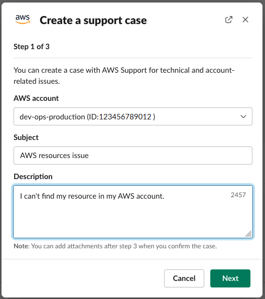
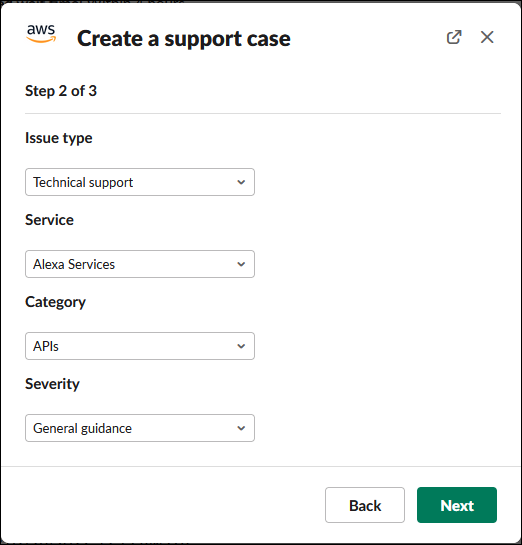
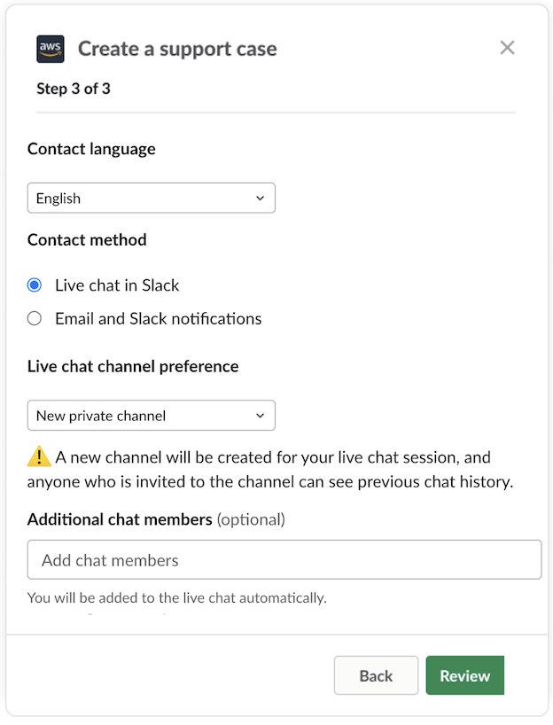
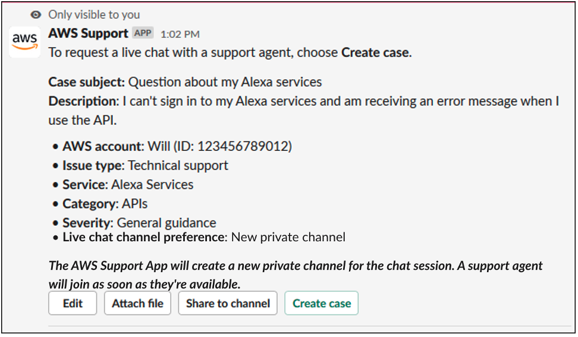

# Creating support cases in a Slack channel

After you authorize your Slack workspace and add your Slack channel, you can create a
support case in your Slack channel.

###### To create a support case in Slack

1. In your Slack channel, enter the following command:

`/awssupport create` 2. In the **Create a support case** dialog box, do the
following:

    1. If you configured more than one account for this Slack channel, for
     **AWS account**, choose the account ID. If you
     created an account name, this value appears next to the account ID. For more
     information, see [Authorize a Slack workspace](authorize-slack-workspace.md "authorize-slack-workspace.md").
    2. For **Subject**, enter a title for the support
     case.
    3. For **Description**, describe the support case. Provide
     details, such as how you're using an AWS service and what troubleshooting
     steps you tried.

    

3. Choose **Next**.
4. On the **Create a support case** dialog box, specify the
   following options:
   1. Choose the **Issue type**.
   2. Choose the **Service**.
   3. Choose the **Category**.
   4. Choose the **Severity**.
   5. Review your case details and choose **Next**.

   The following example shows a technical support case for
   Alexa Services.

   

5. For **Contact language**, choose your preferred language for your
   support case.

###### Note

Japanese language support isn't available for live chat in Slack for account
and billing cases. 6. For **Contact method**, choose **Email and Slack
notifications** or **Live chat in Slack**.

The following example shows how to choose a live chat in Slack.

    1. If you choose **Live chat in Slack**, choose **New private channel**
     or **Current channel** as your **Live chat channel preference**.
     **New private channel** will create a separate
     private channel for you to chat with the AWS Support agent,
     and **Current channel** will use a thread in the current channel for
     you to chat with the AWS Support agent.
    2. (Optional) If you choose **Live chat in Slack**, you can
     enter the names of other Slack members. For **New private channel**,
     the AWS Support App will automatically add you and selected members to the new channel.
     For **Current channel**, the AWS Support App will automatically tag you and selected
     members in the chat thread when the AWS Support agent joins.###### Important

    * We recommend that you only add chat members that you want to have access to your
     support case details and chat history.
    * If you start a new live chat session for an existing support case,
     the AWS Support App uses the same chat channel or thread that was used for
     a previous live chat. The AWS Support App also uses the same live chat channel
     preference that was used previously.
    * The **Current channel** option is only available if the chat
     is requested from a private channel. We recommend that you only use this option
     if you want all channel members to have access to your chat.

7. (Optional) For **Additional contacts to notify**, enter email
   addresses to also receive updates about this support case. You can add up to 10
   email addresses.
8. Choose **Review**.
9. In the Slack channel, review the case details. You can do the
   following:
   - Choose **Edit** to change the case details.
   - Add a file to your case. To do so, follow these steps:
     1. Choose **Attach file**, choose the
        **+**
        icon
        in Slack, and choose **Your computer**.
     2. Navigate to and choose your file.
     3. In the **Upload a file** dialog box, enter
        `@awssupport`, and press the send message
        
        icon.###### Notes
     - You can attach up to three files. Each file can be up to 5
       MB.
     - If you attach a file to your support case, you must submit
       your case within 1 hour. If you don't, you must add the files
       again.

   - Choose **Share to channel** to share the case details
     with others in the Slack channel. You can use this option to share the case
     details with your team before you create the case.

10. Review your case details, and then choose **Create case**.

The following example shows a technical support case for Alexa
Services.

After you create a support case, it might take a few minutes for your case details
to appear. 11. When your support case is updated, you can choose **See details**
to view your case information. You can then do the following:

    * Choose **Share to channel** to share the case details
     with others in the Slack channel.
    * Choose **Reply** to add a correspondence.
    * Choose **Resolve case**.###### Note

If you didn't choose to receive automatic case updates in Slack, you can
search for the support case to find the **See details**
option.
