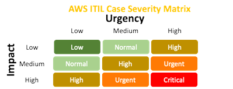
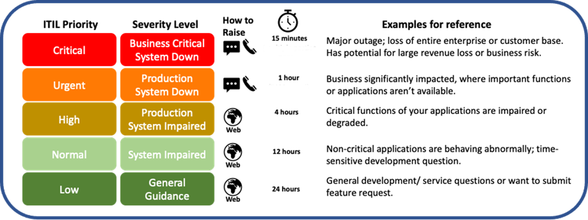

# Create a support case from a support interaction

When you select **Create case** during your support interaction, a support case is created for you with many of the case details, such as the **Subject**, **Description**, **Case type** **Service**, **Category**, and **Severity level** populated for you. You can change this information as needed. Make sure that you review this information for accuracy. For information on how to choose a severity level for your case, see [Choosing an initial support case severity level](case-management.md#choosing-severity "case-management.md#choosing-severity").

###### Important

Before you create a support case, check for events affecting your account resources by visiting your [Health Dashboard](https://phd.aws.amazon.com/phd/home#/ "https://phd.aws.amazon.com/phd/home#/"). You can verify any AWS service issues in the dashboard. There might be a slight delay in posting incidents. If you're uncertain if there is an active incident, open a support case.

After you choose **Create case**, enter or verify the following information:

1. Verify the **Subject** for this support case. The **Subject** is a brief synopsis of what your support interaction is about.
2. Verify the **Description**. Your initial inquiry appears in the **Description** field. Modify this information as needed. Make your description as detailed as possible. Include relevant resource information, along with anything else that might help us understand your issue.
3. (Optional) Choose **Attach files** to add any relevant files
   to your case, such as error logs or screenshots. You can attach up to three
   files. Each file can be up to 5 MB.
4. For **Case type**, choose one of the following options:
   - **Account and billing**
   - **Technical**
   - **Service quotas**. You can only request certain types of service quota increases from the Support Center Console. For more information, see
     [Request a service quota increase](create-service-quota-increase.md "create-service-quota-increase.md").

###### Note

If you have a Basic Support plan, then you can't create a **Technical** support case. 5. Verify the **Service**, **Category**, and **Severity**. 6. In the **Communication preference** section, indicate how you want AWS to communicate with you. You can choose one of the following
options:

    1. **Email:** Receive a response to your email.
    2. **Phone:** Receive a phone call from a
     support agent. If you choose this option, enter the following
     information:

    	* **Country or region**
    	* **Phone number**
    	* **(Optional) Extension**
    3. **Chat:** Start a live chat with a support
     agent. If you can't connect to a chat, see [Troubleshooting](troubleshooting-support-cases.md "troubleshooting-support-cases.md").(Optional) If you have an AWS Business Support+, AWS Enterprise Support, or AWS Unified Operations plan, you can enter up to 10 additional email addresses in the **Additional contacts**. You can enter the email addresses of people to notify when the status of the case changes. If you're signed in as an IAM user, include your email address. If you're signed in with your root account email address and password, you don't need to include your email address.

###### Note

If you have the Basic Support plan, the **Additional contacts** option isn't available. However, the **Operations contact** specified in the **Alternate Contacts** section of the **My Account** page receives copies of the case correspondence, but only for the specific case types of account and billing. 7. When you're ready to submit the support case, select **Submit**. You are directed to the **Case details** page where you can see your case details, the support interaction, and the case correspondences.

Select **Case details** to view the information about your case, such as attachments, or severity level. Select **Support interactions** to see the support interactions associated with this case.
Before you create a support case, check for events affecting your account resources by visiting your [Health Dashboard](https://phd.aws.amazon.com/phd/home#/ "https://phd.aws.amazon.com/phd/home#/"). You can verify any AWS service issues in the dashboard. There might be a slight delay in posting incidents. If you're uncertain if there is an active incident, open a support case.

When creating your support case, make sure that you choose the correct severity level and provide as much information as possible. For more information on what kind of information to provide, see the following **Enterprise Support case best practices** section.

Use the following matrix to help you identify the correct severity.

For Critical or Urgent cases, make sure that you leave contact details so that we can reach out to you, if needed.

###### Note

The quickest way to get help is to use the **Chat** or **Phone** contact method.

###### Topics

- Enterprise Support case target response times
- Enterprise Support best practices
- Enterprise Support escalation path

### Enterprise Support case target response times

The following graphic displays the target AWS Support response times for different case severity levels.

### Enterprise Support case best practices

Submit your support case at the appropriate severity level.

- The appropriate severity level helps make sure that your case is visible across AWS and allows the TAM to manage your issue.
- Only submit one case for each event or issue.
- Make sure that you raise cases in the correct AWS account.

Provide as much detailed information as possible, answering the relevant questions provided in the following list:

- **Who:** Who did what? Who is affected? Who should be looped in? Who have you already talked to?
- **What:** What happened, exactly. What’s the impact or blast radius? What have you already tried to resolve the issue?
- **When:** When did or does it happen (date, time, time zone)? When do you need an answer by?
- **Where:** AWS Region, Availability Zone, specific instance or resource IDs, and other identifiers.
- **Why:** Why are you opening this case (information, limit raise, event-analysis or RCA, outage)?
- **How:** Include information on how to reproduce the problem, how to escalate, and how to contact you.

###### Note

You can change the severity of your support case after you create it. For information, see [Changing the severity level of your support case](case-management.md#change-severity-for-support-cases "case-management.md#change-severity-for-support-cases").

**Enterprise Support business critical or production system down**

- For Business-critical system down or Production system down cases use **Chat** or **Phone** and ensure there are people available at your organization to work the case.
- Clearly describe the issue including what you’ve tried, what you expect and context. Summarize the business impact.
- Provide (or start to capture) as many metrics, timings and symptoms as you can. More data means faster diagnosis.
- Provide a conference bridge. When opening a Business-critical system down issue, provide a conference bridge for the support teams to join to help troubleshoot the problem. As Business-critical system down issues are production down, it's best to get everyone on the phone and come to a common plan of action towards a resolution.
- Ensure that all activity related to the event is captured in the support case (update from Console, not email). The phone option is good for real-time communications; however, make sure that you record updates and outcomes in the support case.

### Enterprise Support escalation path

You can follow the following step-by-step process when facing an issue.

1. **Check the Health Dashboard** if you think that the issue might be related to abnormal AWS service operations.
2. **Assess case information** as outlined in the Support Case Best Practices section above.
3. **Select the appropriate severity** and use **Phone** or **Chat** if quick response is needed.
4. **Contact your TAM** if you need additional assistance or if you are not getting response as expected.
