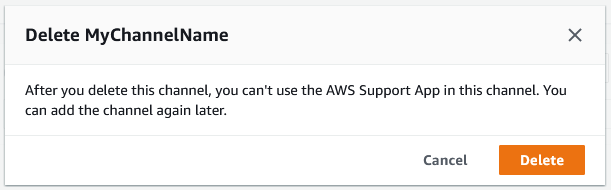

# Deleting a Slack channel configuration from the

AWS Support App

You can delete a channel configuration from the AWS Support App if you don't need it. This action
only removes the channel from the AWS Support App and the AWS Support Center Console. Your channel isn't
deleted from Slack.

You can add up to 20 channels for your AWS account. If you already reached this
quota, you must delete a channel before you can add another one.

###### To delete a Slack channel configuration

1. Sign in to the [**Support Center Console**](https://console.aws.amazon.com/support/app "https://console.aws.amazon.com/support/app") and choose **Slack
   configuration**.
2. On the **Slack configuration** page, under
   **Channels**, choose the channel name, and then choose
   **Delete**.
3. In the **Delete channel name** dialog box, choose
   **Delete**. You can add this channel to the AWS Support App again
   later.

