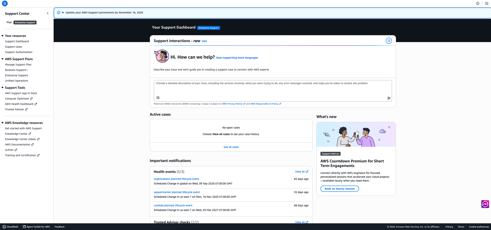
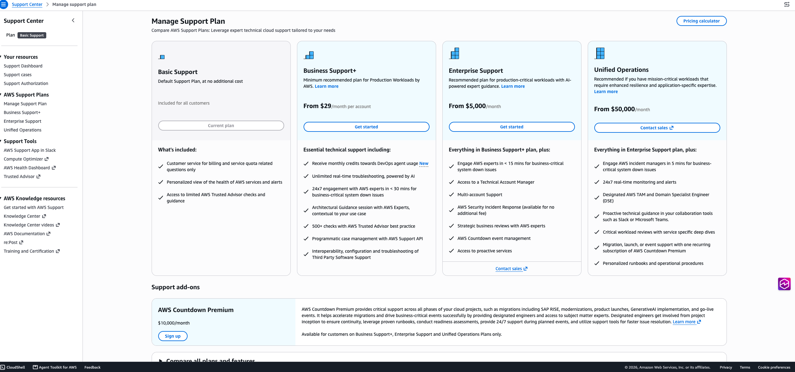
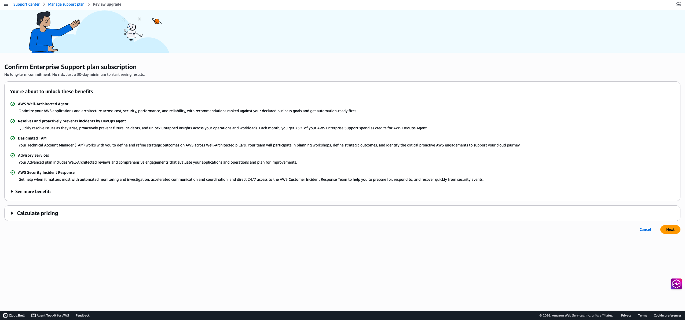
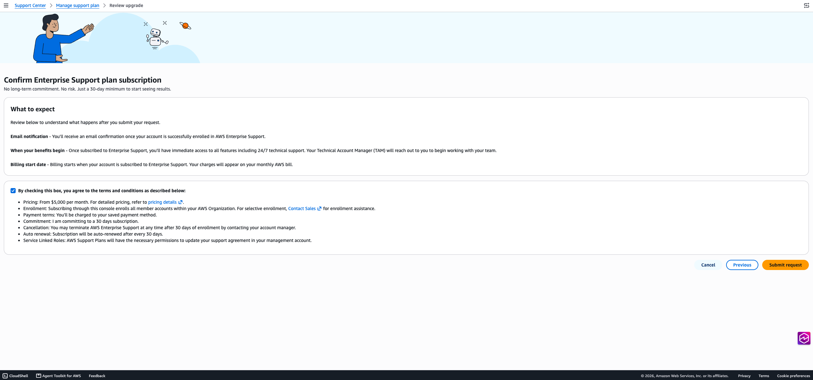
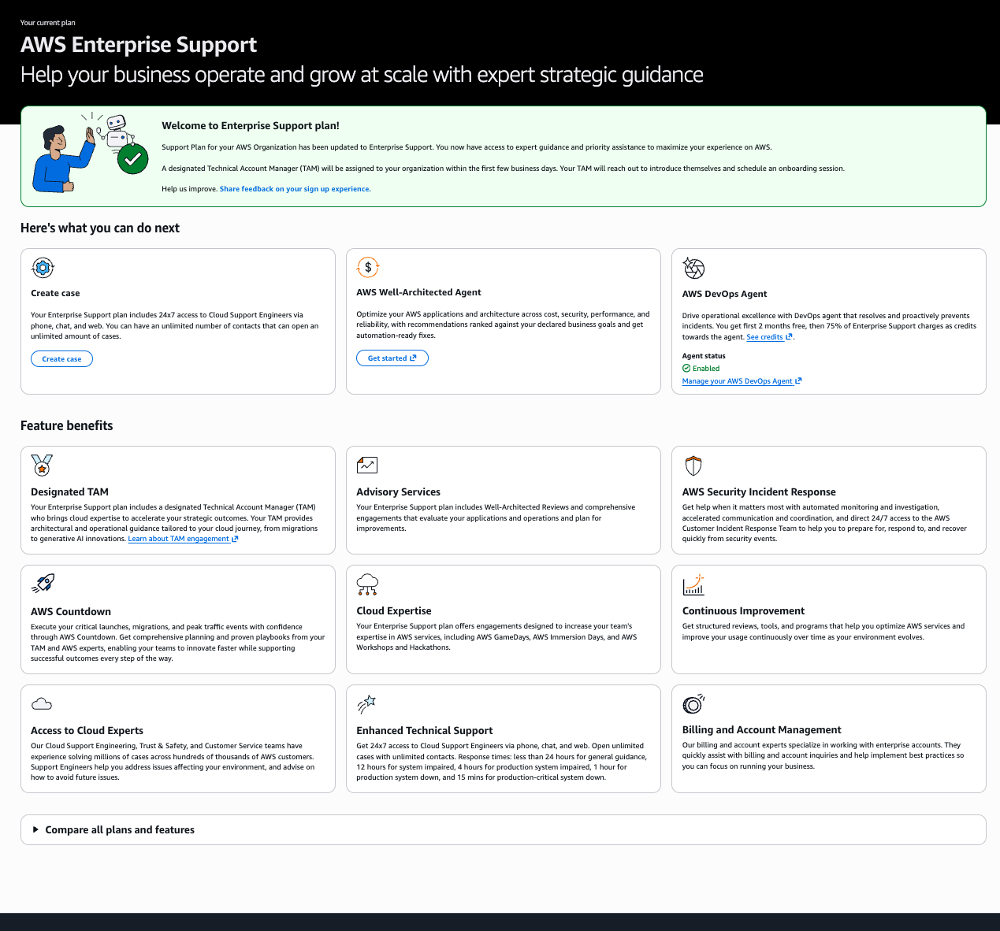

# Sign up for AWS Enterprise Support using self-service subscription

With [AWS Enterprise Support](https://aws.amazon.com/premiumsupport/plans/enterprise/ "https://aws.amazon.com/premiumsupport/plans/enterprise/"), you get a designated
Technical Account Manager (TAM), 24x7 access to Cloud Support Engineers by phone,
chat, and web, and a 15-minute response time when a business-critical system is down.
You also get proactive risk detection, 24x7 security monitoring with Amazon GuardDuty and
AWS Security Hub CSPM, architectural reviews, cost optimization workshops, AI/ML guidance, AWS Well-Architected Agent access, monthly AWS DevOps Agent credits, AWS Countdown,
and AWS Security Incident Response at no additional fee. For a full comparison, see [Compare AWS Support Plans](https://aws.amazon.com/premiumsupport/plans/ "https://aws.amazon.com/premiumsupport/plans/").

Subscribe directly from the AWS Support Plans console without contacting sales.
Enrollment covers every member account in your organization, including accounts
you add later. It activates immediately for most eligible accounts and has no
long-term commitment. If an account that was enrolled at the organization level
later leaves the organization, that account is downgraded to the Basic support
plan. For current pricing, see [AWS Support pricing](https://aws.amazon.com/premiumsupport/pricing/ "https://aws.amazon.com/premiumsupport/pricing/").

For instructions, see [Subscribe to AWS Enterprise Support](#enterprise-sign-up-procedure "#enterprise-sign-up-procedure"). Your TAM reaches out within the
first few business days after enrollment to schedule onboarding.

## Checking eligibility requirements

Self-service subscription is available to AWS customers who meet all of the
following requirements:

- You have a single-payer AWS Organization.
- You are not currently on an Enterprise Support, Enterprise On-Ramp, or Unified Operations
  plan.
- Your account is not associated with a reseller or AWS Partner
  account.
- You are the root user of the management account, or an AWS Identity and Access Management
  (IAM) user with support purchase permissions.

## Subscribe to AWS Enterprise Support

###### To sign up for AWS Enterprise Support

1. Open the [AWS Support
   console](https://console.aws.amazon.com/support/home "https://console.aws.amazon.com/support/home") and choose **Manage Support Plan** under
   **AWS Support Plans** in the left navigation pane.

 2. On the **Manage Support Plan** page, find the
**Enterprise Support** column and choose **Get
started**.

 3. Review the Enterprise Support benefits and pricing, then choose
**Next** to check your account's eligibility.

 4. If your account is eligible, you proceed to the confirmation page. If
validation fails, the page lists each reason. See [Troubleshooting](#enterprise-sign-up-troubleshooting "#enterprise-sign-up-troubleshooting") to resolve
eligibility failures. 5. On the confirmation page, review what to expect and the subscription
terms, select the checkbox to accept the terms, and then choose
**Submit request**.

 6. After the activation request completes, the console displays the
Enterprise Support plan page with a banner confirming that your enrollment is
complete. You also receive a subscription confirmation email.

## Understanding post-enrollment steps

After your account is enrolled:

- You receive an email confirmation. Billing starts when your account is
  subscribed and appears on your monthly AWS bill. For details, see [AWS Support
  pricing](https://aws.amazon.com/premiumsupport/pricing/ "https://aws.amazon.com/premiumsupport/pricing/").
- AWS assigns a designated Technical Account Manager (TAM) to your team
  within the first few business days. Your TAM reaches out to introduce
  themselves and schedule an onboarding session.

## Troubleshooting

Management account required

You're signed in as a member account of an AWS Organization, or
as a standalone account that isn't part of an organization. Only the
organization's management account can submit an Enterprise Support subscription
request. Sign out, sign in with your management account, and reopen
the Support Plans console. If your account isn't part of an
organization, create one by following the steps in [Creating an organization](../../../organizations/latest/userguide/orgs_tutorials_basic.md "../../../organizations/latest/userguide/orgs_tutorials_basic.md") in the _AWS Organizations
User Guide_.

Payer account required

The management account for your organization isn't the payer
account, and only the payer account can submit the request. Sign in
with your payer account and try again. If your organization uses a
separate payer, [contact
sales](https://aws.amazon.com/premiumsupport/aws-support-contact-us/ "https://aws.amazon.com/premiumsupport/aws-support-contact-us/") for assisted enrollment.

All Features mode required

Your organization is in consolidated billing mode, and Enterprise Support
requires AWS Organizations all features mode. Enable all features for your
organization by following the steps in [Enabling all features](../../../organizations/latest/userguide/orgs_manage_org_support-all-features.md "../../../organizations/latest/userguide/orgs_manage_org_support-all-features.md") in the _AWS Organizations User
Guide_, then return to the console and try
again.

Email address not supported

The email address on the account isn't on a company domain, and
support plan enrollment requires a company domain. Update the
account's contact email to a company domain address, or [create a
case](https://console.aws.amazon.com/support/home?interactionId=create-case#/ "https://console.aws.amazon.com/support/home?interactionId=create-case#/") in Support Center for help.

Partner or reseller account not supported

Your account is associated with an AWS Partner or reseller, and
self-service enrollment is available to direct AWS customers only.
Contact your AWS Partner or reseller to add Enterprise Support to your
account.

Support plan request already exists

An Enterprise Support activation is already in progress for your
organization. Wait for the in-flight request to complete. To check
its status or cancel it, contact your account manager or [create a
case](https://console.aws.amazon.com/support/home?interactionId=create-case#/ "https://console.aws.amazon.com/support/home?interactionId=create-case#/") in Support Center.

You don't have the necessary IAM permissions

Your IAM principal is missing the permissions needed to read or
change the support plan. Ask your AWS administrator to grant the
required permissions, or sign in as the management account root
user. For details, see [Manage access to AWS Support Plans](security-support-plans.md "security-support-plans.md").

Unable to verify your account eligibility

The console couldn't complete the eligibility check, usually
because of a transient error. Reload the page and try again. If the
problem persists, [create a
case](https://console.aws.amazon.com/support/home?interactionId=create-case#/ "https://console.aws.amazon.com/support/home?interactionId=create-case#/") in Support Center.

Taking longer than expected

Activation didn't complete within the expected window, and your
request might still be processing. Check your support plan in the
Support Plans console before resubmitting.

Unable to complete enrollment

Your enrollment request was rejected and Enterprise Support was not
activated. You were not charged.

If enrollment fails after you submit your request, you have the following
options:

- **Contact sales** – In the
  [Support Plans
  console](https://console.aws.amazon.com/support/plans/home#/enterprise "https://console.aws.amazon.com/support/plans/home#/enterprise"), choose **Contact sales**. Complete
  the form with your full name, email address, and phone number. A
  representative responds within 24 hours.
- **Create a support case** – In
  [Support Center](https://console.aws.amazon.com/support/home?interactionId=create-case#/ "https://console.aws.amazon.com/support/home?interactionId=create-case#/"),
  create a case referencing your Enterprise Support enrollment attempt.
- **Share feedback** – If you're
  already subscribed to Enterprise Support, go to the [Support Plans console](https://console.aws.amazon.com/support/plans/home#/enterprise "https://console.aws.amazon.com/support/plans/home#/enterprise") and
  choose **Share feedback on your sign up experience**
  in the banner to tell us about your enrollment.

## Changing or canceling your plan

To change or cancel your AWS Enterprise Support plan, contact your designated TAM or
[your AWS
sales representative](https://aws.amazon.com/premiumsupport/aws-support-contact-us/ "https://aws.amazon.com/premiumsupport/aws-support-contact-us/").
