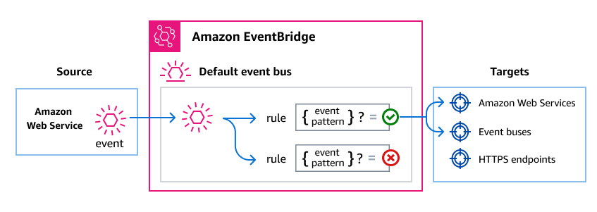

# Integrating AWS Support into event-driven applications using Amazon EventBridge

You can incorporate AWS Support into event-driven applications (EDAs) that use events that
occur in AWS Support to communicate between application components and initiate downstream
processes.

For example, you can get notified whenever the following AWS Support events occur in your
account:

- A support case is created, resolved, or reopened
- A correspondence is added to an existing support case
  You do this by using Amazon EventBridge to route events from AWS Support to other software components.
  Amazon EventBridge is a serverless service that uses events to connect application components
  together, making it easier for you to integrate AWS services like AWS Support into
  event-driven architectures without additional code and operations.

## How EventBridge routes AWS Support events

Here's how EventBridge works with AWS Support events:

As with many AWS services, AWS Support generates and sends events to the EventBridge default
_event bus_. An event bus is a router that receives events and routes
them to the destinations, or _targets_, that you specify. Targets can
include other AWS services, custom applications, and SaaS partner applications.

EventBridge routes events according to _rules_ you create on the event bus.
For each rule, you specify a filter, or _event pattern_, to select only
the events you want. Whenever an event is sent to the event bus, EventBridge compares it against
each rule. If the event matches the rule, EventBridge routes the event to the specified
target(s).

## AWS Support events

AWS Support sends the following events to the default EventBridge event bus
automatically.

| Event detail type                                                                                | Description                            |
| ------------------------------------------------------------------------------------------------ | -------------------------------------- | ----------------------------------------------------------------------------------------------------------------------------------------------------------------------------------------------------------------------------------------------------------------------------------------------------------------------------------------------------------------------------------------------------------------------------------------------------------------------------------------------------------------------------------------------------------------------------------------------------------------------------------------------------------------------------------------------------------------------------------------------------------------------------------------------------------------------------------------------------------------------------------------------------------------------------------------------------------------------------------------------------------------------------------------------------------------------------------------------------------------------------------------------------------------------------------------------------------------------------------------------------------------------------------------------------------------------------------------------------------------------------------------------------------------------------------------------------------------------------------------------------------------------------------------------------------------------------------------------------------------------------------------------------------------------------------------------------------------------------------------------------------------------------------------------------------------------------------------------------------------------------------------------------------------------------------------------------------------------------------------------------------------------------------------------------------------------------------------------------------------------------------------------------------------------------------------------------------------------------------------------------------------------------------------------------------------------------------------------------------------------------------------------------------------------------------------------------------------------------------------------------------------------------------------------------------------------------------------------------------------------------------------------------------------------------------------------------------------------------------------------------------------------------------------------------------------------------------------------------------------------------------------------------------------------------------------------------------------------------------------------------------------------------------------------------------------------------------------------------------------------------------------------------------------------------------------------------------------------------------------------------------------------------------------------------------------------- |
| [Support Case Update](event-detail-support-case-update.md "event-detail-support-case-update.md") | Represents a change in a support case. | ### Event structure All events from AWS services contain two types of data:  • A common set of fields containing metadata about the event, such as the AWS service that is the source of the event, the time the event was generated, the account and region in which the event took place, and others. For definitions of these general fields, see [Event structure](../../../eventbridge/latest/ref/overiew-event-structure.md "../../../eventbridge/latest/ref/overiew-event-structure.md") in the _Amazon EventBridge Events Reference_.  • A `detail` field that contains data specific to that particular service event. ### AWS Support event delivery via AWS CloudTrail AWS services can send events directly to the EventBridge default event bus. In addition, AWS CloudTrail sends events originating from numerous AWS services to EventBridge as well. These events can include API calls, console signins and actions, service events, and CloudTrail Insights. For more information, see [AWS service events delivered via AWS CloudTrail](../../../eventbridge/latest/userguide/eb-service-event-cloudtrail.md "../../../eventbridge/latest/userguide/eb-service-event-cloudtrail.md") in the _EventBridge User Guide_. For a list of AWS Support events sent to EventBridge, refer to the AWS Support topic in the [_EventBridge Events Reference_](../../../eventbridge/latest/ref/welcome.md "../../../eventbridge/latest/ref/welcome.md"). ## Creating event patterns that match AWS Support events Event patterns are filters where specify the data that the events you want to select should have. Each event pattern is a JSON object that contains:  • A `source` attribute that identifies the service sending the event. For AWS Support events, the source is `aws.support`.  • (Optional): A `detail-type` attribute that contains an array of the event names to match.  • (Optional): A `detail` attribute containing any other event data on which to match. For example, the following event pattern would select all Support Case Update events from AWS Support: `{ "source": ["aws.support"], "detail-type": ["Support Case Update"] }` You can get more specific in your event selection by including values in the event itself. For example, the following event pattern matches Support Case Update events that represent a case being reopened: `{ "source": ["aws.support"], "detail-type": ["Support Case Update"], "detail": { "event-name": "ReopenCase" } }` For more information on writing event patterns, see [Event patterns](../../../eventbridge/latest/userguide/eb-event-patterns.md "../../../eventbridge/latest/userguide/eb-event-patterns.md") in the _EventBridge User Guide_. ### See also For more information about how to use EventBridge with AWS Support, see the following resources:  • [How to automate AWS Support API with Amazon EventBridge](https://aws.amazon.com/blogs/mt/how-to-automate-aws-support-api-with-amazon-eventbridge "https://aws.amazon.com/blogs/mt/how-to-automate-aws-support-api-with-amazon-eventbridge")  • [AWS Support case activity notifier](https://github.com/aws-samples/aws-support-case-activity-notifier "https://github.com/aws-samples/aws-support-case-activity-notifier") on GitHub |
