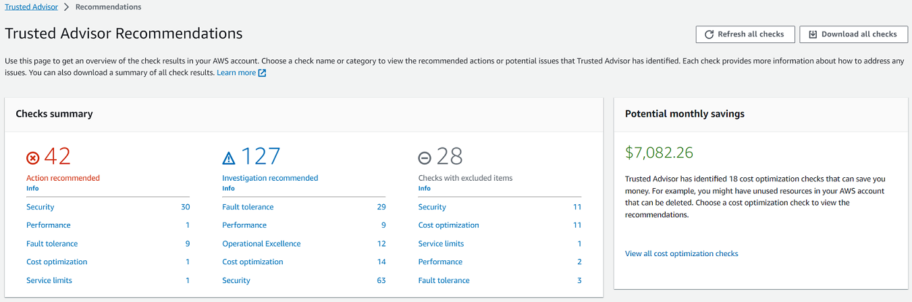
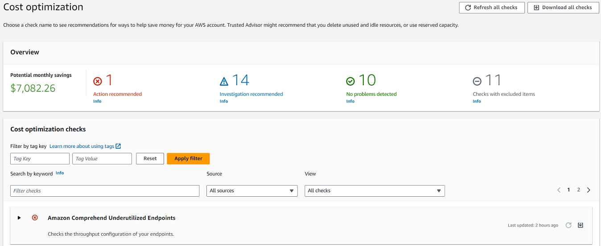
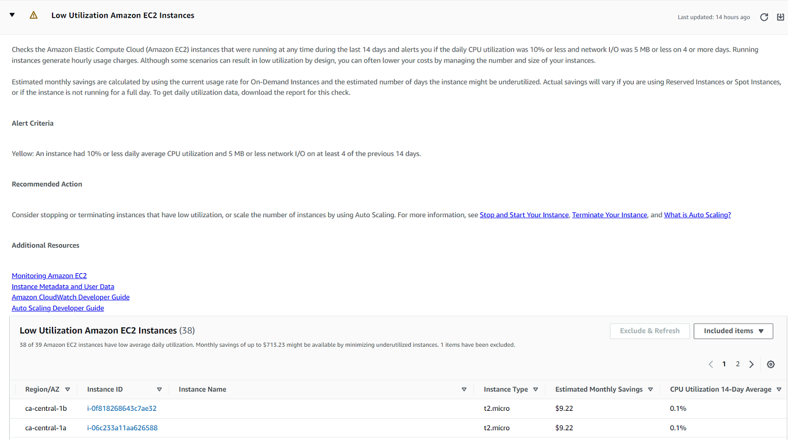

# Get started with

Trusted Advisor Recommendations

You can use the Trusted Advisor Recommendations page of the Trusted Advisor console to review check results for
your AWS account and then follow the recommended steps to fix any issues. For example, Trusted Advisor
might recommend that you delete unused resources to reduce your monthly bill, such as an Amazon Elastic Compute Cloud
(Amazon EC2) instance.

You can also use the AWS Trusted Advisor API to perform operations on your Trusted Advisor checks. For more
information, see the
[AWS Trusted Advisor API Reference](../../../trustedadvisor/latest/APIReference/Welcome.md "../../../trustedadvisor/latest/APIReference/Welcome.md")

###### Topics

- [Sign in to the Trusted Advisor console](#sign-in-the-trusted-advisor-console "#sign-in-the-trusted-advisor-console")
- [View check categories](#view-check-categories "#view-check-categories")
- [View specific checks](#view-specific-checks "#view-specific-checks")
- [Filter your checks](#filter-check-results "#filter-check-results")
- [Refresh check results](#refresh-check-results "#refresh-check-results")
- [Download check results](#download-check-results "#download-check-results")
- [Organizational view](#set-up-organizational-view "#set-up-organizational-view")
- [Preferences](#preferences-trusted-advisor-console "#preferences-trusted-advisor-console")

## Sign in to the Trusted Advisor console

You can view the checks and the status of each check in the Trusted Advisor console.

###### Note

You must have AWS Identity and Access Management (IAM) permissions to access the Trusted Advisor console. For more
information, see [Manage access to AWS Trusted Advisor](security-trusted-advisor.md "security-trusted-advisor.md").

###### To sign in to the Trusted Advisor console

1. Sign in to the Trusted Advisor console at [https://console.aws.amazon.com/trustedadvisor/home](https://console.aws.amazon.com/trustedadvisor/home "https://console.aws.amazon.com/trustedadvisor/home").
2. On the **Trusted Advisor Recommendations** page, view the summary for each check
   category:
   - Action recommended (red) – Trusted Advisor recommends an action for
     the check. For example, a check that detects a security issue for your IAM resources might
     recommend urgent steps.
   - Investigation recommended (yellow) – Trusted Advisor
     detects a possible issue for the check. For example, a check that reaches a quota for a
     resource might recommend ways to delete unused resources.
   - Checks with excluded items (gray) – The number of
     checks that have excluded items, such as resources that you want a check to ignore. For
     example, this might be Amazon EC2 instances that you don't want the check to evaluate.

3. You can do the following on the **Trusted Advisor Recommendations** page:
   - To refresh all checks in your account, choose **Refresh all
     checks**.
   - To create an .xls file that includes all check results, choose **Download all
     checks**.
   - Under **Checks summary**, choose a check category, such as
     **Security**, to view the results.
   - Under **Potential monthly savings**, you can view how much you can save
     for your account and the cost optimization checks for recommendations.
   - Under **Recent changes**, you can view changes to check statuses within
     the last 30 days. Choose a check name to view the latest results for that check or choose the
     arrow icon to view the next page.

###### Example : Trusted Advisor Recommendations

The following example shows a summary of the check results for an
AWS account.

## View check categories

You can view the check descriptions and results for the following check categories:

- Cost optimization – Recommendations that can
  potentially save you money. These checks highlight unused resources and opportunities to reduce
  your bill.
- Performance – Recommendations that can improve the
  speed and responsiveness of your applications.
- Security – Recommendations for security settings
  that can make your AWS solution more secure.
- Fault tolerance – Recommendations that help increase
  the resiliency of your AWS solution. These checks highlight redundancy shortfalls and overused resources.
- Service limits – Checks the usage for your account
  and whether your account approaches or exceeds the limit (also known as quotas) for AWS
  services and resources.
- Operational Excellence – Recommendations to help you operate your AWS environment effectively, and at scale.

###### To view check categories

1. Sign in to the Trusted Advisor console at [https://console.aws.amazon.com/trustedadvisor/home](https://console.aws.amazon.com/trustedadvisor/home "https://console.aws.amazon.com/trustedadvisor/home").
2. In the navigation pane, choose the check category.
3. On the category page, view the summary for each check category:
   - Action recommended (red) – Trusted Advisor recommends an
     action for the check.
   - Investigation recommended (yellow) – Trusted Advisor
     detects a possible issue for the check.
   - No problems detected (green) – Trusted Advisor doesn't
     detect an issue for the check.
   - Excluded items (gray) – The number of checks that
     have excluded items, such as resources that you want a check to ignore.

4. For each check, choose the refresh icon (
   
   ) to refresh this check.
5. Choose the download icon (
   
   ) to create an .xls file that includes the results for this check.

###### Example : Cost optimization category

The following example shows 10 (green) checks that don't have any issues.

## View specific checks

Expand a check to view the full check description, your affected resources, any recommended
steps, and links to more information.

###### To view a specific check

1. Sign in to the Trusted Advisor console at [https://console.aws.amazon.com/trustedadvisor/home](https://console.aws.amazon.com/trustedadvisor/home "https://console.aws.amazon.com/trustedadvisor/home").
2. In the navigation pane, choose a check category.
3. Choose
   the check name to view the description and the following details:
   - **Alert Criteria** – Describes the threshold when a check will
     change status.
   - **Recommended Action** – Describes the recommended actions for
     this check.
   - **Additional Resources** – Lists related AWS
     documentation.
   - A table that lists the affected items in your account. You can include or exclude these
     items from check results.

4. (Optional) To exclude items so that they don't appear in check results:
   1. Select an item and choose **Exclude & Refresh**.
   2. To view all excluded items, choose **Excluded items**.

5. (Optional) To include items so that the check evaluates them again:
   1. Choose **Excluded items**, select an item, and then choose
      **Include & Refresh**.
   2. To view all included items, choose **Included items**.

6. Choose the settings icon (
   
   ). In the **Preferences** dialog box, you can specify the
   number of items or the properties to display, and then choose
   **Confirm**.

###### Example : Cost optimization check

The following **Low Utilization Amazon EC2 Instances** check lists the
affected instances in the account. This check identifies 38 Amazon EC2 instances that have low usage
and recommends that you stop or terminate the resources.

## Filter your checks

On the check category pages, you can specify which check results that you want to view. For
example, you might filter by checks that have detected errors in your account so that you can
investigate urgent issues first.

If you have checks that evaluate items in your account, such as AWS resources, you can use
tag filters to only show items that have the specified tag.

###### To filter your checks

1. Sign in to the Trusted Advisor console at [https://console.aws.amazon.com/trustedadvisor/home](https://console.aws.amazon.com/trustedadvisor/home "https://console.aws.amazon.com/trustedadvisor/home").
2. In the navigation pane or the **Trusted Advisor Recommendations** page, choose the
   check category.
3. For **Search by keyword**, enter a keyword from the check name or
   description to filter your results.
4. For the **View** list, specify which checks to view:
   - **All checks** – List all checks for this category.
   - **Action recommended** – List checks that recommend that you
     take action. These checks are highlighted in red.
   - **Investigation recommended** – List checks that recommend that
     you take possible action. These checks are highlighted in yellow.
   - **No problems detected** – List checks that don't have any
     issues. These checks are highlighted in green.
   - **Checks with excluded items** – List checks that you specified
     to exclude items from the check results.

5. If you added tags to your AWS resources, such as Amazon EC2 instances or AWS CloudTrail trails, you
   can filter your results so that the checks only show items that have the specified tag.

For **Filter by tag**, enter a tag key and value, and then choose
**Apply filter**. 6. In the table for the check, the check results only show items that have the specified key
and value. 7. To clear the filter by tags, choose **Reset**.

### Related information

For more information about tagging for Trusted Advisor, see the following topics:

- [AWS Support enables tagging capabilities for Trusted Advisor](https://aws.amazon.com/about-aws/whats-new/2016/06/aws-support-enables-tagging-capabilities-for-trusted-advisor/ "https://aws.amazon.com/about-aws/whats-new/2016/06/aws-support-enables-tagging-capabilities-for-trusted-advisor/")
- [Tagging AWS
  resources](../../../general/latest/gr/aws_tagging.md "../../../general/latest/gr/aws_tagging.md") in the _AWS General Reference_

## Refresh check results

You can refresh checks to get the latest results for your account. If you have a Developer
or Basic Support plan, you can sign in to the Trusted Advisor console to refresh the checks. If you have
a Business, Enterprise On-Ramp, or Enterprise Support plan, Trusted Advisor automatically refreshes the checks in your account on a weekly
basis.

###### To refresh Trusted Advisor checks

1. Navigate to the AWS Trusted Advisor console at [https://console.aws.amazon.com/trustedadvisor](https://console.aws.amazon.com/trustedadvisor/ "https://console.aws.amazon.com/trustedadvisor/").
2. On the **Trusted Advisor Recommendations** or a check category page, choose
   **Refresh all checks**.

You can also refresh specific checks in the following ways:

- Choose the refresh icon (
  
  ) for an individual check.
- Use the [RefreshTrustedAdvisorCheck](../APIReference/API_RefreshTrustedAdvisorCheck.md "../APIReference/API_RefreshTrustedAdvisorCheck.md") API operation.

###### Notes

- Trusted Advisor automatically refreshes some checks several times a day, such as the
  **AWS Well-Architected high risk issues for reliability**
  check. It might take a few hours for changes to appear in your account. For these
  automatically refreshed checks, you can't choose the refresh icon (
  
  ) to manually refresh your results.
- If you enabled AWS Security Hub for your account, you can't use the Trusted Advisor console to refresh
  Security Hub controls. For more information, see [Refresh your Security Hub findings](security-hub-controls-with-trusted-advisor.md#refreshing-security-hub-findings "security-hub-controls-with-trusted-advisor.md#refreshing-security-hub-findings").

## Download check results

You can download check results to get an overview of Trusted Advisor in your account. You can
download results for all checks or a specific check.

###### To download check results from Trusted Advisor Recommendations

1. Navigate to the AWS Trusted Advisor console at [https://console.aws.amazon.com/trustedadvisor](https://console.aws.amazon.com/trustedadvisor/ "https://console.aws.amazon.com/trustedadvisor/").
   - To download all check results, in the **Trusted Advisor Recommendations** or a
     check category page, choose **Download all checks**.
   - To download a check result for a specific check, choose the check name, and then choose
     the download icon (
     
     ).

2. Save or open the .xls file. The file contains the same summary information from the
   Trusted Advisor console, such as the check name, description, status, affected resources, and so
   on.

## Organizational view

You can set up the organizational view feature to create a report for all member accounts in
your AWS organization. For more information, see [Organizational view for AWS Trusted Advisor](organizational-view.md "organizational-view.md").

## Preferences

On the **Manage Trusted Advisor** page, you can
[disable Trusted Advisor](#disable-trusted-advisor "#disable-trusted-advisor").

On the **Notifications** page, you can configure your weekly email messages
for the check summary. See [Set up notification preferences](#notification-preferences "#notification-preferences").

On the **Your organization** page, you can enable or disable trusted access
with AWS Organizations. This is required for the [Organizational view for AWS Trusted Advisor](organizational-view.md "organizational-view.md") feature and [Trusted Advisor Priority](trusted-advisor-priority.md "trusted-advisor-priority.md").

### Set up notification preferences

Specify who can receive the weekly Trusted Advisor email messages for check results and the
language. You receive an email notification about your check summary for Trusted Advisor Recommendations
once a week.

The email notifications for Trusted Advisor Recommendations don't include results for Trusted Advisor Priority. For
more information, see [Manage Trusted Advisor Priority
notifications](trusted-advisor-priority.md#trusted-advisor-priority-notifications "trusted-advisor-priority.md#trusted-advisor-priority-notifications").

###### To set up notification preferences

1. Sign in to the Trusted Advisor console at [https://console.aws.amazon.com/trustedadvisor/home](https://console.aws.amazon.com/trustedadvisor/home "https://console.aws.amazon.com/trustedadvisor/home").
2. In the navigation pane, under **Preferences**, choose
   **Notifications**.
3. For **Recommendations**, select whom to notify for your check results.
   You can add and remove contacts from the [Account Settings](https://console.aws.amazon.com/billing/home#/account "https://console.aws.amazon.com/billing/home#/account") page in the AWS Billing and Cost Management console.
4. For **Language**, choose the language for the email message.
5. Choose **Save your preferences**.

### Set up organizational view

If you set up your account with AWS Organizations, you can create reports for all member accounts in
your organization. For more information, see [Organizational view for AWS Trusted Advisor](organizational-view.md "organizational-view.md").

### Disable Trusted Advisor

When you disable this service, Trusted Advisor won't perform any checks on your account. Anyone
who tries to access the Trusted Advisor console or use the API operations will receive an access denied
error message.

###### To disable Trusted Advisor

1. Sign in to the Trusted Advisor console at [https://console.aws.amazon.com/trustedadvisor/home](https://console.aws.amazon.com/trustedadvisor/home "https://console.aws.amazon.com/trustedadvisor/home").
2. In the navigation pane, under **Preferences**, choose **Manage
   Trusted Advisor**.
3. Under **Trusted Advisor**, turn off **Enabled**. This action
   disables Trusted Advisor for all checks in your account.
4. You can then manually delete the [AWSServiceRoleForTrustedAdvisor](https://console.aws.amazon.com/iam/home?#/roles/AWSServiceRoleForTrustedAdvisor "https://console.aws.amazon.com/iam/home?#/roles/AWSServiceRoleForTrustedAdvisor")

from your account. For more information, see [Deleting a service-linked role for
Trusted Advisor](using-service-linked-roles-ta.md#delete-service-linked-role-ta "using-service-linked-roles-ta.md#delete-service-linked-role-ta").

### Related information

For more information about Trusted Advisor, see the following topics:

- [How
  do I start using Trusted Advisor?](https://aws.amazon.com/premiumsupport/knowledge-center/trusted-advisor-intro/ "https://aws.amazon.com/premiumsupport/knowledge-center/trusted-advisor-intro/")
- [AWS Trusted Advisor check reference](trusted-advisor-check-reference.md "trusted-advisor-check-reference.md")
