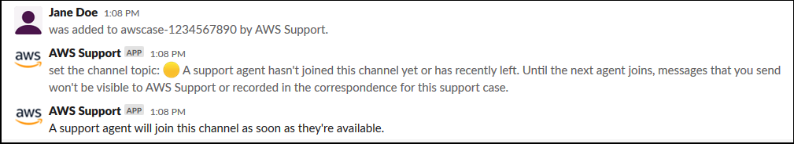
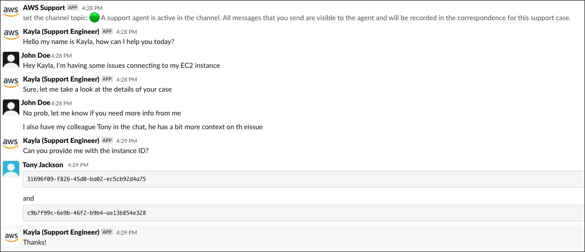
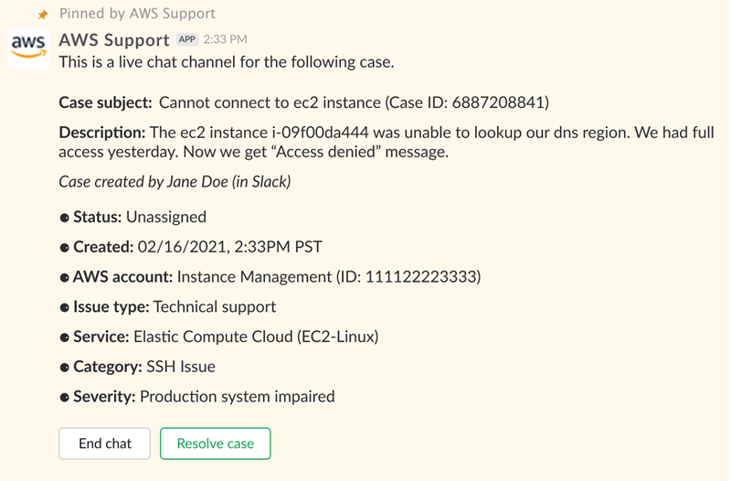
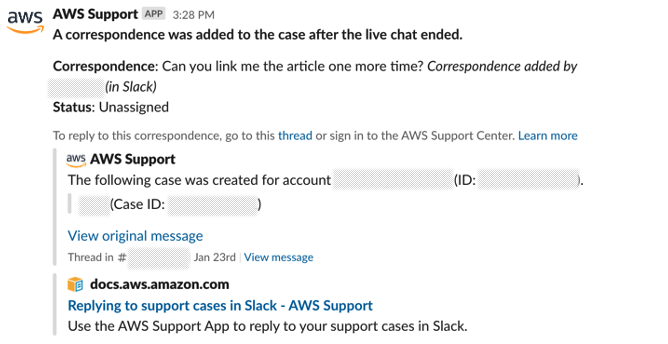
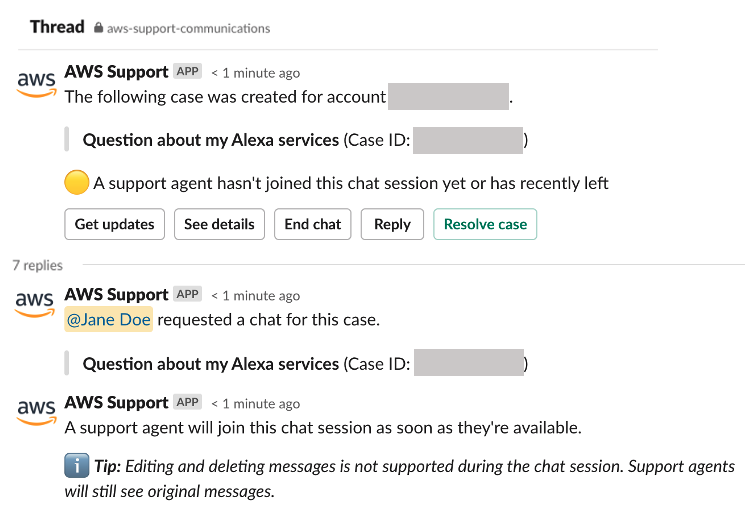
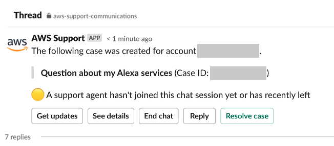

# Join a live chat session with Support

When you request a live chat for your case, you choose to either use a new chat channel
or a thread in the current channel for you and the AWS Support agent.
Use this chat channel or thread to communicate with the support agent
and any others that you invited to the live chat.

###### Important

Anyone who joins a channel with a live chat can view details about the specific
support case and the chat history. Its a best practice to add only users that require
access to your support cases. Any member of a chat channel or thread can also
participate in an active chat.

###### Note

Live chat channels and threads also receive notifications when a correspondence is
added to the case outside of the live chat session. This occurs before, during, and
after a chat session, so you can use a chat channel or thread to monitor all updates for
a case. If you chose to use a new chat channel, use the configuration channel that you
invited the AWS Support App to reply to these correspondences.

###### To join a live chat session with Support in a new channel

1. In the Slack application, navigate to the channel that the AWS Support App creates for
   you. The channel name includes your support case ID, such as
   `awscase-1234567890`.

###### Note

The AWS Support App adds a pinned message to the live chat channel that contains
details about your support case. From the pinned message, you can end the chat
or resolve the case. You can find all pinned messages in this channel under the
channel name. 2. When the support agent joins the channel, you can chat about your support case.
Until a support agent joins the channel, the agent won't see messages in that chat
and the messages don't appear in your case correspondence.

 3. (Optional) Add other members to the chat channel. By default, chat channels are
private. 4. After the support agent joins the chat, the chat channel is active and the
AWS Support App records the chat.

You can chat with the agent about your support case and upload any file
attachments to the channel. The AWS Support App automatically saves your files and chat log
to your case correspondence.

###### Note

When you chat with a support agent, note the following differences in Slack
for the AWS Support App:

    * Support agents can't view shared messages or threads. To share text
     from a message or thread, enter the text as a new message.
    * If you edit or delete a message, the agent still sees the original
     message. You must enter your new message again to show the
     revision.

###### Example: Live chat session

The following is an example of a live chat session with a support agent to fix
a connectivity issue for two Amazon Elastic Compute Cloud (Amazon EC2) instances.

 5. (Optional) To stop the live chat, choose **End chat**. The
support agent leaves the channel and the AWS Support App stops recording the live chat. You
can find the chat history attached to the case correspondence for this support
case. 6. If the issue is resolved, you can choose **Resolve case** from
the pinned message or enter `/awssupport resolve`.

###### Example: End a live chat

The following pinned message shows the case details about an Amazon EC2 instance.
You can find the pinned messages under the Slack channel name.

###### Example: Correspondence notification in chat channel

The following is an example of a live chat channel receiving a notification
when the another collaborator adds an update after the chat has ended.

The notification will indicate the chat status (requested, in progress, or
ended) and whether the correspondence was added by an agent or by another
collaborator. The Support App will also attempt to link back to the original
Slack thread or channel where this chat was requested. You can [reply
to this case](replying-to-support-cases-in-slack.md "replying-to-support-cases-in-slack.md") from that channel, or any other channel with access to
this case.

###### To join a live chat session with Support in the current channel

1. In the Slack application, navigate to the thread in the current channel that
   the AWS Support App uses for the chat. In most cases, this will be
   the thread that started when the case was first created.
2. When the support agent joins the thread, you can chat about your support case.
   Until a support agent joins the thread, the agent won't see messages in that thread,
   and the messages won't appear in your case correspondence when the chat ends.

###### Note

Messages sent to this channel outside of the chat thread are never seen by Support,
even while a chat is active.

 3. (Optional) Tag other channel members to notify them on the chat thread. 4. After the support agent joins the chat, the chat thread is active and the AWS Support App records the chat.
Similar to the new chat channel option, you can chat with the agent about your support case and
upload any file attachments to the thread. The AWS Support App automatically saves your
files and chat log to your case correspondence. 5. (Optional) To stop the live chat, choose End chat from the initial message for this thread.
The support agent leaves the thread and the AWS Support App stops recording the live chat.
You can find the chat history attached to the case correspondence for this support case. 6. If the issue is resolved, you can choose Resolve case from the initial message for this thread.

