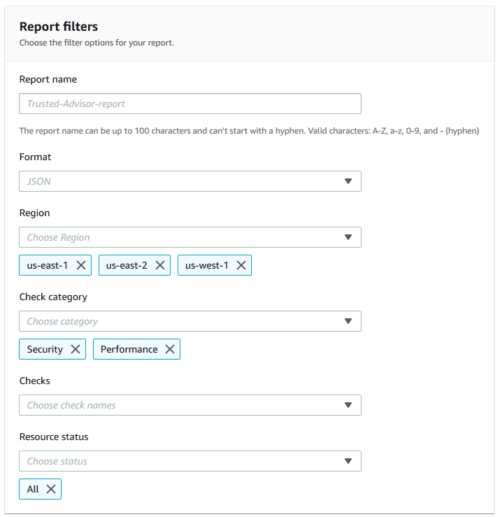
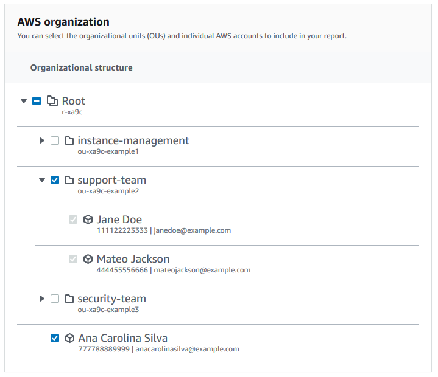
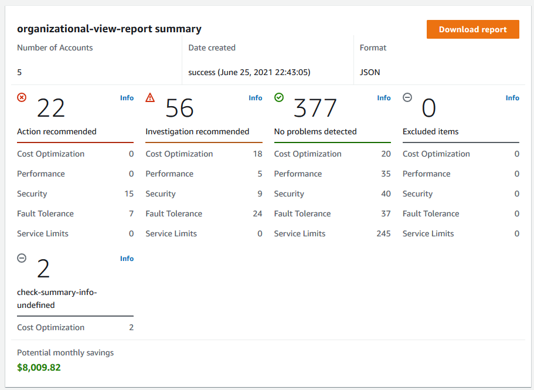
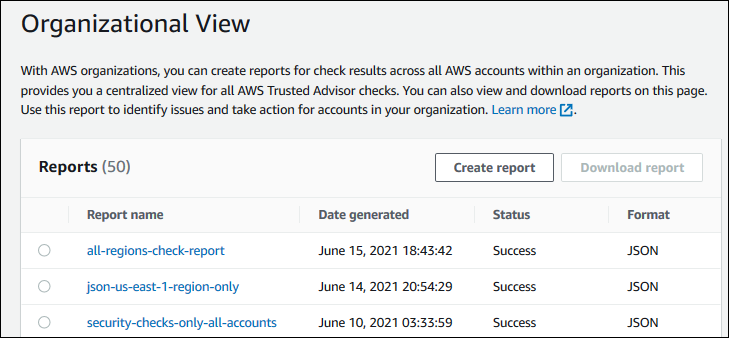
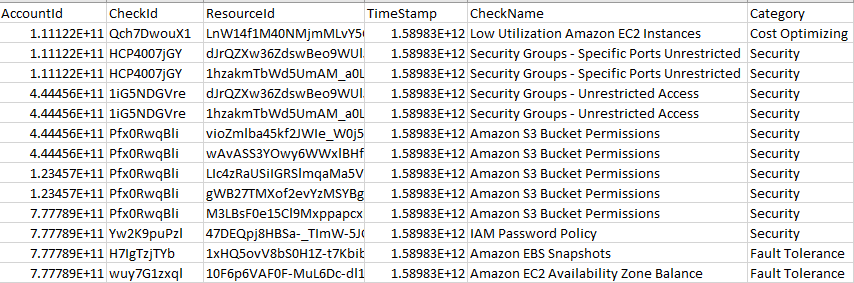
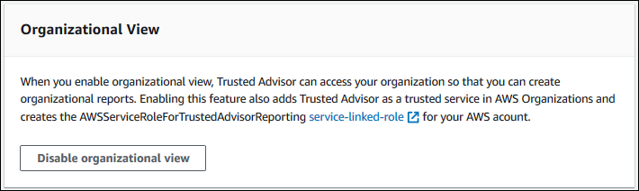

# Organizational view for AWS Trusted Advisor

###### Important

End of Support Notice: Developer Support will be discontinued January 1, 2027. Customers with Developer Support can continue using their existing plan or choose to upgrade to Business Support+ anytime before January 1, 2027. Business Support+ delivers AI-powered assistance that understands the context of your operations, with 24/7 access to AWS experts at $29/month minimum per account. For more information, see [Business Support+ plan details](https://aws.amazon.com/premiumsupport/plans/business-plus/ "https://aws.amazon.com/premiumsupport/plans/business-plus/")

End of Support Notice: Business Support will be discontinued January 1, 2027. Customers with Business Support can continue using their existing plan or choose to upgrade to Business Support+ anytime before January 1, 2027. Business Support+ delivers AI-powered assistance that understands the context of your operations, with 24/7 access to AWS experts at $29/month minimum per account. For more information see, [Business Support+ plan details](https://aws.amazon.com/premiumsupport/plans/business-plus/ "https://aws.amazon.com/premiumsupport/plans/business-plus/")

End of Support Notice: On January 1, 2027, AWS will discontinue Enterprise On-Ramp. Throughout 2026, Enterprise On-Ramp customers will be automatically upgraded to AWS Enterprise Support during contract renewal or in periodic batches. Customers will receive an email notification a month before their upgrade. No further action is required. Enterprise Support provides designated TAM assignment, 15-minute response times, and AWS Security Incident Response available at no additional cost, all at a lower $5,000 minimum (reduced from $15,000). For more information, see [AWS Enterprise Support plan details](https://aws.amazon.com/premiumsupport/plans/enterprise/ "https://aws.amazon.com/premiumsupport/plans/enterprise/").

For more information, see [Developer, Business, and Enterprise On-Ramp end of support](support-plans-eos.md "support-plans-eos.md").

Developer Support, Business Support, and Enterprise On-Ramp will remain available in the AWS GovCloud (US) Region.

Organizational view lets you view Trusted Advisor checks for all accounts in your [AWS Organizations](https://aws.amazon.com/organizations/ "https://aws.amazon.com/organizations/"). After you enable this feature,
you can create reports to aggregate the check results for all member accounts in your
organization. The report includes a summary of check results and information about affected
resources for each account. For example, you can use the reports to identify which accounts
in your organization are using AWS Identity and Access Management (IAM) with the IAM Use check or whether you
have recommended actions for Amazon Simple Storage Service (Amazon S3) buckets with the Amazon S3 Bucket Permissions
check.

###### Topics

- [Prerequisites](#prerequisites-organizational-view "#prerequisites-organizational-view")
- [Enable organizational view](#enable-organizational-view "#enable-organizational-view")
- [Refresh Trusted Advisor checks](#refresh-trusted-advisor-checks "#refresh-trusted-advisor-checks")
- [Create organizational view
  reports](#create-organizational-view-reports "#create-organizational-view-reports")
- [View the report summary](#view-organizational-reports "#view-organizational-reports")
- [Download an organizational view
  report](#download-organizational-view-reports "#download-organizational-view-reports")
- [Disable organizational view](#disable-organizational-view "#disable-organizational-view")
- [Using IAM policies to allow access to
  organizational view](organizational-view-iam-policies.md "organizational-view-iam-policies.md")
- [Using other AWS
  services to view Trusted Advisor reports](use-other-aws-services-with-trusted-advisor-reports.md "use-other-aws-services-with-trusted-advisor-reports.md")

## Prerequisites

You must meet the following requirements to enable organizational view:

- Your accounts must be members of an [AWS Organizations](https://aws.amazon.com/organizations/ "https://aws.amazon.com/organizations/").
- Your organization must have all features enabled for Organizations. For more
  information, see [Enabling all features in your organization](../../../organizations/latest/userguide/orgs_manage_org_support-all-features.md "../../../organizations/latest/userguide/orgs_manage_org_support-all-features.md") in the
  _AWS Organizations User Guide_.
- The management account in your organization must have an AWS Business Support+, AWS Enterprise Support, or AWS Unified Operations plan.
  You can find your support plan from the AWS Support Center or from the [Support plans](https://console.aws.amazon.com/support/plans "https://console.aws.amazon.com/support/plans") page. See [Compare AWS Support
  plans](https://aws.amazon.com/premiumsupport/plans/ "https://aws.amazon.com/premiumsupport/plans/").
- You must sign in as a user in the [management account](../../../organizations/latest/userguide/orgs_manage_accounts.md "../../../organizations/latest/userguide/orgs_manage_accounts.md") (or [assumed
  equivalent role](../../../IAM/latest/UserGuide/id_roles_use_switch-role-console.md "../../../IAM/latest/UserGuide/id_roles_use_switch-role-console.md")). Whether you sign in as an IAM user or an IAM
  role, you must have a policy with the required permissions. See [Using IAM policies to allow access to
  organizational view](organizational-view-iam-policies.md "organizational-view-iam-policies.md").

## Enable organizational view

After you meet the prerequisites, follow these steps to enable organizational view.
After you enable this feature, the following happens:

- Trusted Advisor is enabled as a _trusted service_ in your
  organization. For more information, see [Enabling trusted access with other AWS
  services](../../../organizations/latest/userguide/orgs_integrate_services.md "../../../organizations/latest/userguide/orgs_integrate_services.md") in the _AWS Organizations User Guide_.
- The `AWSServiceRoleForTrustedAdvisorReporting` service-linked-role
  is created for you in the management account in your organization. This role
  includes the permissions that Trusted Advisor needs to call Organizations on your behalf. This
  service-linked role is locked, and you can't delete it manually. For more
  information, see [Using service-linked roles for
  Trusted Advisor](using-service-linked-roles-ta.md "using-service-linked-roles-ta.md").

You enable organizational view from the Trusted Advisor console.

###### To enable organizational view

1. Sign in as an administrator in the organization's management account and open
   the AWS Trusted Advisor console at [https://console.aws.amazon.com/trustedadvisor](https://console.aws.amazon.com/trustedadvisor/ "https://console.aws.amazon.com/trustedadvisor/").
2. In the navigation pane, under **Preferences**, choose
   **Your organization**.
3. Under **Enable trusted access with AWS Organizations**, turn on
   **Enabled**.

###### Note

Enabling organizational view for the management account doesn’t provide the same
checks for all member accounts. For example, if your member accounts all have Basic
Support, those accounts won’t have the same checks available as your management
account. The AWS Support plan determines which Trusted Advisor checks are available for an
account.

## Refresh Trusted Advisor checks

Before you create a report for your organization, we recommend that you refresh the
statuses of your Trusted Advisor checks. You can download a report without refreshing your
Trusted Advisor checks, but your report might not have the latest information.

If you have an AWS Business Support+, AWS Enterprise Support, or AWS Unified Operations plan, Trusted Advisor automatically refreshes the checks in
your account on a weekly basis.

###### Note

If you have accounts in your organization that have a Developer or Basic support
plan, a user for those accounts must sign in to the Trusted Advisor console to refresh the
checks. You can't refresh checks for all accounts from the organization's
management account.

###### To refresh Trusted Advisor checks

1. Navigate to the AWS Trusted Advisor console at [https://console.aws.amazon.com/trustedadvisor](https://console.aws.amazon.com/trustedadvisor/ "https://console.aws.amazon.com/trustedadvisor/").
2. On the **Trusted Advisor Recommendations** page, choose the **Refresh all
   checks**. This refreshes all checks in your account.

You can also refresh specific checks in the following ways:

- Use the [RefreshTrustedAdvisorCheck](../APIReference/API_RefreshTrustedAdvisorCheck.md "../APIReference/API_RefreshTrustedAdvisorCheck.md") API operation.
- Choose the refresh icon (
  
  ) for an individual check.

## Create organizational view

reports

After you enable organizational view, you can create reports so that you can view
Trusted Advisor check results for your organization.

You can create up to 50 reports. If you create reports beyond this quota, Trusted Advisor
deletes the earliest report. You can't recover deleted reports.

###### To create organizational view reports

1. Sign in to the organization's management account and open the AWS Trusted Advisor
   console at [https://console.aws.amazon.com/trustedadvisor](https://console.aws.amazon.com/trustedadvisor/ "https://console.aws.amazon.com/trustedadvisor/").
2. In the navigation pane, choose **Organizational
   View**.
3. Choose **Create report**.
4. By default, the report includes all AWS Regions, check categories, checks,
   and resource statuses. On the **Create report** page, you can
   use the filter options to customize your report. For example, you can clear the
   **All** option for **Region**, and then
   specify the individual Regions to include in the report.
   1. Enter a **Name** for the report.
   2. For **Format**, choose **JSON** or **CSV**.
   3. For **Region**, specify the AWS Regions or choose
      **All**.
   4. For **Check category**, choose the check category or
      choose **All**.
   5. For **Checks**, choose the specific checks for that
      category or choose **All**.

   ###### Note

   The **Check category** filter overrides the
   **Checks** filter. For example, if you choose
   the **Security** category and then choose a
   specific check name, your report includes all check results for that
   category. To create a report for only specific checks, keep the
   default **All** value for **Check
   category** and then choose your check names. 6. For **Resource status**, choose the status to filter,
   such as **Warning**, or choose
   **All**.

5. For **AWS Organizations**, select the organizational units
   (OUs) to include in your report. For more information about OUs, see [Managing organizational units](../../../organizations/latest/userguide/orgs_manage_ous.md "../../../organizations/latest/userguide/orgs_manage_ous.md") in the
   _AWS Organizations User Guide_.
6. Choose **Create report**.

###### Example: Create report filter options

The following example creates a JSON report for the following:

- Three AWS Regions
- All **Security** and **Performance**
  checks


In the following example, the report includes the
**support-team** organizational unit and one AWS account that are part of the
organization.



###### Notes

- The amount of time it takes to create the report depends on the number of
  accounts in the organization and the number of resources in each account.
- You can't create more than one report at a time unless the current report
  has been running for more than 6 hours.
- Refresh the page if you don't see the report appear on the page.

## View the report summary

After the report is ready, you can view the report summary from the Trusted Advisor console.
This lets you quickly view the summary of your check results across your
organization.

###### To view the report summary

1. Sign in to the organization's management account and open the AWS Trusted Advisor
   console at [https://console.aws.amazon.com/trustedadvisor](https://console.aws.amazon.com/trustedadvisor/ "https://console.aws.amazon.com/trustedadvisor/").
2. In the navigation pane, choose **Organizational
   View**.
3. Choose the report name.
4. On the **Summary** page, view the check statuses for each
   category. You can also choose **Download report**.

###### Example: Report summary for an organization



## Download an organizational view

report

After your report is ready, download it from the Trusted Advisor console. The report is a
.zip file that contains three files:

- `summary.json` – Contains a summary of the check
  results for each check category.
- `schema.json` – Contains the schema for the
  specified checks in the report.
- A resources file (.json or .csv) – Contains detailed information about
  the check statuses for resources in your organization.

###### To download an organizational view report

1. Sign in to the organization's management account and open the AWS Trusted Advisor
   console at [https://console.aws.amazon.com/trustedadvisor](https://console.aws.amazon.com/trustedadvisor/ "https://console.aws.amazon.com/trustedadvisor/").
2. In the navigation pane, choose **Organizational
   View**.

The **Organizational View** page displays the available
reports to download. 3. Select a report, choose **Download report**, and
then save the file. You can only download one report at a time.

 4. Unzip the file. 5. Use a text editor to open the `.json` file or a spreadsheet
application to open the `.csv` file.

###### Note

You might receive multiple files if your report is 5 MB or larger.

###### Example: summary.json file

The `summary.json` file shows the number of accounts in the
organization and the statuses of the checks in each category.

Trusted Advisor uses the following color code for check results:

- `Green` – Trusted Advisor doesn't detect an issue for the
  check.
- `Yellow` – Trusted Advisor detects a possible issue for the
  check.
- `Red` – Trusted Advisor detects an error and recommends an
  action for the check.
- `Blue` – Trusted Advisor can't determine the status of the
  check.
  In the following example, two checks are `Red`, one is
  `Green`, and one is `Yellow`.

```
{
    "numAccounts": 3,
    "filtersApplied": {
        "accountIds": ["123456789012","111122223333","111111111111"],
        "checkIds": "All",
        "categories": [
            "security",
            "performance"
        ],
        "statuses": "All",
        "regions": [
            "us-west-1",
            "us-west-2",
            "us-east-1"
        ],
        "organizationalUnitIds": [
            "ou-xa9c-EXAMPLE1",
            "ou-xa9c-EXAMPLE2"
        ]
    },
    "categoryStatusMap": {
        "security": {
            "statusMap": {
                "ERROR": {
                    "name": "Red",
                    "count": 2
                },
                "OK": {
                    "name": "Green",
                    "count": 1
                },
                "WARN": {
                    "name": "Yellow",
                    "count": 1
                }
            },
            "name": "Security"
        }
    },
    "accountStatusMap": {
        "123456789012": {
            "security": {
                "statusMap": {
                    "ERROR": {
                        "name": "Red",
                        "count": 2
                    },
                    "OK": {
                        "name": "Green",
                        "count": 1
                    },
                    "WARN": {
                        "name": "Yellow",
                        "count": 1
                    }
                },
                "name": "Security"
            }
        }
    }
}
```

###### Example: schema.json file

The `schema.json` file includes the schema for the checks in
the report. The following example includes the IDs and properties for the IAM
Password Policy (Yw2K9puPzl) and IAM Key Rotation
(DqdJqYeRm5) checks.

```
{
    "Yw2K9puPzl": [
        "Password Policy",
        "Uppercase",
        "Lowercase",
        "Number",
        "Non-alphanumeric",
        "Status",
        "Reason"
    ],
    "DqdJqYeRm5": [
        "Status",
        "IAM User",
        "Access Key",
        "Key Last Rotated",
        "Reason"
    ],
    ...
}
```

###### Example: resources.csv file

The `resources.csv` file includes information about resources
in the organization. This example shows some of the data columns that appear in the
report, such as the following:

- Account ID of the affected account
- The Trusted Advisor check ID
- The resource ID
- Timestamp of the report
- The full name of the Trusted Advisor check
- The Trusted Advisor check category
- The account ID of the parent organizational unit (OU) or root



The resources file only contains entries if a check result exists at the resource
level. You might not see checks in the report for the following reasons:

- Some checks, such as **MFA on Root Account**, don't have
  resources and won't appear in the report. Checks without resources appear in the
  `summary.json` file instead.
- Some checks only show resources if they are `Red` or
  `Yellow`. If all resources are `Green`, they might not
  appear in your report.
- If an account isn't enabled for a service that requires the check, the check
  might not appear in the report. For example, if you're not using Amazon Elastic Compute Cloud
  Reserved Instances in your organization, the Amazon EC2 Reserved Instance Lease
  Expiration check won't appear in your report.
- The account hasn't refreshed check results. This might happen when users with
  a Basic or Developer support plan sign in to the Trusted Advisor console for the first
  time. If you have an AWS Business Support+, AWS Enterprise Support, or AWS Unified Operations plan, it can take up to one week from
  account sign up for users to see check results. For more information, see [Refresh Trusted Advisor checks](#refresh-trusted-advisor-checks "#refresh-trusted-advisor-checks").
- If only the organization's management account enabled recommendations for
  checks, the report won't include resources for other accounts in the
  organization.

For the resources file, you can use common software such as Microsoft Excel to open
the .csv file format. You can use the .csv file for one-time analysis of all checks
across all accounts in your organization. If you want to use your report with an
application, you can download the report as a .json file instead.

The .json file format provides more flexibility than the .csv file format for advanced
use cases such as aggregation and advanced analytics with multiple datasets. For
example, you can use a SQL interface with an AWS service such as Amazon Athena to run
queries on your reports. You can also use Amazon Quick Suite to create dashboards and visualize
your data. For more information, see [Using other AWS
services to view Trusted Advisor reports](use-other-aws-services-with-trusted-advisor-reports.md "use-other-aws-services-with-trusted-advisor-reports.md").

## Disable organizational view

Follow this procedure to disable organizational view. You must sign in to the
organization's management account or assume a role with the required permissions to
disable this feature. You can't disable this feature from another account in the
organization.

After you disable this feature, the following happens:

- Trusted Advisor is removed as a trusted service in Organizations.
- The `AWSServiceRoleForTrustedAdvisorReporting` service-linked role
  is unlocked in the organization's management account. This means you can delete
  it manually, if needed.
- You can't create, view, or download reports for your organization. To access
  previously created reports, you must reenable organizational view from the
  Trusted Advisor console. See [Enable organizational view](#enable-organizational-view "#enable-organizational-view").

###### To disable organizational view for Trusted Advisor

1. Sign in to the organization's management account and open the AWS Trusted Advisor
   console at [https://console.aws.amazon.com/trustedadvisor](https://console.aws.amazon.com/trustedadvisor/ "https://console.aws.amazon.com/trustedadvisor/").
2. In the navigation pane, choose **Preferences**.
3. Under **Organizational View**, choose **Disable
   organizational view**.



After you disable organizational view, Trusted Advisor no longer aggregates checks from other
AWS accounts in your organization. However, the
`AWSServiceRoleForTrustedAdvisorReporting` service-linked role remains on
the organization's management account until you delete it through the IAM console,
IAM API, or AWS Command Line Interface (AWS CLI). For more information, see [Deleting a service-linked role](../../../IAM/latest/UserGuide/using-service-linked-roles.md#delete-service-linked-role "../../../IAM/latest/UserGuide/using-service-linked-roles.md#delete-service-linked-role") in the
_IAM User Guide_.

###### Note

You can use other AWS services to query and visualize your data for
organizational view reports. For more information, see the following
resources:

- [View
  AWS Trusted Advisor recommendations at scale with AWS Organizations](https://aws.amazon.com/blogs/mt/organizational-view-for-trusted-advisor/ "https://aws.amazon.com/blogs/mt/organizational-view-for-trusted-advisor/") in the
  _AWS Management & Governance Blog_
- [Using other AWS
  services to view Trusted Advisor reports](use-other-aws-services-with-trusted-advisor-reports.md "use-other-aws-services-with-trusted-advisor-reports.md")
