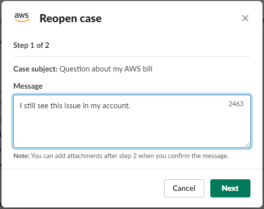

# Reopening a support case in Slack

After you resolve a support case, you can reopen the case from Slack.

###### To reopen a support case in Slack

1. Find the support case to reopen in Slack. See [Searching for support cases in Slack](search-case.md "search-case.md").
2. Choose **See details**.
3. Choose **Reopen case**.
4. In the **Reopen case** dialog box, enter a brief description of
   the issue in the **Message** field.
5. Choose **Next**.

 6. (Optional) Enter additional contacts. 7. Choose **Review**. 8. Review your case details, and then choose **Send message**. Your case reopens.
If you requested a new live chat with a support agent, Slack uses the
same chat channel or thread as the one that was used for a previous live chat.
If you requested a live chat in a new channel and you haven't had one so far,
a new chat channel opens. If you requested a live chat in the current channel and
you haven't had one so far, a thread in the current channel is used.
