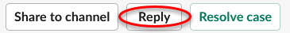
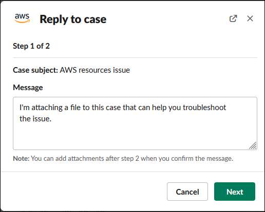
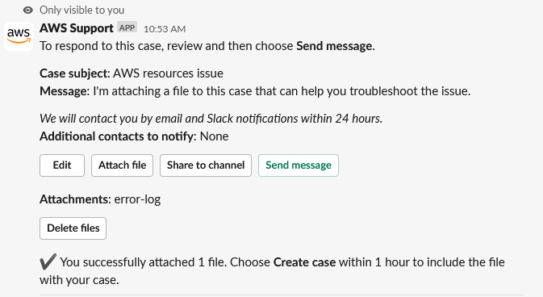

# Replying to support cases in

Slack

You can add updates to your case such as case details and attachments, and reply to responses
from the support agent.

###### Note

- You can also use the AWS Support Center Console to reply to support agents. For more
  information, see [Legacy experience: Updating, resolving, and reopening your case](monitoring-your-case.md "monitoring-your-case.md").
- You cannot add correspondences to cases from chat channels created by the AWS Support App.
  Live chat channels only send messages to agents during the live chat.

###### To reply to a support case in Slack

1. In your Slack channel, choose the case that you want to respond to. You can enter
   `/awssupport search` to find your support case.
2. Choose **See details** next to the case that you want.
3. At the bottom of the case details, choose **Reply**.

 4. In the **Reply to case** dialog box, enter a brief description of
the issue in the **Message** field. Then choose
**Next**.

 5. Choose your contact method. The available contact methods depend on your case type
and support plan. 6. (Optional) For **Additional contacts to notify**, enter
additional email addresses that you want to receive updates about this support case.
You can add up to 10 email addresses. 7. Choose **Review**. You can then choose if you want to edit your
reply, attach files, or share to the channel. 8. When you're ready to reply, choose **Send message**. 9. (Optional) To view previous correspondence for your case, choose
**Previous correspondence**. To view shortened messages, choose
**Show full message**.

###### Example: Reply to a case in Slack

