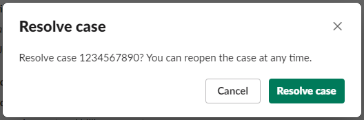

# Resolving a support case in Slack

If you don't need your support case anymore, or you fixed the issue, you can resolve a
support case directly in Slack. This also resolves the case in the AWS Support Center Console.
After you resolve a case, you can reopen the case later.

###### To resolve a support case in Slack

1. In your Slack channel, navigate to the support case. See [Searching for support cases in Slack](search-case.md "search-case.md").
2. Choose **See details** for the case.
3. Choose **Resolve case**.
4. In the **Resolve case** dialog box, choose **Resolve
   case**. You can reopen a case in the Slack channel or from the
   Support Center Console.

