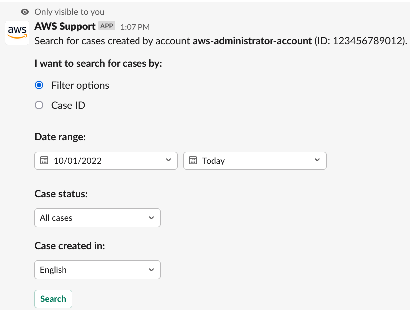
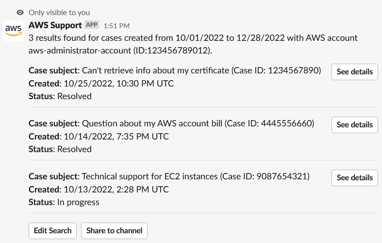
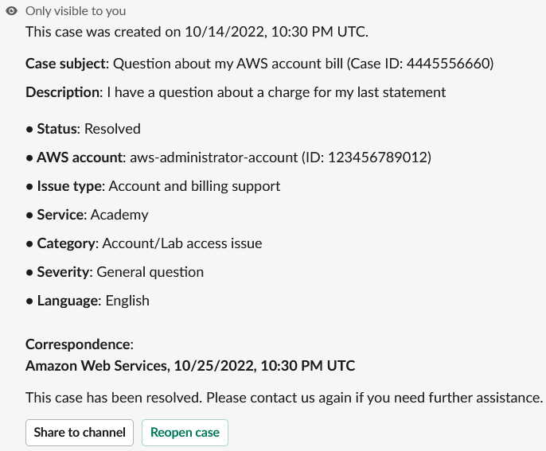

# Searching for support cases in Slack

From your Slack channel, you can search for support cases from your AWS account and from
other accounts that configured the same channel and workspace. For example, if your account
(123456789012) and your coworker's account (111122223333) have configured
the same workspace and channels in the AWS Support Center Console, you can use the AWS Support App to
search for each other's support cases.

To filter your search results, you can use the following options:

- Account ID
- Case ID
- Case status
- Contact language
- Date range

###### Example : Search for cases in Slack

The following example shows how to search by **Filter options** for a
single account by specifying the date range, case status, and contact language.

###### To search for a support case in Slack

1. In the Slack channel, enter the following command:

`/awssupport search` 2. For the **I want to search for cases by:** option, choose one of
the following:

    1. **Filter options** – You can filter cases with the
     following options:

    	* **AWS account** – This list only appears
    	 if you have multiple accounts in the channel.
    	* **Date range** – The date the case was
    	 created.
    	* **Case status** – The current case status,
    	 such as **All open cases** or
    	 **Resolved**.
    	* **Case created in** – The contact language
    	 for the case.
    2. **Case ID** – Enter the case ID. You can only
     enter one case ID at a time. If you have multiple accounts in the channel,
     choose the AWS account to search for the case.

3. Choose **Search**. Your search results appear in Slack.

## Use your search results

The following example returns three support cases from one AWS account.

After you receive your search results, you can do the following:

###### To use your search results

1. Choose **Edit Search** to change your previous filter options
   or case ID.
2. Choose **Share to channel** to share the search results with
   the channel.
3. Choose **See details** for more information about a case. You
   can choose **Show full message** to view the rest of the latest
   correspondence.
4. If you searched by **Filter options**, search results can
   return multiple cases. Choose **Next 5 results** or
   **Previous 5 results** to view the next or previous 5
   cases.

###### Example : Resolved support case

The following example shows a resolved support case for an account and billing
issue after choosing **See details**.

