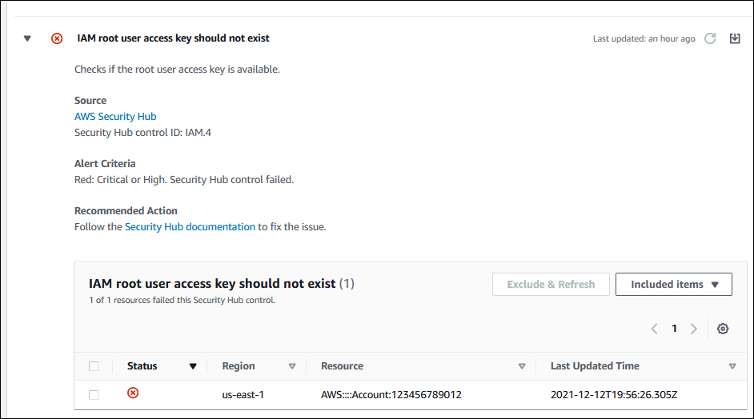

# Viewing AWS Security Hub controls in

AWS Trusted Advisor

After you enable AWS Security Hub for your AWS account, you can view your security controls and
their findings in the Trusted Advisor console. You can use Security Hub controls to identify security
vulnerabilities in your account in the same way that you can use Trusted Advisor checks. You can
view the check's status, the list of affected resources, and then follow Security Hub
recommendations to address your security issues. You can use this feature to find security
recommendations from Trusted Advisor and Security Hub in one convenient location.

###### Notes

- From Trusted Advisor, you can view controls in the AWS Foundational Security Best
  Practices security standard _except_ for controls that have
  the Category: Recover > Resilience. For a list of supported controls, see [AWS Foundational Security Best Practices controls](../../../securityhub/latest/userguide/securityhub-standards-fsbp-controls.md "../../../securityhub/latest/userguide/securityhub-standards-fsbp-controls.md") in the
  _AWS Security Hub User Guide_.

For more information about the Security Hub categories, see [Control categories](../../../securityhub/latest/userguide/control-categories.md "../../../securityhub/latest/userguide/control-categories.md").

- Trusted Advisor onboarded Security Hub controls up to September 26, 2024. Controls released after September 26, 2024 are not yet onboarded to Trusted Advisor. You can find controls released after that date in the [Security Hub log](../../../securityhub/latest/userguide/doc-history.md "../../../securityhub/latest/userguide/doc-history.md").

###### Topics

- [Prerequisites](#prerequisites-security-hub "#prerequisites-security-hub")
- [View your Security Hub
  findings](#security-controls-trusted-advisor-console "#security-controls-trusted-advisor-console")
- [Refresh your Security Hub findings](#refreshing-security-hub-findings "#refreshing-security-hub-findings")
- [Disable Security Hub from Trusted Advisor](#disable-security-hub "#disable-security-hub")
- [Troubleshooting](#troubleshooting-security-hub-integration "#troubleshooting-security-hub-integration")

## Prerequisites

You must meet the following requirements to enable the Security Hub integration with
Trusted Advisor:

- You must have a Business, Enterprise On-Ramp, or Enterprise Support plan for this feature. You can find your
  support plan from the [AWS Support
  Center](https://console.aws.amazon.com/support "https://console.aws.amazon.com/support") or from the [Support
  plans](https://console.aws.amazon.com/support/plans "https://console.aws.amazon.com/support/plans") page. For more information, see [Compare AWS Support plans](https://aws.amazon.com/premiumsupport/plans/ "https://aws.amazon.com/premiumsupport/plans/").
- You must enable resource recording in AWS Config for the AWS Regions that you
  want for your Security Hub controls. For more information, see [Enabling and configuring AWS Config](../../../securityhub/latest/userguide/securityhub-prereq-config.md "../../../securityhub/latest/userguide/securityhub-prereq-config.md").
- You must enable Security Hub and select the **AWS Foundational Security
  Best Practices v1.0.0** security standard. If you haven't done so
  already, see [Setting up
  AWS Security Hub](../../../securityhub/latest/userguide/securityhub-settingup.md "../../../securityhub/latest/userguide/securityhub-settingup.md") in the _AWS Security Hub User Guide_.

###### Note

If you already completed these prerequisites, you can skip to [View your Security Hub
findings](#security-controls-trusted-advisor-console "#security-controls-trusted-advisor-console").

### About AWS Organizations

accounts

If you already completed the prerequisites for a management account, this
integration is enabled automatically for all member accounts in your organization.
Individual member accounts don't need to contact Support to enable this feature.
However, member accounts in your organization must enable Security Hub if they want to see
their findings in Trusted Advisor.

If you want to disable this integration for a specific member account, see [Disable this feature for
AWS Organizations accounts](#disabling-security-hub-for-organizations "#disabling-security-hub-for-organizations").

## View your Security Hub

findings

After you enable Security Hub for your account, it can take up to 24 hours for your Security Hub
findings to appear in the **Security** page of the Trusted Advisor
console.

###### To view your Security Hub findings in Trusted Advisor

1. Navigate to the [Trusted Advisor
   console](https://console.aws.amazon.com/trustedadvisor "https://console.aws.amazon.com/trustedadvisor"), and then choose the **Security**
   category.
2. In the **Search by keyword** field, enter the control name or
   description in the field.

###### Tip

For **Source**, you can choose
**AWS Security Hub** to filter for Security Hub controls. 3. Choose the Security Hub control name to view the following information:

    * **Description** – Describes how this control
     checks your account for security vulnerabilities.
    * **Source** – Whether the check comes from
     AWS Trusted Advisor or AWS Security Hub. For Security Hub controls, you can find the control
     ID.
    * **Alert Criteria** – The status of the
     control. For example, if Security Hub detects an important issue, the status
     might be **Red: Critical or High**.
    * **Recommended Action** – Use the Security Hub
     documentation link to find the recommended steps to fix the
     issue.
    * **Security Hub resources** – You can find the
     resources in your account where Security Hub has detected an issue.

###### Notes

- You must use Security Hub to exclude resources from your findings. Currently, you
  can't use the Trusted Advisor console to exclude items from Security Hub controls. For
  more information, see [Setting the workflow status for
  findings](../../../securityhub/latest/userguide/finding-workflow-status.md "../../../securityhub/latest/userguide/finding-workflow-status.md").
- The organizational view feature supports this integration with Security Hub. You can view
  your findings for your Security Hub controls across your organization, and then
  create and download reports. For more information, see [Organizational view for AWS Trusted Advisor](organizational-view.md "organizational-view.md").

###### Example : Security Hub control for IAM user access key should not exist

The following is an example finding for a Security Hub control in the Trusted Advisor
console.

## Refresh your Security Hub findings

After you enable a security standard, it can take up to two hours for Security Hub to have
findings for your resources. It can then take up to 24 hours for that data to appear in
the Trusted Advisor console. If you recently enabled the **AWS Foundational Security
Best Practices v1.0.0** security standard, check the Trusted Advisor console again
later.

###### Note

- The refresh schedule for each Security Hub control is _periodic_ or _change
  triggered_. Currently, you can't use the Trusted Advisor console or
  the AWS Support API to refresh your Security Hub controls. For more information, see
  [Schedule for running security checks](../../../securityhub/latest/userguide/securityhub-standards-schedule.md "../../../securityhub/latest/userguide/securityhub-standards-schedule.md").
- You must use Security Hub if you want to exclude resources from your findings.
  Currently, you can't use the Trusted Advisor console to exclude items from Security Hub
  controls. For more information, see [Setting the workflow status for
  findings](../../../securityhub/latest/userguide/finding-workflow-status.md "../../../securityhub/latest/userguide/finding-workflow-status.md").

## Disable Security Hub from Trusted Advisor

Follow this procedure if you don't want your Security Hub information to appear in the
Trusted Advisor console. This procedure only disables the Security Hub integration with Trusted Advisor. It
won't affect your configurations with Security Hub. You can continue to use the Security Hub console
to view your security controls, resources, and recommendations.

###### To disable the Security Hub integration

1. Contact [AWS Support](https://console.aws.amazon.com/support "https://console.aws.amazon.com/support") and request to
   disable the Security Hub integration with Trusted Advisor.

After AWS Support disables this feature, Security Hub no longer sends data to Trusted Advisor.
Your
Security Hub data will be removed from Trusted Advisor. 2. If you want to enable this integration again, contact [AWS Support](https://console.aws.amazon.com/support "https://console.aws.amazon.com/support").

### Disable this feature for

AWS Organizations accounts

If you already completed the previous procedure for a management account, Security Hub
integration is automatically removed from all member accounts in your organization.
Individual member accounts in your organization don't need to contact AWS Support
separately.

If you're a member account in an organization, you can contact Support to remove
this feature from only your account.

## Troubleshooting

If you're having issues with this integration, see the following troubleshooting
information.

###### Contents

- [I don't see Security Hub findings in
  the Trusted Advisor console](security-hub-controls-with-trusted-advisor.md#security-hub-findings-not-appearing "security-hub-controls-with-trusted-advisor.md#security-hub-findings-not-appearing")
- [I configured Security Hub and
  AWS Config correctly, but my findings are still missing](security-hub-controls-with-trusted-advisor.md#findings-still-not-appearing-after-enabling "security-hub-controls-with-trusted-advisor.md#findings-still-not-appearing-after-enabling")
- [I want to disable specific Security Hub
  controls](security-hub-controls-with-trusted-advisor.md#missing-findings-for-some-checks "security-hub-controls-with-trusted-advisor.md#missing-findings-for-some-checks")
- [I want to find my excluded
  Security Hub resources](security-hub-controls-with-trusted-advisor.md#finding-excluded-security-hub-findings "security-hub-controls-with-trusted-advisor.md#finding-excluded-security-hub-findings")
- [I want to enable or disable this
  feature for a member account that belongs to an AWS organization](security-hub-controls-with-trusted-advisor.md#troubleshooting-organizations "security-hub-controls-with-trusted-advisor.md#troubleshooting-organizations")
- [I see multiple AWS Regions for
  the same affected resource for a Security Hub check](security-hub-controls-with-trusted-advisor.md#multiple-regions-check-results "security-hub-controls-with-trusted-advisor.md#multiple-regions-check-results")
- [I turned off Security Hub or AWS Config in a
  Region](security-hub-controls-with-trusted-advisor.md#disable-security-hub-regions "security-hub-controls-with-trusted-advisor.md#disable-security-hub-regions")
- [My control is
  archived in Security Hub, but I still see the findings in Trusted Advisor](security-hub-controls-with-trusted-advisor.md#archived-resource-still-appears-trusted-advisor "security-hub-controls-with-trusted-advisor.md#archived-resource-still-appears-trusted-advisor")
- [I still can't view my Security Hub
  findings](security-hub-controls-with-trusted-advisor.md#security-hub-contact-support "security-hub-controls-with-trusted-advisor.md#security-hub-contact-support")

### I don't see Security Hub findings in

the Trusted Advisor console

Verify that you completed the following steps:

- You have a Business, Enterprise On-Ramp, or Enterprise Support plan.
- You enabled resource recording in AWS Config within the same Region as
  Security Hub.
- You enabled Security Hub and selected the **AWS Foundational Security
  Best Practices v1.0.0** security standard.
- New controls from Security Hub are added as checks in Trusted Advisor within two to four
  weeks. See the [note](#best-effort-basis "#best-effort-basis").

For more information, see the [Prerequisites](#prerequisites-security-hub "#prerequisites-security-hub").

### I configured Security Hub and

AWS Config correctly, but my findings are still missing

It can take up to two hours for Security Hub to have findings for your resources. It can
then take up to 24 hours for that data to appear in the Trusted Advisor console. Check the
Trusted Advisor console again later.

###### Notes

- Only your findings for controls in the AWS Foundational Security
  Best Practices security standard will appear in Trusted Advisor
  _except_ for controls that have the
  **Category: Recover > Resilience**.
- If there's a service issue with Security Hub or Security Hub isn't available, it can
  take up to 24 hours for your findings to appear in Trusted Advisor. Check the
  Trusted Advisor console again later.

### I want to disable specific Security Hub

controls

Security Hub sends your data to Trusted Advisor automatically. If you disable a Security Hub control or
no longer have resources for that control, your findings won't appear in
Trusted Advisor.

You can sign in to the [Security Hub
console](https://console.aws.amazon.com/securityhub "https://console.aws.amazon.com/securityhub") and verify if your control is enabled or disabled.

If you disable a Security Hub control or disable all controls for the AWS Foundational
Security Best Practices security standard,
your findings are archived within the next five days. This
five-day period to archive is approximate and best effort only, and isn't
guaranteed. When your findings are archived, they are removed from Trusted Advisor.

For more information, see the following topics:

- [Disabling and enabling individual
  controls](../../../securityhub/latest/userguide/securityhub-standards-enable-disable-controls.md "../../../securityhub/latest/userguide/securityhub-standards-enable-disable-controls.md")
- [Disabling or enabling a security standard](../../../securityhub/latest/userguide/securityhub-standards-enable-disable.md "../../../securityhub/latest/userguide/securityhub-standards-enable-disable.md")

### I want to find my excluded

Security Hub resources

From the Trusted Advisor console, you can choose your Security Hub control name, and then choose
the **Excluded items** option. This option displays all resources
that are suppressed in Security Hub.

If the workflow status for a resource is set to `SUPPRESSED`, then that
resource is an excluded item in Trusted Advisor. You can't suppress Security Hub resources from
the Trusted Advisor console. To do so, use the [Security Hub console](https://console.aws.amazon.com/securityhub "https://console.aws.amazon.com/securityhub"). For more information, see [Setting the workflow status for findings](../../../securityhub/latest/userguide/finding-workflow-status.md "../../../securityhub/latest/userguide/finding-workflow-status.md").

### I want to enable or disable this

feature for a member account that belongs to an AWS organization

By default, member accounts inherit the feature from the management account for
AWS Organizations. If the management account has enabled the feature, then all accounts in the
organization will also have the feature. If you have a member account and want to
make specific changes for your account, you must contact [AWS Support](https://console.aws.amazon.com/support "https://console.aws.amazon.com/support").

### I see multiple AWS Regions for

the same affected resource for a Security Hub check

Some AWS services are global and aren't specific to a Region, such as IAM and
Amazon CloudFront. By default, global resources such as Amazon S3 buckets appear in the
US East (N. Virginia) Region.

For Security Hub checks that evaluate resources for global services, you might see more
than one item for affected resources. For example, if the `Hardware MFA should
 be enabled for the root user` check identifies that your account hasn't
activated this feature, then you will see multiple Regions in the table for the same
resource.

You can configure Security Hub and AWS Config so that multiple Regions won't appear for the
same resource. For more information, see [AWS Foundational Best Practices controls that you might
want to disable](../../../securityhub/latest/userguide/securityhub-standards-fsbp-to-disable.md "../../../securityhub/latest/userguide/securityhub-standards-fsbp-to-disable.md").

### I turned off Security Hub or AWS Config in a

Region

If you stop resource recording with AWS Config or disable Security Hub in an AWS Region,
Trusted Advisor no longer receives data for any controls in that Region. Trusted Advisor removes
your Security Hub findings within 7-9 days. This time frame is best effort and isn't
guaranteed. For more information, see [Disabling
Security Hub](../../../securityhub/latest/userguide/securityhub-disable.md "../../../securityhub/latest/userguide/securityhub-disable.md").

To disable this feature for your account, see [Disable Security Hub from Trusted Advisor](#disable-security-hub "#disable-security-hub").

### My control is

archived in Security Hub, but I still see the findings in Trusted Advisor

When the `RecordState` status changes to `ARCHIVED` for a
finding, Trusted Advisor deletes the finding for that Security Hub control from your account. You
might still see the finding in Trusted Advisor for up to 7-9 days before it's deleted.
This time frame is best effort and isn't guaranteed.

### I still can't view my Security Hub

findings

If you still have issues with this feature, you can create a technical support
case in the [AWS Support
Center](https://console.aws.amazon.com/support/home "https://console.aws.amazon.com/support/home").
