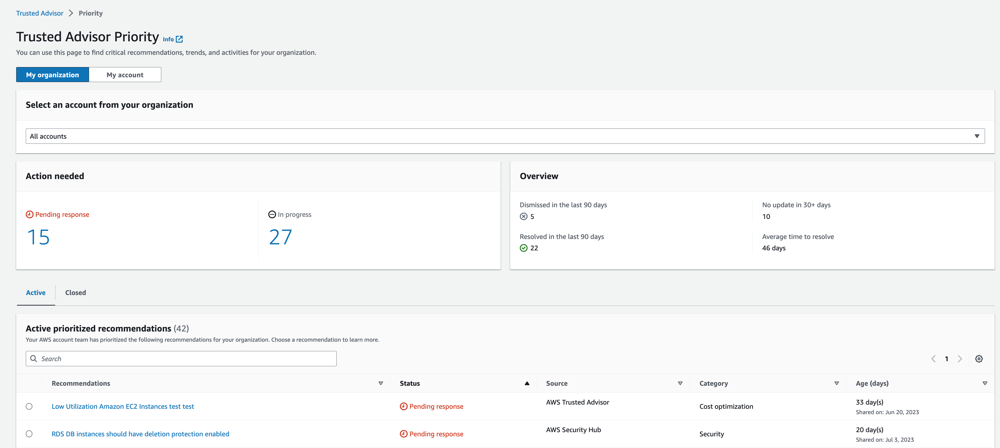
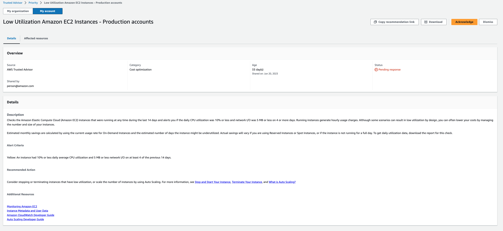
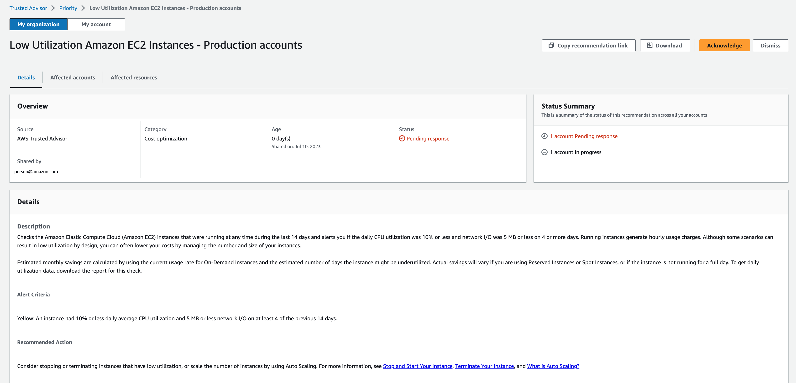
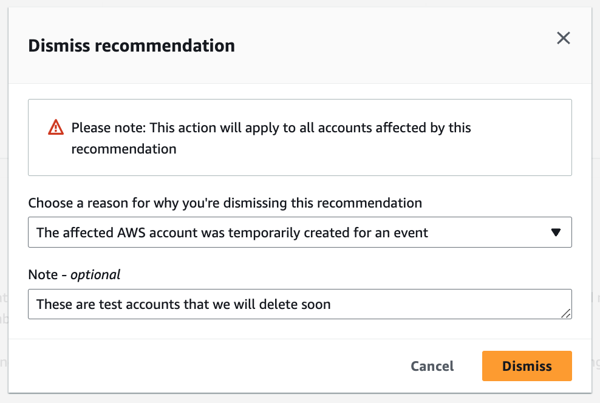
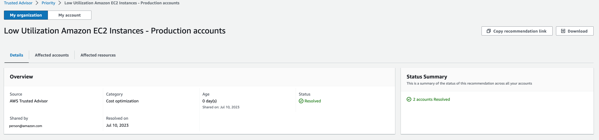
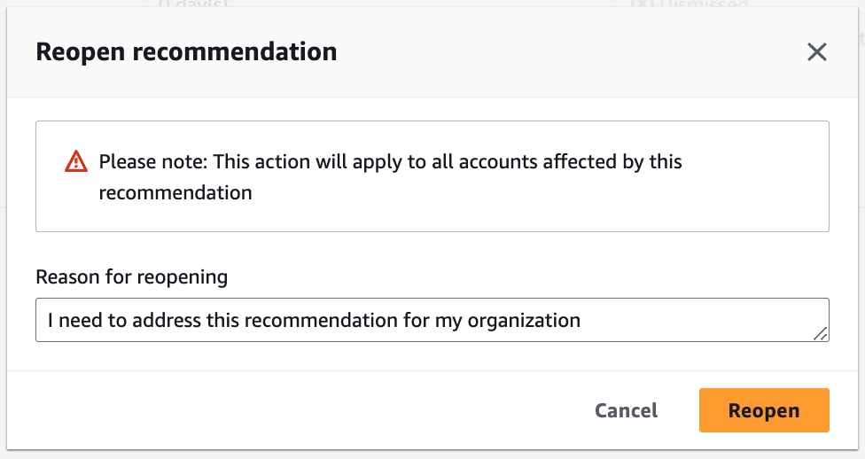

# Get started with AWS Trusted Advisor Priority

Trusted Advisor Priority helps you secure and optimize your AWS account to follow AWS best
practices. With Trusted Advisor Priority, your AWS account team can proactively monitor your account
and create prioritized recommendations when they identify opportunities for you.

For example, your account team can identify if your AWS account root user lacks multi-factor
authentication (MFA). Your account team can create a recommendation so that you can take
immediate action on a check, such as `MFA on Root Account`. The recommendation
appears as an active **prioritized recommendation** on the Trusted Advisor Priority
page of the Trusted Advisor console. You then follow the recommendations to resolve it.

Trusted Advisor Priority recommendations come from these two sources:

- AWS services – Services such as Trusted Advisor, AWS Security Hub, and AWS
  Well-Architected automatically create recommendations. Your account team shares
  these recommendations with you so that those recommendations appear in Trusted Advisor Priority.
- Your account team – Your account team can create manual
  recommendations.
  Trusted Advisor Priority helps you focus on the most important recommendations. You and your account
  team can monitor the recommendation lifecycle, from the point when your account team shared
  the recommendation, up to the point when you acknowledge, resolve, or dismiss it. You can
  use Trusted Advisor Priority to find recommendations for all member accounts in your
  organization.

###### Topics

- [Prerequisites](#prerequisites-trusted-advisor-priority "#prerequisites-trusted-advisor-priority")
- [Enable Trusted Advisor Priority](#enable-trusted-advisor-priority "#enable-trusted-advisor-priority")
- [View prioritized
  recommendations](#viewing-priority-recommendations "#viewing-priority-recommendations")
- [Acknowledge a recommendation](#acknowledge-recommendation "#acknowledge-recommendation")
- [Dismiss a recommendation](#dismiss-recommendation "#dismiss-recommendation")
- [Resolve a recommendation](#resolving-recommendations "#resolving-recommendations")
- [Reopen a recommendation](#reopen-recommendations "#reopen-recommendations")
- [Download recommendation details](#download-risk-details "#download-risk-details")
- [Register delegated
  administrators](#register-delegated-administrators "#register-delegated-administrators")
- [Deregister delegated
  administrators](#deregister-delegated-administrators "#deregister-delegated-administrators")
- [Manage Trusted Advisor Priority
  notifications](#trusted-advisor-priority-notifications "#trusted-advisor-priority-notifications")
- [Disable Trusted Advisor Priority](#disable-trusted-advisor-priority "#disable-trusted-advisor-priority")

## Prerequisites

You must meet the following requirements to use Trusted Advisor Priority:

- You must have an AWS Unified Operations plan.
- Your account must be part of an organization that has enabled all features in AWS Organizations.
  For more information, see [Enabling all features in your organization](../../../organizations/latest/userguide/orgs_manage_org_support-all-features.md "../../../organizations/latest/userguide/orgs_manage_org_support-all-features.md") in the
  _AWS Organizations User Guide_.
- Your organization must have enabled trusted access to Trusted Advisor. To enable trusted
  access, log in as the management account. Open the
  [Your organization](get-started-with-aws-trusted-advisor.md#preferences-trusted-advisor-console "get-started-with-aws-trusted-advisor.md#preferences-trusted-advisor-console") page in
  the Trusted Advisor console.
- You must be signed in to your AWS account to view Trusted Advisor Priority recommendations for your account.
- You must be signed in to the organization's management account or a delegated
  administrator account to view aggregated recommendations across your organization. For instructions on how to register delegated administrator
  accounts, see [Register delegated
  administrators](#register-delegated-administrators "#register-delegated-administrators").
- You must have AWS Identity and Access Management (IAM) permissions to access Trusted Advisor Priority. For
  information on how to control access to Trusted Advisor Priority, see [Manage access to AWS Trusted Advisor](security-trusted-advisor.md "security-trusted-advisor.md") and [AWS managed policies for
  AWS Trusted Advisor](aws-managed-policies-for-trusted-advisor.md "aws-managed-policies-for-trusted-advisor.md").

## Enable Trusted Advisor Priority

Ask your account team to enable this feature for you. You must have
an AWS Unified Operations plan and be the management account owner for your organization. If
the Trusted Advisor Priority page in the console says that you need trusted access with AWS Organizations,
then choose **Enable trusted access with AWS Organizations**. For more
information, see the [Prerequisites](#prerequisites-trusted-advisor-priority "#prerequisites-trusted-advisor-priority") section.

## View prioritized

recommendations

After your account team enables Trusted Advisor Priority for you, you can view the latest
recommendations for your AWS account.

###### To view your prioritized recommendations

1. Sign in to the Trusted Advisor console at [https://console.aws.amazon.com/trustedadvisor/home](https://console.aws.amazon.com/trustedadvisor/home "https://console.aws.amazon.com/trustedadvisor/home").
2. On the **Trusted Advisor Priority** page, you can view the
   following items:

If you're using an AWS Organizations Management or Delegated Administrator account, then switch to the **My Account** tab.

    * **Actions needed** – The number of
     recommendations that are pending a response or are in progress.
    * **Overview** – The following
     information:

    	+ Dismissed recommendations in the last 90 days
    	+ Resolved recommendations in the last 90 days
    	+ Recommendations without an update in over 30 days
    	+ Average time to resolve recommendations

3. On the **Active** tab, the **Active prioritized
   recommendations** show recommendations that your account team
   prioritized for you. The **Closed** tab shows resolved or
   dismissed recommendations.
   1. To filter your results, use the following options:
      - **Recommendation** – Enter keywords to
        search by name. This can be a check name, or a custom name that
        your account team created.
      - **Status** – Whether the
        recommendation is pending a response, in progress, dismissed, or
        resolved.
      - **Source** – The origin of a
        prioritized recommendation. The recommendation can come from
        AWS services, your AWS account team, or a planned service
        event.
      - **Category** – The recommendation
        category, such as security or cost optimization.
      - **Age** – When your account team
        shared the recommendation with you.

4. Choose a recommendation to learn more about its details, the affected resources, and the recommended actions.
   You can then [acknowledge](#acknowledge-recommendation "#acknowledge-recommendation") or
   [dismiss](#dismiss-recommendation "#dismiss-recommendation") the
   recommendation.

###### To view prioritized recommendations across all accounts in your AWS organization

Both the management account and the Trusted Advisor Priority delegated administrators can view recommendations aggregated across your organization.

###### Note

Member accounts don't have access to aggregated recommendations.

1. Sign in to the Trusted Advisor console at [https://console.aws.amazon.com/trustedadvisor/home](https://console.aws.amazon.com/trustedadvisor/home "https://console.aws.amazon.com/trustedadvisor/home").
2. On the **Trusted Advisor Priority** page, make sure that you're on the **My Organization** tab.
3. To view recommendations for one account, select an account from the **Select an account from your organization** dropdown list. Or, you can view recommendations across all your accounts.

On the **My Organization** tab, you can view the following items:

    * **Actions needed:** The number of recommendations across your organization that are pending a response or are in progress.
    * **Overview:** Shows the following items:

    - Dismissed recommendations in the last 90 days.

    - Resolved recommendations in the last 90 days.

    - Recommendations without an update in over 30 days.

    - The average time taken to resolve recommendations.

4. Under the **Active** tab, the **Active prioritized
   recommendations** section shows recommendations that your account team
   prioritized for you. The **Closed** tab shows resolved or
   dismissed recommendations.

To filter your results, use the following options:

    * **Recommendation** – Enter keywords to
     search by name. This can be either a check name, or a custom name that
     your account team created.
    * **Status** – Whether the
     recommendation is pending a response, in progress, dismissed, or
     resolved.
    * **Source** – The origin of a
     prioritized recommendation. The recommendation can come from
     AWS services, your AWS account team, or a planned service
     event.
    * **Category** – The recommendation
     category, such as security or cost optimization.
    * **Age** – When your account team
     shared the recommendation with you.

5. Choose a recommendation to see additional details, affected accounts and resources, and the recommended actions. You can then [acknowledge](#acknowledge-recommendation "#acknowledge-recommendation") or
   [dismiss](#dismiss-recommendation "#dismiss-recommendation") the
   recommendation.

###### Example : Trusted Advisor Priority recommendations

The following example shows 15 recommendations that are pending a response and
27 recommendations that are in progress under the **Action
needed** section. The following image shows two of the
recommendations that are pending response in the **Active prioritized
recommendation** tab.

## Acknowledge a recommendation

Under the **Active** tab, you can learn more about the
recommendation and then decide if you want to acknowledge it.

###### To acknowledge a recommendation

1. Sign in to the Trusted Advisor console at [https://console.aws.amazon.com/trustedadvisor/home](https://console.aws.amazon.com/trustedadvisor/home "https://console.aws.amazon.com/trustedadvisor/home").
2. If you're using an AWS Organizations Management or Delegated Administrator account, then switch to the **My Account** tab.
3. On the **Trusted Advisor Priority** page, under the
   **Active** tab, choose a recommendation name.
4. In the **Details** section, you can review the recommended actions to resolve the recommendation.
5. In the **Affected resources** section, you can review the affected resources and filter by _Status_.
6. Choose **Acknowledge**.
7. In the **Acknowledge recommendation** dialog box, choose
   **Acknowledge**.

The recommendation status changes to **In progress**.
Recommendations in progress or pending a response appear in the
**Active** tab on the Trusted Advisor Priority page. 8. Follow the recommended actions to resolve the recommendation. For more
information, see [Resolve a recommendation](#resolving-recommendations "#resolving-recommendations").

###### Example : Manual recommendation from Trusted Advisor Priority

The following image shows the **Low Utilization EC2 Instances** recommendation that is pending a response.

###### To acknowledge a recommendation for all accounts in your AWS organization

The management account or the Trusted Advisor delegated administrators can acknowledge a recommendation for all of the affected accounts.

###### Note

Member accounts don't have access to aggregated recommendations.

1. Sign in to the Trusted Advisor console at [https://console.aws.amazon.com/trustedadvisor/home](https://console.aws.amazon.com/trustedadvisor/home "https://console.aws.amazon.com/trustedadvisor/home").
2. On the **Trusted Advisor Priority** page, make sure that you're on the
   **My organization** tab.
3. In the **Active** tab, select a recommendation name.
4. Choose **Acknowledge**.
5. In the **Acknowledge recommendation** dialog box, choose **Acknowledge**.

The recommendation status changes to **In progress**. 6. Follow the recommended actions to resolve the recommendation. For more
information, see [Resolve a recommendation](#resolving-recommendations "#resolving-recommendations"). 7. To view the recommendation details, choose the recommendation name.

In the **Details** section, you can review the following information about the recommendation:

    * An **Overview** of the recommendation and a **Details** section covering the recommendation actions to complete.

    A **Status summary** that shows recommendations across all affected accounts.
    * In the **Affected accounts** section, you can review the affected resources across all your accounts. You can filter by **Account number** and **Status**.
    * In the **Affected resources** section, you can review the affected resources across all your accounts. You can filter by **Account number** and **Status**.

###### Example : Manual recommendation from Trusted Advisor Priority

The following image shows the **Low Utilization Amazon EC2 Instances** recommendation that's pending a response. One affected account has acknowledged the recommendation. Another account is pending a response, making the recommendation status **Pending response**.

## Dismiss a recommendation

You can also dismiss a recommendation. This means that you acknowledge the
recommendation, but you won't address it. You can dismiss a recommendation if it's not
relevant to your account. For example, if you have a test AWS account that you plan to
delete, you don't need to follow the recommended actions.

###### To dismiss a recommendation

1. Sign in to the Trusted Advisor console at [https://console.aws.amazon.com/trustedadvisor/home](https://console.aws.amazon.com/trustedadvisor/home "https://console.aws.amazon.com/trustedadvisor/home").
2. If you're using an AWS Organizations Management or Delegated Administrator account, then switch to the **My Account** tab.
3. On the **Trusted Advisor Priority** page, under the
   **Active** tab, choose a recommendation name.
4. On the recommendation detail page, review the information about the affected
   resources.
5. If this recommendation doesn't apply for your account, choose
   **Dismiss**.
6. In the **Dismiss recommendation** dialog box, select a reason
   why you won't address the recommendation.
7. (Optional) Enter a note detailing why you're dismissing the recommendation. If you
   choose **Other**, you must enter a description in the
   **Note** section.
8. Choose **Dismiss**. The recommendation status changes to
   **Dismissed** and appears in the
   **Closed** tab on the Trusted Advisor Priority page.

###### To dismiss a recommendation for all the accounts in your AWS organization

The management account or the delgated administrator of Trusted Advisor Priority can dismiss a recommendation for all of their accounts.

1. Sign in to the Trusted Advisor console at [https://console.aws.amazon.com/trustedadvisor/home](https://console.aws.amazon.com/trustedadvisor/home "https://console.aws.amazon.com/trustedadvisor/home").
2. On the Trusted Advisor Priority page, make sure that you're on the **My Organization** tab.
3. In the
   **Active** tab, select a recommendation name.
4. If this recommendation doesn't apply for your account, then choose
   **Dismiss**.
5. In the **Dismiss recommendation** dialog box, select a reason
   why you won't address the recommendation.
6. (Optional) Enter a note detailing why you're dismissing the recommendation. If you
   choose **Other**, then you must enter a description in the
   **Note** section.
7. Choose **Dismiss**. The recommendation status changes to
   **Dismissed**. The recommendation appears in the
   **Closed** tab on the Trusted Advisor Priority page.

###### Note

You can choose the recommendation name and choose **View
note** to find the reason for dismissal. If your account team
dismissed the recommendation for you, their email address appears next to
the note.

Trusted Advisor Priority also notifies your account team that you dismissed the
recommendation.

###### Example : Dismiss a recommendation from Trusted Advisor Priority

The following example shows how you can dismiss a recommendation.

## Resolve a recommendation

After you acknowledge the recommendation and complete the recommended actions, you can
resolve the recommendation.

###### Tip

After you resolve a recommendation, you can't reopen it. If you want to revisit
the recommendation again later, see [Dismiss a recommendation](#dismiss-recommendation "#dismiss-recommendation").

###### To resolve a recommendation

1. Sign in to the Trusted Advisor console at [https://console.aws.amazon.com/trustedadvisor/home](https://console.aws.amazon.com/trustedadvisor/home "https://console.aws.amazon.com/trustedadvisor/home").
2. On the Trusted Advisor Priority page, make sure that you're on the **My Organization** tab.
3. On the **Trusted Advisor Priority** page, select the recommendation, and
   then choose **Resolve**.
4. In the **Resolve recommendation** dialog box, choose
   **Resolve**. Resolved recommendations appear under the
   **Closed** tab on the Trusted Advisor Priority page. Trusted Advisor Priority
   notifies your account team that you resolved the recommendation.

###### To resolve a recommendation for all accounts in your AWS organization

The management account or the Trusted Advisor Priority delegated administrators can resolve a recommendation for all their accounts.

###### Note

Member accounts don't have access to aggregated recommendations.

1. Sign in to the Trusted Advisor console at [https://console.aws.amazon.com/trustedadvisor/home](https://console.aws.amazon.com/trustedadvisor/home "https://console.aws.amazon.com/trustedadvisor/home").
2. If you're using an AWS Organizations Management or Delegated Administrator account, switch to the **My Account** tab.
3. In the **Active** tab, select a recommendation name.
4. If the recommendation doesn't apply for your account,
   choose **Resolve**.
5. In the **Resolve recommendation** dialog box, choose
   **Resolve**. Resolved recommendations appear under the
   **Closed** tab on the Trusted Advisor Priority page. Trusted Advisor Priority
   notifies your account team that you resolved the recommendation.

###### Example : Manual recommendation from Trusted Advisor Priority

The following example shows a resolved **Low Utilization Amazon EC2 Instances** recommendation.

## Reopen a recommendation

After you dismiss a recommendation, you or your account team can reopen the
recommendation.

###### To reopen a recommendation

1. Sign in to the Trusted Advisor console at [https://console.aws.amazon.com/trustedadvisor/home](https://console.aws.amazon.com/trustedadvisor/home "https://console.aws.amazon.com/trustedadvisor/home").
2. If you're using an AWS Organizations Management or Delegated Administrator account, then switch to the **My Account** tab.
3. On the **Trusted Advisor Priority** page, choose the
   **Closed** tab.
4. Under **Closed recommendations**, select a recommendation
   that was **Dismissed**, and then choose
   **Reopen**.
5. In the **Reopen recommendation** dialog box, describe why
   you're reopening the recommendation.
6. Choose **Reopen**. The recommendation status changes to
   **In progress** and appears under the
   **Active** tab.

###### Tip

You can choose the recommendation name and then choose **View
note** to find the reason for reopening. If your account team
reopened the recommendation for you, their name appears next to the
note. 7. Follow the steps in the recommendation details.

###### To reopen a recommendation for all accounts in your AWS organization

The management account or the Trusted Advisor Priority delegated administrators can reopen a recommendation for all of their accounts.

###### Note

Member accounts don't have access to aggregated recommendations.

1. Sign in to the Trusted Advisor console at [https://console.aws.amazon.com/trustedadvisor/home](https://console.aws.amazon.com/trustedadvisor/home "https://console.aws.amazon.com/trustedadvisor/home").
2. On the Trusted Advisor Priority page, make sure that you're on the **My Organization** tab.
3. Under **Closed** recommendations, select a recommendation
   that was **Dismissed**, and then choose
   **Reopen**.
4. In the **Reopen recommendation** dialog box, describe why
   you're reopening the recommendation.
5. Choose **Reopen**. The recommendation status changes to
   **In progress** and appears under the
   **Active** tab.

###### Tip

You can choose the recommendation name and choose **View
note** to find the reason for reopening. If your account team
reopened the recommendation for you, their name appears next to the
note. 6. Follow the steps in the recommendation details.

###### Example : Reopen a recommendation from Trusted Advisor Priority

The following example shows a recommendation that you want to reopen.

## Download recommendation details

You can also download the results of a prioritized recommendation from
Trusted Advisor Priority.

###### Note

Currently, you can download only one recommendation at a time.

###### To download a recommendation

1. Sign in to the Trusted Advisor console at [https://console.aws.amazon.com/trustedadvisor/home](https://console.aws.amazon.com/trustedadvisor/home "https://console.aws.amazon.com/trustedadvisor/home").
2. On the **Trusted Advisor Priority** page, select the recommendation, and
   then choose **Download**.
3. Open the file to view the recommendation details.

## Register delegated

administrators

You can add member accounts that are part of your organization as delegated
administrators. Delegated administrator accounts can review, acknowledge, resolve,
dismiss, and reopen recommendations in Trusted Advisor Priority.

After you register an account, you must grant the delegated administrator the required
AWS Identity and Access Management permissions to access Trusted Advisor Priority. For more information, see [Manage access to AWS Trusted Advisor](security-trusted-advisor.md "security-trusted-advisor.md") and
[AWS managed policies for
AWS Trusted Advisor](aws-managed-policies-for-trusted-advisor.md "aws-managed-policies-for-trusted-advisor.md").

You can register up to five member accounts. Only the management account can add
delegated administrators for the organization. You must be signed in to the organization's management account to register or deregister a delegated administrator.

###### To register a delegated administrator

1. Sign in to the Trusted Advisor console at [https://console.aws.amazon.com/trustedadvisor/home](https://console.aws.amazon.com/trustedadvisor/home "https://console.aws.amazon.com/trustedadvisor/home") as the management account.
2. In the navigation pane, under **Preferences**, choose
   **Your organization**.
3. Under **Delegated administrator**, choose **Register
   new account**.
4. In the dialog box, enter the member account ID, and then choose
   **Register**.
5. (Optional) To deregister an account, select an account and choose
   **Deregister**. In the dialog box, choose
   **Deregister** again.

## Deregister delegated

administrators

When you deregister a member account, that account no longer has the same access to
Trusted Advisor Priority as the management account. Accounts that are no longer delegated
administrators won't receive email notifications from Trusted Advisor Priority.

###### To deregister a delegated administrator

1. Sign in to the Trusted Advisor console at [https://console.aws.amazon.com/trustedadvisor/home](https://console.aws.amazon.com/trustedadvisor/home "https://console.aws.amazon.com/trustedadvisor/home") as the management account.
2. In the navigation pane, under **Preferences**, choose
   **Your organization**.
3. Under **Delegated administrator**, select an account and
   then choose **Deregister**.
4. In the dialog box, choose **Deregister**.

## Manage Trusted Advisor Priority

notifications

Trusted Advisor Priority delivers notifications through email. This email notification includes a
summary of the recommendations that your account team prioritized for you. You can
specify the frequency that you receive updates from Trusted Advisor Priority.

If you registered member accounts as delegated administrators, they can also set up
their accounts to receive Trusted Advisor Priority email notifications.

Trusted Advisor Priority email notifications don't include check results for individual accounts
and are separate from the weekly notification for Trusted Advisor Recommendations. For more
information, see [Set up notification preferences](get-started-with-aws-trusted-advisor.md#notification-preferences "get-started-with-aws-trusted-advisor.md#notification-preferences").

###### Note

Only the management account or delegated administrator can set up Trusted Advisor Priority email notifications.

###### To manage your Trusted Advisor Priority notifications

1. Sign in to the Trusted Advisor console at [https://console.aws.amazon.com/trustedadvisor/home](https://console.aws.amazon.com/trustedadvisor/home "https://console.aws.amazon.com/trustedadvisor/home") as a management or delegated administrator account.
2. In the navigation pane, under **Preferences**, choose
   **Notifications**.
3. Under **Priority**, you can select the following
   options.
   1. **Daily** – Receive an email notification
      daily.
   2. **Weekly** – Receive an email notification
      once a week.
   3. Choose the notifications to receive:
      - Summary of prioritized recommendations
      - Resolution dates

4. For **Recipients**, select other contacts that you want to receive the
   email notifications. You can add and remove contacts from the [Account Settings](https://console.aws.amazon.com/billing/home#/account "https://console.aws.amazon.com/billing/home#/account") page in
   the AWS Billing and Cost Management console.
5. For **Language**, choose the language for the email
   notification.
6. Choose **Save your preferences**.

###### Note

Trusted Advisor Priority sends email notifications from the
noreply@notifications.trustedadvisor.us-west-2.amazonaws.com
address. You might need to verify that your email client doesn't identify these
emails as spam.

## Disable Trusted Advisor Priority

Contact your account team and ask that they disable this feature for you. After this feature is disabled, prioritized
recommendations no longer appear in your Trusted Advisor console.

If you disable Trusted Advisor Priority and then enable it again later, you can still view the
recommendations that your account team sent before you disabled Trusted Advisor Priority.
