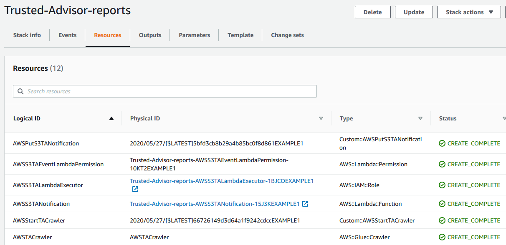
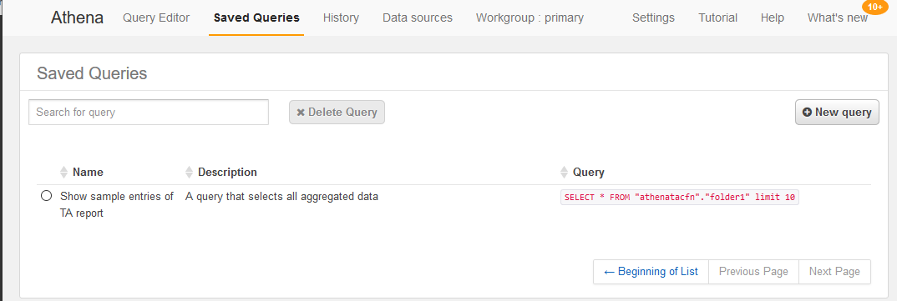
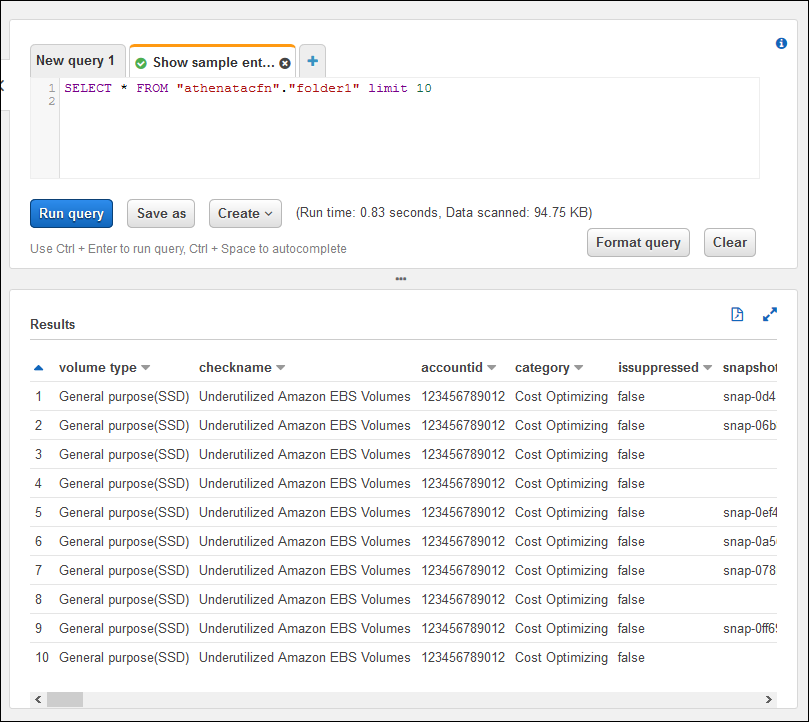
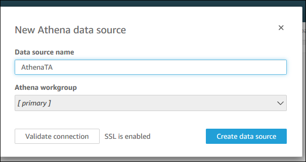
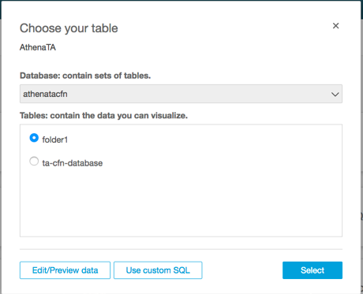
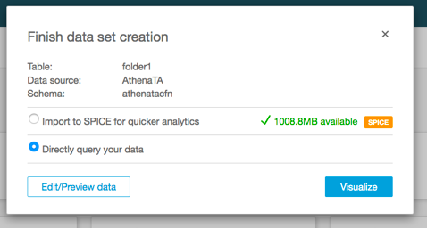
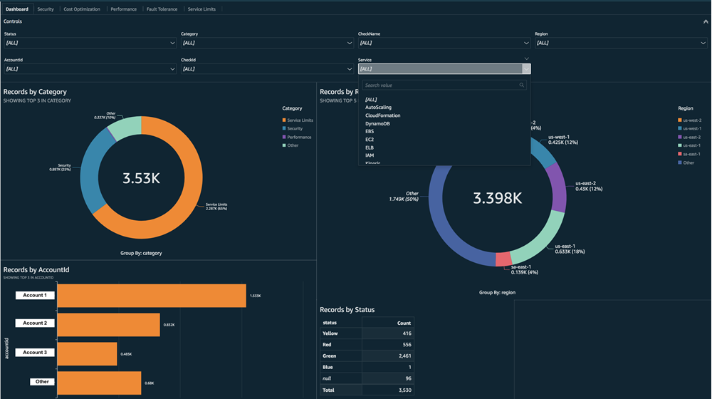

# Using other AWS

services to view Trusted Advisor reports

Follow this tutorial to upload and view your data by using other AWS services. In this
topic, you create an Amazon Simple Storage Service (Amazon S3) bucket to store your report and an CloudFormation template to
create resources in your account. Then, you can use Amazon Athena to analyze or run queries for
your report or Quick Suite to visualize that data in a dashboard.

For information and examples for visualizing your report data, see the [View
AWS Trusted Advisor recommendations at scale with AWS Organizations](https://aws.amazon.com/blogs/mt/organizational-view-for-trusted-advisor/ "https://aws.amazon.com/blogs/mt/organizational-view-for-trusted-advisor/") in the _AWS
Management & Governance Blog_.

## Prerequisites

Before you start this tutorial, you must meet the following requirements:

- Sign in as an AWS Identity and Access Management (IAM) user with administrator permissions.
- Use the US East (N. Virginia) AWS Region to quickly set up your AWS services
  and resources.
- Create an Quick Suite account. For more information, see [Getting Started with Data
  Analysis in Quick Suite](../../../quicksight/latest/user/getting-started.md "../../../quicksight/latest/user/getting-started.md") in the _Amazon Quick Suite User Guide_.

## Upload the report to Amazon S3

After you download your `resources.json` report, upload the file to
Amazon S3. You must use a bucket in the US East (N. Virginia) Region.

###### To upload the report to an Amazon S3 bucket

1. Sign in to the AWS Management Console at [https://console.aws.amazon.com/](https://console.aws.amazon.com/ "https://console.aws.amazon.com/").
2. Use the **Region selector** and choose the US East (N. Virginia)
   Region.
3. Open the Amazon S3 console at
   [https://console.aws.amazon.com/s3/](https://console.aws.amazon.com/s3/ "https://console.aws.amazon.com/s3/").
4. From the list of buckets, choose an S3 bucket, and then copy the name. You use the
   name in the next procedure.
5. On the `bucket-name` page, choose **Create
   folder**, enter the name `folder1`, and then
   choose **Save**.
6. Choose the **folder1**.
7. In **folder1**, choose **Upload** and choose the
   `resources.json` file.
8. Choose **Next**, keep the default options, and then choose
   **Upload**.

###### Note

If you upload a new report to this bucket, rename the
`.json` files each time you upload them so that you don't
override the existing reports. For example, you can add the timestamp to each
file, such as `resources-timestamp.json`,
`resources-timestamp2.json`, and so on.

## Create your resources using

AWS CloudFormation

After you upload your report to Amazon S3, upload the following YAML template to CloudFormation.
This template tells CloudFormation what resources to create for your account so that other
services can use the report data in the S3 bucket. The template creates resources for
IAM, AWS Lambda, and AWS Glue.

###### To create your resources with CloudFormation

1. Download the [trusted-advisor-reports-template.zip](samples/trusted-advisor-reports-template.md "samples/trusted-advisor-reports-template.md") file.
2. Unzip the file.
3. Open the template file in a text editor.
4. For the `BucketName` and `FolderName` parameters,
   replace the values for
   `your-bucket-name-here` and
   `folder1` with the bucket name and
   folder name in your account.
5. Save the file.
6. Open the CloudFormation console at
   [https://console.aws.amazon.com/cloudformation](https://console.aws.amazon.com/cloudformation/ "https://console.aws.amazon.com/cloudformation/").
7. If you haven't already, in the **Region selector**, choose
   the US East (N. Virginia) Region.
8. In the navigation pane, choose **Stacks**.
9. Choose **Create stack** and choose **With new
   resources (standard)**.
10. On the **Create stack** page, under **Specify
    template**, choose **Upload a template file**, and
    then choose **Choose file**.
11. Choose the YAML file and choose **Next**.
12. On the **Specify stack details** page, enter a stack name
    such as `Organizational-view-Trusted-Advisor-reports`, and
    choose **Next**.
13. On the **Configure stack options** page, keep the default
    options, and then choose **Next**.
14. On the **Review
    `Organizational-view-Trusted-Advisor-reports`** page, review your options. At the bottom of the page, select the
    check box for **I acknowledge that CloudFormation might create IAM
    resources**.
15. Choose **Create stack**.

The stack takes about 5 minutes to create. 16. After the stack creates successfully, the **Resources** tab
appears like the following example.



## Query the data in Amazon Athena

After you have your resources, you can view the data in Athena. Use Athena to create
queries and analyze the results of the report, such as looking up specific check results
for accounts in the organization.

###### Notes

- Use the US East (N. Virginia) Region.
- If you're new to Athena, you must specify a query result location before
  you can run a query for your report. We recommend that you specify a
  different S3 bucket for this location. For more information, see [Specifying a query result location](../../../athena/latest/ug/querying.md#query-results-specify-location "../../../athena/latest/ug/querying.md#query-results-specify-location") in the
  _Amazon Athena User Guide_.

###### To query the data in Athena

1. Open the Athena console at
   [https://console.aws.amazon.com/athena/](https://console.aws.amazon.com/athena/home "https://console.aws.amazon.com/athena/home").
2. If you haven't already, in the **Region selector**, choose
   the US East (N. Virginia) Region.
3. Choose **Saved Queries** and in search field, enter
   `Show sample`.
4. Choose the query that appears, such as **Show sample entries of TA
   report**.



The query should look like the following.

```
SELECT * FROM "athenatacfn"."folder1" limit 10
```

5. Choose **Run query**. Your query results appear.

###### Example: Athena query

The following example shows 10 sample entries from the report.


For more information, see [Running
SQL Queries Using Amazon Athena](../../../athena/latest/ug/querying-athena-tables.md "../../../athena/latest/ug/querying-athena-tables.md") in the
_Amazon Athena User Guide_.

## Create a dashboard in Quick Suite

You can also set up Quick Suite so that you can view your data in a dashboard and visualize
your report information.

###### Note

You must use the US East (N. Virginia) Region.

###### To create a dashboard in Quick Suite

1. Navigate to the Quick Suite console and sign in to your [account](https://us-east-1.quicksight.aws.amazon.com "https://us-east-1.quicksight.aws.amazon.com").
2. Choose **New analysis**, **New dataset**,
   and then choose **Athena**.
3. In the **New Athena data source** dialog box, enter a data
   source name such as **AthenaTA**, and then choose
   **Create data source**.

 4. In the **Choose your table** dialog box, choose the
**athenatacfn** table, choose **folder1**,
and then choose **Select**.

 5. In the **Finish data set creation** dialog box, choose
**Directly query your data**, and then choose
**Visualize**.



You can now create a dashboard in Quick Suite. For more information, see [Working with Dashboards](../../../quicksight/latest/user/working-with-dashboards.md "../../../quicksight/latest/user/working-with-dashboards.md") in the _Amazon Quick Suite User Guide_.

###### Example: Quick Suite dashboard

The following example dashboard shows information about the Trusted Advisor checks, such
as the following:

- Affected account IDs
- Summary by AWS Regions
- Check categories
- Check statuses
- Number of entries in the report for each account



###### Note

If you have permission errors while creating your dashboard, make sure that Quick Suite can
use Athena. For more information, see [I Can't Connect to
Amazon Athena](../../../quicksight/latest/user/troubleshoot-connect-athena.md "../../../quicksight/latest/user/troubleshoot-connect-athena.md") in the _Amazon Quick Suite User Guide_.

For more information and examples for visualizing your report data, see the [View
AWS Trusted Advisor recommendations at scale with AWS Organizations](https://aws.amazon.com/blogs/mt/organizational-view-for-trusted-advisor/ "https://aws.amazon.com/blogs/mt/organizational-view-for-trusted-advisor/") in the _AWS
Management & Governance Blog_.

## Troubleshooting

If you have issues with this tutorial, see the following troubleshooting tips.

### I'm not seeing the latest data in my

report

When you create a report, the organizational view feature doesn't automatically
refresh the Trusted Advisor checks in your organization. To get the latest check results,
refresh the checks for the management account and each member account in the
organization. For more information, see [Refresh Trusted Advisor checks](organizational-view.md#refresh-trusted-advisor-checks "organizational-view.md#refresh-trusted-advisor-checks").

### I have duplicate columns in the

report

The Athena console might show the following error in your table if your report has
duplicate columns.

`HIVE_INVALID_METADATA: Hive metadata for table
 `folder1` is invalid: Table descriptor contains
 duplicate columns`

For example, if you added a column in your report that already exists, this can
cause issues when you try to view the report data in the Athena console. You can
follow these steps to fix this issue.

#### Find duplicate columns

You can use the AWS Glue console to view the schema and quickly identify if you
have duplicate columns in your report.

###### To find duplicate columns

1. Open the AWS Glue console at
   [https://console.aws.amazon.com/glue/](https://console.aws.amazon.com/glue/ "https://console.aws.amazon.com/glue/").
2. If you haven't already, in the **Region selector**,
   choose the US East (N. Virginia) Region.
3. In the navigation pane, choose **Tables**.
4. Choose your folder name, such as
   **`folder1`**, and
   then under **Schema**, view the values for
   **Column name**.

If you have a duplicate column, you must upload a new report to your
Amazon S3 bucket. See the following [Upload a new report](#upload-a-new-report "#upload-a-new-report") section.

#### Upload a new report

After you identify the duplicate column, we recommend that you replace the
existing report with a new one. This ensures that the resources created from
this tutorial use the latest report data from your organization.

###### To upload a new report

1. If you haven't already, refresh your Trusted Advisor checks for the accounts
   in your organization. See [Refresh Trusted Advisor checks](organizational-view.md#refresh-trusted-advisor-checks "organizational-view.md#refresh-trusted-advisor-checks").
2. Create and download another JSON report in the Trusted Advisor console. See
   [Create organizational view
   reports](organizational-view.md#create-organizational-view-reports "organizational-view.md#create-organizational-view-reports"). You must use a JSON
   file for this tutorial.
3. Sign in to the AWS Management Console and open the Amazon S3 console at
   [https://console.aws.amazon.com/s3/](https://console.aws.amazon.com/s3/ "https://console.aws.amazon.com/s3/").
4. Choose your Amazon S3 bucket and choose the
   `folder1`
   folder.
5. Select the previous
   ``resources`.json`
   reports and choose **Delete**.
6. In the **Delete objects** page, under
   **Permanently delete objects?**, enter
   `permanently delete`, and then choose
   **Delete objects**.
7. In your S3 bucket, choose **Upload** and then specify
   the new report. This action automatically updates your Athena table and
   AWS Glue crawler resources with the latest report data. It can take a few
   minutes to refresh your resources.
8. Enter a new query in the Athena console. See [Query the data in Amazon Athena](#setting-up-athena "#setting-up-athena").

###### Note

If you still have issues with this tutorial, you can create a technical support
case in the [AWS Support
Center](https://console.aws.amazon.com//support/home "https://console.aws.amazon.com//support/home").
