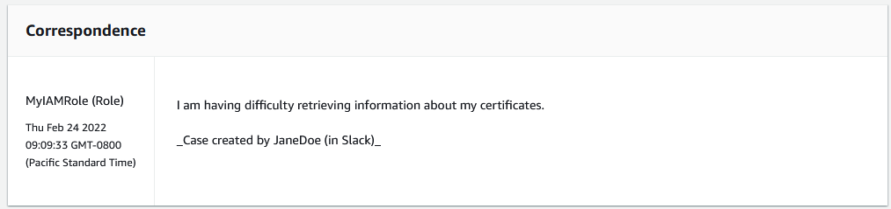

# View AWS Support App correspondences in the

AWS Support Center Console

When you create, update, or resolve support cases for your account in the Slack
channel, you can also sign in to the Support Center Console to view your cases. You can view
the case correspondences to determine whether the case was updated in the Slack channel,
view the chat history with a support agent, and find any attachments that you uploaded
from Slack.

###### To view case correspondences from Slack

1. Sign in to the [**AWS Support Center Console**](https://console.aws.amazon.com/support "https://console.aws.amazon.com/support") for your
   account.
2. Choose your support case.
3. In the **Correspondence**, you can view whether the case was
   created and updated from the Slack channel.

###### Example: Support case

In the following screenshot, Jane Doe reopened a support case in Slack. This
correspondence appears for the support case in the Support Center Console.

