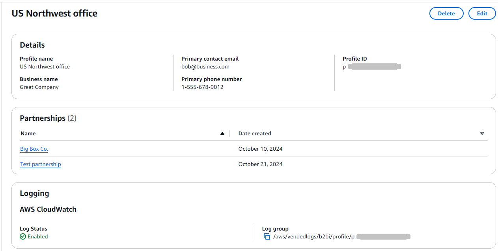
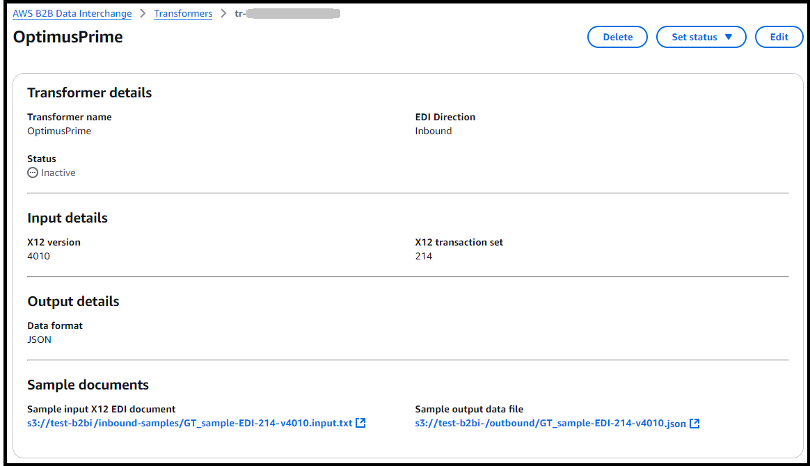
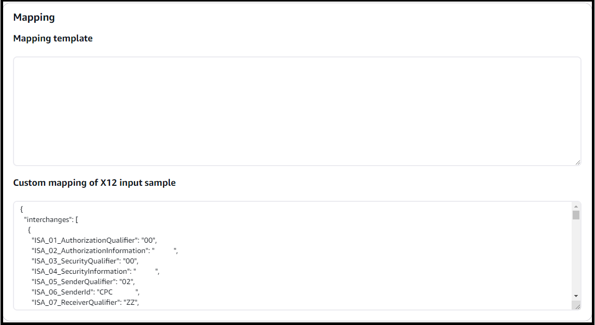
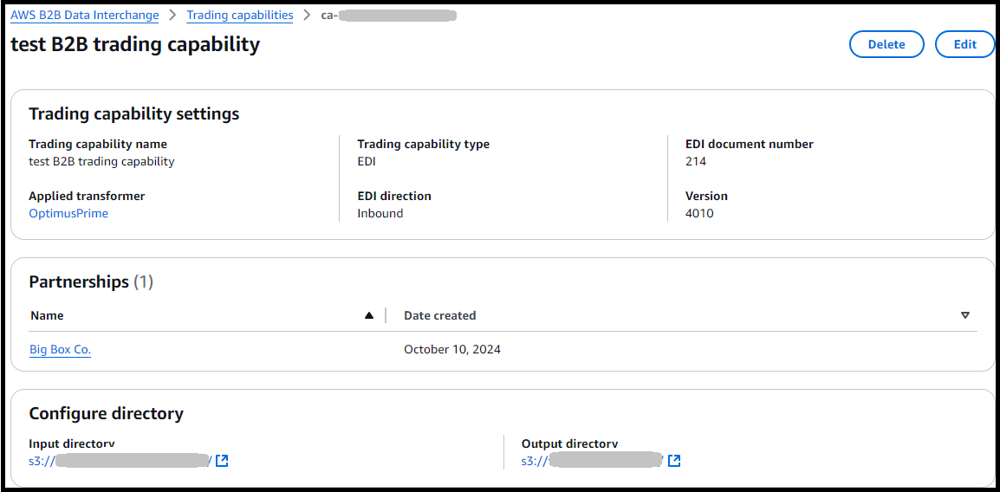
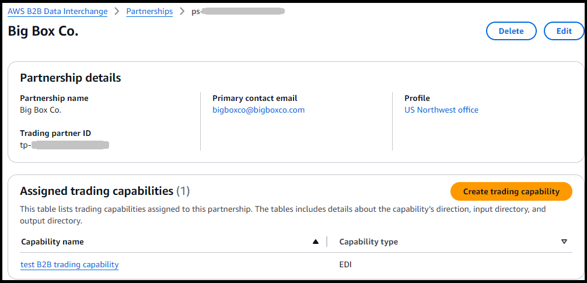

# AWS B2B Data Interchange concepts

You can configure AWS B2B Data Interchange (B2B Data Interchange) to monitor specific locations in Amazon S3 to automate
transformation of your X12 EDI documents to JSON/XML and to generate X12 EDI documents from
JSON/XML data inputs. This topic outlines the resources needed to fully automate your EDI
workflows at scale.

###### Topics

- [Profiles](#definition-profile "#definition-profile")
- [Transformers](#definition-transformer "#definition-transformer")
- [Trading capabilities](#definition-capability "#definition-capability")
- [Partnerships](#definition-partnership "#definition-partnership")

## Profiles

A _profile_ stores details and contact information about your own
business. We recommend that you enable logging to monitor transformation activities and
tag your profiles so that you can organize, search, and filter your profiles
globally.

## Transformers

A _transformer_ allows you to provide specific instructions on how
to transform or generate X12 EDI. When creating a transformer, you specify the direction
of your EDI, the X12 transaction set and version, and the common data representation
(either JSON or XML). We highly recommend that you provide sample input and output
documents that the service uses to create a template for your transformations. Finally,
if you’ve provided sample documents, you can use the mapping editor to customize your
output to align with a specific JSON / XML schema or to align to the service-defined
schema required to generate outbound EDI. The mapping editor is where you add your EDI
mapping code in JSONata (for JSON) or XSLT (for XML) to customize the transformation of
your data.

After you have configured your transformer resource and set it to
**Active**, you can attach it to a trading capability to automate
the transformation of your documents.

###### Note

- Transformers are created with a status of **Inactive**.
  To use a transformer in a trading capability, you must change its status to
  **Active**.
- You can only delete transformers if they are not used by any trading
  capability.
- JSONata and XSLT are open source query and transformation
  languages.

## Trading capabilities

A _trading capability_ contains the information required to build
your event-driven EDI workflows. To create a trading capability, specify the EDI
direction, add details about the EDI document number and version, choose the transformer
to use to transform or generate your EDI, and specify the input and output directories
used to source and store documents. Based on the EDI direction selected and the
transformer attached to the trading capability, you can use the trading capability to
automatically:

- Transform incoming EDI documents into JSON or XML outputs.
- Transform XML or JSON data stored in Amazon S3 into EDI documents.

The input directory specified in your trading capability configuration is monitored
using Amazon S3 events to automatically process your inbound or outbound EDI. When relevant
EDI documents or JSON/XML files are uploaded to your input directory, the transformer
associated with the trading capability automatically processes them.

In the case of inbound, EDI documents are automatically transformed into JSON or XML
data file outputs. In the case of outbound, JSON or XML data file inputs are
automatically transformed into EDI document outputs. All outputs from the transformation
process are written to the output directory specified in your trading partner
configuration.

## Partnerships

A _partnership_ represents the connection between you and your trading partner. It incorporates a profile and one or more trading capabilities.
It is also where you define the interchange control header and functional group header information necessary to generate outbound EDI documents. To create a partnership, add your partner’s contact
information and a unique name to easily identify this partnership. You also need to
select one of your business profiles and one or more trading capabilities to
automatically transform inbound X12 EDI documents and to generate outbound X12 EDI
documents. When you configure a partnership for generating outbound EDI documents, you
must specify all the required interchange control header and functional group header
values.

