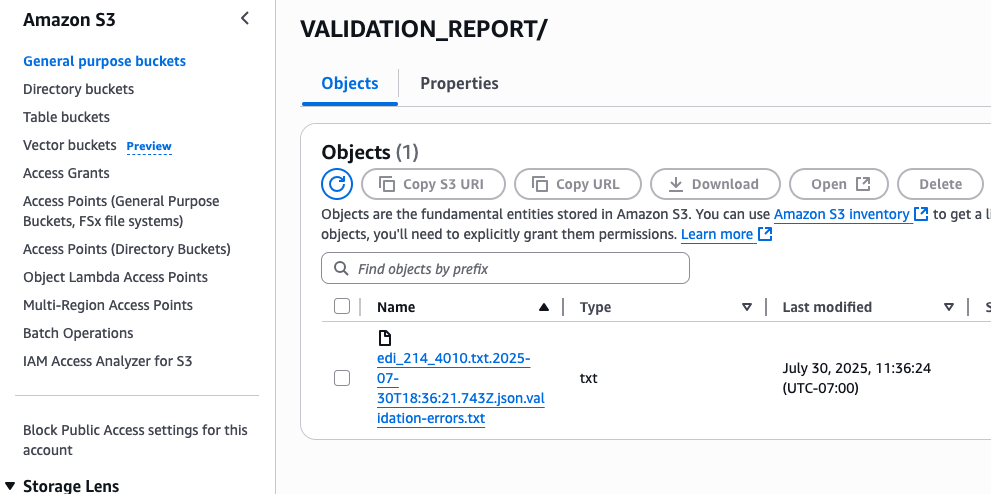

# EDI Validation

EDI Validation is the process of confirming whether an EDI file adheres to an EDI
standard. EDI standards define how business documents should be organized and ensure smooth
communication between trading partners and their systems. AWS B2B Data Interchange performs EDI validation
at various points when you interact with the service, such as when transforming an EDI file
to XML or JSON.

## Validation results communication

Validation errors are communicated through multiple channels to ensure you have
comprehensive visibility into validation issues:

EventBridge Events

EventBridge events for transformation completion and failure contain the
validation status and, when applicable, the URI of the generated validation
report. This allows you to programmatically respond to validation issues in
your automated workflows.

EDI Acknowledgments

Validation results appear in EDI acknowledgments, including any errors
detected during the validation process. Note that ACK files are generated
only for inbound EDI files.

CloudWatch Logs

A CloudWatch log entry that is generated in case of a validation error, which includes the Amazon S3 location of the
validation report and a summary of the first 5 validation errors. Example
log entry:

```
Validation report has been generated and written to
s3://bucket-name/output-key/VALIDATION_REPORT/filename.validation-errors.txt
EventNotes: First 5 validation errors: [Segment ST at position 1 in transaction 1
within functional group 1. For ST-01 transaction type 214, the GS-01 type code
should be QM instead of AG., ...] Total errors: 6
```

Validation reports in Amazon S3

When validation errors exist, a detailed validation report is
automatically written to your Amazon S3 bucket in a
`VALIDATION_REPORT` folder. The report file ends in
`validation-errors.txt`

## Validation Error Reports

When EDI validation errors occur during transformations, AWS B2B Data Interchange generates detailed
validation error reports to help you identify and resolve issues. These reports are
automatically created and written to your Amazon S3 bucket.

### Report format

Validation error reports provide detailed information about each error found in
your EDI document, organized by interchange, functional group, and transaction. The
report format includes:



Each error entry in the report includes the following components:

| Error entry components | Component                                                            | Description |
| ---------------------- | -------------------------------------------------------------------- | ----------- |
| Location information   | Interchange, functional group, transaction, and segment<br>position  |
| Error type             | Missing required elements, invalid codes, length violations,<br>etc. |
| Element details        | Specific element ID and position where the error occurred            |
| Error description      | Clear explanation of what validation rule was violated               |

The following example shows the format of a validation error report:

```
Interchange 1: X12, control# 000000001
  Functional group 1: type QM, control# 1, version 004010
    Transaction 1: type 214, control# 0001
      *** Segment B10 at position 2: Required data element B10-5 is missing.
      *** Segment L11 at position 3: Data element L11-1 with value |SHORT_REF| is too long. Valid length range: 1..8
      *** Segment Q7 at position 6: Data element Q7-1 with value |A| is not in the set of valid codes
3 errors detected
```

## Custom validation rules

In real-world scenarios, trading partners often deviate from standard formats by
agreeing on variations that work for their specific needs. Custom EDI Validation enables
you to have your EDI documents validated against a tailored format that can deviate from
an established standard. You can specify rules that override the standard during
validation, allowing you to personalize EDI formats for individual trading
partners.

The Custom EDI Validation system supports three types of validation rules that you can
apply to both inbound and outbound EDI transformers:

| Types of custom validation rules | Rule type                                                                                                                                                                                                                                                             | Description |
| -------------------------------- | --------------------------------------------------------------------------------------------------------------------------------------------------------------------------------------------------------------------------------------------------------------------- | ----------- |
| Element length rules             | Customize minimum and maximum length constraints for specific EDI<br>elements. A rule on an element ID applies to all instances of that<br>element ID in that EDI version.                                                                                            |
| Code list rules                  | Add or remove allowed codes from element code lists. A rule on an<br>element ID applies to all instances of that element ID in that EDI<br>version. For example, you can add code "0J" or remove codes "001", "002"<br>for element "0098".                            |
| Element requirement rules        | Change element requirements between mandatory and optional. A rule on<br>an element position applies only to that element instance. For example,<br>you can make the element at position 2 in the BGN segment optional or<br>make the element at position 4 required. |

###### Note

The service prevents you from setting conflicting element requirement rules, such
as creating multiple rules that set the same element position to both required and
optional. For example, you cannot create one rule that makes BGN segment position 2
required and another rule that makes BGN segment position 2 optional.

### Custom validation rules limitations

Custom validation rules have the following limitations and constraints.

#### Element length rule

limitations

- _Element ID format_: Must be exactly 4 digits (for
  example, "1039")
- _Length constraints_: Minimum length must be ≥
  1, maximum length must be ≤ 1,000,000
- _Length relationship_: Minimum length cannot be
  greater than maximum length
- _Element existence_: Element ID must exist in the
  X12 model for the specified version and transaction set
- _Single rule per target_: Cannot have multiple
  length rules for the same element

#### Code list rule limitations

- _Element ID format_: Must be exactly 4 digits (for
  example, "1039")
- _Code operations_: At least one of
  `codesToAdd` or `codesToRemove` must be
  non-empty
- _Element type restriction_: Only works with
  elements of data type ID
- _Code list size_: Maximum 2,000 codes per
  list
- _Code format_: Codes must contain only alphanumeric
  characters
- _Adding codes_: Codes to add must not already exist
  in the code list
- _Removing codes_:
  - codes to remove must exist in the current code list
  - you can't remove from empty code lists
  - you can't remove **all** codes
    from a code list unless you are also adding codes as part of the
    same rule

- _Single rule per target_: Cannot have multiple code
  list rules for the same element

#### Element requirement rule

limitations

- _Position format_: Element position identifier must
  be in format "SEGMENT-NN" or "SEGMENT-NN-NN" for sub-elements
- _Requirement values_: Requirement must be either
  MANDATORY or OPTIONAL
- _Element existence_: Element position must exist in
  the X12 model
- _Segment validation_: Segment must exist in the
  transaction set
- _Sub-element support_: Supports composite elements
  with sub-elements, but sub-element position must be valid, cannot
  reference position 0, and position cannot exceed sub-element
  count
- _Single rule per target_: Cannot have multiple
  requirement rules for the same element position

#### Overall limitations

- _Maximum rules_: 100 total validation rules per
  transformer
- _Header segment restrictions_: Rules cannot be
  defined on header segments (ISA/IEA, GS/GE, and ST/SE segments) or
  element IDs 0143, 0329, 1705

## Creating Custom Validation Rules in the

Console

You can create custom validation rules during the transformer creation process in the
AWS B2B Data Interchange console:

1. Sign in to the AWS Management Console and open the AWS B2B Data Interchange console at
   [https://console.aws.amazon.com/b2bi/](https://console.aws.amazon.com/b2bi/ "https://console.aws.amazon.com/b2bi/").
2. Choose _Transformers_ from the navigation pane.
3. Choose _Create transformer_.
4. Choose _Add rule_ and select the rule type you want to
   create:
   - For _Element Length Rules_, select the element ID,
     then specify minimum and maximum length constraints.
   - For _Code List Rules_, select the element ID, then
     specify codes to add or remove.
   - For _Element Requirement Rules_, select the segment
     ID, specify the element position, and set whether it should be required
     or optional.

5. Continue adding rules as needed.
6. Complete the transformer creation process.

When viewing existing transformers, you can see the configured custom validation rules
in the transformer details.

## Best Practices

Follow these best practices when using custom validation:

- _Document your custom rules_ - Keep a record of all custom
  validation rules you create for each trading partner to maintain clarity about
  your EDI format variations.
- _Test thoroughly_ - After creating custom validation rules,
  test with sample documents to ensure the rules work as expected.
- _Use minimal customizations_ - Limit custom validation
  rules to only what's necessary to support your trading partner
  requirements.
- _Monitor validation results_ - Regularly check EventBridge events
  and CloudWatch logs to ensure validation is working correctly.
- _Coordinate with trading partners_ - Ensure your trading
  partners are aware of any format deviations you're implementing.
