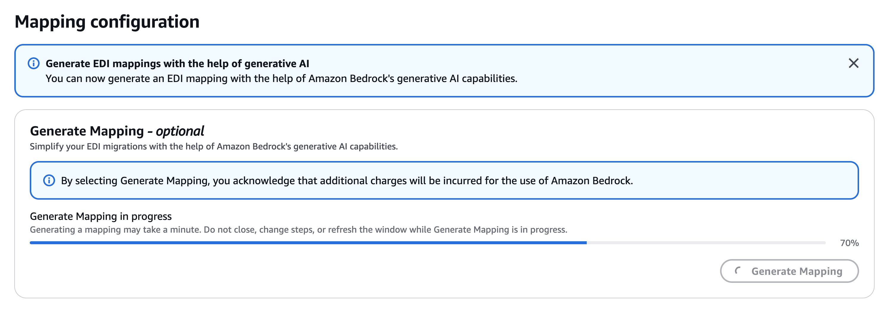
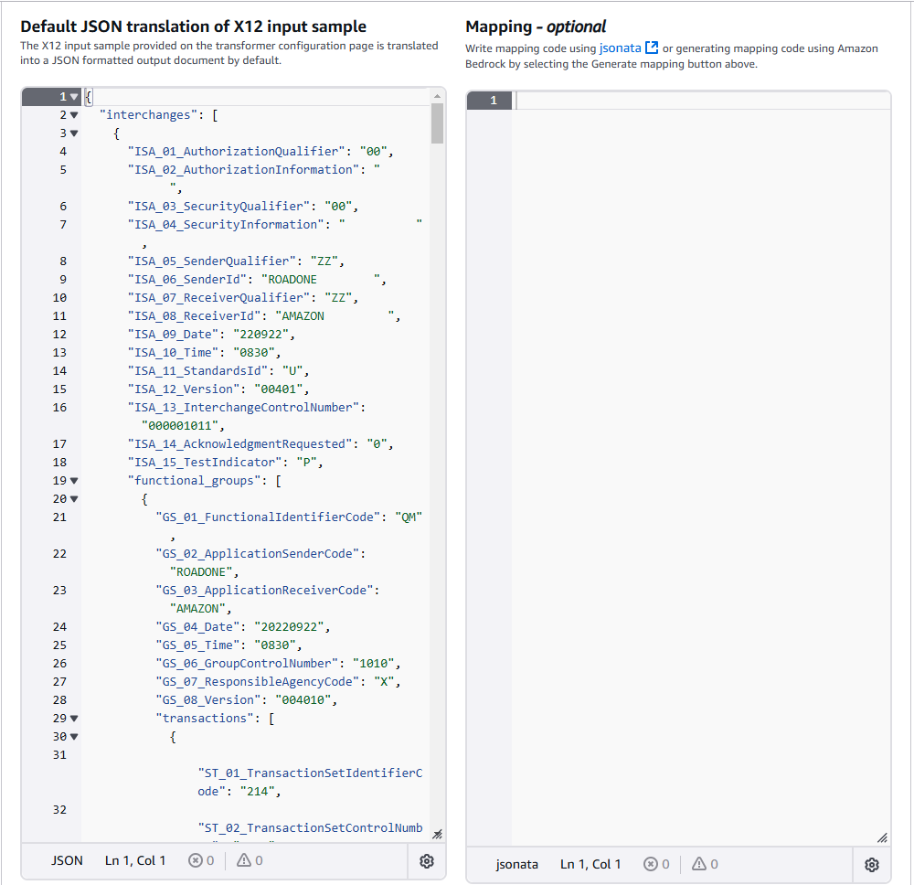
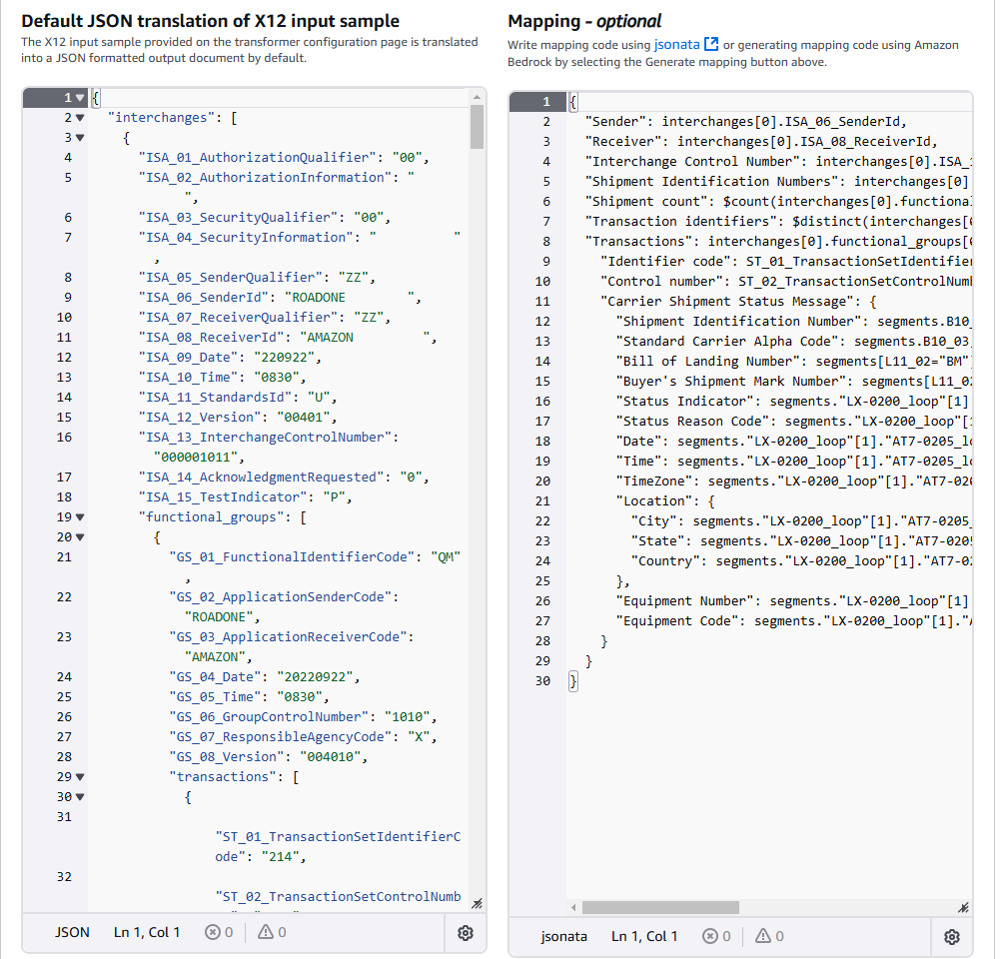
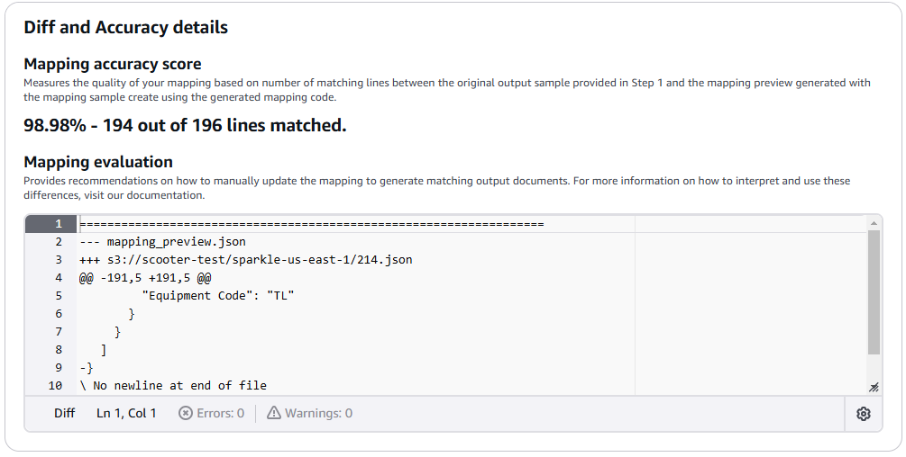

# Generative AI-assisted EDI mapping

The AWS B2B Data Interchange generative AI-assisted EDI mapping capability expedites the process of writing and testing
bi-directional EDI mappings, reducing the time, effort, and costs associated with migrating your
EDI workloads to AWS. This capability leverages your existing EDI documents and transactional
data samples to generate mapping code using generative AI. You can then use the generated
mapping code as a starting point and further customize it to produce output formats that align
with downstream data integration needs.

The following video provides a brief introduction to the AWS B2B Data Interchange generative AI capabilities.

###### Topics

- [Prerequisites for using the AWS B2B Data Interchange generative AI-assisted EDI mapping capability](#ai-assist-prereq "#ai-assist-prereq")
- [Notes about generative AI-assisted EDI mapping](#notes-ai-assist "#notes-ai-assist")
- [Using generative AI-assisted EDI mapping in AWS B2B Data Interchange](#use-ai-mapping "#use-ai-mapping")

## Prerequisites for using the AWS B2B Data Interchange generative AI-assisted EDI mapping capability

Before you can use this feature, you need to enable the models in Amazon Bedrock.

###### Note

You do not incur additional AWS B2B Data Interchange charges to generate mapping code beyond the standard [Amazon Bedrock Pricing](https://aws.amazon.com/bedrock/pricing "https://aws.amazon.com/bedrock/pricing").

###### To enable models in Amazon Bedrock

1. Sign in to the AWS Management Console and open the Amazon Bedrock console at [https://console.aws.amazon.com/bedrock/](https://console.aws.amazon.com/bedrock/ "https://console.aws.amazon.com/bedrock/").
2. From the left-hand navigation menu, choose **Model access** from the
   **Amazon Bedrock configurations** pane.
3. Enable all Anthropic models (AWS B2B Data Interchange currently uses Claude 3.7 Sonnet, Claude 3.5
   Sonnet v1, and Claude 3 Sonnet), then choose **Next**.

In the future, there may be newer models that we will suggest that you enable as
well. 4. If prompted, you may provide your use case details for access to the Anthropic models,
including your company name, URL, industry, user persona, and description of your use
case. 5. Review your selected models, and if you don't need to make any changes, choose
**Submit**.

## Notes about generative AI-assisted EDI mapping

Note the following:

- This feature is available for both inbound and outbound EDI processing.
- To use this feature, you must upload input and output samples when you configure a
  transformer.
- An accuracy score is generated for each mapping, to help you determine whether
  additional edits are needed.
- Mapping code is generated during configuration of your transformer resource, and not a
  transformation runtime.
- No customer data is stored or used to train the models: each mapping generated is a
  one-time operation.
- Currently, the AWS B2B Data Interchange generative AI-assisted EDI mapping capability is only supported in the
  US East (N. Virginia) and US West (Oregon) regions.

## Using generative AI-assisted EDI mapping in AWS B2B Data Interchange

The transformer configuration wizard has three steps:

1. Transformer configuration
2. Mapping configuration
3. Review and create

For details on creating bi-directional transformers, see [Create an inbound transformer](transform-inbound-variations.md#getting-started-transformer "transform-inbound-variations.md#getting-started-transformer") or [Create an outbound transformer](transform-outbound-variations.md#outbound-transformer "transform-outbound-variations.md#outbound-transformer").

To use the AWS B2B Data Interchange generative AI-assisted EDI mapping capability, make sure to upload both an input and
output sample in the transformer configuration step (_Step 1_) when
creating or updating your transformer resource. If you’ve specified both an input and output
sample in Step 1, you see the **Generate Mapping** option enabled during the
mapping configuration step (_Step 2_).

###### To use generative AI-assisted EDI mapping in AWS B2B Data Interchange

1. Upload your EDI document sample and JSON or XML data file sample to an Amazon S3 bucket
   (or buckets) with the appropriate policy and permissions. For details, see [Setting up S3 bucket policies and
   permissions](b2bi-prereq.md#buckets-and-permissions "b2bi-prereq.md#buckets-and-permissions").
2. Navigate to the transformer homepage in the AWS B2B Data Interchange console. Choose **Create
   transformer** to create a new transformer or select an existing transformer
   from the list and choose **Edit** to update the configuration. In the
   **Sample documents** section, specify the input and output samples that
   you uploaded to Amazon S3 in the previous step.
3. Select **Generate Mapping**. You can view the progress and percentage
   complete in the progress bar.

In the **Generate Mapping - optional** pane, notice the following note:
**By selecting Generate Mapping, you acknowledge that additional charges will be
incurred for the use of Amazon Bedrock.**

The **Mapping editor** pane will be empty before you select **Generate Mapping** and while the mapping is being generated.

This screen shows the **Mapping editor** panes before you select
**Generate Mapping** and the Mapping pane is empty.

 4. When the mapping completes, you see the **Generate Mapping was successful** message. You also see the **Mapping editor** has been populated with mapping code.

After the mapping has been generated, the **Diff and Accuracy
details** displays the **Mapping accuracy score** and the
**Mapping evaluation**. Note the following:

    * The accuracy score remains active as you continue to make manual edits, and changes
     based on your editing.
    * The score is determined by how well the provided sample output matches against the
     output document that is generated by the generative AI-assisted EDI mapping.
    * The generated score is determined by counting the number of matching lines and
     divides by the total number of lines in the original output document. For example, if
     19 of 20 lines match, the accuracy score is 95%.
    * If you are unsatisfied with the mapping, return to Step 1 to specify alternate
     input and output samples. Then, return to Step 2 and select **Re-generate
     Mapping**. Using alternate EDI document and JSON or XML data file samples
     will result in new mapping code.

 5. When your mapping is in a satisfactory state, select **Next** to
proceed to step 3, **Review and create**.

Continue to the **Review and create** step, as described in [Create an inbound transformer](transform-inbound-variations.md#getting-started-transformer "transform-inbound-variations.md#getting-started-transformer") or [Create an outbound transformer](transform-outbound-variations.md#outbound-transformer "transform-outbound-variations.md#outbound-transformer").
