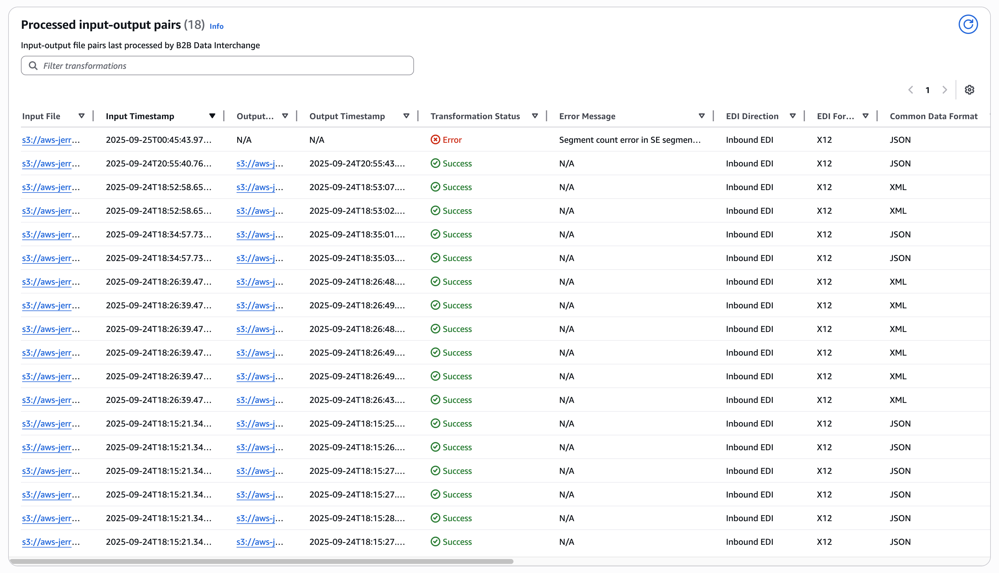

# Monitoring processed input-output

pairs

The Processed input-output pairs table is populated for each partnership and displays
details for the most recently processed input/output file pairs. This table provides
comprehensive information about EDI document transformations, validation status, and
processing results, helping you monitor and troubleshoot EDI transactions. You can use
this information to monitor EDI transaction processing, troubleshoot issues, and verify
successful document exchanges with your trading partners.

###### Note

For the table to be populated with values, you must have enabled logging in the
profile, and the user must have permission to perform
`logs:GetLogEvents`, `logs:StartQuery`, and
`logs:GetQueryResults` actions on the profile's log group.

| Processed input-output pairs table fields | Field                                                                                                                                                                                                                                                                                   | Description | Included in the default view                                                                                                                                                                                                                                                                                                                                                                                                 |
| ----------------------------------------- | --------------------------------------------------------------------------------------------------------------------------------------------------------------------------------------------------------------------------------------------------------------------------------------- | ----------- | ---------------------------------------------------------------------------------------------------------------------------------------------------------------------------------------------------------------------------------------------------------------------------------------------------------------------------------------------------------------------------------------------------------------------------- |
| **Input File**                            | Full S3 path of the source file that was processed. This is typically an EDI document or JSON/XML file that was submitted for transformation.                                                                                                                                           | Yes         |
| **Input Timestamp**                       | The date and time when the input file was received and processing began. Displayed in UTC format.                                                                                                                                                                                       | Yes         |
| **Output File**                           | Full S3 path of the transformed output file. This is the result of the EDI transformation process, typically in the target format (EDI, JSON, or XML).                                                                                                                                  | Yes         |
| **Output Timestamp**                      | The date and time when the output file was generated and made available. Displayed in UTC format.                                                                                                                                                                                       | Yes         |
| **Transformation Status**                 | The current status of the transformation process. Possible values include:  • `SUCCESS` - Transformation completed successfully  • `FAILED` - Transformation failed due to an error  • `IN_PROGRESS` - Transformation is currently being processed                             | Yes         |
| **Error Message**                         | Detailed error information if the transformation failed. This field is empty for successful transformations and contains specific error details for failed transformations.                                                                                                             | Yes         |
| **EDI Direction**                         | Indicates the direction of the EDI transformation:  • `INBOUND` - EDI document received from trading partner  • `OUTBOUND` - EDI document being sent to trading partner                                                                                                           | Yes         |
| **EDI Format**                            | The EDI standard format used for the document. Common values include:  • `X12` - ANSI X12 EDI standard  • _Additional values will be available as AWS B2B Data Interchange expands its support for more EDI formats._                                                             | Yes         |
| **Common Data Format**                    | The common data format (JSON/XML) that an EDI file was translated to/from.                                                                                                                                                                                                              | Yes         |
| **EDI Document Type**                     | The specific type of EDI document being processed. Examples include:  • `X12_850` - Purchase Order  • `X12_856` - Advance Ship Notice                                                                                                                                             | Yes         |
| **EDI Validation Status**                 | The result of EDI document validation against the specified transaction set rules:  • `Passed` - EDI document passed all validation checks  • `Failed` - EDI document failed validation  • `Not attempted` - Validation was not performed                                      | Yes         |
| **Split Number**                          | Populated for cases when an input file is split into multiple outputs. Shows the current split number (e.g., 1, 2, 3) the input-output pair represents.                                                                                                                                 | Yes         |
| **Total Split Count**                     | Populated for cases when an input file is split into multiple outputs. Shows the total number of splits created from the original input file.                                                                                                                                           | Yes         |
| **Functional Acknowledgement**            | Full S3 path to the generated functional acknowledgement.                                                                                                                                                                                                                               | Yes         |
| **Technical Acknowledgement**             | Full S3 path to the generated technical acknowledgement.                                                                                                                                                                                                                                | Yes         |
| **Validation Report**                     | Full S3 path to the detailed validation report containing comprehensive information about any validation errors identified in the EDI file.                                                                                                                                             | Yes         |
| **Partnership**                           | The name and a link to the Partnership that was used in this input-output pair.                                                                                                                                                                                                         | No          |
| **Trading capability**                    | The name and the link to the Trading Capability that was used in this input-output pair.                                                                                                                                                                                                | No          |
| **Transformer**                           | The name and the link to the Transformer that was used in this input-output pair.                                                                                                                                                                                                       | No          |
| **Input file ID**                         | The unique ID AWS B2B Data Interchange assigned to the input file.                                                                                                                                                                                                                      | No          |
| **Output File eTag**                      | Entity tag of the output file. For details, see the eTag entry in the [Object](../../../AmazonS3/latest/API/API_Object.md#AmazonS3-Type-Object-ETag "../../../AmazonS3/latest/API/API_Object.md#AmazonS3-Type-Object-ETag") topic in the _Amazon Simple Storage Service API Reference_. | No          | ###### Note The table displays up to the 10,000 most recently processed input-output pairs (there might be up to a 1 minute delay between the input-output pair being processed and it showing up in the table). For historical data beyond this limit, use vended Amazon CloudWatch logs as described in [Monitoring AWS B2B Data Interchange with Amazon CloudWatch](monitoring-cloudwatch.md "monitoring-cloudwatch.md"). |
