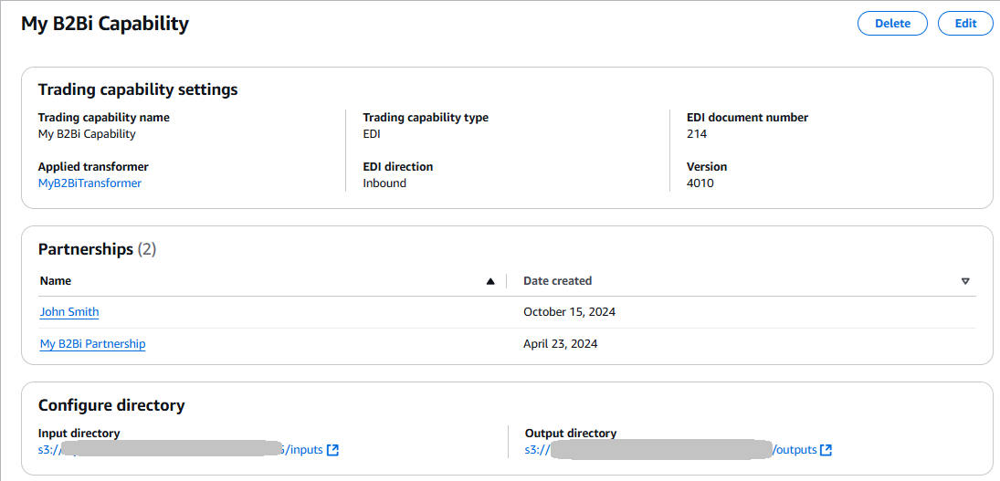
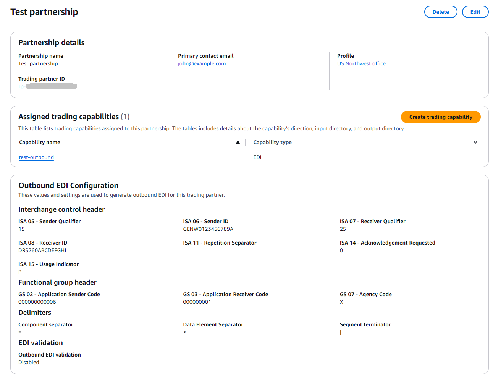

# Inbound EDI

There are two ways that you can invoke a transformer to
convert inbound X12 documents to XML or JSON format.

- **Invoking `StartTransformerJob` API**.
  With this approach, you create an inbound transformer that is configured to
  transform a specific transaction set and version into JSON or XML. You then invoke
  the `StartTransformerJob` action, which requires a Transformer ID, the
  absolute file path in Amazon S3 for the input EDI document, and the output directory path
  in Amazon S3 for the transformed JSON/XML file.

Acknowledgements are stored in a generated **ACK** folder in the
output directory. Subscribe to status updates using events emitted to Amazon EventBridge or
invoke the `GetTransformerJob` API to poll for status updates from the
invoking orchestration engine (such as AWS Step Functions).

###### Note

The **Transformer only** option only works for when you are
transforming incoming X12 documents to JSON/XML, and needs to be invoked.

- **Monitoring specified locations in Amazon S3**. With this
  approach, you configure a transformer, trading capability, and partnership. You then
  drop EDI input documents into the input directory specified in the attached trading
  capability and B2B Data Interchange listens for Amazon S3 events to automatically transform the documents
  to JSON or XML files and stores the files in the specified output directory. The
  input and output directory used are those specified in your trading capability with
  your trading partner's ID added to the prefixes. As part of the partnership
  configuration, you specify one or more trading capabilities to use.

For each of the trading capabilities specified in the Partnership, a trading
partner ID is added as a new prefix to the input and outbound directories specified
in each of the respective trading capabilities. For example, assume that you specify
the following directories in your trading capability:

    + Capability input directory: `s3://EDI-bucket/input-EDI/`
    + Capability output directory: `s3://EDI-bucket/output-JSON/`

When you associate your trading capabilities with your partnership, the service
adds a prefix to both the input and output directory, changing them to the
following:

    + Input directory to drop incoming X12 files becomes
     `s3://EDI-bucket/input-EDI/`<trading-partner-id>`/`
    + Output directory containing the transformed JSON/XML files becomes
     `s3://EDI-bucket/output-JSON/`<trading-partner-id>`/`
    + The acknowledgement is stored in
     `s3://EDI-bucket/output-JSON/`<trading-partner-id>`/ACK/`

You then drop files into the trading-partner-ID prefix in the input directory to
transform EDI for that specific partner. The transformed JSON output is then written
to the trading-partner-ID prefix in the output directory. Using these prefixes
ensures that your EDI documents are properly transformed for each individual trading
partner.

###### Note

You can associate one trading capability with multiple partnerships, and a
partnership can be associated with multiple trading capabilities. Using the
folder structure specified, you can use the same trading capability for multiple
partners. The trading partner ID makes sure that you have clear delineation as
to where the transformed EDI data for a specific partner should be
stored.

###### Topics

- [Transforming inbound EDI documents](#edi-inbound-process "#edi-inbound-process")
- [Create a profile](#getting-started-profile "#getting-started-profile")
- [Create an inbound transformer](#getting-started-transformer "#getting-started-transformer")
- [Create a trading capability for inbound
  EDI](#getting-started-capability "#getting-started-capability")
- [Create a partnership for inbound
  EDI](#getting-started-partnership "#getting-started-partnership")
- [EDI acknowledgements](edi-ack.md "edi-ack.md")
- [EDI splitting](edi-split-overview.md "edi-split-overview.md")

## Transforming inbound EDI documents

Typically, you perform the following steps to transform X12 EDI documents into JSON or
XML data

1. [Create a profile](#getting-started-profile "#getting-started-profile").
2. [Create an inbound transformer](#getting-started-transformer "#getting-started-transformer").
3. [Create a trading capability for inbound
   EDI](#getting-started-capability "#getting-started-capability").
4. [Create a partnership for inbound
   EDI](#getting-started-partnership "#getting-started-partnership").
5. Test your transformation workflow. For details, see the [Testing end-to-end](https://catalog.workshops.aws/getting-started-b2b-data-interchange/en-US/030-testing "https://catalog.workshops.aws/getting-started-b2b-data-interchange/en-US/030-testing") topic from our [EDI document exchange with AWS B2B Data Interchange](https://catalog.workshops.aws/getting-started-b2b-data-interchange/en-US "https://catalog.workshops.aws/getting-started-b2b-data-interchange/en-US") workshop.

## Create a profile

You can use _profiles_ to store contact information and details about your own business and specify a unique name to easily identify this profile A profile contains the following types of information.

- **Profile details**: This section contains the profile name,
  the name of the business, a contact email address, and a phone number.

###### Note

These details are all your characteristics, not those describing your trading partner.
The latter are described as part of the partnership resource.

- **Logging**: This section describes the logging
  configuration. You can also opt out of logging (not recommended).
- **Tagging**: Tag your profiles to easily organize, search, and filter your profiles globally.

###### To create a profile

1. Open the AWS B2B Data Interchange console at [https://console.aws.amazon.com/b2bi/](https://console.aws.amazon.com/b2bi/ "https://console.aws.amazon.com/b2bi/") and select **Profiles** from the navigation pane, then
   choose **Create profile**.
2. Enter the profile details, the name of the profile, the name of the business represented,
   and the contact information (email and phone number).
3. Logging is selected by default. Clear the box to turn off logging (not recommended). The
   log group is based on the profile ID, for example,
   `/aws/vendedlogs/b2bi/p-ABCDE111122223333`.
4. Optionally, add tags as needed.

## Create an inbound transformer

A _transformer_ describes how to process the incoming EDI documents and extract the necessary
information to the output file.

###### Note

If an EDI input file contains more than one transaction, each transaction must
have the same document and version, for example
`214`/`4010`. If not, the transformer
cannot parse the file.

###### To create a transformer

1. Open the AWS B2B Data Interchange console at [https://console.aws.amazon.com/b2bi/](https://console.aws.amazon.com/b2bi/ "https://console.aws.amazon.com/b2bi/") and select **Transformers** from the
   navigation pane, then choose **Create transformer**.
2. Select a transformer name (for example **edi-214-json**), the
   direction, the EDI doc number, and version. Then, provide a sample document by
   selecting a document from Amazon S3. The sample document can preview how your EDI
   documents get converted.
   1. Enter a name (no spaces).
   2. Ensure that **Inbound EDI** is selected.
   3. For **Input Details**, select an EDI document number
      and X12 version from the dropdown menus.
   4. For **Input Details**, select
      **JSON** or **XML**.
   5. Select **Split by transaction** to split processed
      EDI document by transaction set, or **Do not split**.
      For more information about EDI splitting, see [EDI splitting](edi-split-overview.md "edi-split-overview.md").
   6. Optionally, configure custom validation rules to support partner-specific EDI
      formats that deviate from standards. For more information about custom
      validation rules, see [Custom validation rules](edi-validation.md#custom-validation-rules "edi-validation.md#custom-validation-rules").
   7. Optionally, in the **Sample documents** pane, provide
      the bucket and prefix in Amazon S3 for the sample input and output files.
      This is useful for making sure the transformer functions
      correctly.
   8. Optionally, add tags as needed.
   9. Select **Next** to proceed to the next step in the
      wizard.

3. The Mapping configuration screen is displayed. If you provided a sample input
   document in the previous step, the default representation for your sample is
   displayed. For more information about AI-assisted mapping, see the generative
   AI-assisted mapping section.

If you chose not to customize the output format using the **Mapping
template editor**, AWS B2B Data Interchange transforms EDI document inputs using
the default, service-defined format shown on the left side of your
screen.

You can also use the **Mapping template editor** to only
include certain pieces of your EDI documents.

The pieces you select are previewed in the mapping preview pane.

The items in your mapping editor are the only items that are extracted from
the input EDI document, and that are then saved to your output file, located in
your Amazon S3 output location.

This example shows ref ID, shipment ID, and b of lading number, from and to
city, and the shipment status code. 4. When you are happy with your mappings, choose **Next**, which
takes you to the review page. Note that newly created transformers are
inactive.

###### Note

A status of **Inactive** indicates that the transformer
is not used in any trading capabilities: it is essentially in edit mode.
When you are finished editing and updating the transformer, you change the
status to **Active**. Then, you can associate the
transformer with a trading capability. At this point, the transformer is
essentially locked, and in production mode. 5. After your review is complete, choose **Save** to create the
transformer.

## Create a trading capability for inbound

EDI

_Trading capabilities_ contain the information required to build your event-driven EDI workflows.
To create a trading capability, specify the EDI direction, add details about the EDI document number and version, choose
the transformer to use to transform or generate your EDI, and specify the input and output directories used to source and store documents.
Based on the EDI direction selected and the transformer attached to the trading capability, you can use the capability to automatically:

- Transform incoming EDI documents into JSON or XML outputs.
- Transform XML or JSON data stored in Amazon S3 into EDI documents.

###### To create an inbound trading capability

1. Open the AWS B2B Data Interchange console at [https://console.aws.amazon.com/b2bi/](https://console.aws.amazon.com/b2bi/ "https://console.aws.amazon.com/b2bi/") and select **Trading capabilities** from the
   navigation pane, then choose **Create trading
   capability**.
2. In the **Trading capability settings** section, enter the
   following information.
   - Enter a descriptive, unique name for the trading capability.
   - For **EDI direction**, select
     **Inbound**.
   - Choose an **X12 version** and **X12
     transaction** set from the corresponding dropdown
     menus.
   - In the **Apply transformer** field, choose a
     transformer to apply to this trading capability.

3. In the **Configure directories** section, you provide full S3
   path to both the input and output directories.
   - You can use **Browse S3** to navigate to your
     available Amazon S3 buckets, where you can select a bucket (and optionally a
     prefix) to specify your preferred directories.
   - You can validate that your S3 buckets setup meets the prerequisites
     ([Prerequisites for using AWS B2B Data Interchange](b2bi-prereq.md "b2bi-prereq.md")) for AWS B2B Data Interchange using
     **Validate input S3 setup** and **Validate
     output S3 setup**.
   - You can use **Copy policy** to copy a policy that you
     can then paste into your input/output directory's bucket policy to
     provide AWS B2B Data Interchange the necessary access.

 4. Optionally, add tags as needed. 5. After you have configured all of the settings, choose **Create
capability**.

###### Important considerations to avoid failed transformation attempts and unnecessary

charges

- B2B Data Interchange monitors all prefixes of your input directory for new
  files and attempts to transform every file placed in any prefix. Don't place
  files you don't want transformed into your input directory or its
  prefixes.
- Don't set your output directory as a subdirectory of your input directory.
  This configuration causes B2B Data Interchange to attempt processing output
  files as input files.
- B2B Data Interchange will automatically create prefixes in the specified input
  and output directories. Don't delete or edit these prefixes.

## Create a partnership for inbound

EDI

A _partnership_ represents the connection between you and your trading partner. It incorporates a profile and one or more trading capabilities.
It is also where you define the interchange control header and functional group header information necessary to generate outbound EDI documents.

###### To create a partnership

1. Open the AWS B2B Data Interchange console at [https://console.aws.amazon.com/b2bi/](https://console.aws.amazon.com/b2bi/ "https://console.aws.amazon.com/b2bi/") and select **Partnerships** from the navigation
   pane, then choose **Create partnership**.
2. In the **Partnership details** section, provide the following
   information.
   1. Enter a descriptive name for the partnership.
   2. Enter an email address to associate with the partnership. Provide the
      trading partner's email address.
   3. Choose a profile from the dropdown menu.
   4. Select one or more trading capabilities from the **Trading
      capabilities** list.

3. In the **Inbound EDI configuration** section. choose which acknowledgments, if any, to generate.
   1. For **TA1 Technical Acknowledgments**, choose whether or not to generate.
   2. For **Functional (997 and 999) Acknowledgments**, choose whether or not to generate,
      and whether or not to include AK2 loop.For more information about EDI acknowledgements, see [EDI acknowledgements](edi-ack.md "edi-ack.md").

4. Unless you intend to perform outbound EDI processing with this partner, you
   can skip the **Outbound EDI configuration** section.
5. Optionally, add tags as needed.
6. After you have configured all of the settings, choose **Create
   partnership**.

After you create a partnership, you can observe a new sub-directory, within your Amazon S3
input directory, beginning with `tp-`.
