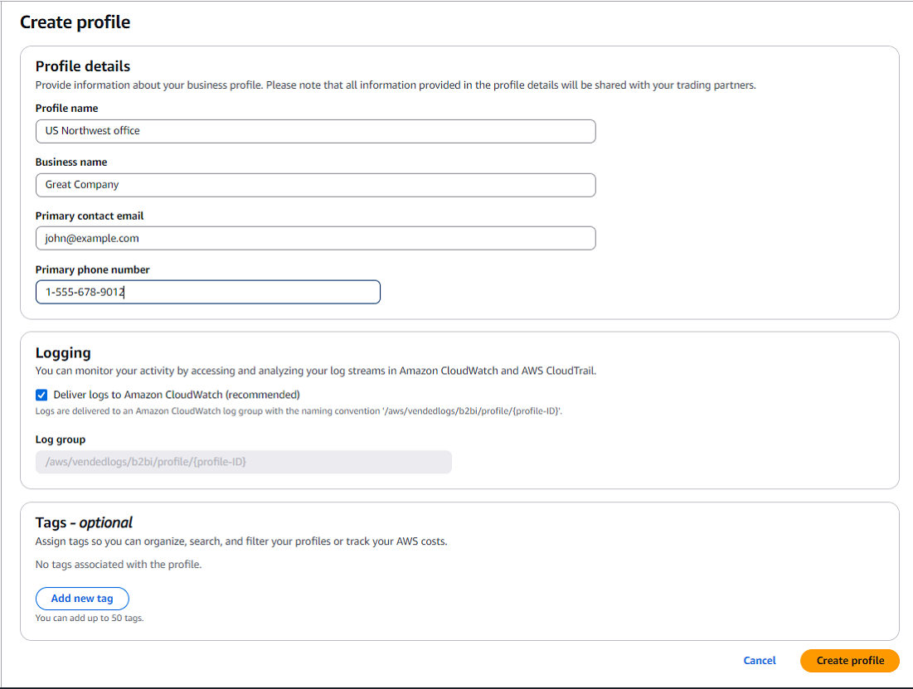
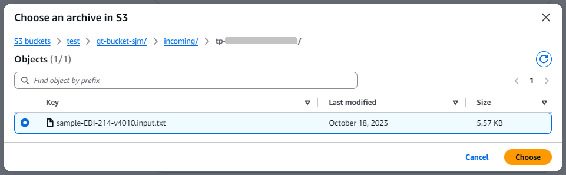
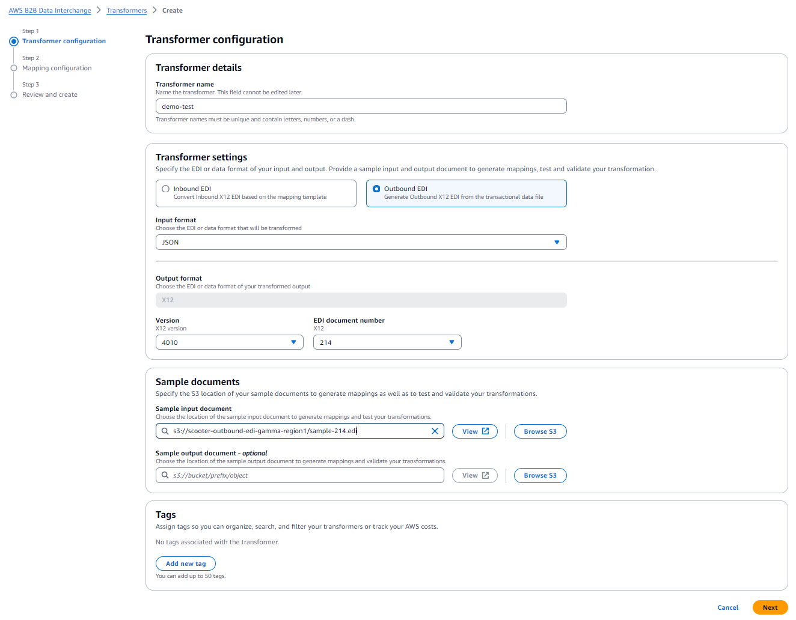
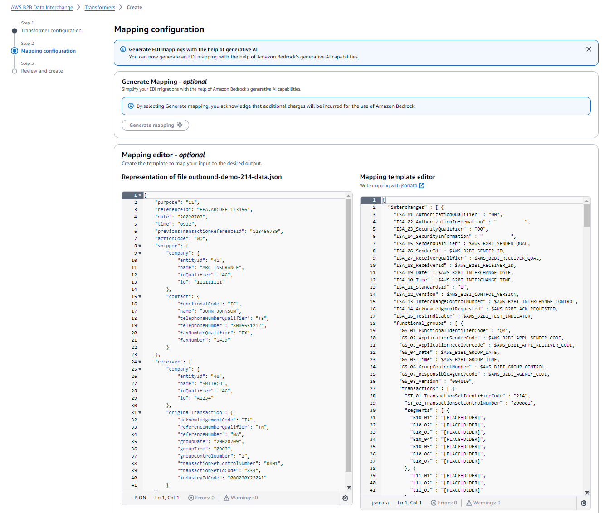
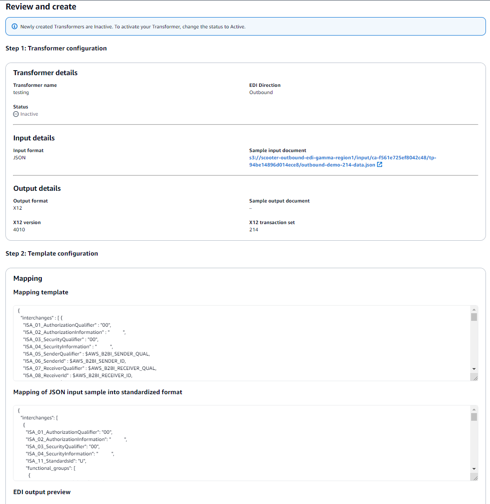

# Outbound EDI

You can use AWS B2B Data Interchange to generate X12 EDI documents for purposes of sending transactional
data to your partners. AWS B2B Data Interchange also automatically generates X12 functional acknowledgements
(including TA1s, 997s, and 999s) in response to inbound EDI.

For example, you may need to send an 810 Invoice after receiving an 850 Purchase Order
from a manufacturing customer. Similarly, you may need to send an 835 Claim Payment after
receiving an 837 Claim from a healthcare provider. Whether responding to or initiating a
transaction, there are numerous scenarios where you may need to generate and send X12 EDI
outbound to your trading partners. To generate outbound X12 EDI, it is common to use JSON or
XML formatted data for your input. This data is typically exported from a downstream
application, such as an Enterprise Resource Planning (ERP) solution or Claims Management
Software (CMS) system. Now, however, you can use B2B Data Interchange to generate the X12 EDI documents.

You start with an XML or JSON formatted file as input, and use the service to generate the
X12 EDI document. B2B Data Interchange then saves it to an Amazon S3 bucket that has been configured to store
your output X12 EDI documents. From Amazon S3, you can automatically send it to your trading
partner using AWS Transfer Family or any other data connectivity solution.

Currently, there is one way to transform JSON- or
XML-formatted data into EDI: **by dropping your JSON or XML files into
Amazon S3 locations that you have specified for monitoring**. With this approach,
you configure an outbound transformer that is configured to transform JSON or XML data into
an X12 EDI document. You then drop JSON or XML documents into the input directory specified
in the attached trading capability and B2B Data Interchange listens for Amazon S3 events to automatically
transform the documents and write the generated X12 into the output directory. The input and
output directory used are those specified in your trading capability with trading partner ID
added to the prefixes. As part of the partnership configuration, you specify one or more
trading capabilities to use.

The process is similar to the corresponding inbound process. The difference is that
prefixes using the trading capability ID and trading partner ID are added to the directories
that you specify in the trading capability.

For example, assume that you specify the following directories in your trading
capability:

- Capability input directory: `s3://EDI-bucket/input-JSON/`
- Capability output directory: `s3://EDI-bucket/output-EDI/`
  When you associate your trading capability with your partnership, the service adds
  prefixes to both the input and output directory, changing them to the following:

- Input directory to drop JSON or XML files becomes
  `s3://EDI-bucket/input-JSON/`<capability-id>`/`<trading-partner-id>``
- Output directory containing the generated X12 documents becomes
  `s3://EDI-bucket/output-EDI/`<capability-id>`/`<trading-partner-id>``
  You then drop JSON or XML files into the trading-partner-ID prefix in the input directory
  to generate EDI. The generated EDI is then written to the trading-partner-ID prefix in the
  output directory.

Similar to the inbound process, this allows you to associate one trading capability with
multiple partnerships, and have partnerships that are associated with multiple trading
capabilities. Using the trading capability and trading partner IDs as prefixes gives you
clear delineation as to where the EDI documents for a specific partner should be
stored.

## Generating outbound EDI documents

Typically, you perform the following steps to generate X12 EDI documents as
output.

1. [Create a profile](#outbound-profile "#outbound-profile")
2. [Create an outbound transformer](#outbound-transformer "#outbound-transformer")
3. Write or import mapping code that the system uses to generate a valid X12 EDI
   document.

You can start with an EDI document, and then run the [CreateStarterMappingTemplate](../APIReference/API_CreateStarterMappingTemplate.md "../APIReference/API_CreateStarterMappingTemplate.md") operation to create your mapping
template. 4. [Create a trading capability for outbound
EDI](#create-outbound-capability "#create-outbound-capability"). Make sure to select
**Outbound** for the **EDI
direction**. 5. [Create a partnership for outbound EDI](#outbound-partnership "#outbound-partnership") 6. Test your transformation workflow. For details, see the [Testing end-to-end](https://catalog.workshops.aws/getting-started-b2b-data-interchange/en-US/030-testing "https://catalog.workshops.aws/getting-started-b2b-data-interchange/en-US/030-testing") topic from our [EDI document exchange with AWS B2B Data Interchange](https://catalog.workshops.aws/getting-started-b2b-data-interchange/en-US "https://catalog.workshops.aws/getting-started-b2b-data-interchange/en-US") workshop.

**Tip:** These testing instructions are written
for testing inbound EDI, so you need to adapt them for testing outbound
EDI.

## Create a profile

You can use _profiles_ to store contact information and details about your own business and specify a unique name to easily identify this profile A profile contains the following types of information.

- **Profile details**: This section contains the profile name,
  the name of the business, a contact email address, and a phone number.

###### Note

These details are all your characteristics, not those describing your trading partner.
The latter are described as part of the partnership resource.

- **Logging**: This section describes the logging
  configuration. You can also opt out of logging (not recommended).
- **Tagging**: Tag your profiles to easily organize, search, and filter your profiles globally.

###### To create a profile

1. Open the AWS B2B Data Interchange console at [https://console.aws.amazon.com/b2bi/](https://console.aws.amazon.com/b2bi/ "https://console.aws.amazon.com/b2bi/") and select **Profiles** from the navigation pane, then
   choose **Create profile**.
2. Enter the profile details, the name of the profile, the name of the business represented,
   and the contact information (email and phone number).
3. Logging is selected by default. Clear the box to turn off logging (not recommended). The
   log group is based on the profile ID, for example,
   `/aws/vendedlogs/b2bi/p-ABCDE111122223333`.
4. Optionally, add tags as needed.



## Create an outbound transformer

An outbound transformer takes in a sample template and produces an EDI, X12-formatted
document that you can send to your trading partners.

###### To create an outbound transformer

1. Open the AWS B2B Data Interchange console at [https://console.aws.amazon.com/b2bi/](https://console.aws.amazon.com/b2bi/ "https://console.aws.amazon.com/b2bi/") and select **Transformers** from the
   navigation pane, then choose **Create transformer**.
2. On the Transformer configuration page, enter the following information.
   1. Enter a name (no spaces).
   2. In **Transfer settings**, choose **Outbound
      EDI**, and select an EDI document number and X12 version
      from the dropdown menus.
   3. For the Input format, select **JSON** or
      **XML**, depending upon the format for the
      documents to be converted by this transformer.
   4. Optionally, configure custom validation rules to support partner-specific EDI
      formats that deviate from standards. For more information about custom
      validation rules, see [Custom validation rules](edi-validation.md#custom-validation-rules "edi-validation.md#custom-validation-rules").
   5. In the **Sample documents** pane, select a sample
      input document, and optionally a sample output document from your
      available Amazon S3 buckets.

   Provide the bucket and prefix in Amazon S3 for a sample document. This is
   useful for making sure the transformer functions correctly.

   

3. Choose **Next** to proceed to the next stage of transformer
   creation.

 4. The **Mapping configuration** screen appears, with the
**Mapping editor** panel populated. You can use generative AI-assisted EDI mapping to expedite the mapping configuration. For details, see [Generative AI-assisted EDI mapping](generative-ai-assisted-mapping.md "generative-ai-assisted-mapping.md").



The items in your mapping editor are the only items that are extracted from
the input EDI document, and that are then saved to your output file, located in
your Amazon S3 output location.

You use the **Mapping template editor** to only include
certain pieces of your EDI documents.

If you chose not to customize the output format using the **Mapping
template editor**,AWS B2B Data Interchange transforms EDI document inputs using the
default, service-defined format shown on the left side of your screen.

The pieces you select are previewed in the mapping preview pane. 5. When you are happy with your mappings, choose **Next**, which
takes you to the review page. Note that newly created transformers are
inactive.

###### Note

A status of **Inactive** indicates that the transformer
is not used in any trading capabilities: it is essentially in edit mode.
When you are finished editing and updating the transformer, you change the
status to **Active**. Then, you can associate the
transformer with a trading capability. At this point, the transformer is
essentially locked, and in production mode.

 6. After your review is complete, choose **Save** to create the
transformer.

## Create a trading capability for outbound

EDI

_Trading capabilities_ contain the information required to build your event-driven EDI workflows.
To create a trading capability, specify the EDI direction, add details about the EDI document number and version, choose
the transformer to use to transform or generate your EDI, and specify the input and output directories used to source and store documents.
Based on the EDI direction selected and the transformer attached to the trading capability, you can use the capability to automatically:

- Transform incoming EDI documents into JSON or XML outputs.
- Transform XML or JSON data stored in Amazon S3 into EDI documents.

###### To create a trading capability

1. Open the AWS B2B Data Interchange console at [https://console.aws.amazon.com/b2bi/](https://console.aws.amazon.com/b2bi/ "https://console.aws.amazon.com/b2bi/") and select **Trading capabilities** from the
   navigation pane, then choose **Create trading
   capability**.
2. In the **Trading capability settings** section, enter the
   following information.
   - Enter a descriptive, unique name for the trading capability.
   - For **EDI direction**, select
     **Outbound**.
   - Choose an **X12 version** and **X12
     transaction** set from the corresponding dropdown
     menus.
   - In the **Apply transformer** field, choose a
     transformer to apply to this trading capability.

3. In the **Configure directories** section, you provide full S3
   path to both the input and output directories.
   - You can use **Browse S3** to navigate to your
     available Amazon S3 buckets, where you can select a bucket (and optionally a
     prefix) to specify your preferred directories.
   - You can validate that your S3 buckets setup meets the prerequisites
     ([Prerequisites for using AWS B2B Data Interchange](b2bi-prereq.md "b2bi-prereq.md")) for AWS B2B Data Interchange using
     **Validate input S3 setup** and **Validate
     output S3 setup**.
   - You can use **Copy policy** to copy a policy that you
     can then paste into your input/output directory's bucket policy to
     provide AWS B2B Data Interchange the necessary access.

 4. Optionally, add tags as needed. 5. After you have configured all of the settings, choose **Create
capability**.

###### Important considerations to avoid failed transformation attempts and unnecessary

charges

- B2B Data Interchange monitors all prefixes of your input directory for new
  files and attempts to transform every file placed in any prefix. Don't place
  files you don't want transformed into your input directory or its
  prefixes.
- Don't set your output directory as a subdirectory of your input directory.
  This configuration causes B2B Data Interchange to attempt processing output
  files as input files.
- B2B Data Interchange will automatically create prefixes in the specified input
  and output directories. Don't delete or edit these prefixes.

## Create a partnership for outbound EDI

A _partnership_ represents the connection between you and your trading partner. It incorporates a profile and one or more trading capabilities.
It is also where you define the interchange control header and functional group header information necessary to generate outbound EDI documents.

If you intend to perform outbound EDI transformations with this partner, fill in
details in the **Outbound EDI configuration** section.

###### To create a partnership

1. Open the AWS B2B Data Interchange console at [https://console.aws.amazon.com/b2bi/](https://console.aws.amazon.com/b2bi/ "https://console.aws.amazon.com/b2bi/") and select **Partnerships** from the navigation
   pane, then choose **Create partnership**.
2. In the **Partnership details** section, provide the following
   information.
   1. Enter a descriptive name for the partnership.
   2. Enter an email address to associate with the partnership. Provide the
      trading partner's email address.
   3. Choose a profile from the dropdown menu.
   4. Select one or more trading capabilities from the **Trading
      capabilities** list.

3. In the **Inbound EDI configuration** section. choose which acknowledgments, if any, to generate.
   1. For **TA1 Technical Acknowledgments**, choose whether or not to generate.
   2. For **Functional (997 and 999) Acknowledgments**, choose whether or not to generate,
      and whether or not to include AK2 loop.For more information about EDI acknowledgements, see [EDI acknowledgements](edi-ack.md "edi-ack.md").

4. Enter header details in the **Outbound EDI configuration**.
   The system uses the outbound EDI header information to format the outbound EDI
   document according to the needs of the partner to whom you are sending these
   documents.
   1. Provide **Interchange control header** information
      (also known as the ISA segment).
   2. Provide **Functional group header** information (also
      known as the GS segment).
   3. Specify starting control numbers. For more information about control
      numbers, see [Control number configuration](#partnership-control-number-config "#partnership-control-number-config").
   4. Optionally, specify **Delimiters**. When creating or
      updating a partnership, you must specify all delimiters or leave them
      all blank. Defining certain delimiters, but not others, is not a valid
      configuration. Take care when specifying delimiters: for more
      information, see [Delimiters for outbound EDI](#outbound-delimiters "#outbound-delimiters").
   5. In the New Lines Formatting section, specify the behavior that you
      require.
      - Select a new line formatting configuration option. Choose
        **New line on character count** only when
        your trading partner specifically requires it, as trading
        partners might reject your EDI files because of
        misinterpretation.
      - Choose the character to represent new lines in your generated
        EDI documents.

   6. Optionally, for **EDI validation**, select
      **Enable outbound EDI** (selected by
      default).

5. Optionally, add tags as needed.
6. After you have configured all of the settings, choose **Create
   partnership**.

After you create a partnership, B2B Data Interchange monitors the prefixes containing the trading
partner ID using Amazon S3 events.

When EDI documents are written to the partnership ID prefix, they are automatically
transformed into JSON/XML files and written to the partnership ID prefix that is nested
within the output directory. When JSON or XML data files are written to the partnership
ID prefix they are automatically transformed into X12 EDI documents and written to the
partnership ID prefix that is nested within the output directory and trading capability
ID prefix.

Finally, we highly recommend that you subscribe to events emitted by B2B Data Interchange for
status updates on transformation jobs. For more information, see [Inbound transformations](transform-inbound-variations.md#inbound-table "transform-inbound-variations.md#inbound-table") or [Outbound transformations](#outbound-table "#outbound-table").

## Control number configuration

You can configure the starting values for control numbers used in EDI documents generated
by AWS B2B Data Interchange.

A control number is an integer that is used to identify a specific interchange, functional
group, or transaction within a functional group as it pertains to a specific trading
partner. AWS B2B Data Interchange generates control numbers for each X12 envelope contained in a generated
EDI acknowledgement or outbound EDI document. The control numbers created and maintained by
B2B Data Interchange include the following:

- **Interchange Control Number**: For the ISA
  (interchange) envelope, B2B Data Interchange generates an interchange control number that is unique
  to the sender ID and receiver ID pair. For example, the first acknowledgement or
  outbound EDI document sent from **SEND01** to **RECV01** receives an ICN of 001. The next interchange
  (whether an acknowledgement or outbound EDI document) sent from **SEND01** to **RECV01**
  receives an ICN of 002, and so on.

###### Note

Specifically, this number is unique for the I*SA05 and ISA06
(sender)* & _ISA07 and ISA08 (receiver)_
combination.

- **Functional Group Control Number**: For the GS
  (functional group) envelope, B2B Data Interchange generates a functional group control number that
  is unique to the sender ID, receiver ID, and functional identifier code combination.
  For example, the first functional group in an interchange sent from **SEND01** to **RECV01** with a
  functional identifier code of FA, would be assigned a functional group control
  number of 001. The next functional group (whether in the same interchange or a new
  interchange) with the same unique combination of sender ID, receiver ID, and
  functional identifier code is assigned a functional group control number of 002, and
  so on.

In the case where there is a functional group with the same sender ID and receiver
ID, but a different functional identifier code, the functional group control number
would also be 001, as this introduces a new, unique combination of sender ID,
receiver ID, and functional identifier code.

###### Note

Specifically, the functional group control number is unique for the
_GS01 (functional identifier code)_ & _GS02
(sender)_ & _GS03 (receiver)_
combination.

- **Transaction Set Control Number**: For ST
  (transactional level) envelope, B2B Data Interchange generates a unique transaction set control
  number for every transaction in a functional group. For example, if there are three
  transactions in a functional group, the transactions are assigned transaction set
  control numbers of 001, 002, and 003. In the case where there is another functional
  group in the same interchange with two transactions, the transactions in this
  functional group are assigned transaction set control numbers of 001 and 002.

The following sample EDI document shows the relationship of the three envelopes (indenting
added for readability).

```
ISA*01*0000000000*01*0000000000*ZZ*ABCDEFGHIJKLMNO*ZZ*123456789012345*101127*1719*U*00400*000003438*0*P*>
    GS*FA*999999999*4405197800*20111206*1100*1*X*004010VICS
        ST*997*0001
            AK1*PO*1421
            AK9*A*1*1*1
        SE*4*0001
    GE*1*1
IEA*1*000000001
```

### Migration considerations

When migrating from another EDI system to AWS B2B Data Interchange, you may want to continue the
sequence of control numbers from your previous system. Configure the starting control
number parameters in your partnership settings to maintain continuity and prevent
duplicate interchange and functional group control numbers

For example, if your previous system used interchange control numbers up to 9999, you
could configure AWS B2B Data Interchange to start from 10000:

```

{
  "controlNumbers": {
    "startingInterchangeControlNumber": 10000
  }
}

```

## Delimiters for outbound EDI

If your input JSON or XML files contain any delimiters, the service replaces them with
a `?` (question mark) character, to ensure that all generated output files
have valid EDI format.

Note the following:

- When you create your partnership and specify delimiters, make sure that none
  of the delimiter characters are in your input files.
- If you don't specify delimiters when you create your partnership, the system
  uses defaults. The default delimiters are `*` (asterisk),
  `:` (colon), `~` (tilde), and `\n`
  (newline).
- Make sure that your mapping template doesn't introduce any delimiter
  characters into the content that will be transformed to EDI.
