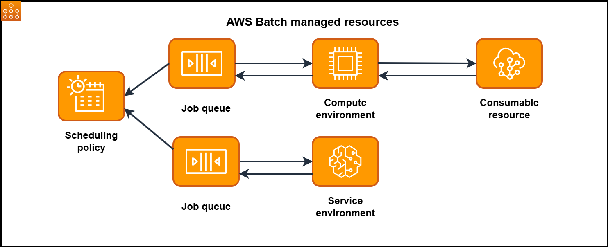

# Components of AWS Batch

AWS Batch simplifies running batch jobs across multiple Availability Zones within a Region. You can create AWS Batch
compute environments within a new or existing VPC. After a compute environment is up and associated with a job queue,
you can define job definitions that specify which Docker container images to run your jobs. Container images are
stored in and pulled from container registries, which may exist within or outside of your AWS
infrastructure.

## Compute environment

A compute environment is a set of managed or unmanaged compute resources that are used to run jobs. With
managed compute environments, you can specify desired compute type (Fargate or EC2) at several levels of detail.
You can set up compute environments that use a particular type of EC2 instance, a particular model such as
`c5.2xlarge` or `m5.10xlarge`. Or, you can choose only to specify that you want to use the
newest instance types. You can also specify the minimum, desired, and maximum number of vCPUs for the environment,
along with the amount that you're willing to pay for a Spot Instance as a percentage of the On-Demand Instance price
and a target set of VPC subnets. AWS Batch efficiently launches, manages, and terminates compute types as needed. You
can also manage your own compute environments. As such, you're responsible for setting up and scaling the instances
in an Amazon ECS cluster that AWS Batch creates for you. For more information, see [Compute environments for AWS Batch](compute_environments.md "compute_environments.md").

## Job queues

When you submit an AWS Batch job, you submit it to a particular job queue, where the job resides until it's
scheduled onto a compute environment. You associate one or more compute environments with a job queue. You can also
assign priority values for these compute environments and even across job queues themselves. For example, you can
have a high priority queue that you submit time-sensitive jobs to, and a low priority queue for jobs that can run
anytime when compute resources are cheaper. For more information, see [Job queues](job_queues.md "job_queues.md").

## Job definitions

A job definition specifies how jobs are to be run. You can think of a job definition as a blueprint for the
resources in your job. You can supply your job with an IAM role to provide access to other AWS resources. You also
specify both memory and CPU requirements. The job definition can also control container properties, environment
variables, and mount points for persistent storage. Many of the specifications in a job definition can be overridden
by specifying new values when submitting individual Jobs. For more information, see [Job definitions](job_definitions.md "job_definitions.md")

## Jobs

A unit of work (such as a shell script, a Linux executable, or a Docker container image) that you submit to
AWS Batch. It has a name, and runs as a containerized application on AWS Fargate or Amazon EC2 resources in your compute
environment, using parameters that you specify in a job definition. Jobs can reference other jobs by name or by ID,
and can be dependent on the successful completion of other jobs or the availability of [resources](resource-aware-scheduling.md "resource-aware-scheduling.md") you specify. For more information, see [Jobs](jobs.md "jobs.md").

## Scheduling policy

You can use scheduling policies to configure how compute resources in a job queue are
allocated between users or workloads. Using fair-share scheduling policies, you can
assign different share identifiers to workloads or users. The AWS Batch job scheduler
defaults to a first-in, first-out (FIFO) strategy. For more information, see [Fair-share scheduling policies](job_scheduling.md "job_scheduling.md").

## Consumable resources

A consumable resource is a resource that is needed to run your jobs, such as a 3rd party license token, database access bandwidth, the need
to throttle calls to a third-party API, and so on. You specify the consumable resources which
are needed for a job to run, and Batch takes these resource dependencies into account when it
schedules a job. You can reduce the under-utilization of
compute resources by allocating only the jobs that have all the required resources available. For more information, see [Resource-aware scheduling](resource-aware-scheduling.md "resource-aware-scheduling.md") .

## Service Environment

A Service Environment define how AWS Batch integrates with SageMaker for job execution.
Service Environments enable AWS Batch to submit and manage jobs on SageMaker while providing
the queuing, scheduling, and priority management capabilities of AWS Batch. Service
Environments define capacity limits for specific service types such as SageMaker Training
jobs. The capacity limits control the maximum resources that can be used by service jobs
in the environment. For more information, see [Service environments for AWS Batch](service-environments.md "service-environments.md").

## Service job

A service job is a unit of work that you submit to AWS Batch to run on a service
environment. Service jobs leverage AWS Batch's queuing and scheduling capabilities while
delegating actual execution to the external service. For example, SageMaker Training jobs
submitted as service jobs are queued and prioritized by AWS Batch, but the SageMaker Training
job execution occurs within SageMaker AI infrastructure. This integration enables data
scientists and ML engineers to benefit from AWS Batch's automated workload management, and
priority queuing, for their SageMaker AI Training workloads. Service jobs can reference other
jobs by name or ID and support job dependencies. For more information, see [Service jobs in AWS Batch](service-jobs.md "service-jobs.md").
