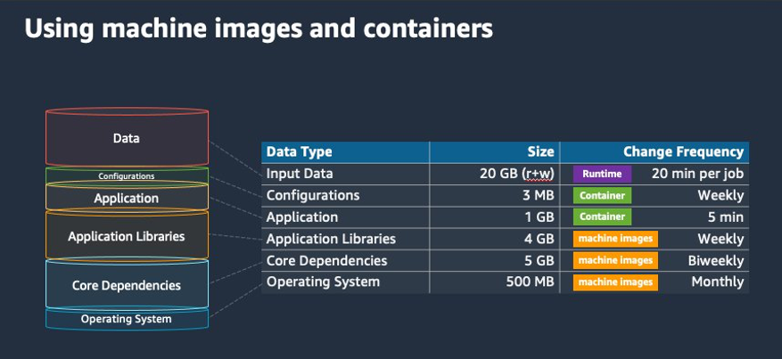

# Optimize containers and AMIs

Container size and structure are important for the first set of jobs that you run. This is
especially true if the container is larger than 4 GB. Container images are built in layers. The
layers are retrieved in parallel by Docker using three concurrent threads. You can increase the
number of concurrent threads using the `max-concurrent-downloads` parameter. For more
information, see the [Dockerd documentation](https://docs.docker.com/engine/reference/commandline/dockerd/ "https://docs.docker.com/engine/reference/commandline/dockerd/").

Although you can use larger containers, we recommend that you optimize container structure
and size for faster startup times.

- Smaller containers are fetched faster – Smaller
  containers can lead to faster application start times. To decrease container size, offload
  libraries or files that are updated infrequently to the Amazon Machine Image (AMI). You can
  also use bind mounts to give access to your containers. For more information, see [Bind
  mounts](../../../AmazonECS/latest/developerguide/bind-mounts.md "../../../AmazonECS/latest/developerguide/bind-mounts.md").
- Create layers that are even in size and break up large layers – Each layer is retrieved by one thread. So, a large layer might
  significantly impact your job startup time. We recommend a maximum layer size of 2 GB as a good
  tradeoff between larger container size and faster startup times. You can run the `docker
history your_image_id` command to check your container image structure and layer size.
  For more information, see the [Docker
  documentation](https://docs.docker.com/engine/reference/commandline/history/ "https://docs.docker.com/engine/reference/commandline/history/").
- Use Amazon Elastic Container Registry as your container repository – When you run
  thousands of jobs in parallel, a self-managed repository can fail or throttle throughput. Amazon ECR
  works at scale and can handle workloads with up to over a million vCPUs.

