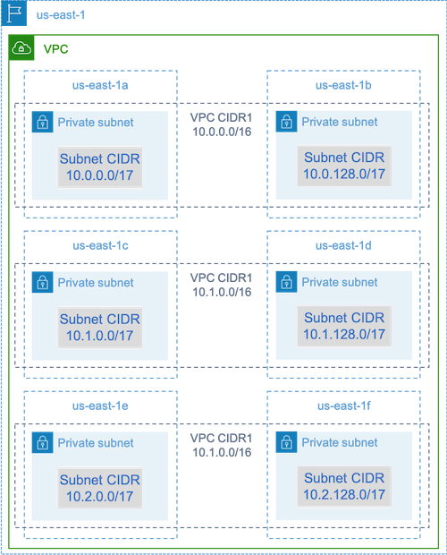

# Common errors and troubleshooting

Errors in AWS Batch often occur at the application level or are caused by instance configurations that don’t meet
your specific job requirements. Other issues include jobs getting stuck in the `RUNNABLE` status or
compute environments getting stuck in an `INVALID` state. For more information about troubleshooting jobs
getting stuck in `RUNNABLE` status, see [Jobs stuck in a RUNNABLE status](job_stuck_in_runnable.md "job_stuck_in_runnable.md"). For information about troubleshooting compute environments in an
`INVALID` state, see [INVALID compute environment](invalid_compute_environment.md "invalid_compute_environment.md").

- Check Amazon EC2 Spot vCPU quotas – Verify that your current
  service quotas meet the job requirements. For example, suppose that your current service quota
  is 256 vCPUs and the job requires 10,000 vCPUs. Then, the service quota doesn't meet the job
  requirement. For more information and troubleshooting instructions, see [Amazon EC2 service
  quotas](../../../AWSEC2/latest/UserGuide/ec2-resource-limits.md "../../../AWSEC2/latest/UserGuide/ec2-resource-limits.md") and [How do I
  increase the service quota of my Amazon EC2resources?](https://aws.amazon.com/premiumsupport/knowledge-center/ec2-instance-limit/ "https://aws.amazon.com/premiumsupport/knowledge-center/ec2-instance-limit/").
- Jobs fail before the application runs – Some jobs might fail because of
  a `DockerTimeoutError` error or a `CannotPullContainerError` error. For troubleshooting
  information, see [How do I
  resolve the "DockerTimeoutError" error in AWS Batch?](https://aws.amazon.com/premiumsupport/knowledge-center/batch-docker-timeout-error/ "https://aws.amazon.com/premiumsupport/knowledge-center/batch-docker-timeout-error/").
- Insufficient IP addresses – The number of IP addresses in
  your VPC and subnets can limit the number of instances that you can create. Use Classless
  Inter-Domain Routings (CIDRs) to provide more IP addresses than are required to run your
  workloads. If necessary, you can also build a dedicated VPC with a large address space. For
  example, you can create a VPC with multiple CIDRs in `10.x.0.0/16` and a subnet in
  every Availability Zone with a CIDR of `10.x.y.0/17`. In this example, _x_ is between 1-4 and _y_ is either 0
  or 128. This configuration provides 36,000 IP addresses in every subnet.

- Verify that instances are registered with Amazon EC2 – If you see your
  instances in the Amazon EC2 console, but no Amazon Elastic Container Service container instances in your Amazon ECS cluster, the Amazon ECS agent might
  not be installed on an Amazon Machine Image (AMI). The Amazon ECS Agent, the Amazon EC2 Data in your AMI, or the launch
  template might also not be configured correctly. To isolate the root cause, create a separate Amazon EC2 instance or
  connect to an existing instance using SSH. For more information, see [Amazon ECS container agent configuration](../../../AmazonECS/latest/developerguide/ecs-agent-config.md "../../../AmazonECS/latest/developerguide/ecs-agent-config.md"), [Amazon ECS Log File Locations](../../../AmazonECS/latest/developerguide/logs.md "../../../AmazonECS/latest/developerguide/logs.md"), and [Compute resource AMIs](compute_resource_AMIs.md "compute_resource_AMIs.md").
- Review the AWS Dashboard – Review the AWS Dashboard
  to verify that the expected job states and that the compute environment scales as expected. You
  can also review the job logs in CloudWatch.
- Verify that your instance is created – If an instance is
  created, it means that your compute environment scaled as expected. If your instances aren't
  created, find the associated subnets in your compute environment to change. For more
  information, see [Verify a scaling activity for
  an Auto Scaling group](../../../autoscaling/ec2/userguide/as-verify-scaling-activity.md "../../../autoscaling/ec2/userguide/as-verify-scaling-activity.md").

We also recommend that you verify that your instances can fulfill your related job requirements. For example,
a job might require 1 TiB of memory, but the compute environment uses a C5 instance type that's limited to 192 GB
of memory.

- Verify that your instances are being requested by AWS Batch – Check Auto Scaling
  group history to verify that your instances are being requested by AWS Batch. This is an indication of how Amazon EC2
  tries to acquire instances. If you receive an error stating the Amazon EC2 Spot can’t acquire an instance in a specific
  Availability Zone, this might be because the Availability Zone doesn't offer a specific instance family.
- Verify that instances register with Amazon ECS – If you see instances in the
  Amazon EC2 console, but no Amazon ECS container instances in your Amazon ECS cluster, the Amazon ECS agent might not be installed on the
  Amazon Machine Image (AMI). Moreover, the Amazon ECS Agent, the Amazon EC2 Data in your AMI, or the launch template might not
  be configured correctly. To isolate the root cause, create a separate Amazon EC2 instance or connect to an existing
  instance using SSH. For more information, see [CloudWatch agent configuration file: Logs section](../../../AmazonCloudWatch/latest/monitoring/CloudWatch-Agent-Configuration-File-Details.md#CloudWatch-Agent-Configuration-File-Logssection "../../../AmazonCloudWatch/latest/monitoring/CloudWatch-Agent-Configuration-File-Details.md#CloudWatch-Agent-Configuration-File-Logssection"), [Amazon ECS Log File Locations](../../../AmazonECS/latest/developerguide/logs.md "../../../AmazonECS/latest/developerguide/logs.md"), and [Compute resource AMIs](compute_resource_AMIs.md "compute_resource_AMIs.md").
- Open a support ticket – If you're still experiencing issues after some
  troubleshooting and have a support plan, open a support ticket. In the support ticket, make sure to include
  information about the issue, workload specifics, the configuration, and test results. For more information, see
  [Compare Support Plans](https://aws.amazon.com/premiumsupport/plans/ "https://aws.amazon.com/premiumsupport/plans/").
- Review the AWS Batch and HPC forums – For more information, see the [AWS Batch](https://repost.aws/tags/TAAQ5TlH16Tc686CgyYUNX0g/aws-batch "https://repost.aws/tags/TAAQ5TlH16Tc686CgyYUNX0g/aws-batch") and [HPC](https://repost.aws/tags/TAjBvP4otfT3eX8PswbXo9AQ/high-performance-compute "https://repost.aws/tags/TAjBvP4otfT3eX8PswbXo9AQ/high-performance-compute") forums.
- Review the AWS Batch Runtime Monitoring Dashboard – This
  dashboard uses a serverless architecture to capture events from Amazon ECS, AWS Batch, and Amazon EC2 to
  provide insights into jobs and instances. For more information, see [AWS Batch Runtime Monitoring
  Dashboards Solution](https://github.com/aws-samples/aws-batch-runtime-monitoring "https://github.com/aws-samples/aws-batch-runtime-monitoring").
