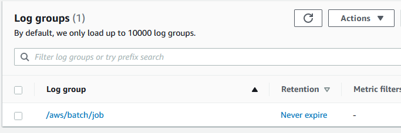
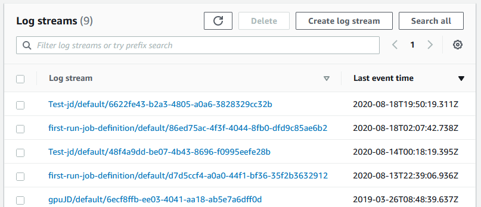
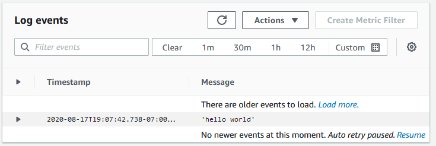

# Tutorial: View CloudWatch Logs

You can view and search CloudWatch Logs logs in the AWS Management Console.

###### Note

It might take a few minutes for data to display in CloudWatch Logs.

###### To view your CloudWatch Logs data

1. Open the CloudWatch console at
   [https://console.aws.amazon.com/cloudwatch/](https://console.aws.amazon.com/cloudwatch/ "https://console.aws.amazon.com/cloudwatch/").
2. In the left navigation pane, choose **Logs**, then choose
   **Log groups**.

 3. Choose a log group to view.

 4. Choose a log stream to view. By default, the streams are identified by the first 200
characters of the job name and the Amazon ECS task ID.

###### Tip

To download log stream data, choose **Actions**.

