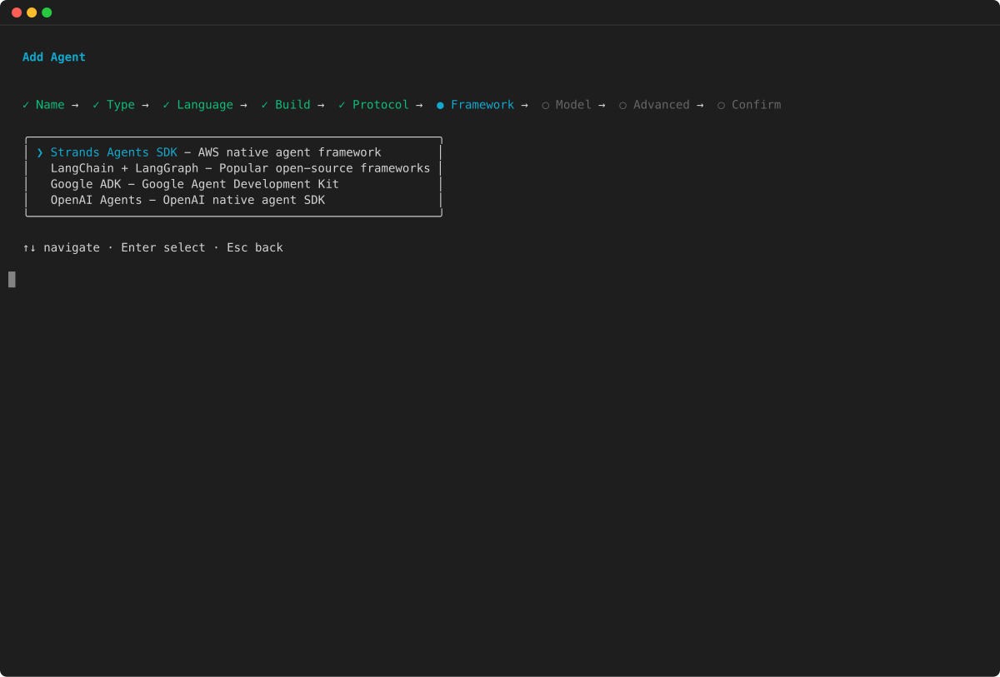
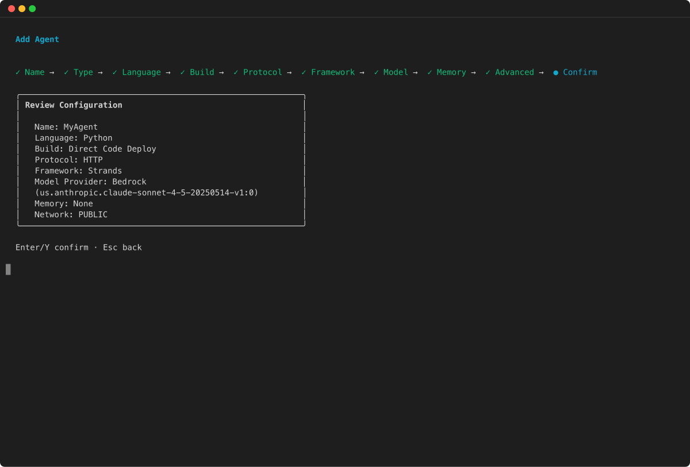
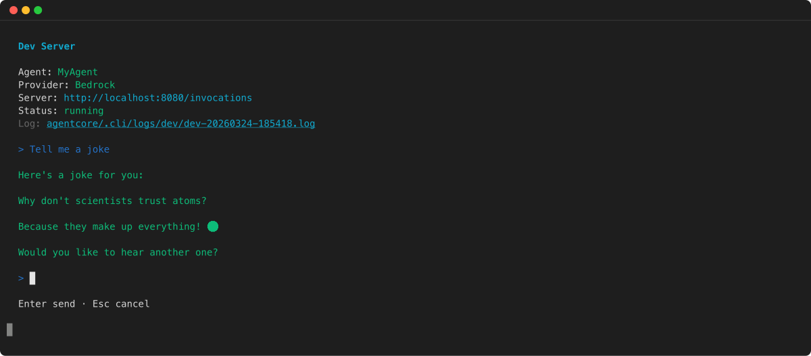
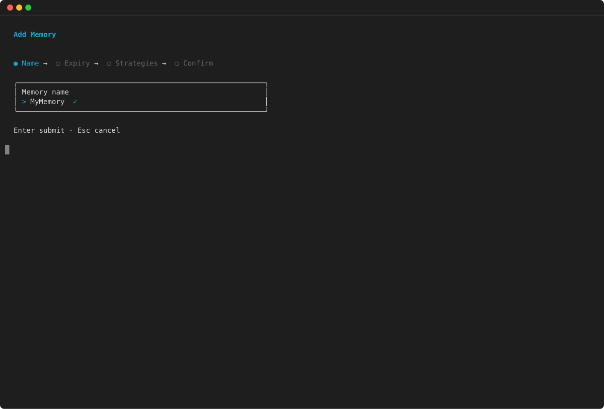
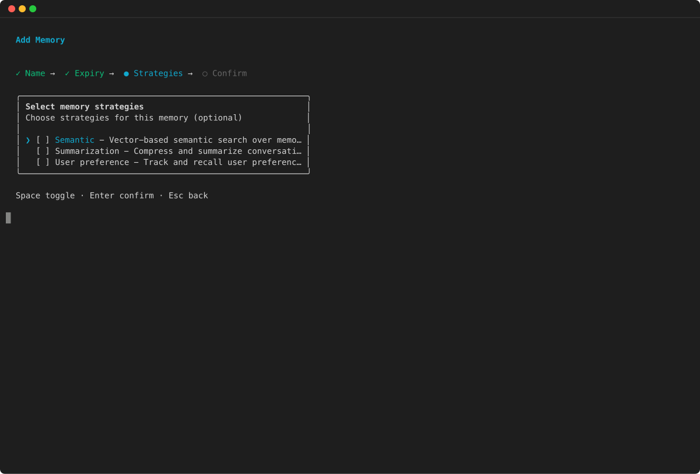
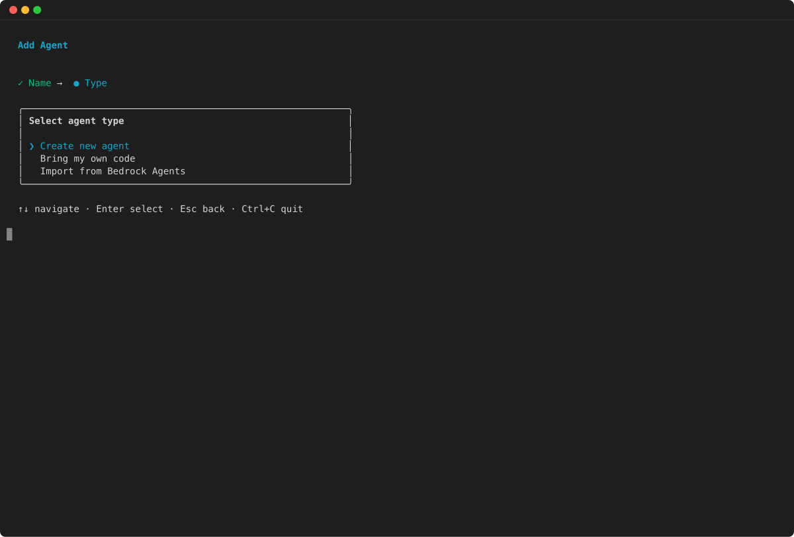
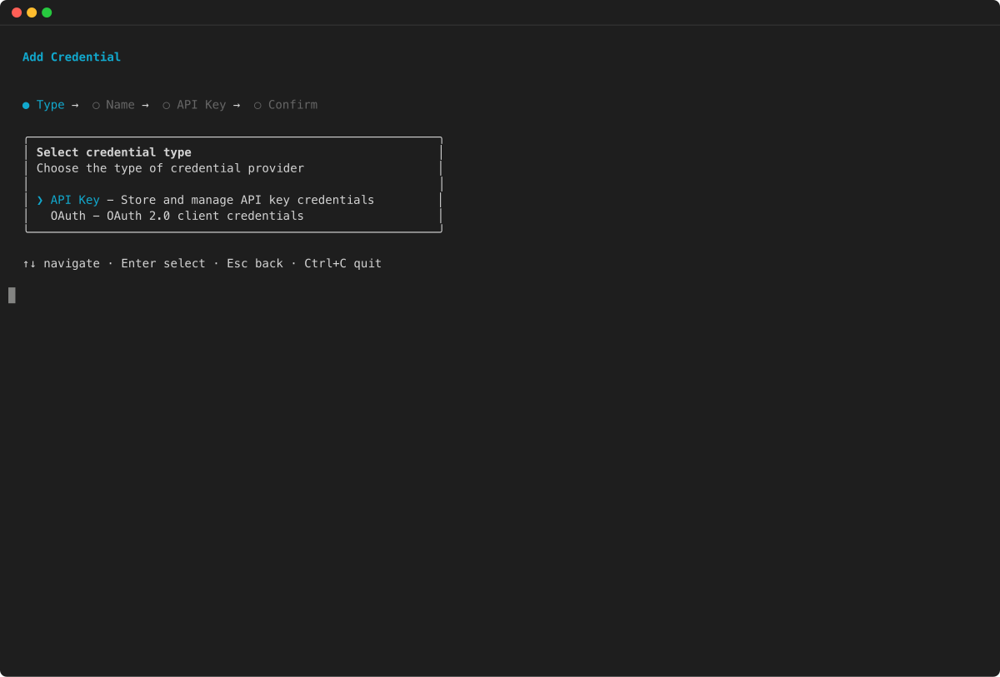

# Get started with Amazon Bedrock AgentCore

This quickstart gets you from zero to a running agent in under five minutes using the [AgentCore CLI](https://github.com/aws/agentcore-cli "https://github.com/aws/agentcore-cli") . You will install the CLI, scaffold a project, test locally, deploy to AgentCore Runtime, and invoke your agent.

## Prerequisites

Before you begin, make sure you have the following:

- **Node.js 20 or later** – The AgentCore CLI is distributed as an npm package and requires Node.js. Check your version:

```
node --version
```

If you need to install or update Node.js, visit [nodejs.org](https://nodejs.org/ "https://nodejs.org/").

- **npm** – Included with Node.js. Used to install the CLI globally.
- **An AWS account with credentials configured** – The CLI uses your AWS credentials to deploy infrastructure and invoke agents. Configure credentials using the AWS CLI, environment variables, or an AWS profile. For more information, see [Configuring the AWS CLI](../../../cli/latest/userguide/cli-configure-files.md "../../../cli/latest/userguide/cli-configure-files.md").
- **Python 3.10 or later** (for agent code) – Agent code generated by the CLI is written in Python. Check your version:

```
python3 --version
```

- **IAM permissions** – Your AWS identity needs permissions to make AgentCore API calls and to assume the CDK bootstrap roles used during deployment. The CLI interacts with AWS in two ways: direct SDK calls (invoking agents, tailing logs, checking status) that use your credentials, and CDK deployments where assumes a separate execution role to provision infrastructure. For ready-to-use IAM policy documents covering both, see [AgentCore CLI IAM Permissions](https://github.com/aws/agentcore-cli/blob/main/docs/PERMISSIONS.md "https://github.com/aws/agentcore-cli/blob/main/docs/PERMISSIONS.md") . For general AgentCore permissions, see [IAM Permissions for AgentCore](runtime-permissions.md "runtime-permissions.md").

## Step 1: Install the AgentCore CLI

Install the CLI globally using npm:

```
npm install -g @aws/agentcore
```

Verify the installation:

```
agentcore --version
```

To update the CLI to the latest version later, run the same install command again or use:

```
agentcore update
```

For the source code and to report issues, see the [agentcore-cli GitHub repository](https://github.com/aws/agentcore-cli "https://github.com/aws/agentcore-cli").

## Step 2: Create your project

Create a new project using the `create` command. You can use command-line flags or the interactive wizard:

###### Example

AgentCore CLI

1. Use the `--defaults` flag to generate a Python agent using the Strands Agents SDK with Amazon Bedrock as the model provider:

```
agentcore create --name MyAgent --defaults
```

Interactive

1. Run `agentcore create` without flags to launch the interactive wizard:

```
agentcore create
```

2. Enter your project name:

 3. Choose your agent framework and model provider:

 4. Review your configuration and confirm:



The interactive mode lets you choose from the following options:

- **Framework** – Strands Agents, LangChain/LangGraph, Google Agent Development Kit (ADK), or OpenAI Agents SDK
- **Model provider** – Amazon Bedrock, Anthropic, OpenAI, or Gemini
- **Memory** – None, short-term only, or long-term and short-term
- **Build type** – CodeZip (default) or Container

### Project structure

After running `agentcore create` , the CLI generates the following project structure:

```
MyAgent/
├── agentcore/
│   ├── agentcore.json      # Project and resource configuration
│   ├── aws-targets.json    # Deployment target (account and region)
│   └── cdk/                # CDK infrastructure (auto-managed)
└── app/
    └── MyAgent/            # Your agent code
        ├── main.py         # Agent entrypoint
        ├── pyproject.toml  # Python dependencies
        └── ...
```

The key files are:

- **agentcore/agentcore.json** – The main configuration file. It defines your agents, memory stores, and credentials. The CLI manages this file when you run `agentcore add` or `agentcore remove` commands.
- **app/** – Contains your agent code. Each agent has its own subdirectory with a `main.py` entrypoint and a `pyproject.toml` for dependencies.
- **agentcore/aws-targets.json** – Defines the AWS account and region for deployment.

The following example shows a typical `agentcore.json` generated by the defaults:

```
{
  "name": "MyAgent",
  "version": 1,
  "tags": {
    "agentcore:created-by": "agentcore-cli",
    "agentcore:project-name": "MyAgent"
  },
  "agents": [
    {
      "type": "AgentCoreRuntime",
      "name": "MyAgent",
      "build": "CodeZip",
      "entrypoint": "main.py",
      "codeLocation": "app/MyAgent/",
      "runtimeVersion": "PYTHON_3_13",
      "networkMode": "PUBLIC",
      "modelProvider": "Bedrock",
      "protocol": "HTTP"
    }
  ],
  "memories": [],
  "credentials": [],
  "evaluators": [],
  "onlineEvalConfigs": [],
  "agentCoreGateways": [],
  "policyEngines": []
}
```

## Step 3: Test locally

Before deploying, test your agent locally using the development server. Change into your project directory and start the dev server:

###### Example

AgentCore CLI

1. ```
   cd MyAgent
   agentcore dev
   ```

```


Interactive

1. Run `agentcore` to open the TUI home screen, then select **dev** to start the local development server with an inline chat prompt:


```

agentcore

```





The dev server automatically creates a Python virtual environment, installs dependencies, and starts a local server with hot-reload on port 8080. Any changes you make to your agent code are picked up automatically.


To view server logs in real time, use the `--logs` flag:


```

agentcore dev --logs

````

Dev server logs are stored in `agentcore/.cli/logs/dev` in your project directory.


In a separate terminal, invoke your local agent:


###### Example


AgentCore CLI

1. ```
agentcore dev "Hello, what can you do?"
````

You can also stream the response in real time:

```
agentcore dev "Tell me a joke" --stream
```

Interactive

1. Run `agentcore dev` without a prompt to open the interactive chat TUI, which streams responses by default and maintains your session automatically:

```
agentcore dev
```


###### Note

Local development does not require deployment. However, Amazon Bedrock AgentCore Memory is not available during local development because memory stores require deployed AWS infrastructure. To use memory, deploy your project first with `agentcore deploy` . For more information, see [Add memory to your Amazon Bedrock AgentCore agent](memory.md "memory.md").

## Step 4: Deploy your agent

When you are ready, deploy your agent to Amazon Bedrock AgentCore Runtime:

###### Example

AgentCore CLI

1. ```
   agentcore deploy
   ```

```


Interactive

1. From the AgentCore CLI home screen, select `deploy` to launch the interactive deployment flow:


The `deploy` command:


* Packages your Python agent code into a zip artifact
* Uses the AWS CDK under the hood to synthesize and deploy resources
* Creates an AgentCore Runtime endpoint for your agent
* Configures Amazon CloudWatch logging and observability

The first deployment takes a few minutes while the CDK bootstraps your account and provisions resources. Subsequent deployments are faster.


To preview what will be deployed without making changes, use:


```

agentcore deploy --plan

````

After deployment completes, check the status of your resources:


###### Example


AgentCore CLI

1. ```
agentcore status
````

Interactive

1. Run `agentcore` and select **status** to view a live dashboard of all deployed resources:

```
agentcore
```


## Step 5: Invoke your deployed agent

After deployment, invoke your agent with a prompt:

###### Example

AgentCore CLI

1. ```
   agentcore invoke --runtime MyAgent "Hello, what can you do?"
   ```

```

###### Note

If your project contains a single runtime, the `--runtime` flag is optional. For multi-runtime projects, specify which runtime to invoke.


You can also stream responses, continue sessions, or use JSON output:


```

# Stream the response in real time

agentcore invoke --runtime MyAgent "Tell me a joke" --stream

# Continue a previous conversation session

agentcore invoke --runtime MyAgent "Tell me another" --session-id my-session

# Get JSON output for scripting

agentcore invoke --runtime MyAgent "Hello" --json

```

To start a new session, run the invoke command without specifying a `--session-id` . The CLI generates a new session automatically.


Interactive

1. Run `agentcore invoke` without a prompt to open the interactive chat TUI, which streams responses by default and maintains your session automatically:


```

agentcore invoke

````


###### Note

Congratulations! You created, tested, and deployed your first agent using the AgentCore CLI.


## Add resources to your project


After creating your initial project, you can add more resources using `agentcore add` . Run the command without arguments to launch the interactive menu, or specify the resource type directly.


### Add memory


Add a memory store with one or more strategies:


###### Example


AgentCore CLI

1. ```
agentcore add memory \
  --name SharedMemory \
  --strategies SEMANTIC,SUMMARIZATION
````

Interactive

1. Run `agentcore add` and select **Memory** to launch the wizard:
2. Enter a name for the memory store:

 3. Select memory strategies:



After adding memory, deploy to provision it:

###### Example

AgentCore CLI

1. ```
   agentcore deploy
   ```

````


Interactive

1. From the AgentCore CLI home screen, select `deploy` to launch the interactive deployment flow:


Available memory strategies are `SEMANTIC` , `SUMMARIZATION` , and `USER_PREFERENCE` . For more information, see [Add memory to your Amazon Bedrock AgentCore agent](memory.md "memory.md").


### Add agents to your project


The AgentCore CLI supports multiple agents in a single project. Each agent gets its own code directory under `app/` and shares the project’s deployment infrastructure.


Add a second agent to the same project:


###### Example


AgentCore CLI

1. ```
agentcore add agent \
  --name ResearchAgent \
  --language Python \
  --framework Strands \
  --model-provider Bedrock \
  --memory shortTerm
````

You can also bring your own agent code:

```
agentcore add agent \
  --name MyCustomAgent \
  --type byo \
  --code-location ./my-custom-agent \
  --entrypoint main.py \
  --language Python \
  --framework Strands \
  --model-provider Bedrock
```

Interactive

1. Run `agentcore add` and select **Agent** to launch the wizard:
2. Choose the agent type and framework:

 3. Select the framework and model provider:

 4. Review the configuration and confirm:


### Add credentials

If you use a non-Bedrock model provider, add credentials for it:

###### Note

When you add an agent with a non-Bedrock model provider using `agentcore add agent` , the CLI prompts you for credentials automatically. Use this command to add credentials separately if you skipped the prompt or need to update them later.

###### Example

AgentCore CLI

1. ```

   ```

# API key credential

agentcore add credential --name OpenAI --api-key sk-...

# OAuth credential

agentcore add credential \
 --name MyOAuthProvider \
 --type oauth \
 --discovery-url https://idp.example.com/.well-known/openid-configuration \
 --client-id my-client-id \
 --client-secret my-secret

```


Interactive

1. Run `agentcore add` and select **Identity** to launch the wizard:
2. Choose the credential type (API Key or OAuth):



3. Enter the credential name and value, then confirm.


## View logs and traces


After deploying, you can stream logs from your agent:


```

# Stream recent logs

agentcore logs

# Filter by time range and level

agentcore logs --since 30m --level error

# Search logs

agentcore logs --query "timeout"

```

You can also view distributed traces:


```

# List recent traces

agentcore traces list

# Get details for a specific trace

agentcore traces get <trace-id>

````

## Clean up


To tear down all AWS resources created by the CLI, first remove all resources from the configuration, then deploy the empty state:


###### Example


AgentCore CLI

1. ```
agentcore remove all
agentcore deploy
````

To preview what will be removed before taking action:

```
agentcore remove all --dry-run
```

Interactive

1. Run `agentcore` and select **remove** to interactively choose which resources to remove:

```
agentcore
```


The `remove all` command resets the configuration files. The subsequent `deploy` detects that resources have been removed and tears them down from your AWS account.

## Next steps

After building your first agent with the AgentCore CLI, explore the following topics:

- [Add memory to your Amazon Bedrock AgentCore agent](memory.md "memory.md") – Store conversation context with long-term and short-term memory
- [Browser](browser-tool.md "browser-tool.md") – Browse the web with the built-in browser tool
- [Gateway](gateway.md "gateway.md") – Connect external tools and services through a secure gateway
- [Observability](observability.md "observability.md") – Monitor and debug agents with logs and traces
- [Code samples](https://github.com/awslabs/amazon-bedrock-agentcore-samples/ "https://github.com/awslabs/amazon-bedrock-agentcore-samples/") – Explore additional examples and patterns
- [AgentCore CLI source](https://github.com/aws/agentcore-cli "https://github.com/aws/agentcore-cli") – View the CLI source code and report issues
