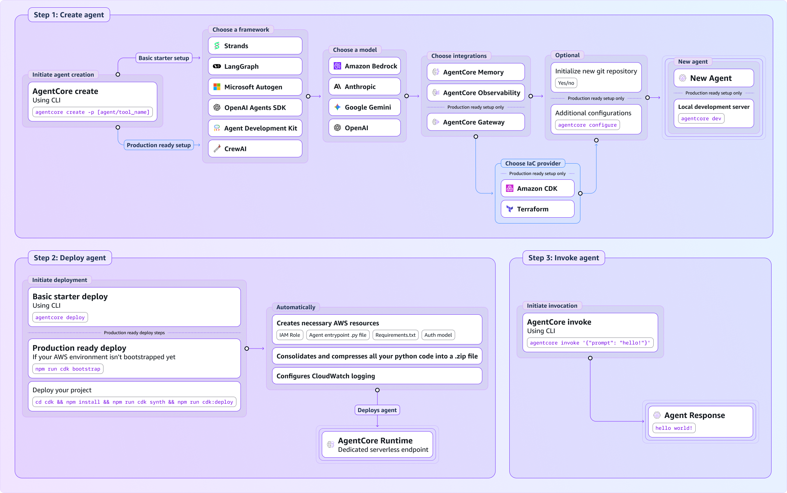

# Get started with Amazon Bedrock AgentCore

This quickstart gets you from zero to running an agent in under five minutes using
Amazon Bedrock AgentCore.



## Step 0: Install the AgentCore CLI

Before you start, make sure you have installed the Amazon Bedrock AgentCore Command
Line Interface (CLI) as part of the starter toolkit. Use the below command to install
the CLI.

```
pip install bedrock-agentcore-starter-toolkit
```

If you face issues with pip install , review the instructions [here](https://packaging.python.org/en/latest/tutorials/installing-packages/ "https://packaging.python.org/en/latest/tutorials/installing-packages/"). Amazon Bedrock AgentCore requires requires Python version 3.10 or
newer. You can check your version:

```
python3 --version
```

If you need to update Python, visit [python.org/downloads](python.org/downloads.md "python.org/downloads.md").

## Step 1: Create your agent

Now, create your agent using the below command.

```
agentcore create
```

The above command:

- bootstraps a simple agent in Strands Agents, LangGraph, OpenAI Agents Software
  Development Kit or Google Agent Development Kit (you can pick which
  framework)
- uses a foundation model from model providers including Amazon Bedrock, OpenAI,
  Google's Gemini, Anthropic's Claude, Amazon Nova, Meta Llama, and Mistral (you
  can pick which model provider)
- produces either a project folder in Python with a simple agent, or
  Infrastructure as Code (IaC) ready code in Terraform or Cloud Development Kit
  (CDK) (you can pick)
- automatically creates Gateway, Memory, and enables Observability
- automatically configures role, entrypoint, requirements and auth model

**[Optional]** Once you have created your agent, start a
local dev server to test it manually.

```
agentcore dev
```

On a separate terminal, run the below command to test your agent response.

```
agentcore invoke --dev "Hello!"
```

## Step 2: Deploy your

agent

Now, host your simple agent in Amazon Bedrock AgentCore Runtime using the below command. If
you don’t already have permissions, refer to [IAM Permissions for AgentCore.](runtime-permissions.md "runtime-permissions.md")

```
agentcore deploy
```

The above command:

- Consolidates all your Python code into a zip file and deploys it
- Deploys your agent to AgentCore Runtime
- Configures CloudWatch logging

## Step 3: Invoke your agent with prompts

Now, test your deployed agent with a simple prompt

```
agentcore invoke '{"prompt": "tell me a joke"}'
```

If you see a joke in the response, your agent is now running in an AgentCore Runtime
and can be invoked.

###### Note

Congratulations! You created and deployed your first agent.

## Next Steps

After building your first agent with Amazon Bedrock AgentCore, we recommend that you explore
the following sections:

- [Add memory to your Amazon Bedrock AgentCore agent](memory.md "memory.md")
- [Enable your agent to interact with web pages using
  Browser](browser-tool.md "browser-tool.md")
- [Securely connect tools and other resources to your
  Gateway](gateway.md "gateway.md")
- [Additional code examples](https://github.com/awslabs/amazon-bedrock-agentcore-samples/ "https://github.com/awslabs/amazon-bedrock-agentcore-samples/")
